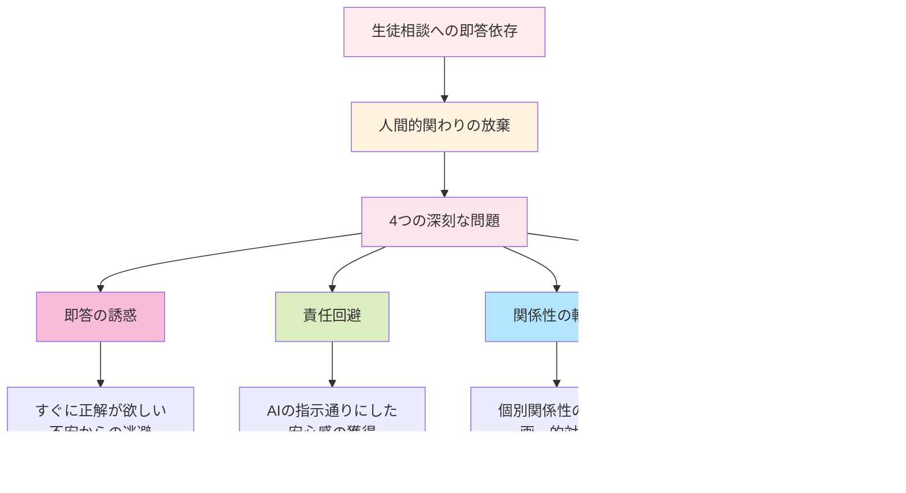

# 対話と相談の外部化危機

## 共感力と傾聴力の喪失

### 失敗事例11：生徒の質問への即答依存

「先生、今日体調が悪くて...」「先生、友達とけんかしちゃって...」

生徒からの相談や質問に対して、すぐにAIに答えを求めてしまう教員が急増しています。しかし、これこそが教育におけるもっとも人間的で重要な瞬間を破壊する行為なのです。

**問題のある使い方**
```
生徒が「友達とけんかして、もう話したくない」と相談してきました。
どのように対応すべきか教えてください。

【状況】
- 小学4年生の女子児童
- 仲の良かった友達とのトラブル
- 休み時間に泣いている
- 詳しい経緯は不明
- 相手の子も同じように悲しそう

適切な声かけと解決方法を具体的に教えてください。
```

**この依頼の根本的な問題**

1. **その子の背景が無視されている**
   - どんな性格の子なのか
   - 普段の友達関係はどうか
   - 過去にどんなトラブルがあったか
   - 家庭での様子はどうか

2. **関係性の文脈が欠如している**
   - この子と教員との信頼関係
   - けんかした相手との関係性
   - クラス全体の人間関係

3. **その瞬間の感情への配慮なし**
   - 今、何を一番感じているのか
   - どんな表情をしているのか
   - どんな言葉を求めているのか

**なぜこのプロンプトが危険なのか**

一見、教育的配慮のある依頼に見えますが、これは認知負債（思考の外部委託による能力低下）の典型例であり、教員としてもっとも大切な「生徒との人間的な関わり」を完全に放棄する行為です。



1. **即答の誘惑**：すぐに「正解」が欲しくなる心理
2. **責任回避**：「AIの指示通りにした」という安心感
3. **関係性の軽視**：個別の関係性を無視した画一的対応
4. **感情の機械化**：人間の感情を問題解決の対象として扱う

### 失われる共感的理解の深刻さ

**AIが生成する典型的な回答例**
```
この状況では、まず児童の気持ちを受け止めることから始めましょう。

## 初期対応（声かけ）

**「つらかったね。話したくない気持ち、よくわかるよ」**

まずは共感を示し、児童が安心して話せる環境を作ります。無理に詳細を聞き出そうとせず、
児童のペースに合わせることが大切です。

## 段階的な対応方法

**1. 気持ちの整理を手伝う**
- 「今どんな気持ち？悲しい？怒ってる？」
- 感情を言葉にすることで、児童が自分の状況を客観視できるよう支援

**2. 話せる範囲で状況を聞く**
- 「何があったか、話せる範囲で教えてくれる？」
- 「友達も悲しそうだったみたいだけど、どう思う？」

**3. 相手の立場も考えてもらう**
- 「○○ちゃん（友達）はどんな気持ちだと思う？」
- 小学4年生なら、相手の気持ちを想像する力が育ってきている時期

## 具体的な解決アプローチ

**冷却期間を設ける**
今日は少し距離を置いて、明日以降に仲直りの機会を作ることを提案。

**仲直りのきっかけ作り**
- 「明日、先生が一緒にいるときに話してみない？」
- 必要に応じて教師が仲介役となる

**予防的な話し合い**
- 友達関係での困ったときの対処法を他の児童も含めて話し合う機会を作る

## 注意すべきポイント

- どちらか一方だけの話を鵜呑みにしない
- 無理に仲直りを強要しない
- 両方の児童の気持ちを大切にする
- 保護者への連絡が必要な場合もある

児童同士のトラブルは成長の機会でもあります。適切な支援により、より深い友情を築けることも多いので、
焦らず見守る姿勢も大切です。
```

**この「完璧な」回答の深刻な問題**

この回答は教育書に書かれているような正論であり、一見すると適切に思えます。しかし、実際の教育現場では以下のような問題が生じます。

### 失われる人間的な瞬間


**1. その子だけの特別な瞬間の喪失**

実際の相談場面では、その子だけが見せる表情、言葉、しぐさがあります。

- 涙の流れ方
- 声のトーン
- 身体の緊張具合
- 目線の動き
- 呼吸のリズム

これらは、その子が今何を感じているかを教えてくれる貴重な情報です。AIの回答に従って機械的に対応すれば、こうした微細なサインを見落としてしまいます。

**2. 信頼関係構築の機会損失**

子どもが困った時に教員に相談するのは、「この先生なら分かってくれる」という信頼があるからです。しかし、マニュアル通りの対応では：

- 「この先生は私のことを分かってくれていない」
- 「結局、大人はみんな同じことしか言わない」
- 「もう相談するのはやめよう」

という失望感を与えてしまいます。

**3. 教員自身の成長機会の放棄**

生徒との一対一の対話は、教員にとってもっとも成長できる瞬間です。

- 子どもの心の動きを理解する力
- 適切な言葉を選ぶ力
- 沈黙に耐える力
- 共感的に聞く力

これらの力は、実際の関わりの中でしか育ちません。

### 失敗事例12：面談準備の放棄

**問題のある使い方**
```
明日、保護者面談があります。以下の生徒について、
保護者に伝える内容と想定される質問への回答を作成してください。

【生徒情報】
- 名前：田中太郎（小学3年生）
- 学習面：算数がやや苦手、国語は普通
- 生活面：おとなしい、友達は少ない
- 特記事項：最近宿題を忘れることが多い

【面談の目的】
- 2学期の成長と課題の共有
- 家庭での様子の聞き取り
- 3学期に向けた連携方針の確認

保護者からの想定質問と回答例も含めて、
15分間の面談シナリオを作成してください。
```

**失われる重要な準備過程**

このような依頼は、面談におけるもっとも重要な準備を放棄しています。

1. **その子への深い理解の蓄積**
   - 毎日の観察で気づいた小さな変化
   - 友達との関わりでの成長
   - 授業中の表情や発言の変化
   - 特別な頑張りを見せた瞬間

2. **保護者との関係性の振り返り**
   - これまでの面談での話題
   - 保護者の教育観や価値観
   - 家庭の状況や配慮事項
   - 保護者が大切にしていること

3. **具体的なエピソードの整理**
   - 成長を示す具体的な場面
   - 課題が見えた具体的な状況
   - クラスでの役割や貢献
   - 友達からの評価や信頼

**AIに頼った面談の悲惨な結果**

```
教員：「田中さんは今学期、学習面で着実に成長されています」
保護者：「具体的にはどのような場面でしょうか？」
教員：「えーっと...（AIの回答を思い出そうとする）」
保護者：「先生、うちの子のことを本当に見てくださっているのでしょうか？」
```

このような事態になれば、保護者との信頼関係は一瞬で崩壊します。

### 失敗事例13：保護者対応の自動化

**問題のある使い方**
```
保護者から以下のメールが来ました。適切な返信文を作成してください。

【保護者からのメール】
「いつもお世話になっております。田中太郎の母です。
最近、息子が学校での出来事をあまり話さなくなり心配しています。
以前はクラスでの楽しい話をたくさんしてくれたのですが、
この1か月ほど『別に』『普通』という返答が多くなりました。
学校で何かトラブルがあったのでしょうか。
お忙しい中恐縮ですが、お時間のある時にお聞かせください。」

【回答の方針】
- 保護者の心配に寄り添う
- 学校での様子を適切に伝える
- 今後の連携について提案する
- 丁寧で温かみのある文章にする

この方針で返信メールを作成してください。
```

**この依頼の深刻な問題点**

1. **保護者の気持ちの軽視**
   - 1か月間心配し続けていた保護者の心境
   - 我が子への愛情と不安
   - 教員への信頼と期待

2. **子どもの状況把握の不足**
   - 田中太郎君に実際に何が起きているのか
   - クラスでの様子の詳細な観察
   - 最近の変化の具体的な把握

3. **関係性の文脈の欠如**
   - この保護者との過去のやりとり
   - 家庭の教育方針や価値観
   - これまでの信頼関係の蓄積

**AIが生成する「無難な」回答の問題**

```
田中太郎君の保護者様

いつもお世話になっております。
ご心配をおかけして申し訳ございません。

学校でのお子様の様子ですが、大きなトラブルなどは
特に見当たりません。授業態度も真面目で、
友達との関係も良好に見受けられます。

ただし、お母様がおっしゃるように、
最近少し内向的になっているように感じることもあります。
成長期にはよくあることですが、
引き続き注意深く見守らせていただきます。

何かお気づきのことがありましたら、
いつでもお気軽にご相談ください。

担任　○○
```

**この回答の問題点**

1. **具体性の完全な欠如** - 「良好に見受けられます」「注意深く見守ります」など、何も伝えていない
2. **保護者の心配への共感不足** - 1か月間の心配に対する理解が浅い
3. **今後の対応が曖昧** - 「何かあれば相談して」という受け身の姿勢
4. **子どもの理解が表面的** - 太郎君の内面や変化への洞察がない

## 真の対話を支援するAI活用

では、生徒や保護者との関わりにおいて、どのようにAIを活用すれば認知負債を避けながら、より良いコミュニケーションを実現できるのでしょうか。

### 事前準備ツールとしての活用

**良い活用例1：面談準備**
```
明日、田中太郎君の保護者面談があります。
以下の観察記録を整理して、面談で話すべきポイントを
優先順位をつけて整理してください。

【観察記録】
9月：
・算数の授業で、分からない問題があっても手を挙げずに
  一人で考え込んでしまうことが多かった
・休み時間は図書室で本を読んでいることが増えた
・給食当番では責任感を持って最後まで片付けていた

10月：
・運動会の練習で、最初は消極的だったが、
  リレーの練習で「頑張る！」と意欲を見せた
・係活動で図書係になり、本の整理を丁寧にしている
・国語の音読で、以前より声が大きくなった

11月：
・算数で友達に教えてもらう場面が増えた（自分から頼むように）
・授業中の発言は少ないが、ワークシートの記述は充実
・廊下で会うと必ず挨拶してくれる

【家庭からの情報（前回面談）】
・読書が大好きで、家でもよく本を読んでいる
・算数に苦手意識があり、宿題に時間がかかる
・一人っ子で、友達関係について少し心配している

この情報を基に：
1. 成長が見えるポイント
2. 今後伸ばしていきたい点
3. 家庭と連携したい事項
を整理してください。
```

このような使い方であれば：
- 教員の観察記録が主体
- AIは整理・分析の補助
- 最終的な判断は教員が行う
- 具体的なエピソードが活かされる

### 対話中は人間性を前面に

**重要な原則：対話中はAIを使わない**

生徒や保護者との実際の対話中は、AIに頼らず、人間としての感性を最大限に活用します。

1. **その瞬間の感情を大切にする**
   - 相手の表情や声のトーンを感じ取る
   - 言葉にならない思いに耳を傾ける
   - 沈黙の意味を理解する

2. **関係性を活かした対応**
   - これまでの積み重ねを思い出す
   - その人らしい反応を予想する
   - 信頼関係に基づいた言葉選び

3. **直感と経験を信頼する**
   - 教員としての専門的判断
   - 人間としての共感力
   - その場の雰囲気を読む力

### 事後記録と次回への活用

**良い活用例2：対話記録の整理**
```
今日の保護者面談の内容を記録し、次回への申し送り事項を整理してください。

【面談内容】
・太郎君の成長：算数への取り組み姿勢の変化、友達との関わりの広がり
・保護者の様子：息子の成長を喜んでいる様子、来年度のクラス替えへの不安
・家庭での変化：読書時間の増加、宿題への取り組み方の改善
・今後の連携：冬休みの過ごし方、3学期の目標設定

【特記事項】
・保護者が「先生のおかげで息子が学校を楽しんでいる」と感謝
・算数の家庭学習について具体的な方法を相談された
・来年度の担任変更について不安を表明

次回面談（3学期末）に向けた観察ポイントと
保護者への継続的な支援方針を提案してください。
```

このような事後活用により
- 面談の成果を確実に記録
- 継続的な関係性を構築
- 次回への具体的な準備

## 学級経営の主体性喪失

### 失敗事例14：生徒相談対応の委任

**問題のある使い方**
```
クラスで以下のような問題が起きています。解決方法を教えてください。

【状況】
- 一部の男子生徒がある女子生徒を無視する
- 無視されている女子生徒は登校を渋るようになった
- クラス全体の雰囲気が重くなっている
- 保護者からも相談を受けた

【これまでの対応】
- 個別に話を聞いた（効果なし）
- 全体指導を行った（一時的な改善のみ）
- 道徳の時間で友達関係について話し合った

根本的な解決方法と今後の指導方針を具体的に教えてください。
```

**この依頼の根本的問題**

1. **クラスの固有性の無視**
   - クラスの人間関係の歴史
   - 一人ひとりの性格や背景
   - これまでの指導の積み重ね

2. **教員のリーダーシップの放棄**
   - 学級経営の責任を外部に委ねる
   - 自分なりの教育方針の不在
   - 試行錯誤から学ぶ姿勢の欠如

3. **子どもたちとの関係性軽視**
   - 一人ひとりとの信頼関係
   - これまでの関わりの文脈
   - 子どもたちの成長への期待

### 失敗事例15：学級経営方針の自動生成

**問題のある使い方**
```
# 小学校4年生クラス経営方針作成プロンプト（改良版）

## 基本指示
小学校4年生担任として、以下の条件を基に**実践的で具体的な**1年間のクラス経営方針を作成してください。月別・学期別の実施計画も含めて提案してください。

## クラス詳細情報
### 基本構成
- **学年**: 小学校4年生（32名）
- **性別構成**: 男子16名、女子16名
- **特別な支援が必要な児童**: 2名（具体的な配慮事項も想定して提案）
- **継続性**: 前年度からの持ち上がり16名、新規16名

### 現在の課題（想定）
- 新しいクラスメートとの関係構築
- 中学年としての責任感の醸成
- 学習内容の高度化への対応
- 個人差への対応

## 重視したい教育方針
### 4つの柱
1. **自主性の育成** - 自分で考え、判断し、行動する力
2. **協調性の向上** - 多様性を認め、協力し合う姿勢
3. **学習意欲の向上** - 主体的に学び続ける意欲
4. **規律ある生活習慣** - 基本的生活習慣と社会性

## 学校教育方針との連携
- **個別最適化した学び**: 一人ひとりの特性に応じた指導
- **協働的な学び**: グループ活動や話し合い活動の充実
- **主体的・対話的で深い学び**: アクティブラーニングの実践

## 求める回答の構成

### 1. 年間経営方針（総論）
- クラスの目標とビジョン
- 指導の基本姿勢
- 保護者・学校との連携方針

### 2. 具体的取り組み計画
以下の観点から**月別または学期別**に整理：

#### A. 学級組織・環境づくり
- 座席配置、係活動、当番活動
- 教室環境の工夫
- ルールづくりと定着方法

#### B. 学習指導
- 各教科での具体的な工夫
- 個別支援の方法
- 評価・フィードバックの工夫

#### C. 生活指導・人間関係づくり
- 朝の会・帰りの会の活用
- 行事への取り組み方
- いじめ防止・人間関係づくり

#### D. 特別支援・個別配慮
- 支援が必要な児童への具体的配慮
- 保護者との連携方法

### 3. 評価・改善計画
- 定期的な振り返り方法
- 目標達成度の測定指標
- 必要に応じた方針修正の考え方

## 回答時の注意点
- **具体性**: 抽象的な表現ではなく、実際の場面を想定した具体的な方法を提示
- **実現可能性**: 現実的で実践可能な内容に
- **継続性**: 1年間を通じた系統的な取り組みとして構成
- **根拠**: 各取り組みの教育的効果や狙いを明確に
- **柔軟性**: 状況に応じて調整可能な余地を残す

## 期待する回答例の要素
- 「4月は関係づくり重視、○○の活動を週2回実施」のような時期別具体策
- 「朝の会で○○を5分間、帰りの会で○○を10分間」のような時間配分
- 「月1回の個別面談」「週1回の振り返りカード」のような頻度
- 「○○な場面では△△の声かけ」のような具体的対応例
```

**この「完璧な」プロンプトがもたらす深刻な問題**

一見すると、この改良版プロンプトは教育的配慮に富み、具体性もあり、「優れた」依頼のように見えます。しかし、これこそが教員の専門性を根底から奪う、もっとも危険な認知負債（思考能力の外部化による専門性の空洞化）を生み出すプロンプトです。


### 1. 教育の根幹となる「なぜ」の思考放棄

**欠けているもっとも重要な要素**
- **なぜこの方針を大切にするのか**という教員の内的動機
- **どんな大人に育ってほしいか**という長期的ビジョン
- **自分はどんな教員でありたいか**という職業的アイデンティティ
- **子どもたちとどんな1年間を過ごしたいか**という具体的な願い

このプロンプトは「方法」ばかりを求めて、教育の根幹である「目的」「意味」「価値」への問いかけを完全に回避しています。

### 2. 32名の顔が見えない画一化の恐怖

**無視されている決定的な情報**
```
実際に教員が知っているべきこと：
・太郎くんは人前で話すのが苦手だが、絵を描くのが得意
・花子さんは引っ込み思案だが、困っている子を放っておけない優しさがある  
・次郎くんは学習は苦手だが、みんなを笑わせるのが上手
・美香さんは完璧主義で、失敗を恐れて挑戦をためらう傾向がある
・支援が必要なA君は電車が大好きで、時刻表を暗記している
・支援が必要なBさんは音楽に敏感で、美しいものを感じ取る力が豊か
```

このプロンプトで作成される方針は、32人の具体的な子どもたちの顔が一切見えない、抽象的で画一的なものになってしまいます。

### 3. 教員の人間性と個性の完全な排除

**排除されている教員の固有性**
- **この教員だからこその強み**：音楽が得意、体を動かすのが好き、読書家、科学に詳しいなど
- **この教員の価値観**：協力を重視する、挑戦を大切にする、表現を重んじるなど  
- **この教員の経験**：前年度の取り組みの成果と反省、過去の成功体験や失敗体験
- **この教員の直感**：この子たちとはこんなクラスを作りたい、という感覚的なビジョン

プロンプトが詳細であればあるほど、教員の個性や人間性が入り込む余地がなくなり、「誰が担任でも同じ」という状況を生み出してしまいます。

### 4. 子どもたちとの協働プロセスの否定

**失われる教育の本質的プロセス**
```
本来あるべき学級づくり：
4月：「みんなでどんなクラスにしたい？」子どもたちと話し合う
5月：試行錯誤しながら、ルールや係活動を子どもたちと作る
6月：うまくいかないことを子どもたちと振り返り、改善する
7月：子どもたちの成長を実感し、2学期への期待を話し合う
```

このプロンプトで作られる方針は、4月の段階で1年間がすべて決まってしまい、子どもたちと一緒に作り上げていく学級づくりの醍醐味を完全に奪ってしまいます。

### 5. 教員の成長と学習機会の剥奪

**失われる専門的成長の機会**
- **試行錯誤から学ぶ力**：うまくいかない時に原因を考え、改善策を見つける力
- **子ども理解の深化**：日々の観察から子どもの変化や特性を読み取る力
- **創造的問題解決力**：予期しない問題に対して、その場で最適解を見つける力
- **省察的実践力**：自分の指導を振り返り、より良い方法を考え続ける力

AIに完璧な方針を作ってもらうことで、教員がもっとも成長できる機会を失ってしまいます。

### 6. 教育の「生きた営み」の死滅

**機械化される教育の人間的側面**

教育は本来、教員と子どもたちが毎日の関わりの中で作り上げていく「生きた営み」です。しかし、この種のプロンプトは教育を「計画の実行」に矮小化し、以下を失わせます：

- **予期せぬ瞬間の価値**：計画にない子どもの発言や行動から生まれる学び
- **関係性の深化**：日々の積み重ねで築かれる信頼と愛情
- **共に成長する喜び**：子どもたちと一緒に悩み、一緒に喜ぶ体験
- **一期一会の尊さ**：二度と再現できない、その年、そのクラスだけの物語

**結論：このプロンプトは、教員を「AIが作った計画の実行者」に貶め、教育という尊い営みを機械的な作業に変質させる、極めて危険な認知負債を生み出します。**

## 主体的な学級経営とAI支援

### ビジョンは教員が描く

学級経営においてもっとも重要なのは、教員自身が明確なビジョンを持つことです。

**教員が必ず考えるべきこと**

1. **教育理念の明確化**
   - 子どもたちにどう成長してほしいか
   - どんな力を身につけてほしいか
   - どんな人間関係を築いてほしいか

2. **具体的な願いの設定**
   - クラスの雰囲気はどうありたいか
   - 一人ひとりにどんな役割を期待するか
   - 1年後、どんな姿になっていてほしいか

3. **自分らしさの発揮**
   - 自分の強みをどう活かすか
   - 自分の価値観をどう伝えるか
   - 自分にしかできないことは何か

### AIを使った実現手段の検討

ビジョンが明確になった後、AIに実現方法を相談することは有効です。

**良い活用例**
```
私は小学校4年生（9-10歳）の担任として、以下のようなクラス作りを目指しています。

**【私の願い】**
・一人ひとりが安心して自分らしさを発揮できるクラス
・お互いの違いを認め合い、支え合えるクラス  
・挑戦することを楽しめるクラス

**【子どもたちの詳細な実態】**
・クラス人数：○○名（男子○名、女子○名）
・人前で話すことが苦手な子が約7割
・競争よりも協力を好む傾向が強い
・創作活動（絵画、工作、音楽）に高い関心を示す
・[特別な配慮が必要な子がいれば簡潔に記載]

**【私の強みと制約】**
・子どもの小さな変化や気持ちの変化に敏感
・個別対話を重視し、一人ひとりとの関係構築が得意
・図工や音楽などの表現活動の指導経験豊富
・利用可能な時間：朝の会（15分）、学級活動（週1時間）、その他の隙間時間
・予算的制約：[あれば記載]

**【求める提案内容】**
1. 日常的に実践できる具体的な活動やルーティン
2. 月単位・学期単位で計画できる大きな取り組み
3. 人前で話すのが苦手な子への段階的アプローチ
4. 表現活動を活かしたクラス作りの工夫
5. 保護者との連携方法

各提案について、実施方法、期待される効果、注意点も含めて教えてください。
```

このような相談なら：
- 教員の主体性が保たれる
- 具体的な実態に基づいている
- 実現可能な方法を検討できる

### 生徒の声を聴く仕組み

AIを活用して、生徒の声をより効果的に聴く仕組みを作ることもできます。

**良い活用例：学級会議の充実**
```
毎週の学級会議で出た子どもたちの意見を整理し、
来週の話し合いのテーマを提案してください。

【今週の意見】
・「休み時間にもっといろんな遊びをしたい」
・「係活動をもっと楽しくしたい」
・「クラスの掃除をもっときれいにしたい」
・「友達ともっと仲良くなりたい」
・「発表が上手になりたい」

【これまでの取り組み】
・当番制による遊び企画（月1回）
・係活動の見直し（今月実施）
・掃除の分担とやり方の確認

子どもたちが主体的に考え、話し合えるテーマと
話し合いの進め方を提案してください。
```

## まとめ：人間関係の核心を守る

この章では、生徒対応・コミュニケーションにおける5つの落とし穴を見てきました：

1. **生徒の質問への即答依存** - 関係構築の機会喪失
2. **面談準備の放棄** - 個別理解の表面化
3. **保護者対応の自動化** - 信頼関係の破綻
4. **生徒相談対応の委任** - リーダーシップの放棄
5. **学級経営方針の自動生成** - 教育観の欠如

**教育の本質的価値**
- 人間と人間との心の通い合い
- 一人ひとりとの深い関係性
- 共に成長していく喜び
- かけがえのない瞬間の積み重ね

**AIとの適切な距離**
- 事前準備の補助として活用
- 対話中は人間性を最優先
- 事後の整理・分析に活用
- 主体的判断は必ず教員が行う

**大切な原則**
- 関係性は一人ひとり異なる
- その瞬間の感情を大切にする
- 教員の人間性が最大の資源
- 効率化より信頼関係を優先

次章では、校務・事務処理における認知負債の問題を見ていきます。一見効率化に適していそうな業務でも、思考を要する重要な側面があることを確認していきましょう。