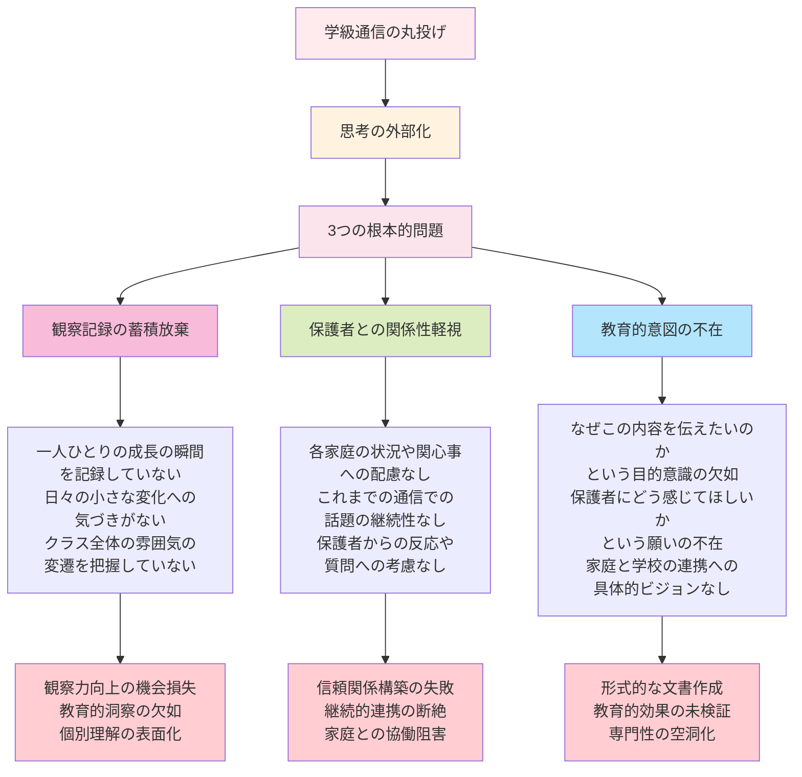
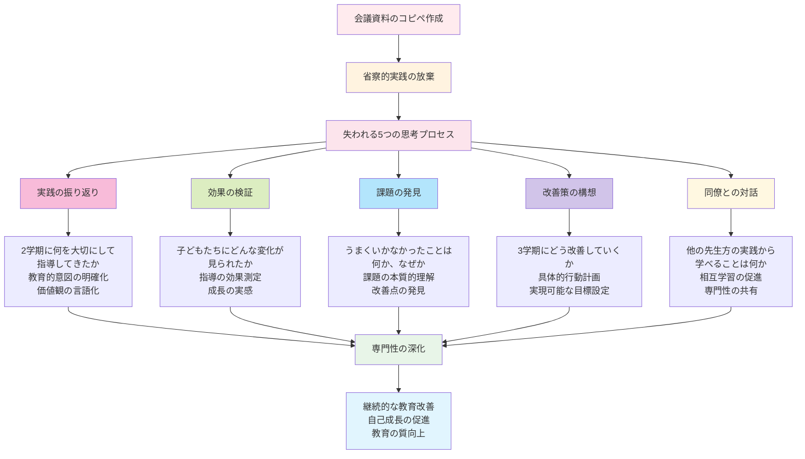
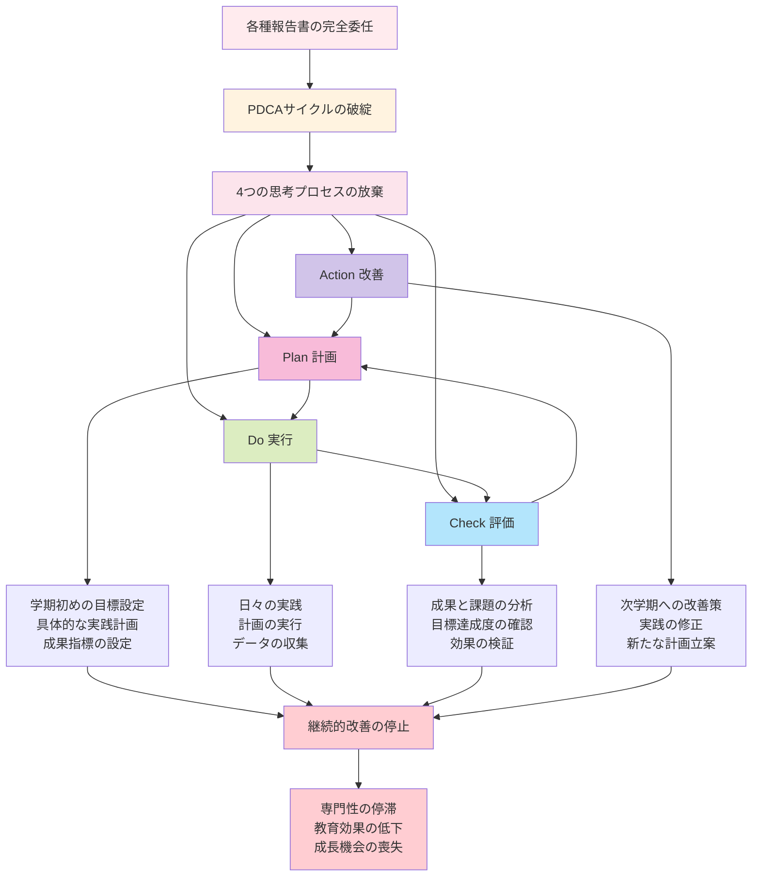

# 文書作成の思考放棄

## 観察と省察の機会損失

### 失敗事例16：学級通信の丸投げ

「毎月の学級通信、忙しくて書く時間がありません。AIに作ってもらえば効率的ですよね？」

学級通信は、保護者との重要なコミュニケーションツールであり、教員自身の観察力と省察力を育む貴重な機会でもあります。しかし、この機会を安易にAIに委ねてしまう教員が増加しています。

**問題のある使い方**
```
11月号の学級通信を作成してください。

【基本情報】
- 対象：小学校3年生の保護者
- 時期：11月（文化祭シーズン）
- 文量：A4用紙1枚程度

【含めてほしい内容】
1. 10月の振り返り（運動会の取り組み）
2. 11月の学習予定（各教科の内容）
3. 文化祭への取り組み紹介
4. 家庭へのお願い事項
5. 子どもたちの成長の様子

【文体・スタイル】
- 親しみやすく温かい文体
- 保護者が読みやすいレイアウト
- 子どもたちの頑張りが伝わる内容
- 具体的なエピソードを含める

この条件で学級通信を作成してください。
```

**この依頼の根本的な問題**



1. **観察記録の蓄積放棄**
   - 一人ひとりの成長の瞬間を記録していない
   - 日々の小さな変化への気づきがない
   - クラス全体の雰囲気の変遷を把握していない

2. **保護者との関係性の軽視**
   - 各家庭の状況や関心事への配慮なし
   - これまでの通信での話題の継続性なし
   - 保護者からの反応や質問への考慮なし

3. **教育的意図の不在**
   - なぜこの内容を伝えたいのかという目的意識の欠如
   - 保護者にどう感じてほしいかという願いの不在
   - 家庭と学校の連携への具体的ビジョンなし

### 失われる観察力向上の機会

**AIが生成する典型的な学級通信例**
```
# 🍂 きらきら 3年◯組だより 🍂
**11月号**　　　　　　　　　　　　　　　　　　　　　令和◯年11月◯日  
**担任：◯◯◯◯**

---

## 🏃‍♂️ 10月を振り返って ～運動会への取り組み～

保護者の皆様、運動会では温かいご声援をありがとうございました。

10月は運動会に向けて、子どもたちが一丸となって練習に取り組みました。特に印象に残っているのは、
リレーの練習での出来事です。バトンパスがうまくいかずに悔しい思いをした時、「大丈夫、みんなで
頑張ろう！」と声をかけ合う姿が見られました。Aさんは「失敗しても、次は絶対成功させる」と前向き
な気持ちを持ち続け、本番では見事にバトンをつなぐことができました。

また、表現ダンスでは、恥ずかしがっていたBくんが、友達に励まされながら最後まで踊り切る姿に
成長を感じました。一人ひとりが自分なりの目標を持って取り組めたことが、何よりの収穫でした。

---

## 📚 11月の学習予定

### 【国語】
- 「三年とうげ」（物語文の読み取り）
- 短作文「秋の思い出」
- 漢字学習（新出漢字15字）

### 【算数】
- かけ算の筆算（2けた×1けた）
- 長さの単位（km、mの関係）
- 図形の学習（三角形・四角形）

### 【理科】
- 太陽の光を調べよう
- かげのでき方と太陽の動き

### 【社会】
- 店ではたらく人々
- お店の工夫を調べよう

### 【その他】
- 図工：「文化祭作品制作」
- 音楽：「文化祭合唱練習」
- 体育：「マット運動」「なわとび」

---

## 🎨 文化祭への取り組み ～みんなで作り上げる発表～

**◆ 展示作品「秋の森の仲間たち」**  
図工の時間に、一人ひとりが動物を描き、みんなで大きな森を作っています。Cさんは「リスの毛の質感を
表現したい」と、筆の使い方を工夫して取り組んでいます。完成した作品は、まるで本当に森の中にいる
ような温かい世界観になっています。

**◆ 合唱発表「ふるさと」**  
音楽の授業では、心を込めて歌うことを大切にしています。最初は声が小さかった子どもたちも、今では
教室いっぱいに響く美しいハーモニーを奏でています。Dくんは「お家の人に聞いてもらうのが楽しみ」
と目を輝かせています。

**文化祭当日：11月◯日（◯）** 
- 展示見学：9:00～10:30
- 合唱発表：10:45～（体育館）

---

## 🏠 家庭へのお願い

### **学習面でのサポート**
- **音読カード**：毎日の音読にご協力ください。お子さんの成長を一緒に見守っていただければと思います
- **九九の練習**：お風呂の時間や移動中など、日常の中で九九に触れる機会を作っていただけると助かります
- **文化祭の練習**：お家でも「ふるさと」を一緒に歌っていただけると、子どもたちの自信につながります

### **生活面でのお願い**
- **朝の準備**：寒くなってきました。時間に余裕を持った朝の準備をお願いします
- **持ち物の確認**：体育着、上履きなど、週末の持ち帰りと月曜日の準備をお子さんと一緒に確認してください
- **健康管理**：手洗い・うがいの徹底をお願いします

---

## 🌟 子どもたちの成長の様子

最近、クラスの中で「ありがとう」や「大丈夫？」の言葉が自然に聞こえてくるようになりました。友達が
困っているときに、さりげなく手を差し伸べる姿も増えています。

特に印象的だったのは、算数でつまずいているEさんに、Fくんが「一緒に考えよう」と声をかけ、休み時間
に教え合っている光景でした。教える側も教わる側も、お互いに学び合う姿勢が育っていることを嬉しく思います。

また、発表の場面でも変化が見られます。以前は手を挙げることが少なかったGさんが、先日の国語の授業で
積極的に発言し、クラス全体が温かい拍手で迎えました。一人ひとりが自分のペースで成長している姿に、
毎日感動しています。

---

## 📞 連絡事項

- **個人懇談会**：11月◯日～◯日（詳細は別紙でお知らせします）
- **授業参観**：11月◯日（◯）2時間目
- **学級費徴収**：11月◯日（◯）◯◯◯円

---

**朝晩の冷え込みが厳しくなってきました。風邪などひかれませんよう、お体にお気をつけください。
文化祭でお子さんたちの頑張りをぜひご覧ください。何かご不明な点がございましたら、いつでも
お声かけください。**

*3年◯組担任　◯◯◯◯*
```

**この「完成度の高い」通信の深刻な問題**

### 1. 子どもの姿が見えない抽象的表現

この通信には、具体的な子どもたちの姿がまったく見えません：

**欠けている具体性**
- 太郎くんが苦手だった縄跳びで初めて連続10回跳べた瞬間
- 花子さんが困っている友達に自分の消しゴムを貸してあげた優しさ
- 運動会の練習で失敗しても「大丈夫！」と励まし合うクラスの雰囲気
- 算数の授業で「分かった！」と目を輝かせた瞬間の表情

**実際の教員の観察記録例**
```
10月15日：運動会練習
・太郎くんが踊りの振り付けを覚えるのに苦労していたが、
  隣の花子さんが「一緒に練習しよう」と声をかけて放課後に特訓
・最初はバラバラだったダンスが、子どもたち同士で
  「ここはこうだよ」と教え合ううちに息が合ってきた
・応援の声出しで、普段おとなしい美香さんが
  「負けないぞー！」と大きな声を出してみんなを驚かせた

10月22日：運動会当日
・太郎くんが最後まで諦めずに走る姿を見て、
  他の子どもたちが「太郎くん、がんばれ！」と自然に応援
・ダンスでは、失敗を恐れずに笑顔で踊る子どもたちの表情が輝いていた
・終了後、「みんなでがんばったから楽しかった」という声が多数
```

このような具体的な観察があってこそ、保護者に伝わる「生きた通信」が書けるのです。

### 2. 保護者との継続的関係の断絶

AIの通信は、これまでの保護者とのやりとりを反映していません：

**見落とされている関係性**
- 前月の通信で「家でも運動会の話をよくしています」という保護者からの反応
- 「うちの子は人前で話すのが苦手で心配」という相談
- 「算数でつまずいているようで…」という家庭からの情報
- 「読み聞かせボランティアに参加したい」という保護者の申し出

### 失敗事例17：会議資料のコピペ作成

**問題のある使い方**
```
来週の職員会議で使用する資料を作成してください。

【会議テーマ】
「2学期の学習指導の振り返りと3学期に向けた改善策」

【資料の構成】
1. 2学期の取り組み実績
2. 児童の学習状況分析
3. 課題と問題点の整理
4. 3学期の重点目標
5. 具体的改善策の提案

【私の担当】
小学校3年生担任として、学年の代表で発表

【会議参加者】
校長、教頭、各学年主任、専科教員

A4用紙2-3枚程度で、分かりやすいレイアウトの資料を作成してください。
```

**失われる省察的実践の機会**

この依頼は、教員としてもっとも重要な「振り返り」の機会を放棄しています。省察的実践とは、自分の教育活動を批判的に振り返り、理論と実践を往復させながら専門性を高めていく実践的アプローチのことです。



**省察的実践に必要な思考プロセス**
1. **実践の振り返り** - 2学期に何を大切にして指導してきたか
2. **効果の検証** - 子どもたちにどんな変化が見られたか
3. **課題の発見** - うまくいかなかったことは何か、なぜか
4. **改善策の構想** - 3学期にどう改善していくか
5. **同僚との対話** - 他の先生方の実践から学べることは何か

これらの思考を通じて、教員は自らの実践を深化させていきます。

### 失敗事例18：研修レポートの外部依存

**問題のある使い方**
```
参加した教育研修のレポートを作成してください。

【研修情報】
・研修名：「個別最適化学習の実践方法」
・主催：○○市教育委員会
・期間：1日（6時間）
・参加者：市内小中学校教員約200名

【研修内容（聞いた話の概要）】
・個別最適化学習の理論と背景
・ICTツールを活用した学習方法
・評価方法の改善
・実践事例の紹介

【レポート要件】
・A4用紙2枚程度
・学んだ内容の整理
・自校での活用方法の提案
・管理職・同僚への報告用

このレポートを作成してください。
```

**思考と成長の機会の完全放棄**

研修レポートの作成は、学んだ内容を自分の実践と結びつけて理解を深める重要な機会です。

**失われる学習プロセス**
1. **知識の整理** - 新しく学んだことを既存の知識と関連づける
2. **実践への応用** - 自分のクラスでどう活用できるかを具体的に考える
3. **課題の発見** - 現在の実践の改善点を見つける
4. **行動計画** - 明日からできることを具体的に計画する
5. **同僚との共有** - 学びを言語化して他者に伝える

## 正しい活用法：文書作成を通じた成長

### 構成案の提示による支援

学級通信や会議資料の作成において、AIを構成の整理や下準備に活用することは有効です。

**良い活用例1：観察記録の整理**
```
以下の観察記録を基に、学級通信に掲載する内容を整理してください。

【10月の観察記録】
10/3: 運動会練習開始。太郎くんが「僕、踊りが苦手」と不安そう
10/5: 花子さんが太郎くんに「一緒に練習しよう」と声かけ
10/8: 休み時間に太郎くんと花子さんが校庭で踊りの練習
10/12: 太郎くんが「少し踊れるようになった！」と嬉しそう
10/15: クラス全体で踊りの息が合ってきた。子どもたちが自主練習
10/18: 美香さんが「みんなで頑張ろう！」と応援の声かけ
10/22: 運動会当日。太郎くんが最後まで笑顔で踊り切った
10/24: 振り返りで「友達と一緒だから頑張れた」という声多数

【保護者からの反応（9月通信への）】
・「家でも運動会の話をよくしています」（田中さん）
・「踊りの練習を家でも見せてくれます」（佐藤さん）
・「友達と励まし合う話を聞いて嬉しいです」（山田さん）

これらの記録から、10月号の学級通信で
保護者に伝えたい内容を3つのポイントに整理してください。
```

**AIの整理例**
```
学級通信10月号の内容整理案

■ ポイント1：友達同士の支え合いの成長
- 太郎くんと花子さんの練習エピソード
- 「一緒だから頑張れる」という子どもたちの声
- 家庭でも友達の話をしている様子

■ ポイント2：挑戦する勇気の育ち
- 「苦手」と言っていた太郎くんの変化
- 自主練習に取り組む積極性
- 「頑張ろう」と励まし合う雰囲気

■ ポイント3：運動会を通じた成長
- 個人の成長（太郎くんの例）
- クラス全体の結束力向上
- 保護者の声との連動
```

この整理を参考に、教員が自分の言葉で通信を書くことで：
- 観察記録が活かされる
- 保護者との継続性が保たれる
- 教員の思いが込められる

### 振り返りツールとしての活用

**良い活用例2：研修内容の理解深化**
```
今日の研修で学んだ内容を整理し、自分の実践との関連を明確にしたいと思います。

【研修で学んだ主なポイント】
・個別最適化学習では、子ども一人ひとりの学習スタイルを把握することが重要
・ICTツールは手段であり、目的ではない
・評価は学習の改善に活用することが大切
・実践事例：A小学校の算数での取り組み

【現在の私の実践】
・算数で習熟度別グループ学習を実施
・タブレットを週2回程度使用
・テスト結果を保護者に報告
・個別支援が必要な子が3名

【私の疑問・課題】
・一人ひとりの学習スタイルをどう把握するか
・ICTツールの効果的な使い方が分からない
・評価を改善にどう活かすか

この情報を基に、以下を整理してください：
1. 研修内容と私の実践の接続点
2. 明日からできる具体的な改善案
3. 長期的に取り組むべき課題
```

このような活用により：
- 学んだ内容が実践と結びつく
- 具体的な行動計画が立てられる
- 継続的な改善サイクルが生まれる

## 計画立案能力の衰退

### 失敗事例19：年間計画の自動生成

**問題のある使い方**
```
小学校3年生の年間指導計画を作成してください。

【基本条件】
- 学習指導要領準拠
- 各教科の年間時数を考慮
- 学校行事との調整
- 季節感のある配列

【各教科の重点】
・国語：読解力と表現力の向上
・算数：基礎計算力と論理的思考
・理科：観察・実験の充実
・社会：地域理解の深化

月別に整理して、実用的な計画を作成してください。
```

**長期的視点の放棄**

年間計画の作成は、教員にとって以下の重要な意味があります。

1. **教育観の具現化** - 1年間で子どもたちをどう育てたいか
2. **系統性の把握** - 学習内容のつながりと発展
3. **バランス感覚** - 各領域の時間配分と重み付け
4. **見通しの構築** - 1年間の流れとリズムの創造

これらを放棄することは、教員としての専門性の核心を失うことになります。

### 失敗事例20：各種報告書の完全委任

**問題のある使い方**
```
以下の情報を基に、学期末の学級経営報告書を作成してください。

【基本データ】
・クラス：3年2組（32名）
・出席率：98.5%
・学習面：おおむね良好
・生活面：大きな問題なし
・行事：運動会、文化祭、校外学習

【特記事項】
・特別な支援が必要な児童2名
・保護者からの相談件数：月平均3件
・学習発表での成果あり

管理職向けの報告書として、適切な形式で作成してください。
```

**PDCAサイクルの形骸化**

報告書の作成は、以下のPDCAサイクルの重要な一部です。



- **Plan（計画）** - 学期初めの目標設定
- **Do（実行）** - 日々の実践
- **Check（評価）** - 成果と課題の分析
- **Action（改善）** - 次学期への改善策

この思考プロセスを放棄することで、継続的な改善が不可能になります。

## 戦略的計画とAI活用

### 過去データの分析補助

**良い活用例：振り返りデータの可視化**
```
以下の3年間の学級経営データを分析し、
傾向と改善ポイントを整理してください。

【3年間のデータ】
令和2年度：
・クラス満足度：85%
・学習意欲向上：78%
・友達関係良好：92%
・課題：発表活動への積極性不足

令和3年度：
・クラス満足度：88%
・学習意欲向上：82%
・友達関係良好：89%
・課題：個別支援の充実が必要

令和4年度：
・クラス満足度：91%
・学習意欲向上：85%
・友達関係良好：94%
・課題：家庭との連携強化

【分析の観点】
1. 継続的に向上している点
2. 改善が必要な領域
3. 令和5年度の重点目標案
```

### 複数シナリオの検討

**良い活用例：状況対応計画**
```
来年度のクラス編成が以下の3パターン考えられます。
それぞれに応じた学級経営の重点を提案してください。

【パターンA】新規クラス（持ち上がりなし）
・関係づくりが最優先課題
・ルールづくりから開始
・保護者との信頼関係構築

【パターンB】半数持ち上がり
・新旧メンバーの融合が課題
・既存の良い関係の活用
・新しい関係性の促進

【パターンC】ほぼ持ち上がり
・さらなる成長への挑戦
・新たな目標設定
・マンネリ化の防止

各パターンでの4月の重点活動を具体的に提案してください。
```

このような活用により：
- 複数の可能性を検討できる
- 状況に応じた柔軟な計画が立てられる
- 教員の判断力が向上する

## まとめ：思考を要する事務業務の価値

この章では、校務・事務処理における5つの誤用を見てきました：

1. **学級通信の丸投げ** - 観察力向上の機会損失
2. **会議資料のコピペ作成** - 省察的実践の放棄
3. **研修レポートの外部依存** - 学習と成長の機会放棄
4. **年間計画の自動生成** - 長期的視点の欠如
5. **各種報告書の完全委任** - PDCAサイクルの形骸化

**校務・事務処理の真の価値**
- 観察力と省察力の向上
- 教育的思考の深化
- 長期的視点の構築
- 継続的改善の習慣

**AI活用の適切な範囲**
- 情報の整理・構造化
- 複数案の提示
- データの可視化
- 形式面のサポート

**保持すべき教員の役割**
- 内容の決定権
- 教育的意図の明確化
- 個別性の反映
- 成長への活用

**大切な原則**
- 効率化と思考の質は両立可能
- 文書作成は自己成長の機会
- 省察なくして改善なし
- 記録は未来への財産

一見効率化に適している校務・事務処理においても、教員の思考と判断が不可欠な領域があります。AIを適切に活用しながら、教員としての専門性を高め続けることが重要です。

次章では、教育の未来に直結する進路指導・特別活動における認知負債の問題を見ていきます。生徒の人生に大きく影響する重要な業務で、どのような落とし穴があるのでしょうか。