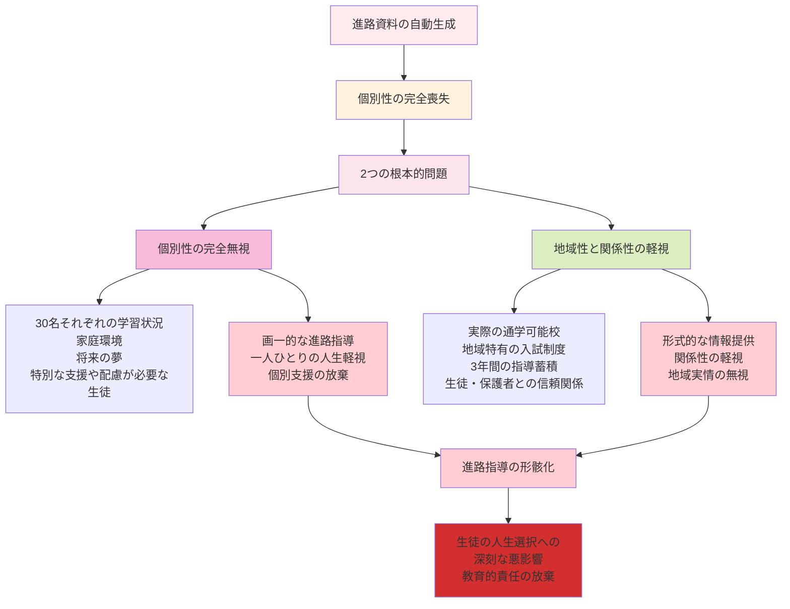
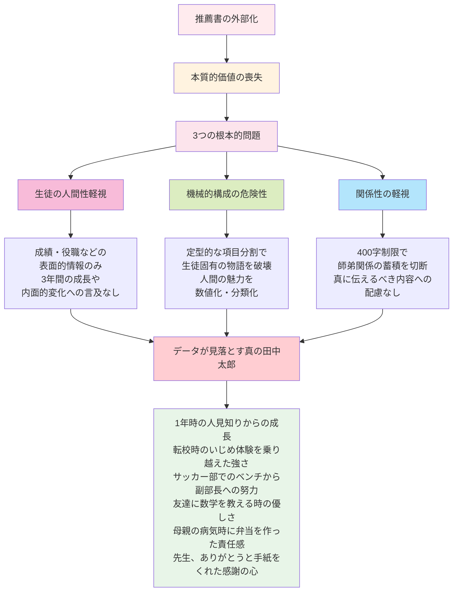
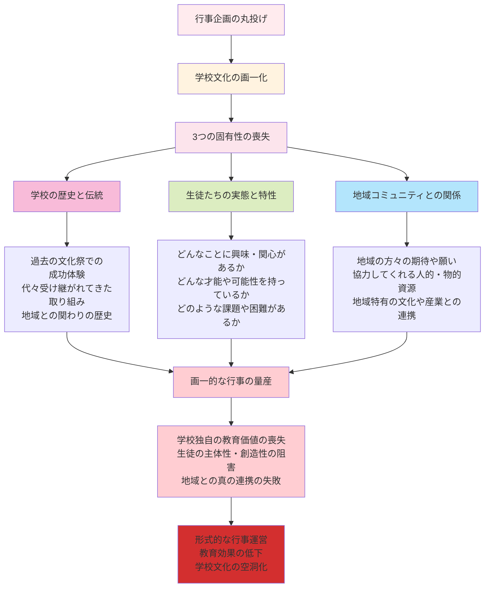
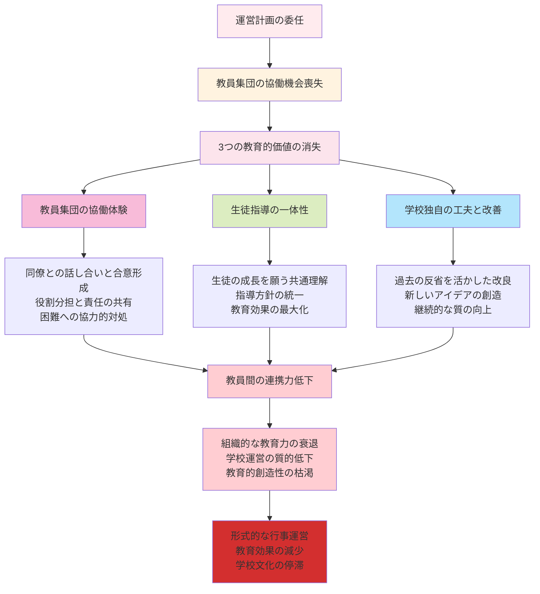
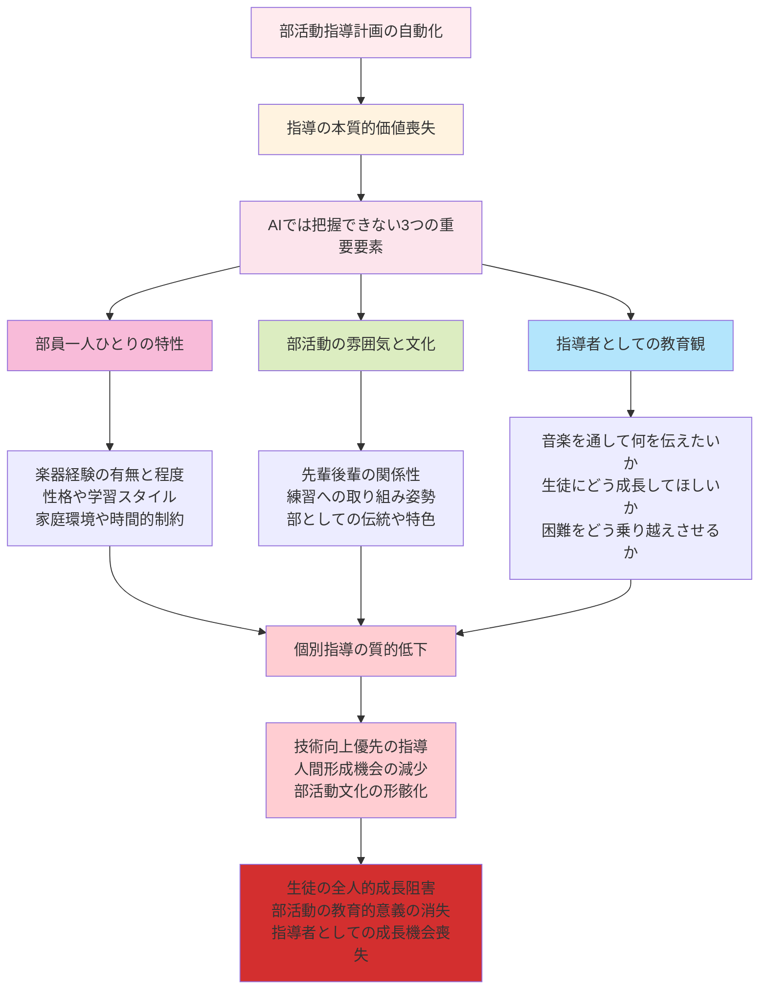

# 進路指導の個別性喪失

## 画一的な進路指導の問題

### 失敗事例21：進路資料の自動生成

中学3年生にとって、進路選択は人生の重要な分岐点です。しかし、この極めて個別性の高い指導において、AIに頼り切ってしまう教員が増加しています。

**問題のある使い方**
```
# 進路指導資料作成プロンプト

## 【基本情報】
**目的：** 中学3年生の進路選択を支援する包括的な指導資料の作成

**対象者：**
- 中学3年生（約30名のクラス想定）
- 学力分布：偏差値40-65程度の幅広い層
- 地域特性：都市部（複数の高校選択肢がある環境）

## 【資料の要件】

### 必須コンテンツ
1. **高校選択の基準と考え方**
   - 学力以外の選択基準、将来の目標との関連性

2. **公立・私立高校の特徴比較**
   - 費用面、カリキュラム、進学実績の比較

3. **入試制度の説明**
   - 推薦・一般入試の違い、併願パターン

4. **学習計画の立て方**
   - 学力レベル別アプローチ、スケジュール例

5. **保護者との相談方法**
   - 家庭での話し合い、意見対立時の対処法

### 体裁・使用場面
- A4用紙5-6枚、図表活用、中学生にも読みやすい構成
- 三者面談・授業・家庭配布の各場面で活用可能

## 【期待する成果物】
- 実用性が高く、すべての生徒・保護者に有益
- 地域の高校事情を踏まえた具体的なアドバイス
- 進路選択への不安軽減と前向きな気持ちの促進
```

**この依頼の根本的な問題**



1. **個別性の完全無視**
   - 30名それぞれの学習状況、家庭環境、将来の夢
   - 特別な支援や配慮が必要な生徒の存在

2. **地域性と関係性の軽視**
   - 実際の通学可能校、地域特有の入試制度
   - 3年間の指導蓄積、生徒・保護者との信頼関係

### 失われる一人ひとりの人生への配慮

**AIが生成する典型的な進路資料例**
```
# 中学3年生 進路選択ガイドブック

## 1. 高校選択の基準と考え方

### 🎯 高校選びで大切にしたい視点
- 将来の目標との繋がり
- 自分の学習スタイル  
- 学校生活の充実度

### ✓ 高校選択チェックリスト
□ 学力レベルが適している □ 興味分野がある □ 通学可能 
□ 学費が無理ない □ 進路実績が合う □ 部活動充実 □ 雰囲気が合う

## 2. 公立高校 vs 私立高校 比較

| 項目 | 公立高校 | 私立高校 |
|------|----------|----------|
| 学費 | 約20-30万円 | 約70-120万円 |
| 入試 | 都道府県統一 | 学校独自 |
| 特色 | 標準的 | 独自性あり |

## 3. 入試制度ガイド

**公立高校入試**
- 推薦入試（2月）：内申重視、面接
- 一般入試（3月）：学力検査+内申

**私立高校入試**  
- 推薦入試（1-2月）：単願・併願
- 一般入試（2月）：3教科中心

## 4. 学力レベル別学習戦略

**A判定（偏差値60以上）**：応用問題中心、1日3-4時間
**B判定（偏差値50-59）**：基礎固め+標準問題、1日2-3時間  
**C判定（偏差値40-49）**：基礎反復、1日1-2時間

## 5. 家庭での進路相談

**話し合いの進め方**
1. 現状共有 2. 将来像確認 3. 選択肢整理 
4. 現実的検討 5. 支援体制確認

**意見対立時の対処**
- お互いの話を聞く
- 学校見学参加
- 担任相談

**💪 頑張る君へ**
進路選択は重要ですが、変更も可能です。今の自分に最適な選択をし、
選んだ道で努力することが大切です。
```

**この「完璧に見える」資料の深刻な問題**

この資料は網羅的で理解しやすく見えますが、まさにこの「完璧さ」が進路指導の本質を見失わせる危険な罠です。

### 1. 個別性の無視

実際の教室には30人の異なる人生があります：

- **太郎くん**：学習障害があるが美術の才能があり、母子家庭で経済的制約
- **花子さん**：成績優秀だが極度のあがり症、推薦入試が適している
- **次郎くん**：不登校経験ありプログラミング得意、通信制が適している可能性
- **美香さん**：転入生で日本語学習中、国際コース特別枠が最適
- **綾香さん**：家庭不安定で心理的サポートが最優先
- **健太くん**：持病により通学制限、定時制や通信制の検討が必要

**資料の「包括性」の限界**

この「完成された」資料は一般的情報は網羅していますが、一人ひとりの複雑な事情には対応できません。むしろ教員の個別対応を阻害する危険があります。

### 2. 数値化できない学校の真の姿

比較表では表せない「教員だけが知る地域の高校のリアル」：

- **A進学校**：偏差値65だが課題膨大、繊細な生徒には負担大
- **B普通高校**：偏差値55だが面倒見良く、不登校経験者への支援充実
- **C工業高校**：就職率100%だが大学進学も強化、病気療養生徒への配慮手厚い
- **D私立高校**：学費高額だが減免制度充実、人間教育重視
- **E国際高校**：外国出身生徒受け入れ実績豊富、文化交流系進路に強い

こうした「生きた学校情報」こそが最適な選択の鍵となります。

### 3. 表面的な励ましの問題

「💪 頑張る君へ」のような一般的なメッセージは、個別の困難（家庭不安定、体調制限、学習障害など）を抱える生徒には適さず、時として有害です。真の進路指導は一人ひとりに寄り添った個別支援が必要です。

### 失敗事例22：推薦書の外部化

**問題のある使い方**
```
高校推薦入試用の推薦書を作成してください。

【生徒情報】
- 名前：田中太郎
- 志望校：○○高校普通科
- 成績：5段階評価で平均3.8（数学は常に4以上）
- 部活動：サッカー部（3年間継続、レギュラー）
- 役職：学級委員（2年時）、サッカー部副部長（3年時）
- 特徴：定期テスト前に数学勉強会を開催

【推薦書要素】
1. 学習面：数学の優秀成績と継続的努力
2. 部活動：3年間の継続性と協調性
3. リーダーシップ：学級委員・勉強会指導
4. 人間性：責任感と思いやり

【文体】
- 400字程度、教師視点、具体的エピソード含む
- 構成：導入→学習→部活・人間性→将来性→結び
```

**推薦書の本質的価値の見失い**

このプロンプトは推薦書を単なる「データ整理文書」として扱い、3年間の関係性を無視しています。



**根本的な問題**

1. **生徒の人間性の軽視**
   - 成績・役職などの表面的情報のみ
   - 3年間の成長や内面的変化への言及なし

2. **機械的構成の危険性**
   - 定型的な項目分割で生徒固有の物語を破壊
   - 人間の魅力を数値化・分類化

3. **関係性の軽視**
   - 400字制限で師弟関係の蓄積を切断
   - 真に伝えるべき内容への配慮なし

**データが見落とす真の田中太郎**

プロンプトの情報は表面的数値のみですが、真実は：
- 1年時の極度の人見知りから成長
- 転校時のいじめ体験を乗り越えた強さ  
- サッカー部でのベンチから副部長への努力
- 友達に数学を教える時の優しさ
- 母親の病気時に弁当を作った責任感
- 「先生、ありがとう」と手紙をくれた感謝の心

田中太郎の真の価値は、困難を乗り越えた強さと内面的成長にあります。

**AIが生成する典型的な推薦書**
```
田中太郎君について推薦いたします。同君は3年間学業に真摯に取り組み、
平均3.8の成績を維持、特に数学で優秀な能力を発揮しています。

サッカー部に3年間継続所属し、協調性を身につけ、学級委員として
責任感を持って役割を果たしました。

○○高校の教育方針に合致する人物であり、入学後も着実な成長が
期待できます。以上により強く推薦いたします。
```

**この文書の問題**
- 田中太郎の人間らしさが見えない
- 具体的エピソードが皆無
- 教員の愛情と確信が感じられない
- 記憶に残らない平凡な内容

**真の推薦書の例**
```
田中太郎君と出会ったのは、転校の挨拶で涙を流していた日でした。
方言でからかわれ困っていた彼が、3年後に「この学校に来て本当に
よかった」と笑顔で語る成長を見て、教員として最高の喜びを感じました。

彼の魅力は数字では表せません。友達への優しさ、家族への責任感、
チームのために応援し続けた忍耐力。これらは成績表にない宝物です。

田中太郎君は間違いなく大きく花開く人物です。心から推薦いたします。
```

**推薦書の本質**
推薦書は「合格のための戦略文書」ではなく、「一人の人間の尊厳と可能性を証明する愛情の結晶」です。

### 失敗事例23：進路面談の自動化

**問題のある使い方**
```
三者面談の進路指導シナリオを作成してください。

【面談対象者】
生徒A：成績優秀、志望校未定、保護者は進学校希望
生徒B：成績中程度、美術に興味、保護者は安定志向
生徒C：学習に困難、手に職系希望、家庭の経済状況考慮

【面談目的】志望校絞り込み、受験戦略確認、認識共有

各15分の面談シナリオ（質問例・アドバイス内容）を作成してください。
```

**人生の岐路における対話の機械化**

この依頼は、生徒の人生に関わる重要な対話を「シナリオ」として機械化しようとする、極めて危険な発想です。一見シンプルに見えますが、進路面談のもっとも重要な要素を完全に見失っています。

**面談で本当に大切なこと**

1. **その場での生の対話**
   - 生徒の表情や声のトーン
   - 保護者の微妙な反応
   - 言葉にならない思いの汲み取り

2. **関係性に基づく信頼**
   - 3年間の積み重ねからくる説得力
   - 生徒・保護者との信頼関係
   - 真剣に向き合う姿勢

3. **個別最適な対応**
   - その瞬間の状況に応じた柔軟性
   - 予想外の展開への対応力
   - 一人ひとりに合わせた伝え方

### 表面的分類と複雑な現実の乖離

**プロンプトの簡略情報**
- 生徒A：成績優秀、志望校未定、保護者は進学校希望
- 生徒B：成績中程度、美術に興味、保護者は安定志向  
- 生徒C：学習に困難、手に職系希望、経済状況考慮

**実際の複雑な現実**
- **生徒A**：父親の医者プレッシャーで苦悩、文学への興味を言えず不眠
- **生徒B**：美術への情熱と母子家庭の経済不安で板挟み、食欲減退
- **生徒C**：学習障害だが機械の天才、進学か就職かで家族会議継続

**このプロンプトの問題**

### 1. 生徒の記号化
記号的表現は生徒の複雑な人間性を見落とします。

### 2. 時間的制約の誤解
15分のタイムスケジュールでは：
- 生徒が心を開く時間なし
- 複雑な事情理解不可能
- 創造的な思考時間なし

### 3. シナリオ化の問題
真の教育的対話は台本では成立しません：
- 予期しない展開への対応不可
- 感情変化への柔軟対応困難
- 教員の直感・経験が活かされない

### 4. 機械的質問の危険
画一的質問は：
- 生徒Aには心を閉ざす原因
- 生徒Bには経済面がデリケート
- 生徒Cには自尊心を傷つける可能性

### 5. 性急な解決志向
人生の選択には：
- 答えを急がない勇気
- 心の準備を待つ忍耐
- 「納得」を重視する価値観
が必要です。

## 個別最適な進路支援

### 情報収集ツールとしてのAI活用

進路指導において、AIを適切に活用する方法を考えてみましょう。

**良い活用例1：進路情報の整理**
```
来週の進路説明会で保護者に説明する内容を整理したいと思います。

【当地域の高校状況】
・公立普通科3校（A高校、B高校、C高校）
・公立専門学科2校（D工業、E商業）
・私立5校（多様な特色）

【今年度の特徴的な変化】
・A高校に新しく国際コースが設置
・D工業高校がIT系学科を新設
・E商業高校が簿記検定の合格率向上

【保護者から多い質問】
・推薦入試の内申点基準
・私立高校の学費支援制度
・コロナ後の就職状況

これらの情報を、保護者が理解しやすい形で整理し、
よくある質問への回答案も含めて提案してください。
```

このような活用なら：
- 地域の実情が反映される
- 教員の情報収集が効率化される
- 保護者への説明が充実する

### 対話を深めるための事前準備

**良い活用例2：面談準備の整理**
```
明日の三者面談に向けて、準備すべき情報を整理してください。

【太郎くんの状況（3年間の記録）】
1年時：数学が得意、内気で発言少ない、友達関係は良好
2年時：学級委員として責任感発揮、体育祭で大活躍、美術にも興味
3年時：進路への不安、理系志向だが将来の方向性未定

【保護者の状況】
・父：工学系企業勤務、息子には理系進学を希望
・母：本人の意思を尊重したい、経済面での心配
・前回面談：志望校を早く決めてほしいという要望

【太郎くんの最近の様子】
・数学の応用問題に熱心に取り組む
・美術部の活動にも積極的参加
・「将来何になりたいか分からない」と悩み相談

【今回の面談目的】
・志望校の方向性を一緒に考える
・理系・文系選択の支援
・家族の願いと本人の気持ちの調整

この情報を基に、面談で確認すべきポイントと
話し合いの進め方を提案してください。
```

**AIの提案例**
```
明日の三者面談に向けて、以下の準備をお勧めします。

## 面談前に確認すべきポイント

**太郎くんの現在の気持ちについて**
- 理系への興味の具体的な分野（工学、理学、医学など）
- 美術への関心度と将来への結びつけ方
- 進路決定への不安の具体的な内容
- 数学以外の理系科目（物理、化学、生物）への興味

**学習状況の詳細**
- 各教科の成績推移と現在の位置
- 模試結果や進路適性検査の結果
- 理系科目の具体的な得意分野

**保護者の期待値の整理**
- 父親の「理系進学希望」の具体的な理由と職業イメージ
- 母親の経済面での心配の詳細
- 家族として譲れない点と柔軟に考えられる点

## 面談の進め方（提案）

**1. 太郎くんの気持ちを最初に聞く（10分）**
現在の興味関心、進路への気持ち、不安に思っていることを率直に話してもらい、本人の声を最優先で確認する。

**2. 具体的な進路選択肢を整理（15分）**
- 理系でも多様な分野があることを説明
- 美術と理系を組み合わせる可能性（デザイン工学、建築など）
- 文理選択の時期と変更の可能性について情報提供

**3. 家族の思いの共有（10分）**
各々の期待や心配を整理し、太郎くんの気持ちとのすり合わせを行う。経済面については具体的な選択肢
と費用を情報提供。

**4. 今後のスケジュールと次のステップ（10分）**
- 夏休み中の体験活動や見学の計画
- 秋の志望校決定に向けたタイムライン
- 次回面談の時期と目標設定

**5. まとめと宿題（5分）**
本日の話し合いで決まったことと、次回までに考えてくること、調べることを明確にする。

## 重要な姿勢

太郎くんの3年間の成長（内気→学級委員→責任感のある生徒）を認めつつ、焦らずに本人のペースで進路を
見つけられるよう支援することが大切です。理系・文系の枠にとらわれず、太郎くんの多面的な興味を活
かせる道を一緒に探していく姿勢で臨まれることをお勧めします。
```

この準備により
- 面談の目的が明確になる
- 見落としがちなポイントを確認できる
- 対話の質が向上する

しかし、実際の面談では
- AIの提案にとらわれず
- その場の雰囲気を重視し
- 生徒・保護者の反応に合わせた柔軟な対応

が不可欠です。

# 学校行事の創造性危機

## 企画力と運営力の外部化

### 失敗事例24：行事企画の丸投げ

**問題のある使い方**
```
中学校の文化祭企画を作成してください。

【基本情報】
・対象：中学校全学年（約600名）
・期間：準備1か月、当日1日
・会場：体育館、各教室、特別教室
・テーマ：「つながり」

【企画内容の要件】
1. 学年別の発表内容
2. 委員会・部活動の参加方法
3. 保護者・地域住民向けの企画
4. 準備スケジュールと役割分担

【重視したい点】
・生徒の主体性
・創造性の発揮
・協働的な取り組み
・地域との連携

実行可能で魅力的な文化祭企画を提案してください。
```

**学校文化の画一化への危険**

この依頼は、その学校独自の文化や伝統、生徒たちの特性を無視した画一的な行事を生み出す危険性があります。



**失われる学校の独自性**
1. **その学校の歴史と伝統**
   - 過去の文化祭での成功体験
   - 代々受け継がれてきた取り組み
   - 地域との関わりの歴史

2. **生徒たちの実態と特性**
   - どんなことに興味・関心があるか
   - どんな才能や可能性を持っているか
   - どのような課題や困難があるか

3. **地域コミュニティとの関係**
   - 地域の方々の期待や願い
   - 協力してくれる人的・物的資源
   - 地域特有の文化や産業との連携

### 失敗事例25：運営計画の委任

**問題のある使い方**
```
体育祭の運営計画書を作成してください。

【体育祭概要】
・参加者：中学校3学年約600名
・日程：1日開催（雨天順延）
・会場：学校グラウンド
・観客：保護者・地域住民約1000名

【運営組織】
・本部：校長、教頭、体育主任
・各学年：学年主任、学級担任
・生徒：体育委員、各学級代表

【競技内容】
・個人競技：短距離走、長距離走、跳躍等
・団体競技：リレー、綱引き、玉入れ等
・学年種目：学年独自の創作競技

【安全管理・準備・当日運営の詳細計画を作成してください】
```

**運営力と創造性の喪失**

体育祭の運営計画は、教員集団の協働と創造性を育む重要な機会です。



**失われる教育的価値**
1. **教員集団の協働体験**
   - 同僚との話し合いと合意形成
   - 役割分担と責任の共有
   - 困難への協力的対処

2. **生徒指導の一体性**
   - 生徒の成長を願う共通理解
   - 指導方針の統一
   - 教育効果の最大化

3. **学校独自の工夫と改善**
   - 過去の反省を活かした改良
   - 新しいアイデアの創造
   - 継続的な質の向上

### 失敗事例26：部活動指導計画の自動化

**問題のある使い方**
```
中学校吹奏楽部の年間指導計画を作成してください。

【部の状況】
・部員数：30名（1年12名、2年10名、3年8名）
・経験者：約半数
・目標：地区大会金賞、県大会出場
・活動：平日2時間、土日4時間

【指導内容】
・基礎練習（音階、ロングトーン等）
・楽曲練習（コンクール曲、演奏会曲）
・アンサンブル指導
・個人指導

【年間行事】
・定期演奏会（春・秋）
・コンクール（夏）
・各種依頼演奏

月別の詳細な指導計画と練習メニューを作成してください。
```

**部活動指導の本質の見失い**

部活動指導は、技術向上だけでなく、人間形成の重要な場です。



**AIでは把握できない重要な要素**
1. **部員一人ひとりの特性**
   - 楽器経験の有無と程度
   - 性格や学習スタイル
   - 家庭環境や時間的制約

2. **部活動の雰囲気と文化**
   - 先輩後輩の関係性
   - 練習への取り組み姿勢
   - 部としての伝統や特色

3. **指導者としての教育観**
   - 音楽を通して何を伝えたいか
   - 生徒にどう成長してほしいか
   - 困難をどう乗り越えさせるか

## 協働的な行事運営

### ブレインストーミングの補助

学校行事において、AIを創造的に活用する方法を考えてみましょう。

**良い活用例1：アイデア発想の支援**
```
# 文化祭テーマ企画書作成依頼

## 依頼内容
来年度の文化祭テーマを検討中です。以下の詳細情報を基に、**具体的なテーマ候補とその実現可能な展開アイデア**を３つ提案してください。

## 学校概要
**【基本情報】**
- 創立50周年を迎える記念年
- 地域の伝統工芸との関わりが深い（具体例：陶芸、織物、木工など）
- 国際交流に力を入れている（姉妹校との定期交流あり）
- 環境教育を重視している（SDGs関連の取り組み推進）

**【生徒の特徴】**
- 表現活動（演劇、音楽、美術）への関心が高い
- 地域ボランティアに積極的に参加
- 多様な文化的背景を持つ生徒が在籍
- 学年：中学校・高校（該当する方を明記）
- 生徒数：約○○名（概算でも可）

**【今年度の主な成果・実績】**
- 地域の職人さんとの交流学習プログラム実施
- SDGsをテーマにした探究活動の発表
- 姉妹校との文化交流イベント開催
- その他特筆すべき活動があれば追記

## 文化祭の制約条件
**【実施条件】**
- 開催時期：○月○日（土日の2日間など）
- 予算規模：概算○○万円程度
- 来場者数：約○○名を想定
- 会場：校内（体育館、教室、グラウンドなど利用可能エリア）

**【重視したい教育的価値】**
1. 協働的な学び（チームワーク、合意形成）
2. 創造性の発揮（独創的なアイデア、表現力）
3. 地域への愛着（地域貢献、地域理解）
4. 多様性の尊重（異文化理解、包括性）

## 求める回答の形式
以下の項目を含む提案を、**3〜5つのテーマ案**について作成してください：

### 各テーマ案について
1. **テーマ名**（キャッチフレーズ含む）
2. **テーマの核となるコンセプト**（50〜100字程度）
3. **50周年記念要素との関連性**
4. **具体的な展開アイデア**
   - クラス展示・発表の方向性
   - 全校企画のアイデア
   - 地域・国際交流要素の組み込み方
   - 環境・SDGs要素の活用法
5. **実現可能性と準備のポイント**
6. **教育的効果の期待値**

### 比較検討材料
- 各テーマの **実現難易度**（5段階評価）
- **生徒の関心度**（予想）
- **地域との連携度**
- **記念年としてのインパクト**

### 追加提案
- テーマ決定プロセスの提案（生徒投票、委員会検討など）
- 準備スケジュールの概要
- 成功のための重要ポイント

## 回答時の注意点
- 抽象的な表現ではなく、**具体的で実行可能な内容**で回答
- 生徒が主体的に取り組めるような**参加型の要素**を重視
- 予算や時間的制約を考慮した**現実的な提案**
- 各学年・クラスが取り組みやすい**段階的な参加方法**も含める
```

**AIの提案例**
```
# 創立50周年記念文化祭テーマ企画書

## テーマ候補一覧

### 【テーマ案１】「つなぐ∞（むげん）〜過去・現在・未来をつなぐ架け橋〜」

#### テーマの核となるコンセプト
50年の歴史と未来への希望を「つなぐ」をキーワードに、伝統工芸・国際交流・環境活動を通じて、
時代を超えた絆と持続可能な未来への架け橋となる文化祭を創造する。

#### 50周年記念要素との関連性
- 創立からの50年間を振り返る「歴史回廊」展示
- OB・OGとの交流イベント「先輩から未来へのメッセージ」
- 50年後の地球環境を考える「タイムカプセル企画」

#### 具体的な展開アイデア

**クラス展示・発表の方向性**
- 各クラスが「つなぐ」をテーマに異なる分野を担当
- 中学1年：地域の昔話と現代のアレンジ劇
- 中学2年：伝統工芸の体験ワークショップ運営
- 中学3年：世界の食文化紹介と試食コーナー
- 高校各学年：SDGs目標別の課題解決プレゼンテーション

**全校企画のアイデア**
- 開会式：50色の風船を使った「未来への願い」飛翔セレモニー
- 「世界と地域をつなぐステージ」：姉妹校とのライブ中継パフォーマンス
- 「職人の技体験村」：地域職人との協働ワークショップエリア
- 閉会式：全校合唱「ふるさと」多言語バージョン

**地域・国際交流要素の組み込み方**
- 地域職人さんとの「匠の技伝承プロジェクト」
- 姉妹校との「文化交流ギャラリー」設置
- 地域住民を講師とした「昔の学校生活」語りの場
- 多文化背景生徒による「世界の挨拶教室」

**環境・SDGs要素の活用法**
- 廃材を活用した装飾品製作プロジェクト
- 「50年後の地球」をテーマにした科学展示
- フードロス削減を考える「もったいない食堂」
- リサイクル素材を使った伝統工芸品制作

#### 実現可能性と準備のポイント
- **準備期間**：6ヶ月前から段階的に始動
- **予算配分**：装飾費30%、材料費40%、講師謝礼20%、その他10%
- **地域連携**：3ヶ月前から職人さんとの打ち合わせ開始
- **技術面**：姉妹校との中継はシンプルなビデオ通話システムを活用

#### 教育的効果の期待値
- 協働学習：異学年・異文化間での共同制作による社会性育成
- 創造性：伝統と革新の融合による新しい表現力の開発
- 地域愛着：職人との交流を通じた地域文化への理解深化
- 多様性尊重：多文化要素の組み込みによる包容性の向上

---

### 【テーマ案２】「RAINBOW HARMONY〜多様性が織りなす50色の虹〜」

#### テーマの核となるコンセプト
50周年を50色の虹に例え、多様な個性・文化・価値観が調和して美しい虹を作り出すように、
みんなの違いを認め合い、共に輝く文化祭を創り上げる。

#### 50周年記念要素との関連性
- 50色のテーマカラーで校内を装飾
- 「50人の先輩からの虹メッセージ」展示
- 創立時から現在までの制服変遷「ファッションレインボー」展示

#### 具体的な展開アイデア

**クラス展示・発表の方向性**
- 各クラスが虹の1色を担当し、その色にちなんだ展示・発表
- 赤組：情熱の国際料理フェスティバル
- 橙組：伝統工芸「陶芸」の温かみ体験
- 黄組：明るい未来を照らすエネルギー展示
- 緑組：環境保護の取り組み紹介
- 青組：平和をテーマにした朗読・合唱
- 藍組：日本の伝統文化「藍染め」体験
- 紫組：創造性あふれるアート展示

**全校企画のアイデア**
- エントランス：巨大虹のアーチゲート（リサイクル素材使用）
- 「ハーモニーステージ」：多文化音楽祭
- 「50色フォトスポット」：来場者参加型撮影コーナー
- 「ダイバーシティカフェ」：世界各国の飲み物提供

**地域・国際交流要素の組み込み方**
- 地域の染色職人による「虹色染めワークショップ」
- 姉妹校生徒作品の「国際虹ギャラリー」
- 地域多文化家庭との「世界の虹伝説」語りの会
- 「手話で歌う虹の歌」聴覚障害者団体との交流

**環境・SDGs要素の活用法**
- ペットボトルキャップで作る虹のモザイクアート
- 「虹色リサイクル分別ゲーム」
- 太陽光を使った虹の科学実験ショー
- 植物による天然染料で虹色作り体験

#### 実現可能性と準備のポイント
- **視覚的インパクト**：カラフルな装飾で華やかな雰囲気創出
- **参加しやすさ**：色分けにより各クラスの役割が明確
- **材料調達**：リサイクル素材中心でコスト削減
- **安全管理**：染料使用時の安全対策徹底

#### 教育的効果の期待値
- 多様性理解：異なる文化・価値観への理解促進
- 美的感覚：色彩を通じた感性の育成
- 環境意識：リサイクル活動を通じた持続可能性への気づき
- 表現力：視覚的表現による創造性の向上

---

### 【テーマ案３】「CRAFTOPIA 2025〜手から手へ、心から心へ〜」

#### テーマの核となるコンセプト
「ものづくり」を通じて、伝統工芸の技と心を次世代に継承し、国際交流と環境配慮を
融合させた、手作りの温かさと創造性あふれる理想郷（ユートピア）を創造する。

#### 50周年記念要素との関連性
- 50年間の学校の「手作り作品」歴史展示
- 卒業生職人による「匠の技継承式」
- 「50の手仕事体験コーナー」設置

#### 具体的な展開アイデア

**クラス展示・発表の方向性**
- 各クラスが異なる手工芸に挑戦し、制作から販売まで体験
- 中学1年：紙工芸（折り紙、ペーパークラフト）
- 中学2年：テキスタイル（織物、刺繍）
- 中学3年：陶芸・木工
- 高校1年：金属工芸・アクセサリー制作
- 高校2年：伝統工芸の現代アレンジ
- 高校3年：卒業制作展示と技術指導

**全校企画のアイデア**
- 「クラフト体験村」：来場者が職人気分を味わえるワークショップエリア
- 「世界の手仕事展」：姉妹校や多文化家庭の伝統工芸紹介
- 「エコクラフトコンテスト」：廃材を使った作品コンペ
- 「手作りマーケット」：生徒作品の販売（収益は地域貢献に活用）

**地域・国際交流要素の組み込み方**
- 地域職人による「マスタークラス」開催
- 姉妹校との「手作り作品交換プログラム」
- 地域高齢者との「昔の手仕事体験談」記録プロジェクト
- 多文化背景生徒による「世界の伝統工芸ツアー」

**環境・SDGs要素の活用法**
- 「アップサイクル工房」：不要品を素材とした作品制作
- 自然素材を使った染色・工芸体験
- 「持続可能なものづくり」をテーマにしたトークセッション
- 地域の間伐材を使った木工体験

#### 実現可能性と準備のポイント
- **技術習得**：職人さんとの事前練習会を複数回実施
- **材料確保**：地域企業からの廃材提供依頼
- **安全対策**：工具使用時の安全講習実施
- **指導体制**：各工芸に熟練者をアシスタントとして配置

#### 教育的効果の期待値
- 創造性：手作業による創造力・集中力の向上
- 技術習得：伝統技術への理解と基礎技能の獲得
- 責任感：制作から販売までの一連の流れを通じた責任感育成
- 世代間交流：職人や高齢者との交流による人間関係構築力向上

---

## 比較検討材料

| 項目 | つなぐ∞ | RAINBOW HARMONY | CRAFTOPIA 2025 |
|------|---------|-----------------|-----------------|
| **実現難易度** | ★★★☆☆ | ★★☆☆☆ | ★★★★☆ |
| **生徒関心度** | ★★★★☆ | ★★★★★ | ★★★★☆ |
| **地域連携度** | ★★★★★ | ★★★☆☆ | ★★★★★ |
| **記念年インパクト** | ★★★★★ | ★★★★☆ | ★★★☆☆ |
| **予算効率** | ★★★☆☆ | ★★★★☆ | ★★☆☆☆ |
| **継続可能性** | ★★★★☆ | ★★★☆☆ | ★★★★★ |

---

## 追加提案

### テーマ決定プロセスの提案
1. **第1段階**：生徒会による3テーマの説明会開催（各15分プレゼン）
2. **第2段階**：クラス内討議（1週間）
3. **第3段階**：全校投票実施（記名式、理由記述必須）
4. **第4段階**：投票結果と理由を踏まえた最終決定

### 準備スケジュールの概要
- **6ヶ月前**：テーマ決定、実行委員会発足
- **5ヶ月前**：地域・国際連携先への協力依頼
- **4ヶ月前**：各クラス企画詳細決定、材料調達開始
- **3ヶ月前**：職人・講師との打ち合わせ、技術指導開始
- **2ヶ月前**：装飾制作、宣伝活動開始
- **1ヶ月前**：リハーサル、最終調整

### 成功のための重要ポイント
1. **生徒主体の運営**：大人はサポート役に徹し、生徒の自主性を最大限尊重
2. **段階的な技術習得**：無理のない範囲で新しいスキルに挑戦
3. **柔軟な計画調整**：準備過程での課題に応じた企画修正の許容
4. **成果の可視化**：制作過程の記録と成果物の適切な展示・保存
5. **安全最優先**：工具使用や調理等における安全管理の徹底
```

この提案を基に、教職員と生徒が議論を重ね、学校独自のテーマを創り上げていくことができます。

### リスク分析の支援

**良い活用例2：安全管理の検討**
```
体育祭の安全管理について、想定されるリスクと対策を整理してください。

【当校の状況】
・グラウンドが狭く、観客席との距離が近い
・参加者約600名、観客約1000名
・近年、熱中症対策が重要課題
・コロナ対策も継続中

【過去の課題】
・競技中の接触による怪我
・観客席からの飛び出し
・熱中症による体調不良者
・雨天時の判断の遅れ

【今年度の新要素】
・1年生に車いす利用の生徒
・アレルギー対応が必要な生徒複数
・新しい競技種目の導入

これらの状況を踏まえた、総合的な安全管理計画を提案してください。
```

このような分析により：
- 見落としがちなリスクを発見
- 対策の優先順位を明確化
- 安全で充実した行事の実現

## まとめ：創造的で意味のある行事を目指して

この章では、進路指導・特別活動における8つの失敗事例を見てきました。

**進路指導での失敗**
1. **進路資料の自動生成** - 個別性の無視
2. **推薦書の外部化** - 関係性の軽視
3. **進路面談の自動化** - 対話の機械化

**特別活動での失敗**
4. **行事企画の丸投げ** - 学校文化の画一化
5. **運営計画の委任** - 協働性の放棄
6. **部活動指導計画の自動化** - 人間形成の軽視

**進路指導の本質的価値**
- 一人ひとりの人生への責任
- 長期的な関係性の重み
- 個別最適な支援の提供
- 将来への希望の創造

**特別活動の教育的意義**
- 創造性と協働性の育成
- 学校独自の文化の継承
- 地域との関係性の構築
- 生徒の主体性の発揮

**適切なAI活用の原則**
- 情報収集と整理の効率化
- 多角的な視点の提供
- リスク分析の補助
- アイデア発想の刺激

**守るべき教員の役割**
- 個別理解と関係性の重視
- 創造的な企画と運営
- 教育的意図の明確化
- 学校文化の継承と発展

進路指導も特別活動も、生徒の人生と成長に直結する重要な教育活動です。効率化の誘惑に負けることなく、教員としての専門性と人間性を最大限に発揮することが求められます。

次章では、教員自身の成長と学習に関わる認知負債の問題を見ていきます。自己省察と専門性向上において、どのような落とし穴があるのでしょうか。