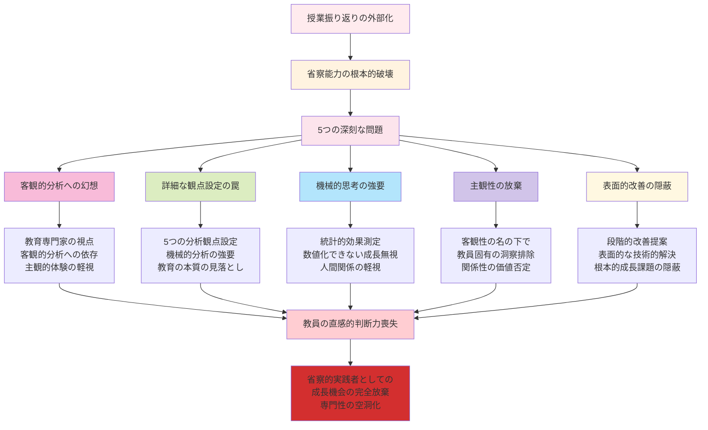
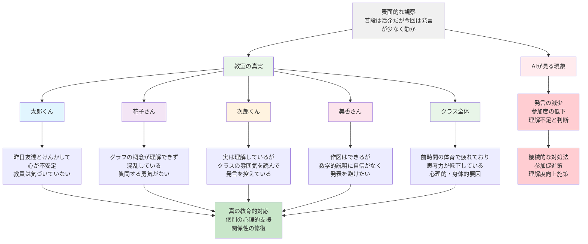
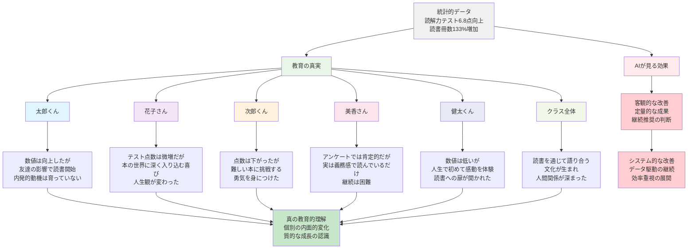

# 自己省察力の喪失

## 振り返りと分析の外部化

### 失敗事例27：授業振り返りの外部化

「今日の授業はどうだったか、客観的に分析してほしい」

教員としての成長にもっとも重要な「授業振り返り」を、安易にAIに委ねてしまう教員が増加しています。しかし、これは専門職としてもっとも大切な能力を失う危険な行為です。

**問題のある使い方**
```
**中学2年数学「一次関数のグラフ」授業の分析と改善提案の依頼**

今日実施した数学授業について、**教育専門家の視点から客観的な分析と具体的な改善提案**をお願いします。

## **授業の基本情報**
- **単元**：一次関数のグラフ（第○時/全○時間中）
- **対象**：中学2年生 32名（数学の習熟度：標準的/やや低め/混在 など）
- **授業時間**：50分
- **学習目標**：
  - 一次関数 y = ax + b のグラフが直線になることを理解する
  - 係数 a（傾き）と b（y切片）の値の変化がグラフの形や位置に与える影響を説明できる
  - **※前提知識**：座標平面、比例のグラフは既習

## **授業の実際の流れと時間配分**
1. **前時の復習**（予定5分→実際○分）：比例のグラフの確認
2. **一次関数の式からグラフを作図**（予定20分→実際○分）：y = 2x + 1, y = -x + 3 など4つの関数
3. **グループでの比較・考察**（予定15分→実際○分）：4人1組、8グループで実施
4. **全体発表・共有**（予定8分→実際○分）：各グループの気づきを発表
5. **まとめとふりかえり**（予定2分→実際○分）

## **観察された課題と詳細**
- **生徒の反応**：普段は活発だが、今回は発言が少なく静か
- **作図活動**：予想以上に時間がかかった生徒が約半数
- **グループ活動**：話し合いは行われていたが、深い考察に至らないグループが多い
- **発表場面**：挙手する生徒が3～4名程度と少ない
- **時間管理**：後半が押してしまい、まとめが不十分

## **分析・評価をお願いしたい観点**
1. **目標達成度**：設定した学習目標に対する到達状況
2. **指導方法の適切性**：説明の仕方、活動設計、支援方法
3. **生徒の理解度**：つまずきの原因と対処法
4. **授業構成**：時間配分、活動の順序や方法
5. **生徒の主体性**：参加度が低かった要因と改善策

## **特に重視したい改善の方向性**
- 次回授業（○月○日予定）での具体的な改善策
- 生徒がより主体的に参加できる工夫
- 作図技能の効率的な指導方法
- グループ活動の質向上

**この情報を基に、教育理論に基づいた分析と、明日からでも実践できる具体的な改善提案をお願いします。**
```

**この依頼の根本的な問題**

このプロンプトは表面的には非常に詳細で「専門的」に見えますが、教員としてもっとも重要な省察能力を根底から奪う深刻な問題を含んでいます。



### 1. 「客観的分析」への幻想が生む思考停止

**プロンプトの致命的な前提**
プロンプトは「教育専門家の視点から客観的な分析」を求めていますが、これは教育における真の成長プロセスを根本的に誤解した発想です。教員の成長は、自分自身の主観的体験を深く省察することでしか実現されません。

**AIには決して理解できない教室の真実**



**プロンプトが見落とす決定的な要素**
- 一人ひとりの生徒の心の状態
- その日の学校全体の雰囲気
- 前時間の授業や休み時間での出来事
- 生徒同士の人間関係の微細な変化
- 教員自身のコンディションや感情状態

### 2. 詳細な観点設定が生む表面的分析の罠

**プロンプトの「專門的」な観点設定の問題**
プロンプトは「目標達成度」「指導方法の適切性」「生徒の理解度」「授業構成」「生徒の主体性」という5つの観点を設定していますが、これらの機械的な分析観点こそが、教員の深い省察を阻害する最大の要因です。

**観点設定が見落とす教育の本質**
- **「目標達成度」**: 数値化できない生徒の内面的成長や感情の変化
- **「指導方法の適切性」**: その瞬間の生徒の状況に応じた臨機応変な対応の価値  
- **「生徒の理解度」**: 理解のプロセスや個別の学習ペースの多様性
- **「授業構成」**: 予定された流れより重要な、生徒との関係性の質
- **「生徒の主体性」**: 表面的な参加度では測れない内的動機や関心の深さ

**このプロンプトがAIに生成させる典型的な分析**

このような詳細で「専門的」なプロンプトを使うと、AIは以下のような一見優秀な授業分析を生成します。

```
# 授業分析レポート：中学2年数学「一次関数のグラフ」

## 授業目標の達成度評価
**達成度: B（おおむね達成）**

設定された学習目標に対し、グラフ作図活動を通じて基本概念の理解促進が図られました。
ただし、生徒の反応から判断すると、完全な定着には課題が残る状況です。

## 生徒の理解度分析
**理解度: C（部分的理解）**

### 観察された課題
- **作図技能の課題**: 約半数の生徒で予想以上の時間を要している
- **主体的参加の低下**: 発言者が3-4名と限定的
- **授業への関与度**: 普段より静かな状況は理解不足の可能性を示唆

### 個別の状況把握
- 作図に時間のかかる生徒：基礎的な座標理解に課題
- 発表を避ける生徒：自信不足または理解不十分
- グループ活動での深い考察不足：話し合いスキルの課題

## 指導方法の評価
**評価: B（概ね適切、改善の余地あり）**

### 効果的だった点
- 具体的な関数を用いた段階的指導
- グループ活動による協働学習の実施
- 実際の作図を通じた体験的学習

### 改善が必要な点
- 個別支援の時間配分
- 発表活動への参加促進策
- つまずき生徒への早期対応

## 時間配分と授業構成の分析
**構成評価: B（適切だが調整が必要）**

- **導入部分（5分）**: 適切な時間配分
- **展開部分（35分）**: 作図活動に予想以上の時間が必要
- **まとめ部分（2分）**: 不十分、理解確認の時間が必要

## 具体的改善提案

### 次回授業での即座改善策
1. **時間配分の調整**
   - 作図活動：20分→25分に延長
   - まとめ・振り返り：2分→5分に延長

2. **個別支援の強化**
   - 机間指導の回数増加
   - つまずき生徒の早期特定と支援

3. **参加促進の工夫**
   - 全体発表前のペア発表導入
   - 発表のための「型」の提示

### 中長期的な改善方向
1. **基礎学力の底上げ**
   - 座標平面の理解度確認と補強
   - 前単元（比例）の定着度再確認

2. **学習環境の最適化**
   - グループ編成の見直し（習熟度バランス考慮）
   - 教室環境・机配置の工夫

## 生徒の主体性向上策
1. **関心・意欲の喚起**
   - 身近な事例での一次関数の活用例紹介
   - 生徒自身の発見を重視した授業展開

2. **参加しやすい環境づくり**
   - 間違いを歓迎する雰囲気の醸成
   - 多様な表現方法の提供

## 評価規準に基づく成果確認
- **知識・技能**: 作図技能の個人差への対応が必要
- **思考・判断・表現**: 発表場面での表現支援が課題
- **主体的に学習に取り組む態度**: 関心を引く工夫が必要

## 次回授業に向けた準備
1. 本時の理解度確認（小テストまたは確認活動）
2. つまずき生徒への個別フォローアップ計画
3. 係数の変化とグラフの関係への発展準備

## 総合所見
授業の基本構成は学習指導要領に沿って適切に設計されていました。生徒の実態により柔軟に対応し、個別支援を充実させることで、さらなる学習効果の向上が期待できます。
```

**この「教育的で完璧な」分析が引き起こす深刻な問題**

### 3. 観点の詳細化が生む機械的思考の罠

このAI分析は確かに専門的で論理的に見えますが、詳細な観点設定こそが教員の深い省察を阻害する最大の要因です。

**機械的分析が見落とす教育の核心**

プロンプトで設定された5つの観点（目標達成度、指導方法の適切性、生徒の理解度、授業構成、生徒の主体性）による分析は、以下の本質的な教育的洞察を完全に排除してしまいます。

```
真に重要だった瞬間の見落とし：
・太郎くんが昨日友達とけんかして心が不安定だったこと
・花子さんがグラフの概念に混乱していたが質問する勇気がなかったこと
・次郎くんは理解していたがクラスの雰囲気を読んで発言を控えていたこと
・美香さんが作図はできるが説明に自信がなく発表を避けたかったこと
・クラス全体が前時間の体育で疲れており思考力が低下していたこと
```

**分析観点の設定が奪う教員の感性**

5つの観点で分析することで、教員は以下の感覚を失います。
- **直感的な気づき**：「何となく今日は調子が悪そう」という全体感
- **関係性の理解**：一人ひとりとの日常的な関わりから生まれる洞察
- **瞬間的な判断**：その場で感じる「今、支援が必要」という感覚
- **全人的な理解**：学習面だけでない、その子の全体像への関心

### 4. 「客観的分析」の名の下での主観性の放棄

プロンプトは「教育専門家の視点から客観的な分析」を求めていますが、教育においてもっとも価値のある洞察は、その教員にしかできない主観的な理解の中にあります。

**AIの「客観性」が消去する教員の専門性**
```
失われた教員だけが持つ情報：
・太郎くんとの信頼関係：「先生にだけは本音を話せる」
・花子さんの性格理解：「完璧主義で失敗を恐れる傾向」
・次郎くんの成長過程：「以前は積極的だったが最近控えめになった」
・美香さんとの日常会話：「数学は好きだが発表が苦手」
・クラス全体の関係性：「互いを思いやる雰囲気が育ってきている」
```

**教員の振り返りに本当に必要な問いかけ**
```
機械的観点ではなく、人間的な振り返り：
・「太郎くんの下を向いた表情に、なぜ気づいてあげられなかったのか？」
・「花子さんの困惑の表情を見た時、なぜすぐに声をかけなかったのか？」
・「クラス全体の疲れを感じた時、なぜ活動を調整しなかったのか？」
・「発表を嫌がる生徒たちの気持ちを、どうすれば理解できるのか？」
・「数学の楽しさを伝えるために、自分には何が足りないのか？」
```

### 5. 段階的改善提案が隠す根本的問題の見落とし

AIの分析は「次回授業での即座改善策」や「中長期的改善方向」など段階的な改善案を提示しますが、これらの表面的な改善策は、教員としての根本的な成長課題を隠してしまいます。

**表面的改善策が見落とす本質的課題**
- **時間配分の調整** → 生徒一人ひとりのペースを理解する感性の不足
- **個別支援の強化** → 支援が必要な瞬間を察知する観察力の課題
- **参加促進の工夫** → 生徒が安心して発言できる関係性構築の不十分さ
- **基礎学力の底上げ** → 前単元での一人ひとりの理解度把握の甘さ
- **学習環境の最適化** → クラス全体の人間関係や雰囲気への配慮不足

### 失敗事例28：教育効果測定の委任

**問題のある使い方**
```
**「読解力向上プログラム」の教育効果測定・分析**

今学期実施した「読解力向上プログラム」の教育効果を統計的に測定・分析し、今後の改善策を提案してください。

**【プログラム概要】**
- 実施期間：2024年4月～7月（4か月間、計16週）
- 対象：中学1年生3クラス（計96名）
- 内容：週2回×90分の読解力向上トレーニング、多読活動、読書感想文
- 指導者：国語科教員3名
- 使用教材：[具体的な教材名があれば記載]

**【収集データ】**
*事前・事後測定データ*
- 読解力テスト（4月）：平均65.3点（標準偏差：不明、満点：不明）
- 読解力テスト（7月）：平均72.1点（標準偏差：不明、満点：不明）
- 読書冊数（4月月平均）：1.2冊/人
- 読書冊数（7月月平均）：2.8冊/人

*質的データ*
- 生徒アンケート結果（7月実施、n=96）：
  - 「読書が楽しくなった」：83%が肯定的回答
  - 「読解力が向上したと感じる」：76%が肯定的回答

**【分析要求事項】**
1. **効果測定**：事前事後比較による効果量の算出（可能な範囲で統計的検定）
2. **要因分析**：成功要因と阻害要因の特定
3. **改善点抽出**：プログラム内容・運営面での課題
4. **実用的提言**：来年度の改善策（具体的な実施方法を含む）
5. **展開可能性**：他学年・他学校への適用における留意点

**【出力形式】**
- エグゼクティブサマリー（主要な結果と提言）
- 詳細分析結果
- 具体的な改善案（実施スケジュール付き）
- リスクと対策

**【分析時の留意点】**
- 統計的分析では利用可能なデータの制約を明示してください
- 因果関係と相関関係を明確に区別してください
- 実務的な実現可能性を考慮した提言をしてください

---

## 主な改善点

**1. データの詳細化**
- 標準偏差、満点、サンプルサイズなど統計分析に必要な情報を明示

**2. 分析制約の明確化**
- 対照群の有無、統計的検定の制約など、分析の限界を事前に示す

**3. 出力形式の具体化**
- 求める回答の構造を明確にし、実務で使いやすい形式を指定

**4. 実用性の強化**
- 具体的な実施方法やスケジュールまで含めた提言を求める

**5. リスク管理の追加**
- 提言実施時のリスクと対策も含めることで、より実践的な分析を促す
```

**この依頼の根本的な問題**

このプロンプトは表面的には非常に詳細で「科学的」に見えますが、教員としてもっとも重要な判断力と省察能力を根底から奪う深刻な問題を含んでいます。

### 1. 「統計的効果測定」への過信が生む思考停止

**プロンプトの致命的な前提**
プロンプトは「統計的な効果測定」と「客観的な分析」を求めていますが、これは教育における真の成長と学びのプロセスを根本的に誤解した発想です。教員の成長は、数値化できない微細な変化を敏感に察知し、一人ひとりの内面的な変化を理解することでしか実現されません。

**AIには決して把握できない教育効果の真実**



**プロンプトが見落とす決定的な要素**
- 一人ひとりの読書体験の質と深さ
- 本との出会いがもたらす価値観の変化
- 友達関係や学級の雰囲気の変化
- 家庭での読書習慣や親子関係への影響
- 教員自身の指導への手応えや成長実感

### 2. 詳細なデータ要求が生む表面的分析の罠

**プロンプトの「專門的」なデータ要求の問題**
プロンプトは「事前事後測定データ」「質的データ」「統計的検定」「効果量の算出」など、教育研究の専門用語を多用していますが、これらの詳細なデータ要求こそが、教員の直感的な理解と日常的な観察を軽視させる最大の要因です。

**データ要求が見落とす教育の本質**
- **「読解力テスト結果」**: 数値では測れない読書への愛情や内的動機の変化
- **「読書冊数の変化」**: 量より重要な、本との深い出会いや感動体験の質
- **「生徒アンケート結果」**: 表面的な満足度では捉えられない内面的な成長や葛藤
- **「統計的効果測定」**: 個別の成長ストーリーや人間関係の変化
- **「要因分析と改善点抽出」**: 教員の直感や経験に基づく深い洞察

**AIが生成する典型的な分析例**
```
# 「読解力向上プログラム」教育効果測定・分析報告書

## エグゼクティブサマリー

### 主要結果
- **読解力テスト**: 平均6.8点の向上（65.3点→72.1点、約10.4%改善）
- **読書習慣**: 月平均読書冊数が2.3倍に増加（1.2冊→2.8冊）
- **学習者意識**: 83%が読書への興味向上、76%が読解力向上を実感

### 重要な提言
1. **継続実施を推奨** - 明確な効果が確認された
2. **個別指導の強化** - 習熟度別アプローチの導入
3. **測定方法の改善** - より詳細なデータ収集体制の構築

---

## 詳細分析結果

### 1. 効果測定

#### 【データ制約の明示】
- 標準偏差未記載のため効果量算出不可
- 対照群なしのため因果関係の特定に限界
- 満点不明のため改善幅の相対評価困難

#### 【可能な範囲での分析】
**読解力テスト結果**
- 改善幅：6.8点（10.4%向上）
- 一般的な教育介入効果（Cohen's d = 0.2-0.8）と比較すると中程度の効果と推定
- 4か月間での改善としては良好な結果

**読書習慣の変化**
- 読書冊数の大幅増加（133%増）
- 習慣形成への強い効果を示唆

**学習者の主観的評価**
- 高い満足度と効果実感
- 内発的動機の向上が確認

### 2. 要因分析

#### 【成功要因】
1. **頻度の適切性**: 週2回の実施頻度が習慣形成に効果的
2. **多角的アプローチ**: 読解トレーニング＋多読＋感想文の組み合わせ
3. **十分な実施期間**: 16週間の継続実施
4. **専門指導体制**: 国語科教員による質の高い指導

#### 【推定される阻害要因】
1. **個人差への対応不足**: 24%の生徒が読解力向上を実感できず
2. **測定方法の限界**: 詳細な習熟度把握の困難
3. **モチベーション維持**: 長期継続への課題

### 3. 改善点抽出

#### 【プログラム内容面】
- 習熟度別グループ編成の導入必要性
- ICT活用による個別最適化の検討
- 評価方法の多様化（ルーブリック導入等）

#### 【運営面】
- より詳細なデータ収集体制の構築
- 教員間の指導方法統一
- 保護者との連携強化

---

## 具体的な改善案

### 【来年度実施計画】

#### **Phase 1: 準備期間（2025年2月-3月）**
- 習熟度診断テストの精緻化
- 教材の習熟度別カスタマイズ
- 教員研修の実施（指導法統一）

#### **Phase 2: 実施期間（2025年4月-7月）**
**4月（導入期）**
- 詳細事前測定（読解力テスト、読書習慣調査、学習意欲調査）
- 習熟度別クラス編成（3段階）
- 個別目標設定

**5-6月（展開期）**
- 週2回実施継続
- 月次進捗確認
- 教員間情報共有会（月1回）

**7月（評価期）**
- 詳細事後測定
- 個別面談実施
- 次年度引継ぎ準備

#### **Phase 3: 評価・改善期（2025年8月-9月）**
- 統計的分析実施
- 改善点抽出
- 次年度計画策定

### 【具体的改善策】

#### **1. 個別最適化の実現**
- **対象**: 習熟度下位25%の生徒
- **方法**: 基礎的読解スキルに特化した個別指導
- **時間**: 通常授業に加えて週1回30分

#### **2. 測定精度の向上**
- **事前事後テスト**: 標準化された読解力テスト導入
- **継続測定**: 月次小テストによる進捗追跡
- **質的評価**: ポートフォリオ評価の併用

#### **3. 動機維持システム**
- **表彰制度**: 読書量・読解力向上者の表彰
- **ピア学習**: 生徒同士の読書紹介活動
- **家庭連携**: 保護者向け進捗報告

---

## リスクと対策

### 【主要リスク】

#### **リスク1: 教員負担の増加**
- **対策**: ICTツール活用による効率化
- **具体策**: 自動採点システム導入、デジタル教材活用

#### **リスク2: 個人差拡大**
- **対策**: 習熟度別指導の徹底
- **具体策**: TA（Teaching Assistant）制度導入

#### **リスク3: 予算制約**
- **対策**: 段階的導入による予算分散
- **具体策**: 1年目は測定改善に集中、2年目から本格拡充

### 【成功確率向上策】

1. **パイロット実施**: 1クラスでの先行実施
2. **外部評価**: 第三者機関による効果測定
3. **継続改善**: 四半期ごとの見直し会議

---

## 展開可能性

### 【他学年への適用】

#### **中学2-3年生**
- **難易度調整**: より高度な読解材料の使用
- **進路連携**: 高校入試対策との統合
- **実施期間**: 6か月間での実施検討

#### **小学校高学年**
- **内容簡略化**: 基礎的読解スキルに特化
- **時間短縮**: 週2回×60分での実施
- **ゲーミフィケーション**: より楽しさを重視した構成

### 【他校への展開時留意点】

1. **環境要因の考慮**: 学校規模、教員体制に応じた調整
2. **地域特性の反映**: 地域の読書環境や文化的背景
3. **段階的導入**: まず1学年から開始し、成果確認後拡大

### 【必要な支援体制】
- 教育委員会レベルでの予算確保
- 教員研修プログラムの standardization
- 効果測定のための共通指標設定
```

### 3. この「科学的で完璧な」分析が引き起こす深刻な問題

**システム化された改善プロセスが奪う教員の直感**

このAI分析は確かに科学的で実用的に見えますが、「エグゼクティブサマリー」「フェーズ別実施計画」「リスクと対策」などの企業的アプローチこそが、教育の本質と教員の直感的判断を破壊する最大の要因です。

**「詳細分析結果」が消去する教育的直感**

AIの分析は「データ制約の明示」「可能な範囲での分析」「成功要因」「阻害要因」など、一見完璧な研究アプローチを提示しますが、これらのカテゴリー分けこそが教員の直感的理解を阻害します。

```
システム化された分析で見落とされる教育の本質：
・「改善幅：6.8点」→ 太郎くんが「僕は馬鹿じゃない」と思えた瞬間の価値
・「133%増加」→ 花子さんが本の中で涙した感動体験の意味
・「24%が向上を実感できず」→ 次郎くんが難しい本へ挑戦し始めた勇気の成長
・「長期継続への課題」→ 美香さんが義務感で読んでいる危険信号
・「個人差への対応不足」→ 健太くんの人生初の本での感動体験のかけがえのなさ
```

**「フェーズ別実施計画」が破壊する教育の自然性**

AIの分析は「Phase 1: 準備期間」「Phase 2: 実施期間」「Phase 3: 評価・改善期」という機械的なスケジュールを提示しますが、このようなシステム化が教育のもっとも大切な「自然な流れ」を破壊します。

```
機械的スケジュール vs 教育の自然なリズム：
・AIの提案：「4月（導入期）→ 詳細事前測定→ 習熟度別クラス編成」
・教育の現実：新学期の不安を抱えた子どもたちと、まずは安心できる関係づくりから

・AIの提案：「月次進捗確認→ 教員間情報共有会（月１回）」
・教育の現実：その日の子どもの様子や気持ちに応じて、柔軟に対応を変える

・AIの提案：「7月（評価期）→ 詳細事後測定→ 個別面談実施」
・教育の現実：一年間を通じて育まれた信頼関係の中で、自然に語られる成長の物語
```

**「リスクと対策」が教育をビジネス化する危険**

AIの分析は「予算制約」「教員負担の増加」「個人差拡大」をリスクとして挙げ、「ICTツール活用」「外部資源活用」「段階的導入」を対策として提示しますが、このようなビジネス的発想こそが教育の本質を破壊します。

### 4. 「エビデンスベース」という名の人間性の放棄

**教育をプロジェクトマネジメント化する危険**

プロンプトが求める「データ駆動型改善」「エビデンスベース」アプローチは、教育を企業のプロジェクトと同じように扱い、教員の直感や関係性、人間的なつながりを「非科学的」として排除してしまいます。

**数値では測れない教員の本質的洞察**
```
AIが「非科学的」として排除する教員の気づき：
・「太郎くんは最近、本を読むときの表情が変わった」という微細な変化への気づき
・「花子さんは数値は低いが、本の中の情景を語る時の目の輝きが素晴らしい」という質的変化の認識
・「次郎くんの『この本、難しいけど面白い』というつぶやきから、知的成長を感じる」という直感的理解
・「美香さんの感想文が機械的になってきている、これは危険信号だ」という早期発見
・「クラス全体が本の話で盛り上がるようになった、この変化こそが最大の成果だ」という総合的判断
・「来年度は競争よりも、もっと本を通じた心の交流を大切にしたい」という教育的直感
```

**結論：教育をビジネスモデルで管理することの恐ろしさ**

このAI分析は、教育を「測定可能な成果を産むプロジェクト」として扱い、教員を「データを実行するオペレーター」に変えてしまいます。しかし、教育の本質は人と人との関わりの中にあり、それはシステム化することができない、かけがえのない価値なのです。

## 省察的実践者としての成長

### 記録の整理と可視化での適切な活用

授業振り返りにおいて、AIを適切に活用する方法を考えてみましょう。

**良い活用例1：授業記録の構造化**
```
今日の授業で気づいたことを整理したいと思います。
以下の観察記録を見やすく構造化してください。

【授業中の気づきメモ】
・10:15 太郎くんが下を向いている、昨日のけんかが原因？
・10:23 花子さんの表情が困惑、グラフの意味が分からない様子
・10:35 次郎くんが他の生徒の作図を覗き込む、関心を示している
・10:42 美香さんが友達に小声で説明、理解が深まっている証拠
・10:47 クラス全体がざわつく、何か発見があった様子
・10:50 発表で手が挙がらない、自信不足か理解不足か

【授業後の感想】
・生徒一人ひとりの状況をもっと把握すべきだった
・太郎くんに声をかけるタイミングを逃した
・花子さんの困惑に早く気づいて支援すべきだった
・全体的に「教える」より「気づかせる」工夫が必要

【明日への課題】
・太郎くんの様子を確認、必要なら個別に話を聞く
・花子さんには授業前に声をかけて理解度を確認
・発表方法を工夫、ペア発表から始める
・グラフの意味をより直感的に理解できる活動を考える

この情報を見やすく整理し、明日の授業準備の参考にしたいと思います。
```

**AIの整理例**
```
# 授業観察記録・振り返りレポート

## 📊 授業中の観察記録

### 時系列での生徒の様子

| 時刻 | 生徒 | 観察内容 | 推測される状況・課題 |
|------|------|----------|---------------------|
| 10:15 | 太郎くん | 下を向いている | 昨日のけんかが原因の可能性 |
| 10:23 | 花子さん | 表情が困惑 | グラフの意味が理解できていない |
| 10:35 | 次郎くん | 他の生徒の作図を覗き込む | 積極的な関心・学習意欲を示している |
| 10:42 | 美香さん | 友達に小声で説明 | 理解が深まり、他者支援ができている |
| 10:47 | クラス全体 | ざわつく | 何らかの発見や気づきがあった |
| 10:50 | クラス全体 | 発表で手が挙がらない | 自信不足または理解不足 |

### 生徒別の状況分析

**🔴 支援が必要な生徒**
- **太郎くん**: 心理的な問題を抱えている可能性、個別配慮が必要
- **花子さん**: 学習内容の理解に困難、個別サポートが必要

**🟡 様子を見守る生徒**
- **クラス全体**: 発表への参加意欲向上が課題

**🟢 良好な状態の生徒**
- **次郎くん**: 学習への積極性を評価、さらに伸ばす工夫を
- **美香さん**: 理解度が高く他者支援もできている、リーダー的役割の可能性

## 🤔 授業後の振り返り

### 気づいた課題
- 生徒一人ひとりの状況把握が不十分
- 太郎くんへの適切なタイミングでの声かけができなかった
- 花子さんの困惑への早期対応ができなかった
- 「教える」中心から「気づかせる」指導への転換が必要

### 授業運営の改善点
- 個別の状況により敏感に反応する必要がある
- 困っている生徒への早期発見・早期対応システムの構築
- 生徒主体の学習活動の充実

## 📝 明日への具体的アクションプラン

### 個別対応
| 生徒 | 対応方法 | タイミング |
|------|----------|------------|
| 太郎くん | 様子確認、必要に応じて個別面談 | 授業前または休み時間 |
| 花子さん | 理解度確認と事前サポート | 授業開始前 |

### 授業改善策
- **発表方法の工夫**: 全体発表の前にペア発表を導入し、安心感を醸成
- **教材の改良**: グラフの意味をより直感的に理解できる体験活動を設計
- **観察システム**: 生徒の表情や行動をより細かくチェックできる巡回方法を確立

### 指導方針の調整
- 講義型から発見型・体験型学習への移行
- 生徒同士の学び合いを促進する仕組みづくり
- 個別ニーズに応じた多層的な支援体制の構築

---

**次回授業前チェックリスト**
- [ ] 太郎くんの心理状態確認
- [ ] 花子さんの予習状況・理解度確認  
- [ ] ペア発表用の活動設計完了
- [ ] 新しいグラフ理解活動の準備完了
- [ ] 生徒観察のポイント再確認
```

このような使い方であれば
- 教員の観察と気づきが主体
- AIは整理・構造化の補助のみ
- 具体的な改善行動につながる
- 教員の成長を促進する

### 気づきの言語化支援

**良い活用例2：省察の深化**
```
今日の授業で感じた「うまくいかなかった感覚」を言語化したいと思います。

【漠然とした感覚】
・なんとなく生徒との距離を感じた
・予定通り進んだけれど満足感がない
・生徒の反応が物足りなかった
・自分の説明に自信が持てなかった
・授業の「流れ」がぎこちなかった

【具体的な場面】
・導入で生徒の表情が硬かった
・説明中に視線が合わない生徒が多かった
・質問しても反応が薄かった
・グループ活動の盛り上がりに欠けた
・まとめの時間で集中力が切れていた

この感覚を分析し、何が原因だったのか、
どう改善すればよいのかを考えたいと思います。
```

**AIの分析支援例**
```
あなたが感じた「うまくいかなかった感覚」を整理すると、大きく3つの要素が絡み合っているように見えます。

**関係性の課題**
生徒との距離感や視線が合わないという状況は、心理的な安全性が十分に構築されていなかった可能性があります。導入で表情が硬かったのは、緊張や不安、あるいは授業内容への関心の低さが影響しているかもしれません。

**エンゲージメントの不足**
質問への反応の薄さやグループ活動の盛り上がりに欠けた点は、生徒が授業に能動的に参加できていない状態を示しています。これは内容の難易度、提示の仕方、または生徒の興味関心とのズレが原因として考えられます。

**授業デザインの違和感**
「流れのぎこちなさ」と最後の集中力切れは、授業の構成や時間配分に改善の余地があることを示唆しています。予定通り進んだのに満足感がないのは、活動同士のつながりや目的の明確さに課題があった可能性があります。

改善のアプローチとして、まず導入時間を使って生徒の状態や関心を確認する「チェックイン」の時間を設けることや、説明の際に意図的に生徒との対話を増やすこと、グループ活動では明確な役割分担や目標設定をすることが有効かもしれません。

どの要素が特に気になりますか？具体的な教科や学年、授業内容も教えていただければ、より詳しい分析ができます。
```

このような支援により
- 漠然とした感覚が具体的な課題として明確化
- 改善の方向性が見えてくる
- 継続的な成長につながる振り返り習慣が身につく

# 学び続ける教員であるために

## 探究心と問題解決力の危機

### 失敗事例29：継続的学習の放棄

**問題のある使い方**
```
教育に関する最新情報とトレンドを定期的に提供してください。

【希望する情報】
・最新の教育研究成果
・新しい指導法や教材
・教育現場での成功事例
・教育政策の動向
・海外の教育事情

【配信頻度】
・週1回、要点をまとめて
・各項目3-5行程度で簡潔に
・実践ですぐに使える情報を優先

【対象】
・中学校数学教員
・指導歴8年目
・学級担任と数学主任を兼務

忙しいので効率的に情報収集したいと思います。
よろしくお願いします。
```

**専門職としての退化**

この依頼は一見効率的に見えますが、教員としてもっとも重要な「学び続ける姿勢」を根底から破壊する危険性があります。

### 1. 受動的学習への堕落

**失われる能動的な学習姿勢**
- 自分で課題を発見し、必要な情報を探索する力
- 複数の情報源を比較検討する判断力
- 新しい知識を既存の経験と統合する思考力
- 実践の中で理論を検証する実証的な態度

**AIが生成する典型的な情報提供例**
```
# 教育情報週報（第○○号）

## 📚 最新の教育研究成果
**数学教育における認知負荷理論の活用**
スワラー氏の最新研究により、数学の問題解決における認知負荷の軽減が学習効果を高めることが
確認されました。複雑な問題を段階的に分解することで、生徒の理解度が25%向上したとの報告があります。

**グロース・マインドセットの数学教育への応用**
ドゥエック博士の研究チームが、数学に対する固定的思考を成長的思考に変える介入プログラムの
効果を実証。8週間の実施で数学への自己効力感が有意に向上しました。

## 🔧 新しい指導法・教材
**デジタル教材「MathVision Pro」**
AR技術を活用した立体図形学習ソフト。生徒が実際に立体を操作しながら学習でき、空間認識能力の
向上に効果があります。月額利用料1,200円。

**協働学習法「ナンバートーク」**
生徒同士が数学的な考えを言語化し合う活動。1回15分程度で実施可能で、論理的思考力の向上が
期待できます。

## 🌟 教育現場での成功事例
**○○中学校の反転授業実践**
動画教材による家庭学習と教室でのアクティブラーニングを組み合わせ、テスト平均点が15点向上。
生徒の学習意欲も大幅に改善されました。

**△△市の個別最適化学習システム**
AIを活用した個別学習プラットフォームの導入により、つまずき箇所の早期発見と対応が可能に。
不登校生徒の学習継続率が向上しています。

## 📋 教育政策の動向
**新学習指導要領の完全実施**
中学校数学での「データの活用」領域が拡充。統計的な見方・考え方の育成がより重視される方向
です。研修機会の確保が課題となっています。

**GIGAスクール構想の現状**
1人1台端末の整備は完了したものの、効果的な活用に課題。特に数学での活用事例の蓄積が求めら
れています。

## 🌍 海外の教育事情
**フィンランドの数学教育改革**
問題解決型学習を重視したカリキュラムにより、PISA数学的リテラシーでトップクラスを維持。
教員の裁量権の大きさが特徴です。

**シンガポールの数学指導法**
「Concrete-Pictorial-Abstract」アプローチの徹底により、基礎学力の確実な定着を実現。
教材開発への投資が充実しています。

---
*次回配信は○月○日を予定しています。*
```

**この「便利な」情報提供の深刻な問題**

### 2. 思考の表面化と判断力の低下

AIが提供する情報は確かに最新で有用に見えますが、以下の重要な学習プロセスを奪ってしまいます。

**失われる深い学習プロセス**
```
本来必要な学習の過程：
1. 自分の実践での問題発見
2. 関連する理論や研究の探索
3. 複数の情報源の比較検討
4. 自分の文脈での適用可能性の検討
5. 小規模な実践での検証
6. 結果の分析と理論の修正
7. 同僚との議論と知識の共有
```

**AIに依存した場合の弱体化**
```
AIに頼った場合の思考：
1. 情報を受動的に受け取る
2. 表面的な理解で満足する
3. 批判的な検討を行わない
4. 自分の文脈を考慮しない
5. 実践での検証を怠る
6. 深い理解に至らない
7. 知識が孤立して蓄積される
```

### 3. 専門的判断力の空洞化

**情報の背景や限界への無関心**
- 研究の対象となった生徒の特性（年齢、文化、学力レベル等）
- 実践された文脈の特殊性（学校規模、地域性、教育環境等）
- 研究手法の限界や結果の解釈の注意点
- 自分の教育現場での適用可能性の慎重な検討

### 失敗事例30：問題解決思考の完全外部化

**問題のある使い方**
```
以下の教育現場での課題について、解決策を提案してください。

【課題】
クラスの数学の授業で、計算はできるが文章題になると途端にできなくなる生徒が多い。
特に以下のような問題がある。

1. 文章を最後まで読まない
2. 何を求めているのか理解できない
3. 式を立てることができない
4. 答えの妥当性を検証しない

【生徒の実態】
・中学2年生（32名）
・計算能力は学年平均レベル
・読解力にはばらつきがある
・数学への苦手意識を持つ生徒が約半数

【制約条件】
・週4時間の数学授業
・特別な教材費はかけられない
・他教科との連携は困難

この状況を改善するための具体的で実践可能な解決策を、
優先順位をつけて提案してください。
```

**創造的問題解決力の放棄**

この依頼は教員としてもっとも重要な「問題解決能力」を完全に外部化する、極めて危険な行為です。

**AIが生成する典型的な解決策例**
```
この文章題の理解困難という課題は、多くの中学校で見られる重要な問題ですね。
以下、優先順位をつけて実践可能な解決策を提案します。

## 【最優先】問題読解の構造化指導

**具体的方法：**
- 文章題を読む際の「3段階読み」を徹底指導
  - 1回目：全体をざっと読む
  - 2回目：重要な数値や条件に線を引く  
  - 3回目：何を求めているかを確認
- 問題文の最後の疑問文を必ず音読させる習慣化
- 「分かっていること」「求めること」を毎回ノートに書き出させる

**導入時期：** 即座に開始可能
**時間：** 各授業の最初10分程度

## 【高優先】視覚的理解の促進

**具体的方法：**
- 文章題を図や表に変換する練習を重点実施
- 生徒に黒板で図解説明させる機会を増やす
- 問題文の重要部分を色分けして板書
- 「絵にしてみよう」を合言葉に、まず状況を描かせる

**効果：** 抽象的な文章を具体的にイメージ化

## 【高優先】段階的な式立て指導

**具体的方法：**
- 複雑な文章題を小さな問いに分解して提示
- 「まず何から求める？」「次に何が分かる？」の思考過程を言語化
- 式を立てる前に「○○を□とおく」の習慣づけ
- 途中式を必ず書かせ、一つずつ確認

## 【中優先】協働学習の活用

**具体的方法：**
- ペアで文章題を読み合い、相手に説明させる活動
- 4人グループで解法を議論し、代表者が発表
- 「教え合いタイム」を週1回設定
- 理解度の異なる生徒同士のペアリング

**メリット：** 追加費用なしで実施可能、説明することで理解が深まる

## 【中優先】答えの検証習慣の定着

**具体的方法：**
- 「答えが出たら問題文に戻る」を徹底指導
- 「この答えは現実的か？」を必ず問いかける
- 逆算による検算方法の指導
- 答えの単位確認を習慣化

## 【長期的取組】読解力向上の仕組み

**具体的方法：**
- 授業冒頭5分で短文読解（数学的文章）
- 日常生活の数学的場面を題材にした問題作成
- 生徒自身に文章題を作らせる活動
- 他の生徒が作った問題を解く相互学習

## 【評価・フィードバック体制】

**具体的方法：**
- 解答過程を重視した採点（答えだけでなく考え方も評価）
- 「どこでつまずいたか」を明確にするチェックリスト活用
- 月1回の個別面談で進歩を確認
- 小さな改善も積極的に褒める

## 【実施スケジュール案】

**1〜2週目：** 3段階読みと視覚化の導入
**3〜4週目：** 式立ての段階化指導開始  
**5〜8週目：** 協働学習の本格実施
**9週目以降：** 全体の定着と個別支援強化

これらの取組により、生徒が文章題に対する苦手意識を克服し、論理的思考力を段階的に向上
させることができると考えます。特に視覚化と協働学習は、数学への興味関心も高める効果が
期待できます。
```

**この「完璧な」解決策が引き起こす深刻な問題**

### 1. 「構造化された指導」が奪う教員の直感的理解

このAI解決策は「3段階読み」「実施スケジュール案」「優先順位づけ」など、一見完璧なシステムを提供しますが、この「構造化」こそが教員のもっとも重要な直感的理解を破壊します。

**「優先順位づけ」が見落とす教育の本質**

AIは「最優先」「高優先」「中優先」というカテゴリー分けを行いますが、教育における真の優先順位は、その日の子どもたちの状態や気持ちによって決まります。

```
「構造化された指導」 vs 「教育の現実」：
・AIの提案：「最優先：問題読解の構造化指導」
・教育の現実：太郎くんが「僕は数学が嫌い」と言った瞬間、まず数学への気持ちを変えることが最優先

・AIの提案：「高優先：視覚的理解の促進」
・教育の現実：花子さんが間違いを恐れている今日、まず安心できる雰囲気づくりが必要

・AIの提案：「中優先：協働学習の活用」
・教育の現実：次郎くんの日本語理解の困難さに気づいた今、先に母語での理解を大切にする
```

**「実施スケジュール」が破壊する教育の自然なリズム**

AIは「1～2週目：3段階読みと視覚化の導入」「3～4週目：式立ての段階化指導開始」という機械的なスケジュールを提示しますが、教育の現実はこのような予定調和では進みません。

### 2. 「一般的な手法」が無視する一人ひとりの特性

**AIの提案が完全に無視する現実**

この「完璧な」解決策は、以下の重要な情報を完全に無視しています。

```
教員だけが知っている子どもたちの真の姿：
・太郎くん：文字を読むのに時間がかかり、「3段階読み」ではかえって負担が増える
・花子さん：理解は早いが、完璧主義で「間違ってもいい」雰囲気作りが最優先
・次郎くん：母語での思考が得意で、「日本語での説明」より先に内容理解を支援すべき
・美香さん：言葉での説明は苦手だが、図や身ぶりでなら素晴らしい表現力を発揮する
・クラス全体：前の担任の影響で委縮しており、「正解」より「挑戦する勇気」が必要
```

**AIの「一般的な手法」 vs 「その子だけのアプローチ」**

```
AIの提案：「文章題を読む際の『3段階読み』を徹底指導」
→ 太郎くんには逆効果、かえって読解への嫌悪感が増す

AIの提案：「『分かっていること』『求めること』を毎回ノートに書き出させる」
→ 花子さんにはプレッシャー、数学への不安が増大

AIの提案：「ペアで文章題を読み合い、相手に説明させる活動」
→ 次郎くんには日本語での説明が酸酷、自信をさらに失う

AIの提案：「4人グループで解法を議論し、代表者が発表」
→ 美香さんには言語化が苦手で、参加できず孤立感が増す
```

### 3. 「システム化された解決」が奪う教員の創造性

**真の問題解決は、その教員だからこその直感と創造性から生まれる**

教員の専門性は、マニュアルやシステムを実行することではなく、目の前の子どもたちの状況を敏感に読み取り、その場で最適なアプローチを創造することにあります。

```
AIのシステム化された手法 vs 教員の創造的アプローチ：

太郎くんへの対応：
・AI：「3段階読みの徹底指導」
・教員：まず数学の楽しさを伝え、彼のペースで音読を大切にする

花子さんへの対応：
・AI：「重要部分に線を引く習慣化」
・教員：「間違いは学びのチャンス」という雰囲気づくりから始める

次郎くんへの対応：
・AI：「ペアで読み合い、説明させる活動」
・教員：母語での理解を大切にし、彼の文化的背景を活かした問題づくり

美香さんへの対応：
・AI：「4人グループで解法を議論」
・教員：彼女の絵や身ぶりでの表現力を活かし、数学をアートで表現させる
```

### 4. 「標準化された指導」が破壊する教育の人間性

**教育の本質は一人ひとりとの関係性にある**

AIの提案する「効果的な手法」は、教育を技術的な問題として扱いますが、真の教育は人と人との関わり、信頼関係、感情の交流の中にあります。

**数値や指標では測れない教育の成果**
- 太郎くんが「僕でもできるかも」と思えた瞬間の価値
- 花子さんが初めて手を上げた時の勇気の成長
- 次郎くんが母語で数学を語った時の目の輝き
- 美香さんが絵で解法を表現した時の自信に満ちた笑顔
- クラス全体が「間違いも大丈夫」と感じられる雰囲気の変化

**結論：教育をテクノロジーで解決しようとすることの限界**

このAIの「完璧な」解決策は、教育を「技術的問題」として扱い、教員を「システムの実行者」に変えてしまいます。しかし、教育の本質は人間同士の深いつながりの中にあり、それはテクノロジーで置き換えることのできない、かけがえのない価値なのです。

## 生涯学習者としてのAI活用

### 学習パートナーとしての対話

継続的な学習において、AIを適切に活用する方法を考えてみましょう。

**良い活用例1：対話的な理解深化**
```
認知負荷理論について学んでいます。
私の理解が正しいか、議論を通じて深めたいと思います。

【私の現在の理解】
認知負荷理論では、人間の作業記憶には限界があり、
学習時に過度な負荷がかかると学習効果が下がるとされています。

数学の授業では、新しい概念と複雑な計算を同時に教えると
生徒の認知負荷が高くなりすぎて、理解が困難になると考えています。

【疑問点】
1. 認知負荷を軽減しすぎると、深い学習にならないのではないか？
2. 生徒によって認知負荷の許容量は異なるはずだが、どう対応すべきか？
3. 慣れ親しんだ内容なら負荷は小さくなるが、それをどう活用すべきか？

この理解について議論し、より深い理解に導いてください。
```

**AIとの対話例**
```
認知負荷理論についての理解を深める対話

## あなたの理解の確認

基本的な理解は正確です。スワラー（Sweller）らの研究に基づく認知負荷理論の核心を捉えています。

## 疑問点への応答と発展的議論

### 1. 認知負荷軽減と深い学習の関係

**興味深い観点ですね。これは「適切な困難性（desirable difficulties）」の概念と関連します。**

認知負荷理論では3つの負荷を区別します。
- **内在的負荷**：学習内容そのものの複雑さ
- **外在的負荷**：指導方法による無駄な負荷
- **生成的負荷**：理解を深めるために必要な負荷

**質問：あなたの授業で、生徒に「適切な困難」を与えている場面はありますか？それはどのような工夫ですか？**

### 2. 個人差への対応

**これは非常に実践的で重要な問題です。**

研究では以下のような要因が認知負荷の個人差に影響することが示されています。
- 前提知識の量と質
- 作業記憶の容量
- 学習スタイル
- 動機や興味

**質問：あなたのクラスで認知負荷の個人差を感じる具体例はありますか？その生徒たちにどのような配慮をしていますか？**

### 3. 既習内容の活用

**これは「認知負荷の転移効果」として知られています。**

既習内容が自動化されると作業記憶の負荷が軽減され、新しい学習に使える認知資源が増加します。

**質問：数学での基礎計算の自動化について、どのような指導をしていますか？それが新しい概念学習にどう影響していると感じますか？**

## さらなる探究のために

この理論を実践で活用するために考えてみませんか：
1. 来週の授業で、認知負荷を意識した指導案を作ってみる
2. 生徒の反応を観察して、負荷の適切性を評価してみる
3. 同僚の先生と認知負荷理論について議論してみる

**あなたはどの点から始めてみたいですか？**
```

このような対話により
- 一方的な知識伝達ではなく、双方向の理解深化
- 理論と実践の結びつけ
- 新たな疑問や探究テーマの発見

### 問題発見の補助

**良い活用例2：データ分析からの気づき促進**
```
今学期の数学テストの結果を分析して、
指導の改善点を見つけたいと思います。

【テスト結果データ】
問題1（計算）：平均85点、正答率86%
問題2（文章題）：平均62点、正答率63%
問題3（図形）：平均78点、正答率75%
問題4（関数）：平均55点、正答率58%
問題5（応用）：平均48点、正答率45%

【気になる点】
・問題2と4で大きく成績が下がっている
・問題5は予想以上に低い
・普段の授業での理解度とギャップがある

【授業での印象】
・文章題は毎回練習しているが定着しない
・関数の概念理解に時間をかけたつもり
・応用問題は授業でも扱ったが難しかった

このデータから見える課題と改善の方向性について、
私が見落としている視点があれば指摘してください。
```

**AIの分析支援例**
```
テスト結果を拝見すると、いくつかの重要な傾向が見えてきます。データから読み取れる課題と
改善の方向性について分析させていただきます。

## データから見える主要な課題

**スキルの階層性の問題**
計算問題（85点）から文章題（62点）、そして応用問題（48点）へと段階的に成績が下がって
いるのは、基礎スキルの応用力に課題があることを示しています。生徒たちは個別のスキルは
習得しているものの、それらを統合して使う力が不足している可能性があります。

**言語的理解と数学的理解の分離**
文章題と関数の低成績は共通点があります。両方とも「状況を数学的に翻訳する」能力を要求
するからです。文章題は日常言語を数式に、関数は変化の関係を式やグラフに変換する必要が
あります。

## 見落としがちな視点

**メタ認知スキルの不足**
普段の授業での理解度とテスト結果のギャップは、生徒が「分かったつもり」になっている
可能性を示唆しています。授業中は教師のサポートがあるため理解できているように感じるが、
独力では解けないという状況です。

**問題解決プロセスの可視化不足**
文章題や応用問題では、答えだけでなく「どう考えたか」のプロセスが重要です。生徒が
行き詰まるポイントが見えていない可能性があります。

**転移学習の弱さ**
授業で扱った応用問題でも低得点ということは、類似問題への応用ができていないことを
意味します。パターン認識や本質的理解が不足している可能性があります。

## 改善の方向性

**段階的スキル統合の強化**
計算→文章題→応用へのブリッジを意識した指導が必要です。例えば、計算問題に簡単な文脈を
加えた問題から始めて、徐々に複雑化していく段階的アプローチが効果的でしょう。

**思考プロセスの言語化**
生徒に解法を説明させる機会を増やし、自分の思考を客観視させることで、メタ認知能力を
育成できます。

**誤答分析の活用**
テスト後に誤答パターンを分析し、どこでつまずいているかを特定することで、より的確な
指導ができるはずです。

**関数指導の再構築**
関数は概念理解だけでなく、表・式・グラフの相互変換能力が重要です。一つの関数を
多様な表現で捉える練習が必要かもしれません。

もっとも重要なのは、生徒が「なぜそう考えるのか」を言語化できるようになることだと
思います。これによって、知識の定着と転移が促進されるでしょう。
```

このような活用により：
- データの背後にある教育的意味の発見
- 新たな仮説の生成
- 具体的な改善行動への道筋

## まとめ：専門性を高め続ける姿勢

この章では、教員の成長と専門性に関わる4つの危機を見てきました。

1. **授業振り返りの外部化** - 省察力の喪失
2. **教育効果測定の委任** - 判断力の退化
3. **継続的学習の放棄** - 受動的学習への堕落
4. **問題解決思考の完全外部化** - 創造性の放棄

**専門職としての成長の本質**
- 自己省察による継続的改善
- 主体的な問題発見と解決
- 理論と実践の往復運動
- 同僚との協働的学習

**認知負債を防ぐAI活用の原則**
- 学習パートナーとしての位置づけ
- 対話を通じた理解深化
- 気づきと発見の促進
- 最終的な判断は教員が行う

**生涯学習者として大切なこと**
- 疑問を持ち続ける姿勢
- 試行錯誤を恐れない勇気
- 失敗から学ぶ謙虚さ
- 成長を楽しむ心

教員の専門性は、知識の量ではなく、学び続け、成長し続ける姿勢の中にあります。AIを適切に活用しながら、専門職としての誇りと責任を持ち続けることが、これからの時代の教員に求められています。

## これまでの章を振り返って

ここまで7章にわたって、生成AIの誤用がいかに教員の認知負債を蓄積させ、専門性を危機にさらすかを30の具体例とともに見てきました。授業設計から生徒対応、校務処理、そして教員の成長に至るまで、あらゆる場面でAIへの過度な依存が深刻な問題を引き起こす実態を確認しました。

しかし、これらの警鐘は決してAIという技術そのものを否定するものではありません。問題は技術ではなく、私たちがそれとどのように向き合うかにあります。

適切に活用すれば、AIは教育の質を向上させ、教員の負担を軽減し、生徒一人ひとりに最適化された学習環境を提供する強力なパートナーとなり得ます。重要なのは、主体性と専門性を保ちながら、AIを賢く活用することです。

次章では、これまでの失敗事例から得られた教訓を活かし、認知負債を防ぎながらAIを効果的に活用するための実践的なガイドラインを提示します。批判から建設へ、問題提起から解決策へ。教員としての誇りと責任を保ちながら、AI時代の教育を豊かに実現する道筋を示していきます。