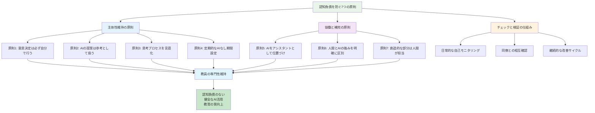
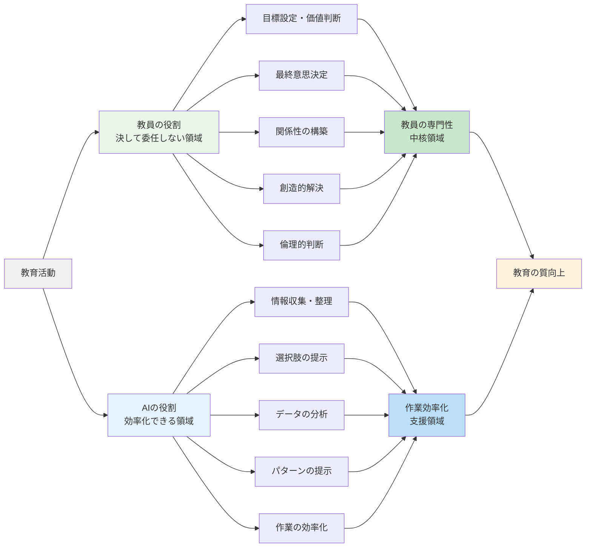
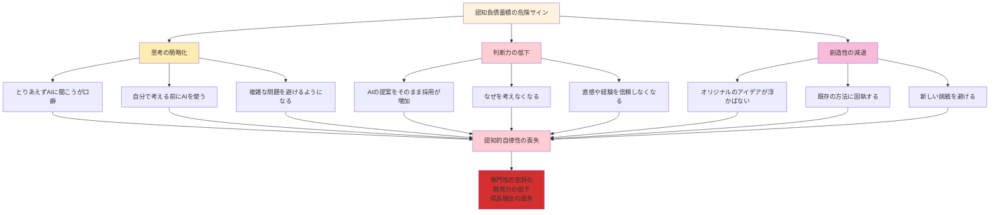

# 認知負債を防ぐ7つの原則

これまで7章にわたって、生成AIの誤用が教員の専門性を奪い、認知負債を蓄積させるさまざまな失敗事例を見てきました。一方で、適切に活用すれば、AIは教員の専門性を高め、より豊かな教育を実現する強力なパートナーになり得ます。

この章では、認知負債を防ぎながらAIの恩恵を最大限に活用するための具体的な方法論を提示します。



## 主体性維持の原則

### 原則1：意思決定は必ず自分で行う

**基本的な考え方**

AIの提案や分析は、あくまでも「判断材料」であり、「最終決定」ではありません。教員としての専門的判断を放棄した瞬間に、認知負債が始まります。

**実践例：授業計画での意思決定**

```
❌ 悪い例：
「この授業計画で実施します」（AIの提案をそのまま採用）

✅ 良い例：
「AIの提案を3つ検討した結果、案2をベースに、
うちのクラスの実態に合わせて○○を修正し、
△△を追加して実施します」
```

**日常での実践方法**

- AI活用前に必ず「私は何を判断したいのか」を明確にする
- 複数の選択肢を検討する習慣をつける
- 「なぜこの判断をしたのか」を言語化できるようにする
- 判断の根拠を教育理論や経験と照らし合わせる

### 原則2：AIの提案は「参考」として扱う

**認知負債を生む危険な思考パターン**

- 「AIが作ったから正しい」
- 「詳細に作られているから完璧」
- 「時間をかけて考えるより効率的」

**健全な関係性の構築**

AIの提案に対して、常に以下の視点で検証します。

1. **適切性の検証**：自分のクラス・学校に適しているか
2. **実現可能性の確認**：現実的に実施可能か
3. **教育効果の予測**：期待する学習効果が得られるか
4. **安全性の確保**：生徒の安全や心理的配慮は十分か

**実践例：生徒指導での参考活用**

```
状況：クラスでいじめの兆候を発見

❌ 危険な依存：
「AIの指導方針に従って対応しよう」

✅ 健全な参考活用：
「AIの提案も参考にしながら、
・この子たちの関係性の歴史
・保護者との関係
・これまでの指導の積み重ね
を総合的に判断して対応方針を決める」
```

### 原則3：思考プロセスを言語化する習慣

**なぜ言語化が重要なのか**

認知負債の最大の危険は、「考えていないのに考えた気になる」ことです。思考プロセスを言語化することで、自分が本当に考えているかを確認できます。

**日々の実践方法**

**授業準備での言語化例**
```
「今日の算数で分数の導入をする。
・前回の授業で、太郎くんがまだ整数の割り算で困っていた
・花子さんは理解が早いので、発展的な問題も用意したい
・クラス全体として、具体的な操作から入る方が理解しやすい傾向
・AIの提案では図形を使った導入が提案されているが、
  うちのクラスには食べ物の例の方が身近で分かりやすいだろう
・今日の目標は『分数という考え方があることを知る』
・評価は操作活動での反応と振り返りシートで確認」
```

**生徒対応での言語化例**
```
「美香さんが最近元気がない。
・以前は積極的だったが、先週から発言が減っている
・友達関係は特に変化なし
・家庭での変化があるかもしれない
・まずは自然な会話の機会を作って様子を聞いてみよう
・AIの提案では段階的アプローチが示されているが、
  美香さんの性格を考えると、まず信頼関係の確認から」
```

### 原則4：定期的な「AIなし」期間の設定

**認知的自律性を保つための重要な習慣**

定期的にAIを使わずに業務を行うことで、自分の思考力や判断力が維持されているかを確認します。

**実践的なスケジュール**

- **週1回のAIなし日**：1週間のうち1日は完全にAIを使わない
- **月1回の振り返り週**：1か月に1週間、可能な限りAIを使わずに業務を行う
- **長期休暇での完全離脱**：夏休みなどに1〜2週間、AIから完全に離れる

**AIなし期間での確認ポイント**

1. **思考の流暢性**：AIなしでもスムーズに思考できるか
2. **判断の確実性**：迷いなく判断を下せるか
3. **創造性の維持**：新しいアイデアが浮かぶか
4. **専門知識の定着**：必要な知識がすぐに思い出せるか

## 協働と補完の原則

### 原則5：AIは「アシスタント」として位置づける

**健全な関係性の構築**

AIは優秀なアシスタントですが、決して「上司」や「専門家」ではありません。教員が「監督者」として、AIの能力を適切に活用します。

**役割分担の明確化**



| 教員の役割 | AIの役割 |
|-----------|----------|
| 目標設定・価値判断 | 情報収集・整理 |
| 最終意思決定 | 選択肢の提示 |
| 関係性の構築 | データの分析 |
| 創造的解決 | パターンの提示 |
| 倫理的判断 | 作業の効率化 |

**実践例：保護者面談の準備**

```
教員の役割（決して委任しない領域）：
・この保護者との関係性の把握
・子どもの成長への願いの明確化
・面談の目標設定
・話す内容の優先順位決定

AIの役割（効率化できる領域）：
・過去の面談記録の整理
・話題の構造化
・想定質問の列挙
・時間配分の提案
```

### 原則6：人間の強みとAIの強みを明確に区別

**人間にしかできないこと**

1. **共感と情緒的理解**
   - 生徒の心の動きを感じ取る
   - 言葉にならない思いを理解する
   - 感情に寄り添う

2. **創造性と直感**
   - 新しいアイデアの創出
   - 予期せぬ発想の転換
   - 芸術的・美的判断

3. **価値判断と倫理**
   - 何が正しいかの判断
   - 道徳的な意思決定
   - 人間としての模範の提示

4. **関係性と信頼**
   - 一人ひとりとの絆の構築
   - 長期的な関係の育成
   - 人間的な魅力の発揮

**AIが得意なこと**

1. **情報処理と分析**
   - 大量データの整理
   - パターンの発見
   - 客観的な分析

2. **作業の効率化**
   - 定型的な業務の支援
   - 資料の作成補助
   - スケジュール管理

3. **複数の視点の提示**
   - 多様な選択肢の生成
   - 異なる角度からの検討
   - 見落としの防止

**実践例：学級経営での適切な分担**

```
人間（教員）が担当：
・学級の雰囲気作り
・一人ひとりとの対話
・価値観の伝達
・緊急時の判断

AI活用領域：
・活動アイデアの収集
・スケジュールの調整案
・保護者への連絡文案
・記録の整理
```

### 原則7：創造的な部分は人間が担当

**創造性を守る重要性**

教育は本質的に創造的な営みです。一人ひとりの子どもとの出会いは二度とない一期一会であり、その瞬間に最適な教育を創り出すのは人間にしかできません。

**創造性を発揮すべき場面**

1. **授業のオリジナル要素**
   - 導入の工夫
   - 例え話や具体例
   - まとめ方の工夫

2. **生徒への個別対応**
   - その子だけの特別な支援
   - 関係性に基づいた言葉選び
   - 成長に応じた期待の設定

3. **学級の特色作り**
   - クラス独自の取り組み
   - 子どもたちとの協働創造
   - 文化の醸成

**実践例：道徳授業での創造性発揮**

```
AI活用（効率化）：
・教材の候補となる資料収集
・指導案の基本構成
・評価の観点整理

人間の創造性（核心部分）：
・この子たちの心に響く教材選択
・一人ひとりの心の動きに応じた問いかけ
・その瞬間にしか生まれない対話の展開
・価値観の伝達方法
```

## チェックと検証の仕組み構築

### 日常的な自己モニタリング

**認知負債蓄積の早期発見**

以下のサインが現れたら、AI依存が進んでいる可能性があります。



1. **思考の簡略化**
   - 「とりあえずAIに聞こう」が口癖になる
   - 自分で考える前にAIを使う
   - 複雑な問題を避けるようになる

2. **判断力の低下**
   - AIの提案をそのまま採用することが増える
   - 「なぜ」を考えなくなる
   - 直感や経験を信頼しなくなる

3. **創造性の減退**
   - オリジナルのアイデアが浮かばない
   - 既存の方法に固執する
   - 新しい挑戦を避ける

**週次チェックリスト**

毎週金曜日に以下を振り返りましょう。

```
□ AIを使わずに解決した問題はあったか
□ AIの提案を修正・改善したことはあったか
□ 自分なりの創意工夫をした場面はあったか
□ 生徒との対話で新しい発見はあったか
□ 「なぜ」を3回以上問いかけた場面はあったか
□ 直感や経験を信頼して判断した場面はあったか
□ 同僚と専門的な議論をしたか
```

### 同僚との相互確認

**専門職コミュニティでの質保証**

一人での自己モニタリングには限界があります。同僚との対話を通じて、客観的な視点を得ることが重要です。

**効果的な相互確認の方法**

1. **定期的な実践共有**
   - 月1回、お互いの実践を報告
   - AI活用の成功例と失敗例を共有
   - 改善点について議論

2. **授業観察とフィードバック**
   - 相互の授業参観
   - AI活用の適切性について意見交換
   - 教員の専門性発揮度の確認

3. **事例検討会の実施**
   - 困難事例の協働解決
   - AI活用の判断基準の検討
   - ベストプラクティスの共有

**相互確認での観察ポイント**

```
□ 教員の主体性が保たれているか
□ 生徒との関係性が築けているか
□ 創造的な工夫が見られるか
□ 専門的判断が適切に行われているか
□ AI依存の兆候はないか
```

# 場面別・目的別活用ガイド

## 授業準備での賢い使い方

### 情報収集フェーズ：効率的なリサーチ支援

**AIが力を発揮する領域**

授業準備の初期段階では、AIの情報収集・整理能力を最大限に活用できます。ただし、収集した情報をどう活用するかは教員が判断します。

**実践例1：単元導入の資料収集**

```
効果的な依頼例：
「小学5年生の社会科『工業生産』の単元導入で、
子どもたちが身近に感じられる製造業の例を探しています。
以下の条件に合う事例を5つ提案してください：

【条件】
・子どもたちが日常的に使っている製品
・工場見学が可能（関東圏内）
・安全性に配慮された製造過程
・環境への取り組みも学べる企業

各事例について、製品の特徴、製造工程の概要、
教育的価値、見学時の注意点も含めて教えてください。」
```

**教員の専門性を活かす視点**

収集された情報に対して、教員は以下を判断します。
- この情報は我が校の子どもたちに適しているか
- 教育目標達成に有効か
- 実施上の課題はないか
- より効果的な活用方法はないか

### アイデア展開フェーズ：創造性のスタートライン

**AIとのブレインストーミング**

AIを「発想のきっかけ」として活用し、そこから教員独自のアイデアを発展させます。

**実践例2：体験活動のアイデア発想**

```
段階的な活用例：

【第1段階：AIでアイデアの種を得る】
依頼：「中学1年生の理科『光の性質』で、
生徒が驚きと発見を体験できる実験を10個提案して」

【第2段階：教員による選択と発展】
・AIの提案から3つを選択
・自分のクラスの実態に合わせて修正
・安全性と実現可能性を検証
・独自の工夫を2つ追加

【第3段階：オリジナル活動の創造】
・選択した要素を組み合わせ
・クラスの特性を活かした新しい展開
・評価方法と支援策も含めて完成
```

**創造性を保つためのコツ**

1. **必ず複数案を検討**：1つの提案に固執しない
2. **既存の要素を組み合わせ**：AIの提案を組み合わせて新しいものを創る
3. **自分らしさを追加**：教員の個性や強みを活かす要素を加える
4. **生徒の声を反映**：過去の生徒の反応や要望を組み込む

### 教材作成フェーズ：素材加工の協働

**効率的な教材素材の準備**

AIに基本的な素材を用意してもらい、教員が教育的価値を高める加工を行います。

**実践例3：ワークシート作成での協働**

```
【教員の設計】（決して委任しない）
・学習目標の明確化
・生徒の実態に応じた難易度設定
・評価のポイント決定
・個別支援の方針策定

【AIへの依頼】（効率化できる部分）
「以下の目標に沿ったワークシートの素材を作成してください：

目標：分数の足し算の手順を理解し、計算できる
対象：小学4年生（分数の基本概念は理解済み）
形式：A4用紙1枚、段階的な問題配置
配慮：計算が苦手な児童向けのヒント欄も含める

問題例、説明文、図表の配置案を提案してください」

【教員による最終調整】（必須プロセス）
・自分のクラスの実態に合わせた微調整
・つまずきやすいポイントの追加説明
・個別支援が必要な児童への配慮
・評価規準に基づく採点基準設定
```

### 最終確認フェーズ：品質保証の仕組み

**客観的な確認作業**

準備した授業の質を客観的に確認するため、AIに「監査」的な役割を依頼します。

**実践例4：授業計画の客観的チェック**

```
チェック依頼例：
「以下の授業計画について、客観的な視点から
改善点や見落としている点を指摘してください：

【授業計画の概要】
（教員が作成した詳細な授業計画を提示）

【チェックポイント】
・学習目標と活動の整合性
・時間配分の適切性
・安全面での配慮
・個別支援の具体性
・評価方法の妥当性
・準備物の確認

率直な改善提案をお願いします。」
```

**最終判断は教員が実行**

AIの指摘を受けて、教員が以下を判断します。
- 指摘は妥当か
- 自分のクラスには当てはまるか
- 修正の優先順位はどうするか
- 実現可能な改善策は何か

## 生徒対応での適切な活用

### 事前準備：情報整理と戦略検討

生徒との対話や指導において、AIは事前準備の段階で力を発揮します。しかし、実際の対応は必ず教員の人間性と専門性で行います。

**準備段階での効果的活用**

**実践例1：個別指導計画の準備**

```
状況：学習に困難を抱える生徒への支援計画立案

【AIへの相談】
「以下の観察記録を基に、支援の方向性について
多角的な視点からアドバイスをください：

【観察記録】
・数学の授業で計算ミスが目立つ（特に繰り上がり）
・集中時間が短い（10分程度で他のことを考え始める）
・友達とのコミュニケーションは良好
・体育や音楽では積極的
・家庭学習の習慣はある

【検討したい観点】
・学習方法の工夫
・集中力向上の手立て
・強みを活かした支援
・家庭との連携方法」

【教員の最終判断】
・AIの提案を参考にしながら
・この子の性格や家庭環境を考慮
・実現可能性を検討
・支援の優先順位を決定
```

**実践例2：保護者対応の準備**

```
【AIを活用した準備】
「明日の保護者面談に向けて、以下の内容を
整理・構造化してください：

【面談の背景】
・子どもの最近の様子（成長点と課題）
・保護者からの相談内容
・前回面談での話し合い内容
・今回の面談目標

【準備すべき資料】
・成長の記録
・作品やテストの例
・今後の支援方針

話し合いの流れと時間配分の提案もお願いします」

【教員による最終準備】
・この保護者との関係性を踏まえた調整
・話し方や言葉選びの検討
・予想される質問への回答準備
・家庭との連携方針の確認
```

### 対応中：人間性を最優先

**重要な原則：対話中はAIを使わない**

生徒や保護者との実際の対話においては、AIに頼らず、教員の人間性を最大限に発揮します。

**対話中に大切にすること**

1. **その瞬間の相手に集中**
   - 表情、声のトーン、身体の様子を観察
   - 言葉にならない感情を感じ取る
   - 相手のペースに合わせる

2. **関係性を活かした対応**
   - これまでの積み重ねを思い出す
   - 相手の特性や価値観を考慮
   - 信頼関係に基づいた言葉を選ぶ

3. **教員としての専門性を発揮**
   - 教育的観点からの判断
   - 発達段階に応じた関わり
   - 将来を見据えた支援

**対話中の心構え**

```
✅ 大切にすること：
・相手の話を最後まで聞く
・共感的な理解を示す
・相手の立場に立って考える
・自分の経験と専門知識を活かす
・その場の雰囲気を読む

❌ 避けるべきこと：
・スマートフォンでAIに質問する
・定型的な回答を探す
・マニュアル通りの対応をする
・相手の感情を軽視する
```

### 事後記録：振り返りと継続的改善

対話や指導の後は、AIを活用して記録を整理し、次回への改善につなげます。

**実践例3：対話記録の効果的整理**

```
【AIへの整理依頼】
「今日の生徒面談の内容を記録し、
継続的な支援に活かせる形で整理してください：

【面談内容】
・学習面：数学への苦手意識、英語への興味
・生活面：友人関係の変化、部活動での悩み
・家庭面：進路への不安、保護者の期待

【生徒の様子】
・最初は緊張していたが、徐々にリラックス
・進路の話になると表情が曇る
・部活動の話では生き生きとしていた

【今後の支援方針】
・学習面での具体的な支援策
・進路相談の継続
・保護者との連携方法

次回面談（1か月後）に向けた観察ポイントと
支援の重点項目を提案してください」

【教員による最終確認】
・記録の正確性確認
・支援方針の妥当性判断
・実現可能性の検討
・他の教員との情報共有内容決定
```

### 継続的改善：パターン分析と支援技術向上

**AIを活用した支援技術の向上**

長期的な記録を分析することで、自分の支援パターンや効果的な方法を客観的に把握できます。

**実践例4：支援パターンの分析**

```
【分析依頼】
「過去3か月間の生徒指導記録を分析し、
私の支援パターンと改善点を教えてください：

【記録データ】
・個別面談記録（月4回平均）
・保護者対応記録（月2回平均）
・学習支援記録（週3回平均）

【分析の観点】
・うまくいった事例の共通点
・困難だった事例の特徴
・支援方法の傾向
・改善の余地がある領域

客観的な分析結果と、具体的な改善提案を
お願いします」

【教員による活用】
・分析結果の妥当性検証
・改善提案の実現可能性検討
・自分の強みと課題の再認識
・今後の支援技術向上計画策定
```

## 校務効率化における注意点

### 思考を要する業務の識別

校務の中には、一見事務的に見えても実は重要な思考や判断を要する業務があります。これらを適切に識別し、機械的な処理を避けることが重要です。

**思考を要する校務の例**

1. **学級通信の作成**
   - 子どもたちの成長の記録
   - 保護者へのメッセージ
   - 教育方針の伝達

2. **指導要録の記述**
   - 一人ひとりの成長の評価
   - 個性や特徴の表現
   - 次年度への申し送り

3. **年間計画の立案**
   - 長期的な教育ビジョン
   - 系統性のある学習計画
   - 地域や学校の特色反映

**効率化と思考のバランス**

これらの業務では、AIに事務的な部分を支援してもらいながら、思考や判断が必要な部分は教員が担当します。

**実践例：学級通信作成での適切な分担**

```
【AIに依頼する部分】（効率化可能）
・基本的なレイアウトの提案
・季節に応じた挨拶文の例
・一般的な学校行事の説明文
・連絡事項の整理

【教員が必ず担当する部分】（思考が必要）
・子どもたちの具体的な成長エピソード
・クラス独自の取り組みの紹介
・保護者への感謝や願いの表現
・教育的メッセージの内容
・個別の配慮が必要な連絡事項
```

### 文書作成における省察の機会を活かす

**文書作成を通じた自己省察**

文書作成は、自分の教育実践を振り返り、整理する貴重な機会です。この過程をAIに委ねてしまうと、重要な成長の機会を失います。

**実践例：研修レポートでの省察活用**

```
【問題のあるAI依存】
「今日参加した○○研修についてレポートを作成して」

【適切な活用方法】

【第1段階：教員による省察】（必須プロセス）
・研修で学んだことの整理
・自分の実践との関連づけ
・今後活かしたい点の明確化
・疑問や課題の整理

【第2段階：AIによる構造化支援】
「以下の省察内容を、読みやすいレポート形式に
整理してください：

【学んだこと】
（教員が書いた省察内容）

【実践との関連】
（教員が考えた関連性）

【今後の活用】
（教員が決めた活用方針）

論理的で分かりやすい構成にしてください」

【第3段階：教員による最終仕上げ】
・自分らしい表現への調整
・具体例の追加
・読み手に応じた配慮
・実践計画の具体化
```

### 長期的思考と計画力の維持

**PDCAサイクルの主体的運用**

計画立案や振り返りは、教員の専門性の核心部分です。AIは情報整理や分析を支援しますが、判断や方針決定は教員が行います。

**実践例：年間指導計画での適切な活用**

```
【教員の主体的思考】（決して委任しない）
・教育目標と価値観の明確化
・子どもたちの実態把握と願い
・地域や学校の特色との関連
・前年度の成果と課題の分析

【AIによる支援】（効率化可能）
・スケジュールの調整案
・他校の実践例の収集
・時数計算や配当の確認
・形式的な整理作業

【協働プロセス】
1. 教員が基本方針と重点を決定
2. AIに具体的な計画案の作成を依頼
3. 教員が案を検討し、修正指示
4. 最終的な判断と決定は教員が実行
```

## まとめ：持続可能なAI活用

この章では、認知負債を防ぎながらAIを効果的に活用するための7つの原則と、場面別の具体的な活用方法を示しました。

**7つの原則の再確認**

1. **意思決定は必ず自分で行う** - 主体性の維持
2. **AIの提案は「参考」として扱う** - 適切な距離感
3. **思考プロセスを言語化する** - 認知的自律性の確保
4. **定期的な「AIなし」期間の設定** - 能力維持の確認
5. **AIは「アシスタント」として位置づける** - 役割の明確化
6. **人間の強みとAIの強みを区別** - 適材適所の活用
7. **創造的な部分は人間が担当** - 教育の本質を守る

**場面別活用のポイント**

- **授業準備**：情報収集と素材作成でAIを活用、教育的判断は教員
- **生徒対応**：事前準備と事後整理でAI活用、対話は人間性で
- **校務処理**：事務的作業はAI、思考や省察は教員が担当

**持続可能性の鍵**

1. **継続的な自己モニタリング**：定期的な能力確認
2. **同僚との相互確認**：客観的な視点の獲得  
3. **専門性向上への意欲**：生涯学習者としての姿勢
4. **教育への情熱の維持**：人間的な関わりの価値を忘れない

これらの原則と方法を実践することで、AIは教員の専門性を奪う「認知負債の源」ではなく、教育の質を高める「創造的パートナー」となります。重要なのは、技術に振り回されるのではなく、教員が主体性を持ってAIを活用することです。

次章では、AI時代における教員の専門性と、認知的自律性を育む教育の未来について考察します。
