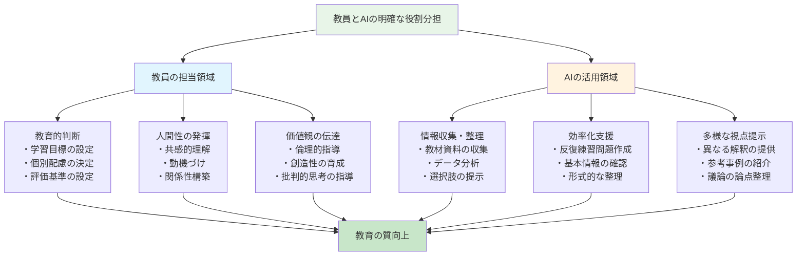
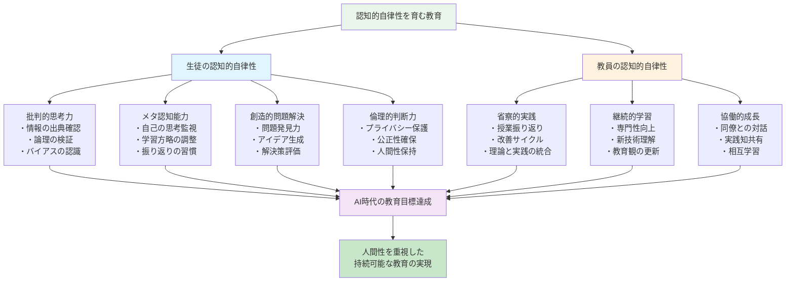
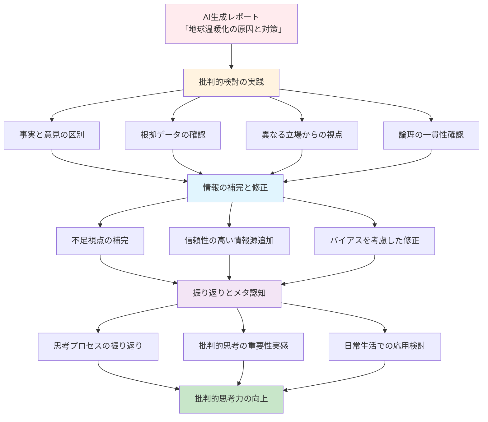
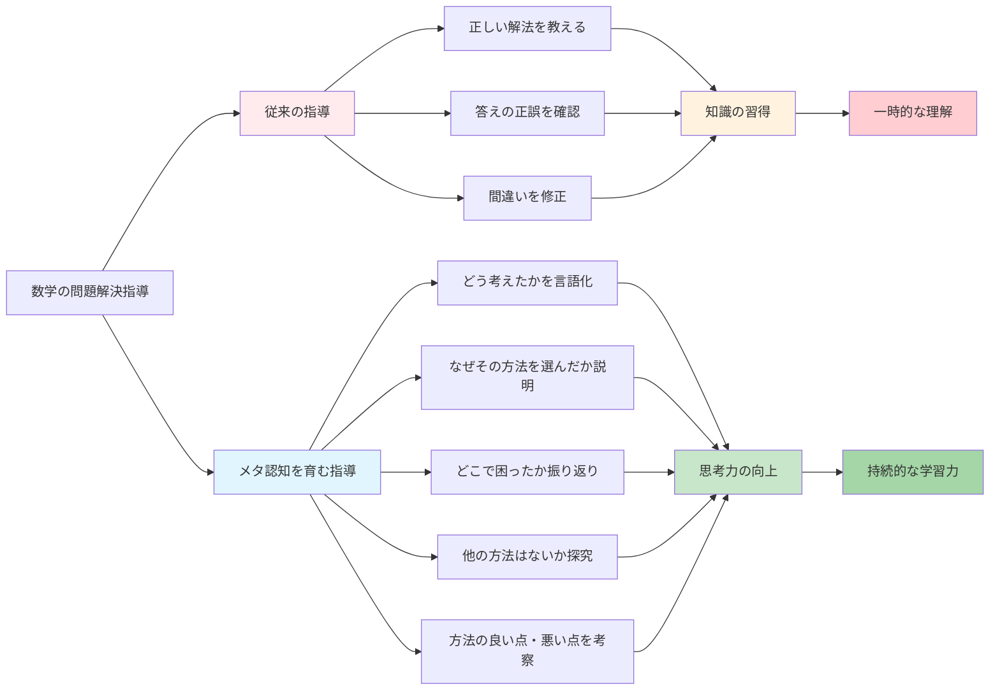
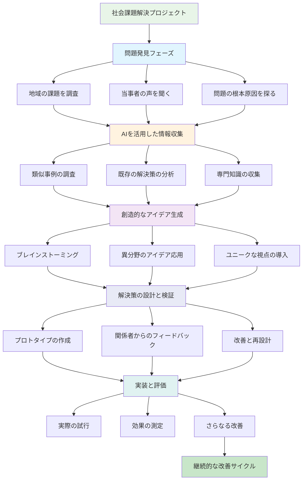
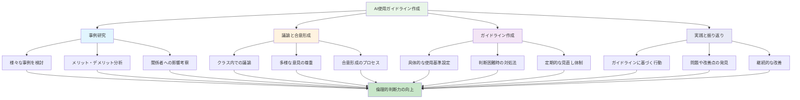
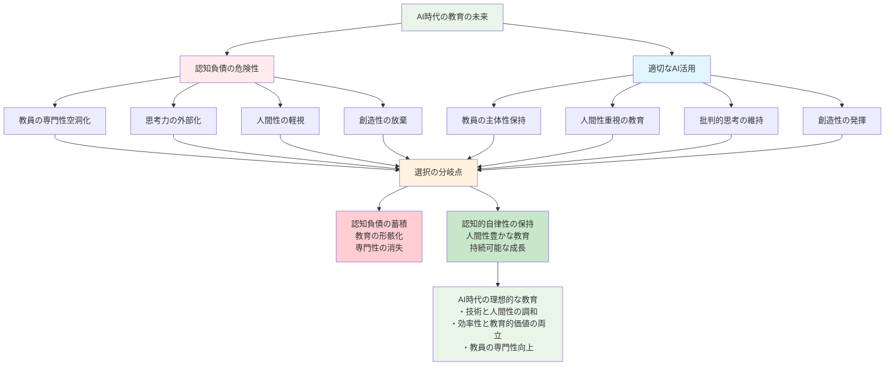

# 教員の専門性とは何か

これまで8章にわたって、生成AIの誤用がいかに教員の認知負債を蓄積させ、専門性を空洞化させるかを見てきました。しかし、この危機的状況は同時に、教員の専門性とは何かを根本的に問い直す機会でもあります。

AI時代だからこそ、改めて考える必要があります。教員にしかできないこととは何か。これからの教育において、どのような専門性が求められるのか。

## 人間にしかできないこと

### 共感と情動的な関わり

**生徒の心に寄り添う力**

教育の根幹は、人と人との心の通い合いにあります。これは、どれほど高度なAIが開発されても、人間にしか実現できない領域です。

**具体的な場面での人間性の発揮**

```
場面：中学2年生の太郎くんが数学の授業中に泣き出した

AIには不可能な教員の対応：
・太郎くんの涙の意味を瞬時に理解する（恥ずかしさ、悔しさ、無力感の混在）
・他の生徒たちの反応を同時に把握し、クラス全体の心理状態をケア
・言葉にならない太郎くんの気持ちに共感し、適切な距離で寄り添う
・その瞬間に必要な温かさや厳しさを直感的に判断
・太郎くんだけでなく、クラス全体にとっての学びの瞬間に変える

AIが生成するマニュアル的対応：
「生徒が泣いた場合の対処法」
1. 冷静に状況を把握する
2. 他の生徒への配慮を行う
3. 個別に話を聞く時間を作る
4. 必要に応じて保護者に連絡する
```

**感情の機微を読み取る感性**

教員は日々、生徒の微細な変化を感じ取っています。
- 表情の曇り
- 声のトーンの変化
- 身体の緊張
- 視線の動き
- 沈黙の意味

これらの情報を総合し、一人ひとりの心の状態を理解することは、長年の経験と豊かな人間性があってこそ可能です。

### 創造性と即興性

**予期せぬ状況への対応**

教育現場では、計画通りにいかないことが日常です。まさにその瞬間に、教員の創造性と即興性が発揮されます。

**教員の創造的対応例**

```
状況：理科の実験で予想と異なる結果が出た

マニュアル通りの対応：
・実験手順を再確認する
・器具の不備を疑う
・正しい結果を教える

創造的な教員の対応：
・「面白い！なぜだと思う？」と好奇心を刺激
・予想外の結果こそが科学の醍醐味だと伝える
・生徒と一緒に原因を探究する過程を楽しむ
・失敗から学ぶ姿勢をモデルとして示す
・この体験を次の学習への動機付けに活用
```

**アートとしての教育**

教育は科学であると同時にアートでもあります。同じ教材を使っても、教員の個性や創造性によって、まったく異なる学習体験が生まれます。

- 導入の工夫
- 例え話の選択
- 間の取り方
- 表情や身ぶり
- 声の抑揚

これらすべてが、その教員ならではの「作品」として統合され、生徒の心に深く刻まれる授業が生まれます。

### 価値判断と倫理

**何が正しいかを教える役割**

教員は知識を伝えるだけでなく、善悪の判断、正義感、道徳性を育む重要な役割を担っています。

**価値判断が求められる場面**

```
場面：クラスでいじめが発覚した時

AIには判断できない複雑な要素：
・いじめの背景にある人間関係の歴史
・加害者となった生徒の家庭環境や心理状態
・被害者の性格や過去のトラウマ
・クラス全体の価値観や雰囲気
・保護者や地域の文化的背景
・長期的な人間関係への影響

教員の倫理的判断：
・すべての子どもの尊厳を守る
・加害者も含めて全員の成長を願う
・短期的な解決より長期的な関係修復を重視
・正義と慈愛のバランスを取る
・コミュニティ全体の価値観を育む
```

**人生の指針を示す使命**

教員は教科指導だけでなく、人生の先輩として、生き方のモデルを示す存在でもあります。日々の行動、言葉選び、価値観の表現を通じて、生徒たちの人格形成に深い影響を与えています。

### ロールモデルとしての存在

**生き方を示す存在**

教員のもっとも重要な役割の一つは、「こんな大人になりたい」と思われる存在であることです。これは知識や技術では伝えられない、人間としての魅力や人生への姿勢の問題です。

**ロールモデルとしての要素**

- **学び続ける姿勢**：新しいことに挑戦し、失敗を恐れない
- **誠実さ**：言行一致し、責任を持つ
- **他者への配慮**：多様性を尊重し、弱い立場の人を守る
- **情熱**：自分の仕事や人生に対する熱意
- **謙虚さ**：間違いを認め、生徒からも学ぶ

これらの人間的魅力は、AIがどれほど進歩しても代替できない、教員の根本的な価値です。

## 進化する専門性

AI時代において、教員の専門性は消失するのではなく、進化し、より高次元の能力へと発展していきます。

### デジタルリテラシー

**AIを使いこなす力**

教員には、AIを適切に活用しながら、その限界を理解し、主体性を保つ能力が求められます。

**デジタルリテラシーの構成要素**

1. **技術的理解**
   - AIの基本的な仕組みと能力の理解
   - 各種ツールの効果的な使い方
   - データの扱い方と情報セキュリティ

2. **批判的思考**
   - AI生成コンテンツの妥当性を判断する力
   - バイアスや限界を見抜く力
   - 複数の情報源を比較検討する力

3. **倫理的判断**
   - プライバシーの保護
   - 公正性の確保
   - 透明性の維持

**実践例：授業でのAI活用指導**



```
教員が身につけるべき指導力：

技術面：
・生徒にAIツールの適切な使い方を指導
・AIの出力結果の確認方法を教える
・著作権や引用のルールを指導

教育面：
・AIを使った学習の効果と限界を説明
・人間の思考とAIの処理の違いを理解させる
・創造性や批判的思考の重要性を伝える

倫理面：
・AIを使う際の責任について話し合う
・他者への影響を考慮する姿勢を育む
・AI依存のリスクについて考えさせる
```

### ファシリテーション能力

**学びを促進する力**

AI時代の教員は、知識の伝達者から学びのファシリテーターへと役割を変化させていきます。

**ファシリテーション能力の要素**

1. **問いを立てる力**
   - 生徒の思考を深める質問
   - 探究心を刺激する課題設定
   - 議論を活性化する論点提示

2. **対話を促進する力**
   - 安心して発言できる環境づくり
   - 多様な意見を引き出す技術
   - 建設的な議論へと導く調整力

3. **学習をデザインする力**
   - 生徒の主体性を引き出す活動設計
   - 協働学習の効果的な運営
   - 個別最適化された学習環境の構築

**実践例：探究型授業のファシリテーション**

```
従来の教員の役割：
・正しい答えを教える
・知識を効率的に伝達する
・統一的な理解を目指す

ファシリテーター型教員の役割：
・生徒の疑問や関心を引き出す
・多様な視点や解釈を大切にする
・学習プロセス自体を価値あるものとする
・失敗や試行錯誤を学習の機会と捉える
・生徒同士の学び合いを促進する
```

### データ活用能力

**エビデンスに基づく指導**

現代の教員には、さまざまなデータを適切に収集・分析し、指導の改善に活用する能力が求められます。

**教育データの種類と活用**

1. **学習データ**
   - テスト結果の分析
   - 学習履歴の把握
   - つまずきパターンの発見

2. **行動データ**
   - 授業中の参加度
   - 課題への取り組み状況
   - 協働学習での役割

3. **感情・意欲データ**
   - 学習へのモチベーション
   - 自己効力感の変化
   - ストレスレベルの把握

**重要な注意点：データと人間性のバランス**

```
❌ データ依存の危険：
・数値だけで生徒を判断する
・個別性を見失う
・人間的な関わりを軽視する

✅ 適切なデータ活用：
・データは判断材料の一つ
・必ず人間的な観察と組み合わせる
・生徒の成長を多面的に捉える
・データの背景にある物語を大切にする
```

### 協働スキル

**AIと人間のチームワーク**

教員には、AIを効果的なパートナーとして活用しながら、人間同士の協働も促進する能力が求められます。

**協働スキルの構成要素**

1. **AI協働スキル**
   - AIの強みと弱みの理解
   - 効果的な指示の出し方
   - 結果の検証と改善

2. **人間協働スキル**
   - 同僚との連携
   - 保護者との協力
   - 地域との連携

3. **統合スキル**
   - AIからの情報と人間の洞察の統合
   - デジタルとアナログの使い分け
   - 効率性と人間性のバランス

**実践例：協働的な授業改善**

```
AI活用による効率化：
・過去の授業記録の分析
・類似事例の収集
・改善案の生成

人間による判断と調整：
・自校の文脈での適用可能性
・生徒の特性に応じた修正
・実施可能性の検証

同僚との協働：
・実践知の共有
・多角的な視点での検討
・継続的な改善サイクル
```

# 認知的自律性を育む教育へ

AI時代の教育の最重要課題は、生徒と教員が共に「認知的自律性」を保ち、向上させることです。認知的自律性とは、自分の思考プロセスを意識し、批判的に検討し、主体的に判断する能力のことです。



## 生徒の認知的自律性

### 批判的思考力

**AIの出力を検証する力**

生徒たちは、AI生成のコンテンツに日常的に接する世代です。だからこそ、その内容を鵜呑みにするのではなく、批判的に検討する能力が不可欠です。

**批判的思考力の育成方法**

1. **情報の出典確認**
   - 「この情報はどこから来たのか」を常に問う
   - 一次資料と二次資料の区別
   - 信頼できる情報源の見分け方

2. **論理の検証**
   - 論証の構造を分析する
   - 前提と結論の関係を確認する
   - 論理的飛躍や誤謬を発見する

3. **バイアスの認識**
   - 情報提供者の立場や利害を考慮する
   - 自分自身の偏見に気づく
   - 多様な視点から問題を捉える

**実践例：AI生成レポートの検証授業**



### メタ認知能力

**自分の思考を客観視する力**

メタ認知とは「認知についての認知」、つまり自分の思考プロセスを意識し、コントロールする能力です。

**メタ認知能力の構成要素**

1. **メタ認知的知識**
   - 自分の学習特性の理解
   - 課題の性質の把握
   - 効果的な学習方略の知識

2. **メタ認知的技能**
   - 学習の計画立案
   - 学習過程のモニタリング
   - 学習方略の調整

3. **メタ認知的感情**
   - 学習への動機や意欲
   - 自己効力感
   - 学習に対する態度

**実践例：思考プロセスの可視化**



### 創造的問題解決

**AIを活用した新しい解決法**

生徒たちには、AIを道具として活用しながら、人間ならではの創造性を発揮する能力が求められます。

**創造的問題解決のプロセス**

1. **問題の発見と定義**
   - 表面的な問題の背後にある真の課題の発見
   - 問題を多角的に捉える視点
   - 問題設定の創造性

2. **アイデアの生成**
   - AIを活用した発想の拡張
   - 異分野の知識の組み合わせ
   - 既成概念にとらわれない思考

3. **解決策の評価と改善**
   - 複数の基準での評価
   - 実現可能性の検討
   - 継続的な改善

**実践例：社会課題解決プロジェクト**



### 倫理的判断力

**AIの適切な使用を判断する力**

AI技術の急速な発展に伴い、その使用に関する倫理的判断力がますます重要になっています。

**倫理的判断の観点**

1. **プライバシーの保護**
   - 個人情報の適切な取り扱い
   - データの利用範囲の理解
   - 同意と拒否の権利

2. **公正性の確保**
   - バイアスや差別の防止
   - 機会の平等
   - 多様性の尊重

3. **透明性の維持**
   - AIの使用の明示
   - 意思決定プロセスの説明
   - 責任の所在の明確化

4. **人間性の保持**
   - 人間関係の価値
   - 感情や共感の重要性
   - 創造性と個性の尊重

**実践例：AI使用ガイドラインの作成**



## 持続可能な教育の実現

### バランスの取れたAI活用

**依存と活用の境界線**

持続可能な教育のためには、AIへの過度な依存を避けながら、その恩恵を最大限に活用する、絶妙なバランスが必要です。

**健全なAI活用の原則**

1. **補完的活用**
   - AIは人間の能力を置き換えるのではなく、補完する
   - 人間の判断と責任を常に保持する
   - AIの限界を理解し、適切な場面で使用する

2. **教育的価値の重視**
   - 効率性だけでなく、学習効果を重視する
   - 思考プロセスの学習を大切にする
   - 人間的な成長を最優先する

3. **透明性と説明責任**
   - AI使用の明示
   - 判断根拠の説明
   - 結果への責任

**実践的なガイドライン**

```
授業におけるAI活用の判断基準：

✅ 適切な活用場面：
・情報収集と整理
・個別化された練習問題の生成
・多様な視点の提示
・創作活動のインスピレーション

❌ 避けるべき場面：
・最終的な評価や判断
・感情的な支援や相談
・創造性が重要な課題の完成
・人間関係の構築

⚠️ 慎重な検討が必要な場面：
・学習計画の作成
・教材の選択
・指導方法の決定
・問題解決の方向性
```

### 継続的な振り返りと改善

**認知負債のモニタリング**

AI活用の健全性を保つためには、定期的な振り返りと改善が不可欠です。

**個人レベルでの振り返り**

1. **日常的な自己点検**
   - AI使用の頻度と目的の確認
   - 自分で判断・創造した割合の把握
   - 思考力や創造性の変化の感覚

2. **週次・月次の振り返り**
   - 成功事例と課題の整理
   - AI活用の効果の検証
   - 改善点の発見と計画

3. **長期的な評価**
   - 専門性の向上度の確認
   - 生徒や保護者からのフィードバック
   - 同僚との比較と学習

**組織レベルでの取り組み**

```
学校全体での持続可能なAI活用：

1. 研修とガイドライン
・AI活用研修の定期実施
・ガイドラインの策定と更新
・事例共有と学習

2. 相互チェック体制
・授業参観での確認
・同僚間での情報交換
・メンター制度の活用

3. 継続的改善
・四半期ごとの評価会議
・ベストプラクティスの共有
・課題解決のための協働

4. 外部評価
・専門家による評価
・他校との情報交換
・最新動向の把握
```

### コミュニティでの学び合い

**成功事例の共有**

持続可能なAI活用のためには、個人の努力だけでなく、コミュニティ全体での学び合いが重要です。

**効果的な情報共有の仕組み**

1. **実践事例の記録と共有**
   - 成功事例の詳細な記録
   - 失敗事例からの学習
   - 改善プロセスの共有

2. **定期的な研究会**
   - 月1回の実践発表会
   - テーマ別の研究グループ
   - 外部講師による最新情報提供

3. **オンラインコミュニティ**
   - 実践事例のデータベース
   - リアルタイムでの質問・相談
   - 最新情報の共有

**学び合いの文化の醸成**

```
健全な学習コミュニティの特徴：

・失敗を恐れない文化
・多様な意見の尊重
・建設的な批判の歓迎
・継続的な学習への意欲
・協働と競争のバランス
・新しい挑戦への支援
```

### 未来への提言

**次世代の教育者たちへ**

AI時代の教育を担う現在と未来の教育者に向けて、以下の提言をいたします。

**基本的な心構え**

1. **人間性を最優先に**
   - 技術は手段であり、目的ではない
   - 生徒との人間的な関わりを何より大切にする
   - 効率性より教育的価値を重視する

2. **学び続ける姿勢**
   - AIの進歩に合わせて自分も成長する
   - 失敗を恐れず新しいことに挑戦する
   - 同僚や生徒からも謙虚に学ぶ

3. **批判的思考の保持**
   - AIの提案を鵜呑みにしない
   - 常に「なぜ」「本当に」と問い続ける
   - 複数の視点から物事を考える

4. **創造性の発揮**
   - AIにはできない独自の価値を生み出す
   - 一人ひとりの生徒に合わせた創意工夫
   - 予期せぬ瞬間を教育の機会に変える

**実践的な指針**

```
日々の教育実践での心がけ：

朝の準備：
・今日出会う生徒たちのことを思い浮かべる
・AIツールの使用計画と人間性発揮の場面を整理
・その日の教育目標を自分の言葉で確認

授業中：
・生徒の表情や反応を敏感に感じ取る
・計画にとらわれず、必要に応じて柔軟に調整
・AIでは代替できない人間的な関わりを大切に

授業後：
・生徒との関わりで感じたことを記録
・AIを使った部分と使わなかった部分の効果を比較
・明日への改善点を自分で考える

日々の振り返り：
・AI依存していないか自己チェック
・創造性や判断力が保たれているか確認
・教員としての成長実感を大切にする
```

## 結語：認知的自律性を保ち続けるために

本書では、生成AIの誤用がいかに教員の認知負債を蓄積させ、専門性を危機にさらすかを30の具体例とともに示してきました。しかし、この警鐘は決して技術を否定するものではありません。



AIは確かに強力なツールです。適切に活用すれば、教育の質を向上させ、教員の負担を軽減し、生徒一人ひとりに最適化された学習環境を提供できます。

問題は、技術そのものではなく、私たちがそれとどのように向き合うかです。

**大切なのは「主体性」**

AIに判断を委ね、思考を外部化し、創造性を放棄してしまえば、教員はただの「AIオペレーター」となってしまいます。しかし、自分の専門性と人間性を保ちながら、AIを賢く活用すれば、これまでにない豊かな教育が実現できます。

**忘れてはならない教育の本質**

- 一人ひとりとの心の通い合い
- かけがえのない瞬間の積み重ね
- 共に成長していく喜び
- 人間だからこその創造性
- 未来への希望を育む使命

これらの価値は、どれほど技術が進歩しても変わることはありません。

**未来への責任**

私たち教員は、AI時代を生きる子どもたちに何を伝えるべきでしょうか。

それは、技術の使い方だけではありません。人間としての誇りと責任、創造する喜び、他者との協働の価値、そして何より、自分の頭で考え、自分の心で感じ、自分の意志で行動する「認知的自律性」の大切さです。

**最後のメッセージ**

AIと共存する未来において、教員の役割はなくなることはありません。むしろ、その重要性はますます高まるでしょう。

なぜなら、AI時代だからこそ、「人間らしさ」「創造性」「共感力」「倫理観」といった、人間にしか育むことのできない資質が、何より大切になるからです。

認知負債を恐れず、しかし警戒を怠らず、技術を賢く活用しながら、人間性豊かな教育を実現していきましょう。

それが、未来を担う子どもたちへの、私たち教員の責務であり、誇りある使命なのです。

**「先生、それAIに丸投げですか？」**

この問いかけを胸に刻み、常に自分自身に問い続けながら、教育者としての道を歩んでいきましょう。

---

*子どもたちの未来のために*  
*教育の本質を守るために*  
*そして、教員としての誇りを保つために*

認知的自律性を保ち続けることが、AI時代を生きる私たち教員の、もっとも重要な責務です。