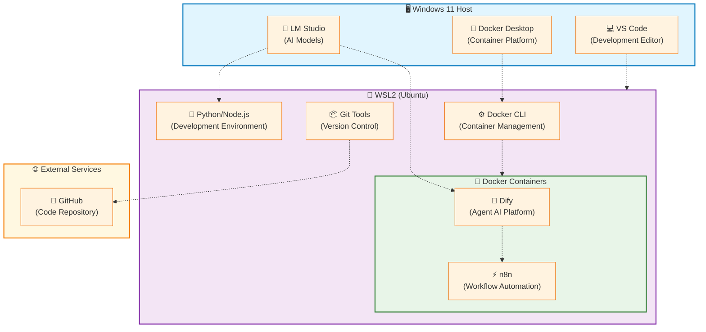

# 第2章で構築する環境の全体像

本章では、Agent AI開発に必要な完全なローカル環境を段階的に構築します。構築する環境は以下の要素で構成されます。

## 構築する技術スタックの概要



## 各コンポーネントの役割と必要性

### 1. WSL2（Windows Subsystem for Linux 2）
**役割**: Windows上でLinux環境を提供
**必要性**: 
- Agent AI開発では多くのオープンソースツールがLinux前提
- Dockerとの親和性が高い
- 開発効率とパフォーマンスの向上

### 2. Docker Desktop
**役割**: コンテナ化技術によるサービス管理
**必要性**:
- 複数のAIサービス（Dify、n8n等）の統合管理
- 環境の再現性と移植性
- 開発・本番環境の一致

### 3. LM Studio
**役割**: ローカルLLM実行環境
**必要性**:
- セキュアなAI処理（データが外部に出ない）
- コスト効率的なAI利用
- 高速な応答とカスタマイズ性

### 4. VS Code + 開発ツール
**役割**: 統合開発環境
**必要性**:
- WSL2との seamless な連携
- Agent AI開発に特化した拡張機能
- 効率的なコード作成とデバッグ

### 5. Dify
**役割**: Agent AIワークフロー構築・管理プラットフォーム
**必要性**:
- 視覚的なAgent AIワークフロー設計
- LLMアプリケーションの迅速な開発・デプロイ
- 複雑なAI処理の体系的な管理
- ノーコード・ローコードでのAI機能実装

### 6. n8n
**役割**: ワークフロー自動化ツール
**必要性**:
- 業務プロセスの自動化
- 外部API・サービスとの連携
- Agent AIと既存システムの統合
- 柔軟なトリガー・アクション設定

### 7. GitHub
**役割**: コードリポジトリ・バージョン管理
**必要性**:
- Agent AIコードの安全な管理
- チーム開発での協業
- バックアップと履歴管理
- CI/CDパイプラインとの連携

## 構築後に実現できること

この環境を構築することで、以下が可能になります。

- **完全ローカルでのAgent AI開発**: 外部API依存なし
- **セキュアなデータ処理**: 機密情報の安全な取り扱い
- **高速なプロトタイピング**: 即座のテストと修正
- **コスト効率的な開発**: API利用料金の心配なし
- **本格運用への移行**: 構築した環境をそのまま本番利用可能

## 前提条件

この章を進める前に、以下を確認してください：

- **Windows 11** または **Windows 10（バージョン 2004以降）**
- **16GB以上のRAM**（32GB推奨）
- **SSD 100GB以上の空き容量**
- **管理者権限**でのPC操作が可能
- **インターネット接続**（初期セットアップ時）

---

# 開発環境の構築手順

## WSL2のインストール

### WSL2とは何か

WSL2（Windows Subsystem for Linux 2）は、Windows上でLinux環境をネイティブに近い性能で実行できる技術です。従来の仮想マシンと比べて以下の利点があります。

- **高速起動**: 数秒でLinux環境が利用可能
- **低リソース消費**: 必要な分だけメモリを使用
- **ファイルシステム統合**: WindowsとLinuxファイルの相互アクセス
- **ネットワーク共有**: WindowsとLinuxでポートを共有

### インストール手順の詳細解説

**ステップ1: PowerShellでのWSL2インストール**

まず、スタートメニューで「PowerShell」を検索し、**必ず「管理者として実行」** を選択してください。

```powershell
# WSL2と Ubuntu を一括でインストール
wsl --install
```

**このコマンドが実行する処理：**
1. WSL機能の有効化
2. 仮想マシンプラットフォーム機能の有効化  
3. 最新Linuxカーネルのダウンロード
4. WSL2をデフォルトバージョンに設定
5. Ubuntu Linuxディストリビューションのインストール

**実行後の画面例：**
```
インストール中: 仮想マシン プラットフォーム
仮想マシン プラットフォーム は正常にインストールされました。
インストール中: Linux 用 Windows サブシステム
Linux 用 Windows サブシステム は正常にインストールされました。
ダウンロード中: WSL カーネル
インストール中: WSL カーネル
WSL カーネル は正常にインストールされました。
ダウンロード中: Ubuntu
要求された操作は正常に実行されました。変更を有効にするには、システムを再起動する必要があります。
```

**ステップ2: システム再起動**

インストール完了後、**必ずPCを再起動**してください。これにより、WSL2の機能が有効化されます。

**ステップ3: Ubuntu の初期設定**

再起動後、スタートメニューから「Ubuntu」を起動します。初回起動時は以下の設定を行います。

```bash
# ユーザー名の設定（例: agent-dev）
Enter new UNIX username: agent-dev

# パスワードの設定（入力時は画面に表示されません）
New password: ********
Retype new password: ********
```

**ユーザー名とパスワードの注意点：**
- ユーザー名は英小文字のみ使用
- パスワードは8文字以上推奨
- このアカウントは Ubuntu 内での作業用となります

**ステップ4: システムの更新**

Ubuntu環境を最新状態に更新します。

```bash
# パッケージ一覧の更新
sudo apt update

# システム全体のアップグレード（5-10分程度）
sudo apt upgrade -y

# 開発に必要な基本ツールのインストール
sudo apt install -y build-essential curl software-properties-common
```

**各コマンドの説明：**
- `sudo apt update`: 利用可能なパッケージの最新情報を取得
- `sudo apt upgrade -y`: インストール済みパッケージを最新版に更新
- `build-essential`: コンパイラやビルドツールの基本パッケージ
- `curl`: ファイルダウンロード用ツール
- `software-properties-common`: PPAリポジトリ管理用ツール

**インストール確認**

WSL2が正常にインストールされたことを確認：

```bash
# WSLのバージョン確認
wsl --list --verbose

# 期待される出力例：
# NAME      STATE           VERSION
# Ubuntu    Running         2
```

## 開発ツールのセットアップ

### VS Code の統合環境構築

Visual Studio Codeは、WSL2との統合により、WindowsとLinuxの境界を意識せずに開発できる強力な環境を提供します。

**ステップ1: VS Code のインストール**

1. [VS Code公式サイト](https://code.visualstudio.com/)から「Download for Windows」をクリック
2. ダウンロードした `VSCodeUserSetup-x64-x.xx.x.exe` を実行
3. インストール時は **すべてデフォルト設定** で進めてOK

**ステップ2: WSL統合拡張機能のインストール**

VS Code起動後、以下の手順で拡張機能をインストール：

1. **拡張機能アイコン**（左サイドバーの四角いアイコン）をクリック
2. 検索ボックスに「**Remote - WSL**」と入力
3. Microsoft製の拡張機能を「**インストール**」

**この拡張機能の役割：**
- WSL内のファイルを直接編集可能
- WSL内でのターミナル統合
- LinuxとWindows間のシームレスな作業

**ステップ3: WSL環境での VS Code 起動テスト**

Ubuntu（WSL2）を起動し、以下のコマンドを実行：

```bash
# ホームディレクトリでVS Codeを起動
code .
```

**初回起動時の動作：**
1. VS Code Serverの自動インストール（1-2分）
2. WindowsのVS Codeが起動し、WSL環境に接続
3. 左下に「**WSL: Ubuntu**」の表示を確認

**ステップ4: 推奨拡張機能のインストール**

Agent AI開発に便利な拡張機能を追加インストール：

1. **Python** - Python開発サポート
2. **Docker** - Dockerファイル編集とコンテナ管理
3. **YAML** - 設定ファイル編集支援
4. **GitLens** - Git履歴の可視化
5. **REST Client** - API テスト用

### Git の最新版インストール

Git は Agent AI プロジェクトのバージョン管理に必須のツールです。最新機能とセキュリティアップデートを利用するため、公式PPAからインストールします。

**ステップ1: 最新版Gitのインストール**

```bash
# Git公式PPAリポジトリの追加
sudo add-apt-repository ppa:git-core/ppa -y

# パッケージ一覧の更新
sudo apt update

# 最新版Gitのインストール
sudo apt install -y git

# インストール確認
git --version
# 期待される出力: git version 2.43.x または以降
```

**ステップ2: GitHub CLI (gh) のインストール**

```bash
# GitHub CLIの公式リポジトリキーを追加
curl -fsSL https://cli.github.com/packages/githubcli-archive-keyring.gpg | sudo dd of=/usr/share/keyrings/githubcli-archive-keyring.gpg

# リポジトリの追加
echo "deb [arch=$(dpkg --print-architecture) signed-by=/usr/share/keyrings/githubcli-archive-keyring.gpg] https://cli.github.com/packages stable main" | sudo tee /etc/apt/sources.list.d/github-cli.list > /dev/null

# パッケージ一覧の更新
sudo apt update

# GitHub CLIのインストール
sudo apt install -y gh

# インストール確認
gh --version
# 期待される出力: gh version 2.40.x または以降
```

**ステップ3: Git の基本設定**

```bash
# 開発者情報の設定（実際の名前とメールアドレスに変更）
git config --global user.name "Taro Yamada"
git config --global user.email "taro.yamada@example.com"

# VS Code をGitの標準エディタに設定
git config --global core.editor "code --wait"

# Windows/Linux間の改行コード問題を解決
git config --global core.autocrlf input

# 日本語ファイル名を正しく表示
git config --global core.quotepath false

# デフォルトブランチ名を設定
git config --global init.defaultBranch main
```

**ステップ4: 設定確認**

```bash
# 設定内容の表示
git config --list

# 期待される出力例：
# user.name=Taro Yamada
# user.email=taro.yamada@example.com
# core.editor=code --wait
# core.autocrlf=input
# core.quotepath=false
# init.defaultbranch=main
```

**ステップ5: GitHub との連携設定**

```bash
# GitHub CLIを使用した認証
gh auth login

# 認証設定の選択：
# ? What account do you want to log into? GitHub.com
# ? What is your preferred protocol for Git operations? SSH
# ? Generate a new SSH key to add to your GitHub account? Yes
# ? Enter a passphrase for your new SSH key (Optional): [パスフレーズ入力]
# ? Title for your SSH key: WSL2-Agent-AI-Dev
# ? How would you like to authenticate GitHub CLI? Login with a web browser

# 認証確認
gh auth status
```

**GitHub CLI の活用**

```bash
# リポジトリの作成
gh repo create my-agent-ai-project --private --description "Agent AI development project"

# リポジトリのクローン
gh repo clone username/repository-name

# プルリクエストの作成
gh pr create --title "Add new feature" --body "Feature description"

# イシューの作成
gh issue create --title "Bug report" --body "Bug description"
```

### プログラミング環境の構築

Agent AI開発では、Python（AI/機械学習）とNode.js（Webサービス）の両方を使用します。

### Python 開発環境

**なぜPythonが必要か：**
- Agent AI ライブラリの大半がPython製
- LLMとの連携ライブラリが豊富
- データ処理・分析ツールが充実

**仮想環境の作成と管理**

Python仮想環境により、プロジェクトごとに独立したパッケージ管理が可能になります。

```bash
# プロジェクト用ディレクトリを作成
mkdir ~/agent-ai-projects
cd ~/agent-ai-projects

# Python仮想環境の作成
python3 -m venv agent-ai-env

# 仮想環境の有効化
source agent-ai-env/bin/activate

# プロンプトが変わることを確認
# (agent-ai-env) agent-dev@DESKTOP-XXXXX:~/agent-ai-projects$

# pipの最新化
pip install --upgrade pip

# 基本的なAI開発パッケージのインストール
pip install requests python-dotenv
```

**仮想環境の操作方法：**
```bash
# 仮想環境の有効化
source ~/agent-ai-projects/agent-ai-env/bin/activate

# 仮想環境の無効化
deactivate

# インストール済みパッケージの確認
pip list
```

### Node.js 開発環境

**なぜNode.jsが必要か：**
- 高速なWebAPI作成
- フロントエンド開発に必須
- 豊富なnpmパッケージエコシステム
- Agent AIとの連携における重要なランタイム

**なぜnvmを使用するか：**
- 複数のNode.jsバージョンの管理
- プロジェクトごとの異なるNode.jsバージョン対応
- LTS版と最新版の切り替えが簡単
- 開発チームでのバージョン統一

**ステップ1: nvm (Node Version Manager) のインストール**

```bash
# nvmの最新版をインストール
curl -o- https://raw.githubusercontent.com/nvm-sh/nvm/v0.39.0/install.sh | bash

# 新しいターミナルセッションを開始するか、設定を再読み込み
source ~/.bashrc

# nvmのインストール確認
nvm --version
# 期待される出力: 0.39.0
```

**ステップ2: Node.js 20 LTS のインストールと設定**

```bash
# 利用可能なNode.jsバージョンの確認
nvm ls-remote --lts

# Node.js 20 LTS の最新版をインストール
nvm install 20
nvm install --lts

# インストール済みバージョンの確認
nvm ls

# Node.js 20 LTS をデフォルトに設定
nvm use 20
nvm alias default 20

# インストール確認
node --version
npm --version

# 期待される出力：
# v20.11.0
# 10.2.4
```

**ステップ3: プロジェクト固有の .nvmrc ファイル作成**

```bash
# プロジェクトディレクトリの作成
mkdir -p ~/agent-ai-projects
cd ~/agent-ai-projects

# .nvmrcファイルの作成（プロジェクトのNode.jsバージョン指定）
echo "20" > .nvmrc

# .nvmrcファイルを使用したNode.jsバージョンの使用
nvm use
# 期待される出力: Found '/home/username/agent-ai-projects/.nvmrc' with version <20>
# Now using node v20.11.0 (npm v10.2.4)
```

**ステップ4: npm の最適化設定**

```bash
# npmの設定確認
npm config list

# 開発効率向上のための設定
npm config set init-license "MIT"
npm config set init-author-name "Your Name"
npm config set init-author-email "your.email@example.com"

# セキュリティ監査を自動実行
npm config set audit-level moderate

# パッケージのインストール速度向上
npm config set progress false
npm config set loglevel warn
```

**ステップ5: 開発用グローバルツールのインストール**

```bash
# よく使用するグローバルツールのインストール
npm install -g nodemon typescript ts-node @types/node

# インストール確認
nodemon --version
tsc --version
ts-node --version

# grbalパッケージの一覧表示
npm list -g --depth=0
```

**ステップ6: Agent AI開発用プロジェクトの初期化**

```bash
# プロジェクトディレクトリの作成
mkdir ~/agent-ai-projects/my-agent-api
cd ~/agent-ai-projects/my-agent-api

# プロジェクト用の.nvmrcファイルを作成
echo "20" > .nvmrc

# 適切なNode.jsバージョンを使用
nvm use

# package.jsonの作成
npm init -y

# 基本パッケージのインストール
npm install express dotenv cors axios
npm install -D nodemon @types/node @types/express typescript

# TypeScript設定ファイルの作成
npx tsc --init

# 基本的なディレクトリ構造を作成
mkdir -p src/{routes,middleware,utils,types}
mkdir -p tests

# 開発用スクリプトの追加
npm pkg set scripts.dev="nodemon src/index.ts"
npm pkg set scripts.build="tsc"
npm pkg set scripts.start="node dist/index.js"
npm pkg set scripts.nvm="nvm use"
```

**ステップ7: 動作確認用のサンプルコード**

```bash
# サンプルのExpressアプリケーションを作成
cat << 'EOF' > src/index.ts
import express from 'express';
import cors from 'cors';
import dotenv from 'dotenv';

dotenv.config();

const app = express();
const PORT = process.env.PORT || 3000;

// ミドルウェアの設定
app.use(cors());
app.use(express.json());

// ルートエンドポイント
app.get('/', (req, res) => {
  res.json({ 
    message: 'Agent AI API Server is running!',
    timestamp: new Date().toISOString(),
    nodeVersion: process.version,
    npmVersion: process.env.npm_version
  });
});

// ヘルスチェックエンドポイント
app.get('/health', (req, res) => {
  res.json({ 
    status: 'healthy', 
    uptime: process.uptime(),
    nodeVersion: process.version
  });
});

app.listen(PORT, () => {
  console.log(`🚀 Agent AI API Server is running on port ${PORT}`);
  console.log(`📦 Node.js Version: ${process.version}`);
});
EOF

# 開発サーバーの起動テスト
npm run dev
```

**nvm環境の確認と便利なコマンド**

```bash
# 設定確認スクリプト
cat << 'EOF' > check-nodejs-nvm.sh
#!/bin/bash
echo "=== Node.js & nvm 環境確認 ==="
echo "nvm Version: $(nvm --version)"
echo "Current Node.js Version: $(node --version)"
echo "Current npm Version: $(npm --version)"
echo "Default Node.js Version: $(nvm version default)"
echo "Installation Path: $(which node)"
echo ""
echo "=== インストール済みNode.jsバージョン ==="
nvm ls
echo ""
echo "=== .nvmrc ファイルの内容 ==="
if [ -f .nvmrc ]; then
  echo "Found .nvmrc: $(cat .nvmrc)"
else
  echo ".nvmrc file not found"
fi
echo ""
echo "=== グローバルパッケージ ==="
npm list -g --depth=0
EOF

chmod +x check-nodejs-nvm.sh
./check-nodejs-nvm.sh
```

**便利なnvmコマンド**

```bash
# よく使用するnvmコマンド
echo "=== nvm 便利コマンド ==="

# 最新LTS版のインストール
# nvm install --lts

# 最新版のインストール
# nvm install node

# 特定バージョンのインストール
# nvm install 18.17.0

# バージョン切り替え
# nvm use 18
# nvm use 20

# デフォルトバージョンの設定
# nvm alias default 20

# インストール済みバージョン一覧
# nvm ls

# 利用可能なリモートバージョン一覧
# nvm ls-remote

# 現在のバージョン確認
# nvm current

# バージョンの削除
# nvm uninstall 18.17.0
```

## Docker環境の構築

### Docker とは何か、なぜ必要か

Docker は、アプリケーションとその実行環境を「コンテナ」として包み込む技術です。Agent AI開発における利点：

- **環境の一貫性**: 開発・テスト・本番で同じ環境
- **依存関係の分離**: 各サービスが独立して動作
- **スケーラビリティ**: 必要に応じてサービスを拡張
- **チーム開発**: 環境差異による問題を回避

### Docker Desktop のインストールと設定

**ステップ1: Docker Desktop のダウンロード**

1. [Docker Desktop公式サイト](https://www.docker.com/products/docker-desktop/)にアクセス
2. 「Download Docker Desktop for Windows」をクリック
3. `Docker Desktop Installer.exe` をダウンロード

**ステップ2: インストール実行**

1. ダウンロードした `Docker Desktop Installer.exe` を **管理者として実行**
2. インストール設定で以下を確認：
   - ☑ **Use WSL 2 instead of Hyper-V** (必須)
   - ☑ **Add shortcut to desktop** (推奨)
3. インストール完了後、**PCを再起動**

**ステップ3: Docker Desktop の初期設定**

再起動後、Docker Desktop を起動し、初期設定を行います。

1. **利用規約への同意** (個人・小規模企業は無料)
2. **アンケートのスキップ** (Skip survey)
3. **WSL2統合の有効化**

**ステップ4: WSL2統合の設定**

Docker Desktop で以下の設定を確認：

1. 設定アイコン（⚙️）→ **Settings** をクリック
2. **General** タブで以下を確認：
   - ☑ **Use the WSL 2 based engine**
3. **Resources** → **WSL Integration** で以下を設定：
   - ☑ **Enable integration with my default WSL distro**
   - ☑ **Ubuntu** (利用するディストリビューション)

**ステップ5: WSL2リソース設定の最適化**

Agent AI開発に適したリソース設定は、Docker DesktopではなくWSL2の.wslconfigファイルで管理します。

**WSL2設定ファイルの作成**

Windows環境でPowerShellまたはコマンドプロンプトを開き、以下を実行：

```powershell
# ホームディレクトリに移動
cd $env:USERPROFILE

# .wslconfigファイルを作成
notepad .wslconfig
```

**推奨設定内容**

メモ帳に以下の設定を記載してください：

```ini
[wsl2]
# メモリ設定 (システムRAMの50-75%を推奨)
memory=16GB

# CPU設定 (物理コア数の75%程度を推奨)
processors=6

# スワップファイルサイズ (メモリの50%程度)
swap=8GB

# スワップファイルの場所 (高速SSD推奨)
swapfile=C:\\temp\\wsl-swap.vhdx

# ページレポート機能 (メモリ効率化)
pageReporting=true

# ネストした仮想化 (必要に応じて)
nestedVirtualization=true

# VM アイドルタイムアウト (60秒)
vmIdleTimeout=60000
```

**システム構成別推奨設定**

```ini
# 軽量システム (16GB RAM, 4コア)
[wsl2]
memory=8GB
processors=3
swap=4GB

# 標準システム (32GB RAM, 8コア)
[wsl2]
memory=16GB
processors=6
swap=8GB

# 高性能システム (64GB RAM, 12コア以上)
[wsl2]
memory=32GB
processors=10
swap=16GB
```

**設定適用とDocker Desktop設定の調整**

```powershell
# WSL2の完全停止（設定適用に必要）
wsl --shutdown

# WSL2の再起動
wsl

# 設定確認
wsl --status
```

**Docker Desktop側での設定確認**

.wslconfigでリソースを管理する場合、Docker Desktop側の設定は以下のようにします。

1. **Settings** → **Resources** → **Advanced**を開く
2. **WSL2統合が有効な場合の注意事項**：
   - Docker DesktopのCPU/Memory設定は.wslconfigの設定に従う
   - 「Use the WSL 2 based engine」が有効の場合、WSL2の制限が優先される
   - Docker Desktop側の設定は参考値として表示される

**リソース設定の確認**

```bash
# WSL2環境で実行
# CPU使用率の確認
htop

# メモリ使用量の確認
free -h

# スワップ使用量の確認
swapon -s

# Docker統計情報の確認
docker system df
docker system info
```

### Docker の動作確認

**基本動作テスト**

WSL2（Ubuntu）環境で以下のコマンドを実行：

```bash
# Dockerのバージョン確認
docker --version
# 期待される出力: Docker version 24.x.x, build xxxxxxx

# Docker Composeのバージョン確認
docker compose version
# 期待される出力: Docker Compose version v2.x.x

# Hello Worldコンテナの実行テスト
docker run hello-world
```

**Hello World実行時の期待される出力：**
```
Unable to find image 'hello-world:latest' locally
latest: Pulling from library/hello-world
2db29710123e: Pull complete
Digest: sha256:xxxxxxxxxxxx
Status: Downloaded newer image for hello-world:latest

Hello from Docker!
This message shows that your installation appears to be working correctly.
...
```

**Docker コンテナの基本操作**

```bash
# 実行中のコンテナ一覧
docker ps

# すべてのコンテナ一覧（停止中も含む）
docker ps -a

# ダウンロード済みイメージ一覧
docker images

# 不要なコンテナとイメージの削除
docker system prune
```

### Docker Compose の理解

Docker Compose は、複数のコンテナを連携させるためのツールです。Agent AI開発では以下のような構成になります。

```yaml
# docker-compose.yml の例
version: '3.8'
services:
  # LM Studio (AIモデル実行)
  lm-studio:
    # 設定内容...
  
  # Dify (Agent AIワークフロー)
  dify:
    # 設定内容...
  
  # n8n (自動化ツール)
  n8n:
    # 設定内容...
```

この設定により、Agent AI に必要な全サービスを一括で管理できます。

## LM Studioのセットアップ

### LM Studio とは何か

LM Studio は、ローカル環境で大規模言語モデル（LLM）を実行するためのデスクトップアプリケーションです。Agent AI開発における重要な役割：

- **プライベートAI処理**: データが外部に送信されない
- **コスト効率**: API利用料金が不要
- **高速レスポンス**: ネットワーク遅延なし
- **カスタマイズ性**: モデルやパラメータを自由に選択

### インストールと初期設定

**ステップ1: LM Studio のダウンロード**

1. [LM Studio公式サイト](https://lmstudio.ai/)にアクセス
2. 「Download LM Studio」をクリック
3. Windows版インストーラーをダウンロード

**ステップ2: インストール実行**

1. ダウンロードした `LM-Studio-x.x.x-Setup.exe` を実行
2. インストール設定はすべて **デフォルト** で進める
3. インストール完了後、LM Studio を起動

**ステップ3: 初期設定の確認**

LM Studio起動後、以下を確認・設定：

1. **GPU認識の確認**: 
   - 右上の設定 → System Information でGPUが認識されていることを確認
2. **モデル保存場所の設定**:
   - 十分な空き容量があるドライブを選択（推奨：50GB以上）

### DeepSeek-Coder-V2-Lite-Instruct-GGUF のセットアップ

**ステップ1: モデルの検索とダウンロード**

1. **Discover** タブを開く
2. 検索ボックスに「**DeepSeek-Coder-V2-Lite-Instruct-GGUF**」と入力
3. 検索結果から適切なバージョンを選択：

**推奨量子化バージョン：**
```
システムRAM別推奨:
- 16GB RAM: Q4_K_M (約8GB)
- 32GB RAM: Q5_K_M (約10GB) 
- 64GB RAM: Q8_0 (約16GB)
```

4. 「**Download**」ボタンをクリック
5. ダウンロード進捗を確認（10-30分程度）

**ステップ2: モデルのロードテスト**

1. **Chat** タブを開く
2. 上部の「**Select a model to load**」をクリック
3. ダウンロードした **DeepSeek-Coder-V2-Lite-Instruct-GGUF** を選択
4. 「**Load Model**」をクリック
5. モデル読み込み完了まで待機（1-3分）

**ステップ3: APIサーバーの起動**

1. **Server** タブを開く
2. 以下の設定を確認：
   - **Port**: 1234 (デフォルト)
   - **CORS**: Enabled
   - **API Key**: 空白（ローカル開発用）
3. 「**Start Server**」をクリック
4. サーバーステータスが「**Running**」になることを確認

### WSL2からの接続テスト

WSL2環境から LM Studio API にアクセスできることを確認：

```bash
# API サーバーの稼働確認
curl http://localhost:1234/v1/models

# 期待されるレスポンス例：
# {
#   "object": "list",
#   "data": [
#     {
#       "id": "deepseek-coder-v2-lite-instruct",
#       "object": "model",
#       "owned_by": "deepseek"
#     }
#   ]
# }

# 簡単なチャット API テスト
curl -X POST http://localhost:1234/v1/chat/completions \
  -H "Content-Type: application/json" \
  -d '{
    "model": "deepseek-coder-v2-lite-instruct",
    "messages": [{"role": "user", "content": "Hello"}],
    "max_tokens": 50
  }'
```

## 環境構築の検証とトラブルシューティング

### 全体的な動作確認

構築した環境が正常に動作することを確認：

```bash
# WSL2環境で以下をすべて実行
echo "=== 環境確認スクリプト ==="

# 1. WSL2バージョン確認
echo "1. WSL2バージョン:"
wsl --list --verbose

# 2. Docker動作確認
echo "2. Docker動作:"
docker --version && docker compose version

# 3. Python環境確認
echo "3. Python環境:"
python3 --version && pip --version

# 4. Node.js環境確認
echo "4. Node.js環境:"
node --version && npm --version

# 5. Git設定確認
echo "5. Git設定:"
git config --global user.name && git config --global user.email

# 6. LM Studio API確認
echo "6. LM Studio API:"
curl -s http://localhost:1234/v1/models | head -3
```

### よくある問題と解決方法

**WSLインストール関連**
- **エラー 0x80370102**: BIOSで仮想化機能を有効化
- **Ubuntu起動しない**: Windows Update を最新にしてWSLカーネル更新

**Docker関連**
- **Docker Desktop起動しない**: WSL2統合設定を確認
- **コンテナが起動しない**: メモリ不足の場合はDocker設定でメモリ増量

**LM Studio関連**
- **モデルダウンロードが失敗**: インターネット接続とディスク容量を確認
- **APIサーバーが応答しない**: Windowsファイアウォールの除外設定

### パフォーマンス最適化のヒント

**WSL2メモリ制限の詳細設定**

既に.wslconfigファイルを作成している場合、以下の設定でさらなる最適化が可能です。

```ini
[wsl2]
# 基本リソース設定
memory=16GB
processors=8
swap=8GB

# 高度なパフォーマンス設定
pageReporting=false          # Windows側のメモリ回収を無効化（安定性向上）
nestedVirtualization=false   # 不要な場合は無効化（パフォーマンス向上）
vmIdleTimeout=-1            # VM自動停止を無効化（常時稼働）

# デバッグ・開発用設定
debugConsole=true           # デバッグコンソールを有効化
kernelCommandLine=cgroup_no_v1=all  # cgroup v2を強制使用
```

**Agent AI開発に特化した設定**

```ini
[wsl2]
# Agent AI + Docker + LM Studio 用の推奨設定
memory=24GB                 # LM Studioのモデルローディング考慮
processors=10               # 並列処理重視
swap=12GB                   # 大容量モデル対応
pageReporting=true          # メモリ効率化
vmIdleTimeout=300000        # 5分でタイムアウト
```

**設定変更後の確認手順**

```powershell
# Windows PowerShellで実行
# 1. WSL2完全停止
wsl --shutdown

# 2. WSL2再起動
wsl

# 3. リソース使用状況確認
wsl --status
```

```bash
# WSL2内で実行
# メモリ・CPU制限の確認
echo "=== WSL2 リソース確認 ==="
echo "利用可能メモリ: $(free -h | grep 'Mem:' | awk '{print $2}')"
echo "利用可能CPU: $(nproc)"
echo "スワップ容量: $(free -h | grep 'Swap:' | awk '{print $2}')"

# Docker統計情報
docker system info | grep -E "(CPUs|Total Memory)"
```

**LM Studio最適化設定**
- GPU Layers: -1 (全層GPU使用)
- Context Length: 4096-8192
- Batch Size: 512-1024

## Agent AIワークフロー環境の構築

### Difyのセットアップ

**Difyとは何か**

Dify は、ローカル環境でAgent AIワークフローを構築・管理するためのオープンソースプラットフォームです。LLMアプリケーションの開発を効率化し、複雑なAIワークフローを視覚的に設計できます。

**前提条件の確認**

```bash
# WSL2環境での前提条件確認
echo "=== Dify インストール前提条件確認 ==="

# CPU情報（2コア以上必要）
echo "CPU コア数: $(nproc)"

# メモリ容量（4GB以上必要）
echo "メモリ容量: $(free -h | grep 'Mem:' | awk '{print $2}')"

# Docker/Docker Composeバージョン確認
docker --version
docker compose version

# ディスク容量確認（10GB以上推奨）
df -h ~/agent-ai-projects
```

**ステップ1: Difyリポジトリのクローン**

```bash
# プロジェクトディレクトリに移動
cd ~/agent-ai-projects

# Difyリポジトリのクローン（最新版）
git clone https://github.com/langgenius/dify.git
cd dify

# 現在のブランチ確認
git branch -a
```

**ステップ2: Docker Compose設定の準備**

Difyは2つのインストール方法があります。ここでは簡単なAll-in-One方式を使用します：

```bash
# Dockerディレクトリに移動
cd docker

# 環境設定ファイルをコピー
cp .env.example .env

# 環境変数の確認と必要に応じて編集
nano .env

# 主要な環境変数（デフォルトで問題ない場合が多い）
# EDITION=SELF_HOSTED
# CONSOLE_URL=http://127.0.0.1:5001
# SERVICE_API_URL=http://127.0.0.1:5001
```

**ステップ3: Docker Composeでの起動（All-in-One方式）**

```bash
# Docker Composeファイルの確認
ls -la docker-compose*.yaml

# All-in-Oneモードでの起動（推奨）
docker compose up -d

# 起動プロセスの監視（初回は10-15分程度）
docker compose logs -f

# Ctrl+C でログ監視を終了
```

**ステップ4: サービス起動状況の確認**

```bash
# 全サービスの状態確認
docker compose ps

# 期待される出力例：
# NAME                IMAGE                           COMMAND                  SERVICE    STATUS
# docker-api-1        langgenius/dify-api:latest     "/bin/bash /entrypoi…"   api        Up
# docker-db-1         postgres:15-alpine             "docker-entrypoint.s…"   db         Up
# docker-nginx-1      nginx:latest                   "sh -c 'cp /docker-e…"   nginx      Up
# docker-redis-1      redis:6-alpine                 "docker-entrypoint.s…"   redis      Up
# docker-sandbox-1    langgenius/dify-sandbox:latest "/main"                  sandbox    Up
# docker-ssrf_proxy-1 langgenius/dify-ssrf-proxy:latest "/app/ssrf_proxy"     ssrf_proxy Up
# docker-web-1        langgenius/dify-web:latest     "/bin/sh ./entrypoin…"   web        Up
# docker-worker-1     langgenius/dify-api:latest     "/bin/bash /entrypoi…"   worker     Up

# ヘルスチェック
docker compose exec api curl http://localhost:5001/health
```

**ステップ5: 初期設定とアカウント作成**

```bash
# Difyの初期設定URLを表示
echo "=== Dify 初期設定 ==="
echo "ブラウザで以下のURLにアクセスしてください："
echo "http://localhost/install"
echo ""
echo "管理者アカウント作成例："
echo "Email: admin@your-company.com"
echo "Name: Administrator"
echo "Password: 強力なパスワード（8文字以上、大小英数字記号を含む）"
```

**ステップ6: LM Studio連携の準備**

初期設定完了後、LM Studioとの連携設定を行います：

```bash
# ホストマシンのIPアドレス確認（WSL2からのアクセス用）
echo "=== LM Studio 連携情報 ==="
echo "Docker内からのLM Studio URL: http://host.docker.internal:1234/v1"
echo ""
echo "Dify管理画面での設定手順："
echo "1. Settings → Model Provider"
echo "2. 'OpenAI-API-compatible' を選択"
echo "3. Base URL: http://host.docker.internal:1234/v1"
echo "4. API Key: 空欄のまま"
echo "5. Model Name: deepseek-coder-v2-lite-instruct"
```

**Difyの動作確認とトラブルシューティング**

```bash
# サービスログの個別確認
docker compose logs api      # APIサービスのログ
docker compose logs web      # Webインターフェースのログ
docker compose logs worker   # ワーカーサービスのログ
docker compose logs nginx    # Nginxのログ

# よくある問題と解決方法
echo "=== トラブルシューティング ==="

# ポート競合の確認
sudo lsof -i :80 -i :5001 -i :5432 -i :6379

# Docker リソース使用状況
docker system df
docker stats --no-stream

# サービスの再起動
docker compose restart api
docker compose restart web

# 完全なリセット（データは失われます）
# docker compose down -v
# docker compose up -d
```

**開発モードでの起動（オプション）**

ソースコードから直接起動する場合（開発者向け）：

```bash
# ミドルウェアのみDocker Composeで起動
cd docker
cp middleware.env.example middleware.env
docker compose -f docker-compose.middleware.yaml up -d

# 以降はPython/Node.js環境でのセットアップが必要
# （詳細はDify公式ドキュメント参照）
```

### n8nのセットアップ

**n8nとは何か**

n8n は、ノーコードでワークフロー自動化を実現するオープンソースツールです。Agent AIとの連携により、複雑な業務プロセスの自動化が可能になります。

**ステップ1: n8n用Docker Compose設定**

```bash
# n8n用ディレクトリを作成
mkdir ~/agent-ai-projects/n8n
cd ~/agent-ai-projects/n8n

# 暗号化キーの生成
openssl rand -base64 32

# 生成されたキーを記録（例: L9X2vM8K4R7nP3wE6sQ1hF0dY9uV5bN8x...)
```

**ステップ2: Docker Compose設定ファイルの作成**

```bash
# docker-compose.yml ファイルを作成
cat << 'EOF' > docker-compose.yml
version: '3.8'

services:
  n8n:
    image: n8nio/n8n:latest
    container_name: n8n_local
    restart: unless-stopped
    ports:
      - "5678:5678"
    environment:
      - N8N_ENCRYPTION_KEY=L9X2vM8K4R7nP3wE6sQ1hF0dY9uV5bN8x  # 生成したキーに置き換え
      - GENERIC_TIMEZONE=Asia/Tokyo
      - N8N_HOST=localhost
      - N8N_PORT=5678
      - N8N_PROTOCOL=http
    volumes:
      - n8n_data:/home/node/.n8n
    networks:
      - n8n_network

volumes:
  n8n_data:

networks:
  n8n_network:
    driver: bridge
EOF
```

**重要**: `N8N_ENCRYPTION_KEY` の値を、ステップ1で生成した実際のキーに置き換えてください。

**ステップ3: n8nサービスの起動**

```bash
# n8nコンテナの起動
docker compose up -d

# 起動状況の確認
docker compose ps

# 期待される出力：
# NAME       IMAGE              COMMAND                  SERVICE   CREATED   STATUS   PORTS
# n8n_local  n8nio/n8n:latest  "tini -- /docker-ent…"   n8n       xxs ago   Up xxs   0.0.0.0:5678->5678/tcp
```

**ステップ4: n8n初期設定**

1. ブラウザで `http://localhost:5678` にアクセス
2. 初回アクセス時のアカウント作成：
   ```
   First name: Admin
   Last name: User
   Email: admin@yourcompany.com
   Password: 強力なパスワード
   ```
3. ライセンスキーの設定（オプション）：
   - 「Skip for now」でスキップ可能
   - 高度な機能が必要な場合は無料ライセンスを取得

**n8nの動作確認**

```bash
# n8nログの確認
docker compose logs n8n

# 正常起動の確認メッセージ例：
# n8n ready on 0.0.0.0, port 5678
# Version: 1.x.x
```

### 統合環境の動作確認

**サービス一覧の確認**

```bash
# 全Docker コンテナの状況確認
docker ps --format "table {{.Names}}\t{{.Image}}\t{{.Status}}\t{{.Ports}}"

# 期待される出力例：
# NAMES          IMAGE                          STATUS        PORTS
# n8n_local      n8nio/n8n:latest             Up xx minutes 0.0.0.0:5678->5678/tcp
# dify-web       langgenius/dify-web:latest    Up xx minutes 0.0.0.0:80->3000/tcp
# dify-api       langgenius/dify-api:latest    Up xx minutes 0.0.0.0:5001->5001/tcp
# dify-db        postgres:15-alpine            Up xx minutes 5432/tcp
# dify-redis     redis:6-alpine                Up xx minutes 6379/tcp
```

**各サービスへのアクセス確認**

```bash
# 各サービスの疎通確認
echo "=== サービス疎通確認 ==="

# Dify API確認
curl -s http://localhost:5001/health 2>/dev/null && echo "✅ Dify API: 正常" || echo "❌ Dify API: 接続エラー"

# Dify Web確認
curl -s http://localhost/ 2>/dev/null && echo "✅ Dify Web: 正常" || echo "❌ Dify Web: 接続エラー"

# n8n確認
curl -s http://localhost:5678/healthz 2>/dev/null && echo "✅ n8n: 正常" || echo "❌ n8n: 接続エラー"

# LM Studio確認
curl -s http://localhost:1234/v1/models 2>/dev/null && echo "✅ LM Studio: 正常" || echo "❌ LM Studio: 接続エラー"
```

### 環境統合とワークフロー作成準備

**LM Studio との連携設定**

1. **Dify での LM Studio 連携**：
   - Dify管理画面 → Settings → Model Provider
   - Custom Model の追加：
     ```
     Model Name: DeepSeek-Coder-V2-Lite-Instruct
     API Base URL: http://host.docker.internal:1234/v1
     API Key: (空白)
     ```

2. **n8n での LM Studio 連携**：
   - n8n ワークフロー内での HTTP Request ノード設定：
     ```
     URL: http://host.docker.internal:1234/v1/chat/completions
     Method: POST
     ```

**ネットワーク設定の注意点**

Docker コンテナから Windows ホストの LM Studio にアクセスする場合：
- `localhost` ではなく `host.docker.internal` を使用
- Docker Desktop の設定で「Use the WSL 2 based engine」が有効になっていることを確認

## 構築完了：次章への準備

おめでとうございます！これで Agent AI 開発に必要な完全なローカル環境が構築できました。

### 構築済み環境の確認

✅ **WSL2 + Ubuntu**: Linux開発環境  
✅ **VS Code + Extensions**: 統合開発環境  
✅ **Python + Virtual Environment**: AI開発環境  
✅ **Node.js + npm**: Webサービス開発環境  
✅ **Docker Desktop**: コンテナ管理環境  
✅ **LM Studio + DeepSeek-Coder**: ローカルAI環境  
✅ **Dify**: Agent AIワークフロー構築プラットフォーム  
✅ **n8n**: ノーコード自動化ツール  

### 実現できるようになったこと

- **セキュアなAI開発**: すべてのデータがローカルに保持
- **コスト効率的な実験**: API料金を気にせず開発
- **高速なプロトタイピング**: 即座のテストとデバッグ
- **本格的なAgent AI開発**: 企業レベルでの実用性
- **視覚的ワークフロー構築**: Difyによる直感的なAgent AI設計
- **業務プロセス自動化**: n8nによるノーコード自動化

### アクセス可能なサービス一覧

```
🤖 LM Studio:     http://localhost:1234
🎯 Dify:          http://localhost (ポート80)
⚡ n8n:           http://localhost:5678
💻 VS Code:       WSL2統合環境
🐳 Docker:        デスクトップアプリケーション
```

### 次章の内容

第3章では、この完全な環境を使用して実際のAgent AI実装を行います。

- DeepSeek-Coder-V2-Lite-Instruct-GGUF を使用したコード生成
- Difyでの視覚的ワークフロー設計
- n8nとの連携による業務自動化
- 実践的なAgent AIシステムの構築例

準備が整いました。実際のAgent AI開発を始めましょう！