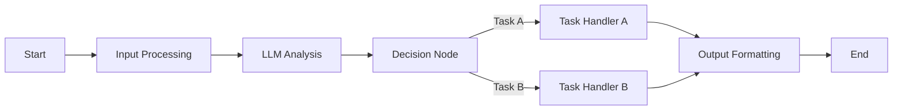

# Difyのインストールと設定

## Docker Composeでのデプロイ

### docker-compose.ymlの準備

Difyは、LLMアプリケーション開発のためのオープンソースプラットフォームです。ビジュアルなワークフロー作成と、Agent AIの構築が特徴です。

**1. プロジェクトディレクトリの作成**

```bash
# Difyプロジェクトディレクトリ作成
mkdir -p ~/agent-ai-project/dify
cd ~/agent-ai-project/dify

# 必要なディレクトリ構造
mkdir -p volumes/db
mkdir -p volumes/redis
mkdir -p volumes/weaviate
mkdir -p volumes/storage
```

**2. docker-compose.ymlの作成**

```yaml
version: '3.8'

services:
  # Dify API Service
  api:
    image: langgenius/dify-api:0.6.12
    restart: always
    environment:
      MODE: api
      LOG_LEVEL: INFO
      SECRET_KEY: 'your-secret-key-change-this'
      CONSOLE_WEB_URL: 'http://localhost:3000'
      INIT_PASSWORD: 'admin123'
      CONSOLE_API_URL: 'http://localhost:5001'
      SERVICE_API_URL: 'http://localhost:5001'
      APP_WEB_URL: 'http://localhost:3000'
      FILES_URL: ''
      MIGRATION_ENABLED: 'true'
      # Database
      DB_USERNAME: postgres
      DB_PASSWORD: difyai123456
      DB_HOST: db
      DB_PORT: 5432
      DB_DATABASE: dify
      # Redis
      REDIS_HOST: redis
      REDIS_PORT: 6379
      REDIS_DB: 0
      REDIS_USE_SSL: 'false'
      # Celery
      CELERY_BROKER_URL: redis://redis:6379/1
      BROKER_USE_SSL: 'false'
      # Storage
      STORAGE_TYPE: local
      STORAGE_LOCAL_PATH: /app/api/storage
      # Vector Store
      VECTOR_STORE: weaviate
      WEAVIATE_HOST: http://weaviate:8080
      WEAVIATE_API_KEY: WVF5YThaHlkYwhGUSmCRgsX3tD5ngdN8pkih
    volumes:
      - ./volumes/storage:/app/api/storage
    depends_on:
      - db
      - redis
      - weaviate
    networks:
      - dify-network

  # Dify Worker Service
  worker:
    image: langgenius/dify-api:0.6.12
    restart: always
    environment:
      MODE: worker
      LOG_LEVEL: INFO
      SECRET_KEY: 'your-secret-key-change-this'
      # Same environment variables as api service
      DB_USERNAME: postgres
      DB_PASSWORD: difyai123456
      DB_HOST: db
      DB_PORT: 5432
      DB_DATABASE: dify
      REDIS_HOST: redis
      REDIS_PORT: 6379
      REDIS_DB: 0
      CELERY_BROKER_URL: redis://redis:6379/1
      STORAGE_TYPE: local
      STORAGE_LOCAL_PATH: /app/api/storage
      VECTOR_STORE: weaviate
      WEAVIATE_HOST: http://weaviate:8080
      WEAVIATE_API_KEY: XXXXXXXXXXXXXXXXXXXXXXXXXXXXXX
    volumes:
      - ./volumes/storage:/app/api/storage
    depends_on:
      - db
      - redis
      - weaviate
    networks:
      - dify-network

  # Dify Web Frontend
  web:
    image: langgenius/dify-web:0.6.12
    restart: always
    environment:
      CONSOLE_API_URL: 'http://localhost:5001'
      APP_API_URL: 'http://localhost:5001'
      SENTRY_DSN: ''
    ports:
      - "3000:3000"
    depends_on:
      - api
    networks:
      - dify-network

  # PostgreSQL Database
  db:
    image: postgres:15-alpine
    restart: always
    environment:
      POSTGRES_PASSWORD: difyai123456
      POSTGRES_DB: dify
      PGDATA: /var/lib/postgresql/data/pgdata
    volumes:
      - ./volumes/db:/var/lib/postgresql/data
    healthcheck:
      test: ["CMD-SHELL", "pg_isready -U postgres"]
      interval: 10s
      timeout: 5s
      retries: 5
    networks:
      - dify-network

  # Redis Cache
  redis:
    image: redis:7-alpine
    restart: always
    volumes:
      - ./volumes/redis:/data
    command: redis-server --requirepass difyai123456
    healthcheck:
      test: ["CMD", "redis-cli", "ping"]
      interval: 10s
      timeout: 5s
      retries: 5
    networks:
      - dify-network

  # Weaviate Vector Store
  weaviate:
    image: semitechnologies/weaviate:1.24.1
    restart: always
    environment:
      QUERY_DEFAULTS_LIMIT: 25
      AUTHENTICATION_ANONYMOUS_ACCESS_ENABLED: 'true'
      PERSISTENCE_DATA_PATH: '/var/lib/weaviate'
      DEFAULT_VECTORIZER_MODULE: 'none'
      ENABLE_MODULES: ''
      CLUSTER_HOSTNAME: 'node1'
      AUTHENTICATION_APIKEY_ENABLED: 'true'
      AUTHENTICATION_APIKEY_ALLOWED_KEYS: 'WVF5YThaHlkYwhGUSmCRgsX3tD5ngdN8pkih'
      AUTHENTICATION_APIKEY_USERS: 'dify'
    volumes:
      - ./volumes/weaviate:/var/lib/weaviate
    networks:
      - dify-network

  # Nginx Reverse Proxy
  nginx:
    image: nginx:alpine
    restart: always
    ports:
      - "5001:80"
    volumes:
      - ./nginx.conf:/etc/nginx/nginx.conf
    depends_on:
      - api
    networks:
      - dify-network

networks:
  dify-network:
    driver: bridge
```

**3. nginx.confの作成**

```nginx
events {
    worker_connections 1024;
}

http {
    upstream api_server {
        server api:5001;
    }

    server {
        listen 80;
        server_name localhost;
        
        client_max_body_size 100M;
        proxy_read_timeout 300s;
        proxy_connect_timeout 75s;

        location / {
            proxy_pass http://api_server;
            proxy_set_header Host $host;
            proxy_set_header X-Real-IP $remote_addr;
            proxy_set_header X-Forwarded-For $proxy_add_x_forwarded_for;
            proxy_set_header X-Forwarded-Proto $scheme;
        }
    }
}
```

### 環境変数の設定

**1. .envファイルの作成**

```bash
# .env ファイル
# Security
SECRET_KEY=your-secret-key-here
INIT_PASSWORD=your-secure-password

# Database
DB_USERNAME=postgres
DB_PASSWORD=difyai123456
DB_HOST=db
DB_PORT=5432
DB_DATABASE=dify

# Redis
REDIS_HOST=redis
REDIS_PORT=6379
REDIS_PASSWORD=difyai123456
REDIS_DB=0

# Storage
STORAGE_TYPE=local
STORAGE_LOCAL_PATH=/app/api/storage

# Mail Service (Optional)
MAIL_TYPE=smtp
MAIL_DEFAULT_SEND_FROM=no-reply@dify.ai
SMTP_SERVER=smtp.gmail.com
SMTP_PORT=587
SMTP_USERNAME=your-email@gmail.com
SMTP_PASSWORD=your-app-password
SMTP_USE_TLS=true

# LLM Provider (LM Studio)
LM_STUDIO_API_BASE=http://host.docker.internal:1234/v1
LM_STUDIO_API_KEY=not-needed

# Feature Flags
BILLING_ENABLED=false
EDITION=SELF_HOSTED
```

**2. シークレットキーの生成**

```bash
# ランダムなシークレットキーを生成
openssl rand -base64 32

# または
python3 -c "import secrets; print(secrets.token_urlsafe(32))"
```

### 起動と初期設定

**1. Difyの起動**

```bash
# Docker Composeで起動
cd ~/agent-ai-project/dify
docker compose up -d

# ログの確認
docker compose logs -f

# サービスの状態確認
docker compose ps
```

**2. 初期設定の確認**

```bash
# ヘルスチェック
curl http://localhost:5001/health

# Webインターフェースアクセス
# ブラウザで http://localhost:3000 を開く
```

**3. 管理者アカウントの設定**

```
1. http://localhost:3000 にアクセス
2. "Create an account" をクリック
3. 管理者情報を入力:
   - Email: admin@example.com
   - Password: Admin@123456（.envで設定したもの）
   - Name: Admin
4. ワークスペースの作成
```

## LM Studioとの連携

### カスタムモデルの追加

**1. モデルプロバイダーの設定**

Difyの管理画面から設定：

```
Settings → Model Providers → Custom → Add Custom Model

設定項目:
- Provider Name: LM Studio
- Model Type: LLM
- API Base URL: http://host.docker.internal:1234/v1
- API Key: dummy-key（LM Studioでは不要だが必須項目）
```

**2. モデルの登録**

```yaml
モデル設定:
  Model Name: llama-3.2-3b-instruct
  Model Display Name: Llama 3.2 3B
  
パラメータ設定:
  Max Tokens: 4096
  Temperature Range: 0.0 - 2.0
  Top P Range: 0.0 - 1.0
  
料金設定（ローカルなので0）:
  Input Price: 0
  Output Price: 0
```

**3. カスタムモデルの設定ファイル**

```json
{
  "provider": "lm-studio",
  "model_type": "llm",
  "models": [
    {
      "model": "llama-3.2-3b-instruct",
      "model_display_name": "Llama 3.2 3B Instruct",
      "model_properties": {
        "max_tokens": 4096,
        "temperature": 0.7,
        "top_p": 0.95,
        "frequency_penalty": 0,
        "presence_penalty": 0
      },
      "deprecated": false
    }
  ],
  "credentials": {
    "api_base": "http://host.docker.internal:1234/v1",
    "api_key": "not-required"
  }
}
```

### APIエンドポイントの設定

**1. 接続設定のテスト**

```python
import requests

# Dify内からLM Studioへの接続テスト
def test_lm_studio_connection():
    # Docker内からホストマシンのLM Studioにアクセス
    url = "http://host.docker.internal:1234/v1/models"
    
    try:
        response = requests.get(url, timeout=5)
        if response.status_code == 200:
            models = response.json()
            print("Available models:", models)
            return True
        else:
            print(f"Error: {response.status_code}")
            return False
    except Exception as e:
        print(f"Connection failed: {e}")
        return False

test_lm_studio_connection()
```

**2. プロキシ設定（必要な場合）**

```yaml
# docker-compose.ymlに追加
services:
  api:
    environment:
      # プロキシ設定
      HTTP_PROXY: http://proxy.example.com:8080
      HTTPS_PROXY: http://proxy.example.com:8080
      NO_PROXY: localhost,127.0.0.1,db,redis,weaviate
```

### 接続テスト

**1. Dify UI での接続テスト**

```
1. Settings → Model Providers
2. LM Studio プロバイダーを選択
3. "Test" ボタンをクリック
4. 成功メッセージを確認
```

**2. APIを使用した接続テスト**

```bash
# Dify APIを通じてLM Studioモデルをテスト
curl -X POST http://localhost:5001/v1/chat-messages \
  -H "Authorization: Bearer your-api-key" \
  -H "Content-Type: application/json" \
  -d '{
    "query": "Hello, are you working?",
    "model": {
      "provider": "lm-studio",
      "name": "llama-3.2-3b-instruct"
    }
  }'
```

**3. トラブルシューティング**

```bash
# 接続問題の診断
# 1. LM Studio側の確認
curl http://localhost:1234/v1/models

# 2. Docker内からの確認
docker exec dify-api-1 curl http://host.docker.internal:1234/v1/models

# 3. ネットワークの確認
docker network inspect dify_dify-network

# 4. ログの確認
docker compose logs api | grep -i error
```

# エージェントワークフローの作成

## 基本的なワークフロー

### プロンプトチェーンの設計

**1. ワークフローの新規作成**

```
1. Dify Dashboard → "Create App"
2. "Workflow" を選択
3. アプリ名: "Agent AI Assistant"
4. 説明: "Multi-step reasoning agent"
```

**2. 基本的なノード構成**



**3. プロンプトチェーンの実装**

```yaml
Node 1 - Input Processing:
  Type: LLM
  Model: llama-3.2-3b-instruct
  System Prompt: |
    You are an AI agent that analyzes user requests and determines the appropriate action.
    Extract the following from the user input:
    1. Intent (what the user wants to do)
    2. Key entities (important nouns/concepts)
    3. Required actions
    
    Output in JSON format.
  
  User Prompt: {{input}}

Node 2 - Task Router:
  Type: Code
  Language: Python
  Code: |
    import json
    
    # Parse the analysis from previous node
    analysis = json.loads({{node1.output}})
    intent = analysis.get('intent', '')
    
    # Route to appropriate handler
    if 'code' in intent.lower():
        return {'route': 'code_generation'}
    elif 'data' in intent.lower():
        return {'route': 'data_analysis'}
    else:
        return {'route': 'general_assistance'}
```

### 条件分岐の実装

**1. 条件ノードの設定**

```yaml
Condition Node:
  Type: Conditional Branch
  Conditions:
    - If {{task_router.route}} == "code_generation"
      Then: Go to Code Generation Node
    
    - If {{task_router.route}} == "data_analysis"
      Then: Go to Data Analysis Node
    
    - Else
      Then: Go to General Assistant Node
```

**2. 各ブランチの処理ノード**

```yaml
Code Generation Branch:
  Node Type: LLM
  Model: llama-3.2-3b-instruct
  System Prompt: |
    You are a expert programmer. Generate clean, well-commented code.
    Language: {{detected_language}}
    Requirements: {{requirements}}
  
  Temperature: 0.3  # Lower for more deterministic code

Data Analysis Branch:
  Node Type: LLM + Code
  Step 1 - Analysis Plan:
    Model: llama-3.2-3b-instruct
    Prompt: Create a data analysis plan for: {{query}}
  
  Step 2 - Execute Analysis:
    Type: Code
    Language: Python
    Code: |
      # Execute the analysis plan
      import pandas as pd
      import json
      
      plan = {{step1.output}}
      # Implementation here
```

**3. エラーハンドリング**

```python
# Error Handler Node
def handle_errors(node_output, error_type=None):
    """
    統一的なエラーハンドリング
    """
    if error_type == "timeout":
        return {
            "status": "error",
            "message": "Processing timeout. Please try with a simpler request.",
            "suggestion": "Break down your request into smaller parts"
        }
    elif error_type == "invalid_input":
        return {
            "status": "error", 
            "message": "Invalid input format",
            "suggestion": "Please provide clear, structured input"
        }
    else:
        return {
            "status": "error",
            "message": "An unexpected error occurred",
            "details": str(node_output)
        }
```

### ループ処理

**1. 反復処理ノードの実装**

```yaml
Loop Node Configuration:
  Type: Loop
  Maximum Iterations: 5
  
  Loop Condition:
    Continue While: {{iteration_count}} < {{max_iterations}} 
                   AND {{task_complete}} == false
  
  Loop Body:
    - Refinement Node:
        Type: LLM
        Prompt: |
          Current result: {{current_result}}
          Iteration: {{iteration_count}}
          
          Improve the result by:
          1. Adding more detail
          2. Fixing any errors
          3. Enhancing clarity
    
    - Quality Check:
        Type: Code
        Code: |
          score = evaluate_quality({{refinement.output}})
          if score > 0.8:
              return {"task_complete": true, "final_result": output}
          else:
              return {"task_complete": false, "current_result": output}
```

**2. 再帰的タスク処理**

```python
# Recursive Task Decomposition Node
def decompose_task(task, depth=0, max_depth=3):
    """
    複雑なタスクを再帰的に分解
    """
    if depth >= max_depth:
        return [task]
    
    # LLMを使用してタスクを分解
    subtasks = llm_decompose(task)
    
    result = []
    for subtask in subtasks:
        if is_simple_task(subtask):
            result.append(subtask)
        else:
            # 再帰的に分解
            result.extend(decompose_task(subtask, depth + 1))
    
    return result
```

## 高度なエージェント機能

### メモリ機能の実装

**1. 会話メモリの設定**

```yaml
Memory Configuration:
  Type: Conversation Memory
  Storage: Vector Database (Weaviate)
  
  Settings:
    Window Size: 10  # 最新10ターンを保持
    Summary Threshold: 20  # 20ターン超えたら要約
    
  Memory Schema:
    - user_input: string
    - agent_response: string
    - timestamp: datetime
    - context_embedding: vector
    - metadata: json
```

**2. 長期記憶の実装**

```python
# Long-term Memory Node
class LongTermMemory:
    def __init__(self, vector_store):
        self.vector_store = vector_store
        self.memory_index = "agent_memories"
    
    def store_memory(self, content, category, importance=5):
        """
        重要な情報を長期記憶に保存
        """
        embedding = self.generate_embedding(content)
        
        memory_doc = {
            "content": content,
            "category": category,
            "importance": importance,
            "timestamp": datetime.now().isoformat(),
            "embedding": embedding,
            "access_count": 0
        }
        
        self.vector_store.index(
            index=self.memory_index,
            document=memory_doc
        )
    
    def retrieve_relevant_memories(self, query, top_k=5):
        """
        クエリに関連する記憶を取得
        """
        query_embedding = self.generate_embedding(query)
        
        results = self.vector_store.search(
            index=self.memory_index,
            vector=query_embedding,
            top_k=top_k
        )
        
        # アクセスカウントを更新
        for result in results:
            self.update_access_count(result['id'])
        
        return results
    
    def forget_old_memories(self, days=30, importance_threshold=3):
        """
        古い・重要度の低い記憶を削除
        """
        cutoff_date = datetime.now() - timedelta(days=days)
        
        self.vector_store.delete(
            index=self.memory_index,
            query={
                "timestamp": {"$lt": cutoff_date.isoformat()},
                "importance": {"$lt": importance_threshold},
                "access_count": {"$lt": 2}
            }
        )
```

**3. コンテキスト管理**

```yaml
Context Manager Node:
  Type: Code
  Purpose: Maintain conversation context across interactions
  
  Implementation: |
    class ContextManager:
        def __init__(self):
            self.current_context = {}
            self.context_history = []
            
        def update_context(self, key, value):
            self.current_context[key] = value
            self.context_history.append({
                'timestamp': datetime.now(),
                'key': key,
                'value': value
            })
        
        def get_relevant_context(self, query):
            # クエリに関連するコンテキストを抽出
            relevant = {}
            keywords = extract_keywords(query)
            
            for key, value in self.current_context.items():
                if any(kw in key.lower() for kw in keywords):
                    relevant[key] = value
            
            return relevant
```

### 外部API連携

**1. API連携ノードの設定**

```yaml
HTTP Request Node:
  Name: External API Caller
  Method: POST
  URL: https://api.example.com/v1/process
  
  Headers:
    Authorization: Bearer {{api_key}}
    Content-Type: application/json
  
  Body:
    {
      "query": "{{processed_query}}",
      "context": "{{context}}",
      "parameters": {
        "temperature": 0.7,
        "max_tokens": 1000
      }
    }
  
  Error Handling:
    Retry: 3 times with exponential backoff
    Fallback: Use local model
```

**2. 複数API の統合**

```python
# Multi-API Integration Node
async def integrate_apis(query, apis_config):
    """
    複数のAPIを並列で呼び出し、結果を統合
    """
    import asyncio
    import aiohttp
    
    async def call_api(session, api_config, query):
        try:
            async with session.post(
                api_config['url'],
                json={'query': query},
                headers=api_config['headers']
            ) as response:
                return {
                    'api': api_config['name'],
                    'status': response.status,
                    'data': await response.json()
                }
        except Exception as e:
            return {
                'api': api_config['name'],
                'status': 'error',
                'error': str(e)
            }
    
    async with aiohttp.ClientSession() as session:
        tasks = [
            call_api(session, api, query) 
            for api in apis_config
        ]
        results = await asyncio.gather(*tasks)
    
    # 結果の統合
    return merge_api_results(results)
```

### ファイル処理

**1. ファイルアップロードノード**

```yaml
File Upload Handler:
  Type: File Processing
  Accepted Types: 
    - .txt, .md (Text files)
    - .csv, .xlsx (Data files)
    - .pdf (Documents)
    - .json, .xml (Structured data)
  
  Max Size: 10MB
  
  Processing Pipeline:
    1. File Validation
    2. Content Extraction
    3. Format Conversion
    4. Data Processing
```

**2. ドキュメント処理**

```python
# Document Processing Node
class DocumentProcessor:
    def __init__(self):
        self.supported_formats = {
            'pdf': self.process_pdf,
            'docx': self.process_docx,
            'txt': self.process_text,
            'csv': self.process_csv
        }
    
    def process_document(self, file_path, file_type):
        """
        ドキュメントを処理して構造化データに変換
        """
        if file_type not in self.supported_formats:
            raise ValueError(f"Unsupported file type: {file_type}")
        
        # ファイルタイプに応じた処理
        processor = self.supported_formats[file_type]
        content = processor(file_path)
        
        # テキストチャンク化
        chunks = self.chunk_text(content, chunk_size=500)
        
        # 各チャンクの埋め込み生成
        embeddings = [
            self.generate_embedding(chunk) 
            for chunk in chunks
        ]
        
        return {
            'file_path': file_path,
            'file_type': file_type,
            'chunks': chunks,
            'embeddings': embeddings,
            'metadata': self.extract_metadata(file_path)
        }
    
    def chunk_text(self, text, chunk_size=500, overlap=50):
        """
        テキストを重複を持たせてチャンク化
        """
        chunks = []
        for i in range(0, len(text), chunk_size - overlap):
            chunk = text[i:i + chunk_size]
            chunks.append(chunk)
        return chunks
```

**3. データ変換とエクスポート**

```yaml
Data Export Node:
  Type: Data Transformation
  
  Input Format: JSON
  Output Formats:
    - CSV
    - Excel
    - Markdown
    - PDF
  
  Transformation Pipeline:
    1. Data Validation:
       - Schema checking
       - Data type validation
       
    2. Format Conversion:
       - JSON to target format
       - Preserve data integrity
       
    3. Export Options:
       - Download link generation
       - Email delivery
       - Cloud storage upload
```

これらの機能を組み合わせることで、高度なAgent AIワークフローを構築できます。次章では、n8nを使用してこれらのワークフローをさらに自動化する方法を解説します。