# n8nのセットアップ

## n8nのインストール

### Docker環境での起動

n8nは、ノーコード/ローコードワークフロー自動化ツールです。様々なサービスやAPIを視覚的に連携させ、複雑な自動化を実現できます。

**1. n8n用ディレクトリ作成**

```bash
# n8nプロジェクトディレクトリ作成
mkdir -p ~/agent-ai-project/n8n
cd ~/agent-ai-project/n8n

# データ永続化用ディレクトリ作成
mkdir -p ./data/.n8n
mkdir -p ./data/db
```

**2. docker-compose.ymlの作成**

```yaml
version: '3.8'

services:
  n8n:
    image: n8nio/n8n:latest
    restart: always
    ports:
      - "5678:5678"
    environment:
      # 基本設定
      - N8N_BASIC_AUTH_ACTIVE=true
      - N8N_BASIC_AUTH_USER=admin
      - N8N_BASIC_AUTH_PASSWORD=admin123456
      
      # セキュリティ設定
      - N8N_SECURE_COOKIE=false
      - N8N_HOST=localhost
      - N8N_PORT=5678
      - N8N_PROTOCOL=http
      
      # データベース設定
      - DB_TYPE=postgresdb
      - DB_POSTGRESDB_HOST=postgres
      - DB_POSTGRESDB_PORT=5432
      - DB_POSTGRESDB_DATABASE=n8n
      - DB_POSTGRESDB_USER=n8n
      - DB_POSTGRESDB_PASSWORD=n8n
      
      # 実行設定
      - N8N_PAYLOAD_SIZE_MAX=16
      - N8N_METRICS=true
      - N8N_LOG_LEVEL=info
      
      # 外部API設定
      - N8N_DEFAULT_BINARY_DATA_MODE=filesystem
      - N8N_PERSISTED_BINARY_DATA_TTL=1440
      
      # LM Studio連携
      - LM_STUDIO_API_BASE=http://host.docker.internal:1234/v1
      - DIFY_API_BASE=http://host.docker.internal:5001
      
    volumes:
      - ./data/.n8n:/home/node/.n8n
      - ./data/files:/files
    depends_on:
      - postgres
    networks:
      - n8n-network

  # PostgreSQL for n8n
  postgres:
    image: postgres:15-alpine
    restart: always
    environment:
      POSTGRES_DB: n8n
      POSTGRES_USER: n8n
      POSTGRES_PASSWORD: n8n
      POSTGRES_NON_ROOT_USER: n8n
      POSTGRES_NON_ROOT_PASSWORD: n8n
    volumes:
      - ./data/db:/var/lib/postgresql/data
    networks:
      - n8n-network

  # Redis for queue management
  redis:
    image: redis:7-alpine
    restart: always
    volumes:
      - ./data/redis:/data
    command: redis-server --requirepass n8n123
    networks:
      - n8n-network

  # n8n Worker (optional, for scaling)
  n8n-worker:
    image: n8nio/n8n:latest
    restart: always
    command: n8n worker
    environment:
      - DB_TYPE=postgresdb
      - DB_POSTGRESDB_HOST=postgres
      - DB_POSTGRESDB_PORT=5432
      - DB_POSTGRESDB_DATABASE=n8n
      - DB_POSTGRESDB_USER=n8n
      - DB_POSTGRESDB_PASSWORD=n8n
      - N8N_LOG_LEVEL=info
      - QUEUE_BULL_REDIS_HOST=redis
      - QUEUE_BULL_REDIS_PORT=6379
      - QUEUE_BULL_REDIS_PASSWORD=n8n123
    volumes:
      - ./data/.n8n:/home/node/.n8n
    depends_on:
      - postgres
      - redis
    networks:
      - n8n-network

networks:
  n8n-network:
    driver: bridge
```

**3. 環境設定ファイル**

```bash
# .env ファイル
# n8n Configuration
N8N_BASIC_AUTH_USER=admin
N8N_BASIC_AUTH_PASSWORD=admin123456
N8N_ENCRYPTION_KEY=your-encryption-key-32-characters

# Database
POSTGRES_DB=n8n
POSTGRES_USER=n8n
POSTGRES_PASSWORD=n8n

# External Services
LM_STUDIO_HOST=host.docker.internal
LM_STUDIO_PORT=1234
DIFY_HOST=host.docker.internal
DIFY_PORT=5001

# Security
N8N_JWT_AUTH_HEADER_NAME=authorization
N8N_JWT_AUTH_HEADER=Bearer
```

### 永続化設定

**1. データ永続化の設定確認**

```bash
# 永続化ディレクトリの作成と権限設定
sudo chown -R 1000:1000 ./data/.n8n
sudo chown -R 999:999 ./data/db

# ボリュームマウントの確認
docker compose config
```

**2. バックアップ設定**

```bash
#!/bin/bash
# backup-n8n.sh

# 日付を含むバックアップディレクトリ作成
BACKUP_DIR="./backups/$(date +%Y%m%d_%H%M%S)"
mkdir -p "$BACKUP_DIR"

# データベースバックアップ
docker compose exec postgres pg_dump -U n8n n8n > "$BACKUP_DIR/n8n_db.sql"

# ワークフローファイルバックアップ
cp -r ./data/.n8n "$BACKUP_DIR/n8n_data"

echo "Backup completed: $BACKUP_DIR"
```

### 認証設定

**1. 基本認証の設定**

```yaml
# Basic認証設定（開発用）
Basic Auth:
  Username: admin
  Password: admin123456
  Active: true

# JWT認証設定（本番用）
JWT Auth:
  Header Name: authorization
  Secret: your-jwt-secret-key
  Issuer: n8n-instance
  Audience: n8n-users
```

**2. OAuth認証の設定（本番環境）**

```yaml
OAuth Configuration:
  Provider: Google/GitHub/Azure AD
  Client ID: your-oauth-client-id
  Client Secret: your-oauth-client-secret
  Redirect URI: http://your-domain.com/oauth/callback
  
Environment Variables:
  - N8N_OAUTH_GOOGLE_CLIENT_ID=your-google-client-id
  - N8N_OAUTH_GOOGLE_CLIENT_SECRET=your-google-secret
  - N8N_OAUTH_GITHUB_CLIENT_ID=your-github-client-id
  - N8N_OAUTH_GITHUB_CLIENT_SECRET=your-github-secret
```

## 基本的なノードの使い方

### トリガーノード

**1. Webhook トリガー**

```yaml
Webhook Trigger Configuration:
  HTTP Method: POST
  Path: /webhook/agent-ai
  Authentication: Header Auth
  
  Response Settings:
    Response Code: 200
    Response Data: "Processing started"
    
  Headers:
    Content-Type: application/json
    Authorization: Bearer {{$json.auth_token}}
```

**2. Schedule トリガー**

```yaml
Schedule Trigger:
  Interval: Every Hour
  
  Cron Expression: "0 * * * *"
  
  Timezone: Asia/Tokyo
  
  Trigger Rules:
    - Rule: Weekdays only
      Expression: "0 9-17 * * 1-5"
    
    - Rule: Every 30 minutes during work hours
      Expression: "0,30 9-17 * * 1-5"
```

**3. File Trigger**

```yaml
File Trigger:
  Watch Folder: /files/input
  
  File Pattern: "*.json"
  
  Action: On file creation
  
  Processing:
    - Move processed files to: /files/processed
    - Delete original: false
    - Parse JSON content: true
```

### アクションノード

**1. HTTP Request ノード**

```yaml
HTTP Request Node:
  Method: POST
  URL: http://host.docker.internal:1234/v1/chat/completions
  
  Headers:
    Content-Type: application/json
    Authorization: Bearer dummy-key
  
  Body:
    {
      "model": "llama-3.2-3b-instruct",
      "messages": [
        {
          "role": "user",
          "content": "{{$json.user_query}}"
        }
      ],
      "temperature": 0.7,
      "max_tokens": 1000
    }
  
  Options:
    Timeout: 30 seconds
    Follow Redirects: true
    Ignore SSL Issues: false
```

**2. Code ノード（JavaScript/Python）**

```javascript
// JavaScript Code Node
// データ処理とフォーマット変換

// 入力データの取得
const inputData = $input.all();

// 処理結果を格納する配列
const results = [];

for (const item of inputData) {
  const data = item.json;
  
  // LLMレスポンスの解析
  if (data.choices && data.choices.length > 0) {
    const response = data.choices[0].message.content;
    
    // レスポンスの構造化
    const structured = {
      timestamp: new Date().toISOString(),
      original_query: data.original_query,
      llm_response: response,
      confidence: calculateConfidence(response),
      categories: extractCategories(response),
      action_items: extractActionItems(response)
    };
    
    results.push(structured);
  }
}

// カスタム関数
function calculateConfidence(text) {
  // 信頼度計算ロジック
  const certaintyKeywords = ['確実', 'definitely', 'certainly'];
  const uncertaintyKeywords = ['perhaps', 'maybe', 'possibly'];
  
  let score = 0.5; // ベーススコア
  
  certaintyKeywords.forEach(keyword => {
    if (text.toLowerCase().includes(keyword)) score += 0.1;
  });
  
  uncertaintyKeywords.forEach(keyword => {
    if (text.toLowerCase().includes(keyword)) score -= 0.1;
  });
  
  return Math.max(0, Math.min(1, score));
}

function extractCategories(text) {
  // カテゴリ抽出ロジック
  const categories = [];
  const categoryMapping = {
    'code|programming|developer': 'Programming',
    'data|analysis|statistics': 'Data Analysis',
    'design|creative|art': 'Creative',
    'business|strategy|marketing': 'Business'
  };
  
  Object.entries(categoryMapping).forEach(([pattern, category]) => {
    const regex = new RegExp(pattern, 'i');
    if (regex.test(text)) {
      categories.push(category);
    }
  });
  
  return categories;
}

function extractActionItems(text) {
  // アクションアイテム抽出
  const sentences = text.split(/[.!?]+/);
  const actionItems = [];
  
  const actionWords = ['should', 'must', 'need to', 'required', 'すべき', '必要'];
  
  sentences.forEach(sentence => {
    if (actionWords.some(word => sentence.toLowerCase().includes(word))) {
      actionItems.push(sentence.trim());
    }
  });
  
  return actionItems;
}

return results;
```

**3. Database ノード**

```yaml
Database Node (PostgreSQL):
  Connection:
    Host: postgres
    Port: 5432
    Database: agent_ai_data
    User: postgres
    Password: your_password
  
  Operation: Insert
  
  Query: |
    INSERT INTO conversation_logs 
    (user_id, query, response, confidence, timestamp, metadata)
    VALUES 
    ($1, $2, $3, $4, $5, $6)
  
  Parameters:
    - "{{$json.user_id}}"
    - "{{$json.query}}"
    - "{{$json.llm_response}}"
    - "{{$json.confidence}}"
    - "{{$json.timestamp}}"
    - "{{JSON.stringify($json.metadata)}}"
```

### データ変換

**1. Set ノード（データ設定）**

```yaml
Set Node Configuration:
  Keep Only Set: false
  
  Values to Set:
    - Name: processed_data
      Value: "{{$json.raw_data | process}}"
      
    - Name: user_info
      Value: 
        id: "{{$json.user_id}}"
        name: "{{$json.user_name}}"
        timestamp: "{{$now}}"
        
    - Name: llm_params
      Value:
        model: "llama-3.2-3b-instruct"
        temperature: 0.7
        max_tokens: 1000
        
  Expressions:
    - Name: formatted_output
      Expression: |
        {{
          {
            "id": $json.id,
            "processed_at": $now,
            "result": $json.response,
            "metadata": {
              "confidence": $json.confidence,
              "processing_time": $json.end_time - $json.start_time
            }
          }
        }}
```

**2. Function ノード（データ変換）**

```javascript
// Function Node - Data Transformation
const items = $input.all();

return items.map(item => {
  const data = item.json;
  
  // 複雑なデータ変換ロジック
  const transformed = {
    // 基本情報
    id: generateUniqueId(),
    original_data: data,
    
    // AI処理結果
    ai_analysis: {
      sentiment: analyzeSentiment(data.text),
      entities: extractEntities(data.text),
      summary: generateSummary(data.text),
      keywords: extractKeywords(data.text)
    },
    
    // メタデータ
    processing_info: {
      processed_at: new Date().toISOString(),
      processing_duration: calculateDuration(),
      version: '1.0.0'
    }
  };
  
  return { json: transformed };
});

// ヘルパー関数
function generateUniqueId() {
  return 'ai_' + Date.now() + '_' + Math.random().toString(36).substr(2, 9);
}

function analyzeSentiment(text) {
  // 簡単な感情分析（実際はLLMを使用）
  const positiveWords = ['good', 'great', 'excellent', 'wonderful'];
  const negativeWords = ['bad', 'terrible', 'awful', 'horrible'];
  
  let score = 0;
  positiveWords.forEach(word => {
    if (text.toLowerCase().includes(word)) score += 1;
  });
  negativeWords.forEach(word => {
    if (text.toLowerCase().includes(word)) score -= 1;
  });
  
  return {
    score: score,
    label: score > 0 ? 'positive' : score < 0 ? 'negative' : 'neutral'
  };
}

function extractEntities(text) {
  // エンティティ抽出（簡易版）
  const emailRegex = /\b[A-Za-z0-9._%+-]+@[A-Za-z0-9.-]+\.[A-Z|a-z]{2,}\b/g;
  const phoneRegex = /\b\d{3}-\d{3}-\d{4}\b/g;
  const urlRegex = /https?:\/\/[^\s]+/g;
  
  return {
    emails: text.match(emailRegex) || [],
    phones: text.match(phoneRegex) || [],
    urls: text.match(urlRegex) || []
  };
}
```

# AI統合ワークフローの構築

## LM Studio連携

### HTTPリクエストノード

**1. LM Studio API呼び出し設定**

```yaml
LM Studio API Call:
  Node Type: HTTP Request
  Method: POST
  URL: http://host.docker.internal:1234/v1/chat/completions
  
  Headers:
    Content-Type: application/json
    Accept: application/json
  
  Body Configuration:
    Body Type: JSON
    Body Content: |
      {
        "model": "{{$json.model || 'llama-3.2-3b-instruct'}}",
        "messages": [
          {
            "role": "system",
            "content": "{{$json.system_prompt || 'You are a helpful AI assistant.'}}"
          },
          {
            "role": "user", 
            "content": "{{$json.user_query}}"
          }
        ],
        "temperature": {{$json.temperature || 0.7}},
        "max_tokens": {{$json.max_tokens || 1000}},
        "stream": false
      }
  
  Response Handling:
    Success Status Codes: 200
    Error Handling: Continue On Fail
```

**2. 動的パラメータ制御**

```javascript
// Parameter Controller Node
const inputData = $input.all();

return inputData.map(item => {
  const data = item.json;
  
  // タスクタイプに応じたパラメータ調整
  let params = {
    model: 'llama-3.2-3b-instruct',
    temperature: 0.7,
    max_tokens: 1000
  };
  
  // タスク別パラメータ調整
  switch(data.task_type) {
    case 'code_generation':
      params.temperature = 0.3;  // より決定的
      params.max_tokens = 2000;
      params.system_prompt = "You are an expert programmer. Generate clean, well-commented code.";
      break;
      
    case 'creative_writing':
      params.temperature = 0.9;  // より創造的
      params.max_tokens = 1500;
      params.system_prompt = "You are a creative writer. Write engaging, imaginative content.";
      break;
      
    case 'data_analysis':
      params.temperature = 0.5;  // バランス型
      params.max_tokens = 1200;
      params.system_prompt = "You are a data analyst. Provide clear, accurate analysis.";
      break;
      
    default:
      params.system_prompt = "You are a helpful AI assistant.";
  }
  
  return {
    json: {
      ...data,
      ...params
    }
  };
});
```

### レスポンス処理

**1. LLMレスポンス解析**

```javascript
// LLM Response Parser Node
const responses = $input.all();

return responses.map(item => {
  const data = item.json;
  
  // レスポンス構造の確認
  if (!data.choices || data.choices.length === 0) {
    return {
      json: {
        error: 'No response from LLM',
        original_request: data.original_request,
        timestamp: new Date().toISOString()
      }
    };
  }
  
  const choice = data.choices[0];
  const content = choice.message.content;
  
  // レスポンスの詳細解析
  const parsed = {
    // 基本情報
    response_id: generateResponseId(),
    model_used: data.model,
    finish_reason: choice.finish_reason,
    
    // コンテンツ解析
    content: {
      raw: content,
      word_count: content.split(/\s+/).length,
      character_count: content.length,
      has_code: /```/.test(content),
      has_json: /^\s*\{/.test(content.trim()),
      language_detected: detectLanguage(content)
    },
    
    // 使用量情報
    usage: data.usage || {},
    
    // 品質メトリクス
    quality_metrics: {
      completeness: assessCompleteness(content, data.original_query),
      relevance: assessRelevance(content, data.original_query),
      clarity: assessClarity(content)
    },
    
    // メタデータ
    metadata: {
      processed_at: new Date().toISOString(),
      processing_time: data.processing_time,
      request_id: data.request_id
    }
  };
  
  return { json: parsed };
});

// ヘルパー関数
function generateResponseId() {
  return 'resp_' + Date.now() + '_' + Math.random().toString(36).substr(2, 6);
}

function detectLanguage(text) {
  // 簡易言語検出
  const japanesePattern = /[\u3040-\u309F\u30A0-\u30FF\u4E00-\u9FAF]/;
  const englishPattern = /^[A-Za-z\s.,!?'"()-]+$/;
  
  if (japanesePattern.test(text)) return 'ja';
  if (englishPattern.test(text)) return 'en';
  return 'unknown';
}

function assessCompleteness(content, query) {
  // 完全性評価（簡易版）
  const contentLength = content.length;
  const queryComplexity = query.split(/\s+/).length;
  
  const expectedLength = queryComplexity * 20; // 目安
  const ratio = contentLength / expectedLength;
  
  return Math.min(1.0, Math.max(0.0, ratio));
}

function assessRelevance(content, query) {
  // 関連性評価（キーワードベース）
  const queryWords = query.toLowerCase().split(/\s+/);
  const contentWords = content.toLowerCase().split(/\s+/);
  
  const matches = queryWords.filter(word => 
    contentWords.some(cWord => cWord.includes(word))
  );
  
  return matches.length / queryWords.length;
}

function assessClarity(content) {
  // 明確性評価（文構造ベース）
  const sentences = content.split(/[.!?]+/).filter(s => s.trim().length > 0);
  const avgSentenceLength = sentences.reduce((sum, s) => sum + s.length, 0) / sentences.length;
  
  // 適度な文長（50-150文字）が明確とみなす
  const clarityScore = avgSentenceLength > 150 ? 0.5 : avgSentenceLength < 20 ? 0.6 : 1.0;
  
  return clarityScore;
}
```

### エラーハンドリング

**1. 包括的エラー処理**

```javascript
// Error Handler Node
const items = $input.all();

return items.map(item => {
  const data = item.json;
  
  // エラーの分類と処理
  let errorInfo = null;
  let shouldRetry = false;
  let fallbackAction = null;
  
  if (data.error) {
    errorInfo = classifyError(data.error);
    shouldRetry = errorInfo.retryable;
    fallbackAction = determineFallback(errorInfo.category);
  }
  
  const result = {
    // 元データ
    original_data: data,
    
    // エラー情報
    error_analysis: errorInfo,
    
    // 処理方針
    processing_decision: {
      should_retry: shouldRetry,
      retry_count: data.retry_count || 0,
      max_retries: 3,
      fallback_action: fallbackAction,
      next_step: determineNextStep(data, errorInfo)
    },
    
    // ログ情報
    log_entry: {
      timestamp: new Date().toISOString(),
      error_code: errorInfo?.code,
      user_id: data.user_id,
      workflow_id: data.workflow_id,
      step: 'llm_processing'
    }
  };
  
  return { json: result };
});

function classifyError(error) {
  const errorString = JSON.stringify(error).toLowerCase();
  
  // エラーパターンの分類
  if (errorString.includes('timeout')) {
    return {
      category: 'timeout',
      severity: 'medium',
      retryable: true,
      code: 'TIMEOUT_ERROR',
      suggestion: 'Reduce context length or increase timeout'
    };
  }
  
  if (errorString.includes('connection')) {
    return {
      category: 'connection',
      severity: 'high',
      retryable: true,
      code: 'CONNECTION_ERROR',
      suggestion: 'Check LM Studio server status'
    };
  }
  
  if (errorString.includes('model')) {
    return {
      category: 'model',
      severity: 'high',
      retryable: false,
      code: 'MODEL_ERROR',
      suggestion: 'Verify model name and availability'
    };
  }
  
  if (errorString.includes('token') || errorString.includes('length')) {
    return {
      category: 'input_length',
      severity: 'medium',
      retryable: true,
      code: 'INPUT_LENGTH_ERROR',
      suggestion: 'Reduce input length or increase max_tokens'
    };
  }
  
  return {
    category: 'unknown',
    severity: 'medium',
    retryable: false,
    code: 'UNKNOWN_ERROR',
    suggestion: 'Review error details and system logs'
  };
}

function determineFallback(errorCategory) {
  const fallbacks = {
    'timeout': 'use_cached_response',
    'connection': 'use_backup_model',
    'model': 'use_default_model',
    'input_length': 'truncate_input',
    'unknown': 'manual_review'
  };
  
  return fallbacks[errorCategory] || 'manual_review';
}

function determineNextStep(data, errorInfo) {
  if (!errorInfo) return 'continue_processing';
  
  const retryCount = data.retry_count || 0;
  const maxRetries = 3;
  
  if (errorInfo.retryable && retryCount < maxRetries) {
    return 'retry_with_backoff';
  }
  
  if (errorInfo.category === 'input_length') {
    return 'preprocess_input';
  }
  
  return 'execute_fallback';
}
```

## 複雑なワークフローパターン

### マルチステップ処理

**1. タスク分解ワークフロー**

```mermaid
graph TD
    A[Input Task] --> B[Task Analyzer]
    B --> C{Complexity Check}
    C -->|Simple| D[Direct Processing]
    C -->|Complex| E[Task Decomposer]
    E --> F[Subtask 1]
    E --> G[Subtask 2]
    E --> H[Subtask N]
    F --> I[Result Aggregator]
    G --> I
    H --> I
    D --> J[Output Formatter]
    I --> J
    J --> K[Final Result]
```



**2. タスク分解ノード実装**

```javascript
// Task Decomposer Node
const tasks = $input.all();

return tasks.map(item => {
  const data = item.json;
  const originalTask = data.task;
  
  // タスクの複雑度分析
  const complexity = analyzeComplexity(originalTask);
  
  if (complexity.score < 0.5) {
    // 単純タスク：直接処理
    return {
      json: {
        task_id: generateTaskId(),
        original_task: originalTask,
        processing_type: 'direct',
        subtasks: [originalTask],
        estimated_time: complexity.estimated_time,
        complexity_score: complexity.score
      }
    };
  }
  
  // 複雑タスク：分解処理
  const subtasks = decomposeTask(originalTask, complexity);
  
  return {
    json: {
      task_id: generateTaskId(),
      original_task: originalTask,
      processing_type: 'decomposed',
      subtasks: subtasks,
      dependency_map: createDependencyMap(subtasks),
      estimated_time: subtasks.reduce((sum, st) => sum + st.estimated_time, 0),
      complexity_score: complexity.score
    }
  };
});

function analyzeComplexity(task) {
  const factors = {
    length: task.length,
    keywords: countComplexityKeywords(task),
    questions: (task.match(/\?/g) || []).length,
    conditions: countConditionalWords(task),
    steps: countStepIndicators(task)
  };
  
  // 複雑度スコア計算
  const score = (
    Math.min(factors.length / 500, 1) * 0.2 +
    Math.min(factors.keywords / 10, 1) * 0.3 +
    Math.min(factors.questions / 5, 1) * 0.2 +
    Math.min(factors.conditions / 5, 1) * 0.2 +
    Math.min(factors.steps / 10, 1) * 0.1
  );
  
  return {
    score: score,
    factors: factors,
    estimated_time: Math.ceil(score * 300) // 秒
  };
}

function decomposeTask(task, complexity) {
  // 自然言語処理でタスクを分解
  const sentences = task.split(/[.!?]+/).filter(s => s.trim().length > 0);
  const subtasks = [];
  
  sentences.forEach((sentence, index) => {
    const trimmed = sentence.trim();
    if (trimmed.length > 0) {
      subtasks.push({
        id: `subtask_${index + 1}`,
        content: trimmed,
        priority: determinePriority(trimmed, index),
        dependencies: findDependencies(trimmed, subtasks),
        estimated_time: Math.ceil(trimmed.length / 10) // 簡易推定
      });
    }
  });
  
  return subtasks;
}

function countComplexityKeywords(text) {
  const complexKeywords = [
    'analyze', 'compare', 'evaluate', 'synthesize', 'optimize',
    'integrate', 'customize', 'implement', 'design', 'develop'
  ];
  
  return complexKeywords.filter(keyword => 
    text.toLowerCase().includes(keyword)
  ).length;
}

function countConditionalWords(text) {
  const conditionals = ['if', 'when', 'unless', 'while', 'provided', 'assuming'];
  return conditionals.filter(word => 
    text.toLowerCase().includes(word)
  ).length;
}
```

### 並列処理

**1. 並列実行制御**

```javascript
// Parallel Execution Controller
const inputTasks = $input.all();

// 並列処理グループの作成
const parallelGroups = createParallelGroups(inputTasks);

return parallelGroups.map((group, groupIndex) => {
  return {
    json: {
      group_id: `parallel_group_${groupIndex}`,
      tasks: group.tasks,
      execution_strategy: 'parallel',
      max_concurrent: 3, // 最大同時実行数
      timeout_per_task: 60, // タスクあたりのタイムアウト（秒）
      failure_strategy: 'continue_others', // 他を継続
      aggregation_method: 'merge_results',
      
      // 実行制御
      execution_config: {
        start_delay: groupIndex * 1000, // グループ間遅延
        priority: determinePriority(group),
        resource_allocation: calculateResources(group)
      }
    }
  };
});

function createParallelGroups(tasks) {
  const groups = [];
  let currentGroup = { tasks: [], dependencies: [] };
  
  tasks.forEach(task => {
    const taskData = task.json;
    
    // 依存関係チェック
    if (hasActiveDependencies(taskData, currentGroup.tasks)) {
      // 新しいグループを開始
      if (currentGroup.tasks.length > 0) {
        groups.push(currentGroup);
      }
      currentGroup = { tasks: [taskData], dependencies: [] };
    } else {
      // 現在のグループに追加
      currentGroup.tasks.push(taskData);
    }
  });
  
  // 最後のグループを追加
  if (currentGroup.tasks.length > 0) {
    groups.push(currentGroup);
  }
  
  return groups;
}

function hasActiveDependencies(task, activeTasks) {
  if (!task.dependencies) return false;
  
  return task.dependencies.some(dep => 
    activeTasks.some(activeTask => activeTask.id === dep)
  );
}
```

### スケジュール実行

**1. 高度なスケジューリング**

```yaml
Advanced Scheduler Configuration:
  
  # 定期実行パターン
  Recurring Schedules:
    - Name: "Daily Agent Training"
      Cron: "0 2 * * *"  # 毎日午前2時
      Timezone: "Asia/Tokyo"
      
    - Name: "Hourly Data Processing"
      Cron: "0 * * * *"  # 毎時0分
      Conditions:
        - Business Hours Only: "0 9-17 * * 1-5"
        
    - Name: "Weekly Model Update"
      Cron: "0 0 * * 0"  # 毎週日曜日
      Pre-execution Checks:
        - Disk Space: "> 10GB"
        - CPU Usage: "< 50%"
  
  # 条件付き実行
  Conditional Triggers:
    - Name: "Error Threshold Alert"
      Condition: "error_rate > 0.05"
      Action: "send_notification"
      
    - Name: "Performance Degradation"
      Condition: "avg_response_time > 5000ms"
      Action: "scale_resources"
  
  # イベント駆動実行
  Event Triggers:
    - Event: "file_uploaded"
      Pattern: "*.csv"
      Workflow: "data_processing_pipeline"
      
    - Event: "api_request"
      Endpoint: "/webhook/agent-task"
      Workflow: "agent_task_processor"
```

**2. 動的スケジューリング**

```javascript
// Dynamic Scheduler Node
const scheduleRequests = $input.all();

return scheduleRequests.map(item => {
  const data = item.json;
  
  // 動的スケジュール計算
  const schedule = calculateOptimalSchedule(data);
  
  return {
    json: {
      schedule_id: generateScheduleId(),
      original_request: data,
      
      // 最適化されたスケジュール
      optimized_schedule: {
        execution_time: schedule.optimal_time,
        estimated_duration: schedule.duration,
        resource_requirements: schedule.resources,
        dependencies: schedule.dependencies
      },
      
      // リソース予約
      resource_reservation: {
        cpu_cores: schedule.resources.cpu,
        memory_mb: schedule.resources.memory,
        storage_gb: schedule.resources.storage,
        network_bandwidth: schedule.resources.network
      },
      
      // 監視設定
      monitoring: {
        performance_metrics: ['response_time', 'throughput', 'error_rate'],
        alert_thresholds: {
          max_execution_time: schedule.duration * 1.5,
          max_memory_usage: schedule.resources.memory * 1.2,
          max_error_rate: 0.05
        }
      }
    }
  };
});

function calculateOptimalSchedule(request) {
  const task = request.task;
  const priority = request.priority || 'normal';
  const currentLoad = getCurrentSystemLoad();
  
  // 実行時間の最適化
  const optimalTime = findOptimalExecutionTime(task, priority, currentLoad);
  
  // リソース要件の計算
  const resources = estimateResourceRequirements(task);
  
  // 依存関係の解析
  const dependencies = analyzeDependencies(task);
  
  return {
    optimal_time: optimalTime,
    duration: estimateExecutionDuration(task, resources),
    resources: resources,
    dependencies: dependencies,
    confidence: calculateScheduleConfidence(task, resources, currentLoad)
  };
}

function findOptimalExecutionTime(task, priority, currentLoad) {
  const now = new Date();
  const baseTime = new Date(now.getTime() + 60000); // 1分後
  
  // 優先度に基づく調整
  switch(priority) {
    case 'high':
      return baseTime; // 即座に実行
    case 'normal':
      return new Date(baseTime.getTime() + (currentLoad.cpu > 80 ? 300000 : 0)); // 負荷高時は5分遅延
    case 'low':
      return new Date(baseTime.getTime() + 900000); // 15分遅延
    default:
      return baseTime;
  }
}
```

これらのパターンを組み合わせることで、複雑で柔軟なAgent AIワークフローを構築できます。次章では、これらの技術を実践的なユースケースに適用する方法を解説します。