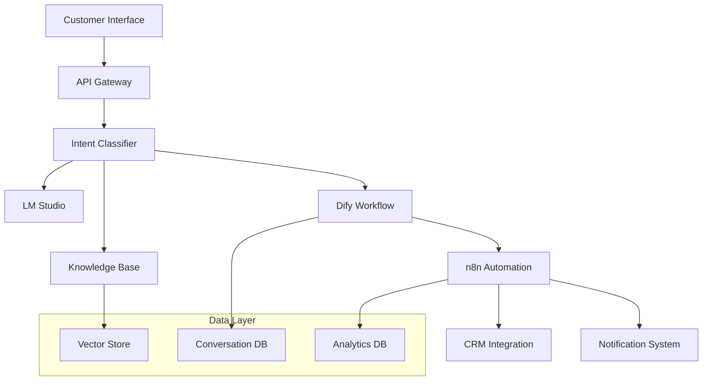

# カスタマーサポートエージェント

## 要件定義と設計

### 機能要件の整理

実用的なカスタマーサポートエージェントを構築するため、まず具体的な要件を定義します。

**1. 基本機能要件**

```yaml
Primary Functions:
  FAQ対応:
    - 質問意図の理解と分類
    - 適切な回答の検索と提供
    - マルチターン対話の管理
    
  問い合わせルーティング:
    - 問題の複雑度判定
    - 適切な担当部署への振り分け
    - エスカレーション条件の判定
    
  情報収集:
    - 顧客情報の確認
    - 問題詳細の聞き取り
    - 関連情報の記録

Secondary Functions:
  学習機能:
    - 新しいFAQの自動学習
    - 回答精度の継続改善
    - 顧客満足度の分析
    
  レポート機能:
    - 問い合わせ傾向の分析
    - 解決率の追跡
    - 業務効率の測定
```

**2. 非機能要件**

```yaml
Performance Requirements:
  Response Time: < 3秒（90%の場合）
  Availability: 99.5%以上
  Concurrent Users: 100人同時対応可能
  
Quality Requirements:
  Accuracy: FAQ回答精度85%以上
  Customer Satisfaction: 4.0/5.0以上
  Resolution Rate: 一次回答で70%以上解決
  
Security Requirements:
  Data Protection: 個人情報の適切な保護
  Access Control: 権限ベースのアクセス制御
  Audit Trail: 全ての対話ログの記録
```

### システム構成

**1. アーキテクチャ概要**



**2. コンポーネント詳細**

```yaml
Components:
  Frontend:
    - Web Chat Widget
    - Mobile App Interface
    - Voice Interface (optional)
    
  Backend Services:
    - Intent Classification Service
    - Knowledge Management Service
    - Conversation Management Service
    - Analytics Service
    
  AI/ML Components:
    - Local LLM (LM Studio)
    - Vector Database (Weaviate)
    - Workflow Engine (Dify)
    - Automation Platform (n8n)
    
  External Integrations:
    - CRM System
    - Ticketing System
    - Email Service
    - SMS Gateway
```

### データフロー設計

**1. 問い合わせ処理フロー**

```yaml
Customer Inquiry Flow:
  
  Step 1 - Input Processing:
    Input: Customer message
    Processing: 
      - Text normalization
      - Language detection
      - Intent extraction
    Output: Structured inquiry data
    
  Step 2 - Intent Classification:
    Input: Structured inquiry
    Processing:
      - Multi-level classification
      - Confidence scoring
      - Context consideration
    Output: Intent + confidence score
    
  Step 3 - Knowledge Retrieval:
    Input: Classified intent
    Processing:
      - Vector similarity search
      - Context-aware filtering
      - Ranking by relevance
    Output: Relevant knowledge items
    
  Step 4 - Response Generation:
    Input: Knowledge + context
    Processing:
      - Template-based response
      - LLM-generated response
      - Personalization
    Output: Customer response
    
  Step 5 - Quality Assurance:
    Input: Generated response
    Processing:
      - Accuracy verification
      - Safety filtering
      - Tone adjustment
    Output: Final response
```

**2. データスキーマ設計**

```sql
-- 会話管理テーブル
CREATE TABLE conversations (
    id UUID PRIMARY KEY,
    customer_id VARCHAR(100),
    session_id VARCHAR(100),
    channel VARCHAR(50), -- web, mobile, email, etc.
    start_time TIMESTAMP,
    end_time TIMESTAMP,
    status VARCHAR(20), -- active, closed, escalated
    satisfaction_score INTEGER,
    metadata JSONB
);

-- メッセージテーブル
CREATE TABLE messages (
    id UUID PRIMARY KEY,
    conversation_id UUID REFERENCES conversations(id),
    sender VARCHAR(20), -- customer, agent, system
    content TEXT,
    message_type VARCHAR(50), -- text, image, file, etc.
    intent VARCHAR(100),
    confidence_score DECIMAL(3,2),
    timestamp TIMESTAMP,
    metadata JSONB
);

-- ナレッジベーステーブル
CREATE TABLE knowledge_base (
    id UUID PRIMARY KEY,
    category VARCHAR(100),
    question TEXT,
    answer TEXT,
    keywords TEXT[],
    embedding VECTOR(1536),
    usage_count INTEGER DEFAULT 0,
    effectiveness_score DECIMAL(3,2),
    created_at TIMESTAMP,
    updated_at TIMESTAMP
);

-- 分析データテーブル
CREATE TABLE analytics (
    id UUID PRIMARY KEY,
    conversation_id UUID REFERENCES conversations(id),
    metric_name VARCHAR(100),
    metric_value DECIMAL(10,2),
    dimensions JSONB,
    recorded_at TIMESTAMP
);
```

## 実装とテスト

### Difyでのエージェント構築

**1. ナレッジベース構築**

```yaml
Knowledge Base Setup in Dify:
  
  Data Sources:
    - FAQ Documents (PDF, Word)
    - Product Manuals
    - Support Tickets History
    - Company Policies
    
  Processing Pipeline:
    1. Document Upload
    2. Text Extraction
    3. Chunk Segmentation (500 tokens)
    4. Embedding Generation
    5. Vector Store Indexing
    
  Configuration:
    Chunk Size: 500 tokens
    Overlap: 50 tokens
    Embedding Model: text-embedding-ada-002 (or local alternative)
    Vector Store: Weaviate
```

**2. 対話フロー設計**

```yaml
Conversation Flow in Dify:
  
  Start Node:
    - Greeting Message
    - Customer Identification
    - Initial Intent Capture
    
  Intent Classification Node:
    Model: llama-3.2-3b-instruct
    System Prompt: |
      You are a customer service intent classifier.
      Classify the customer's message into one of these categories:
      1. billing_inquiry
      2. technical_support
      3. product_information
      4. complaint
      5. order_status
      6. other
      
      Also provide a confidence score (0-1).
      
      Response format:
      {
        "intent": "category_name",
        "confidence": 0.95,
        "entities": ["extracted", "entities"],
        "reasoning": "brief explanation"
      }
    
  Knowledge Retrieval Node:
    Type: Vector Search
    Database: Weaviate
    Query: {{intent_classifier.entities}} + {{user_message}}
    Top K: 5
    Similarity Threshold: 0.7
    
  Response Generator Node:
    Model: llama-3.2-3b-instruct
    System Prompt: |
      You are a helpful customer service representative.
      Use the provided knowledge to answer the customer's question.
      Be polite, professional, and concise.
      
      Knowledge: {{knowledge_retrieval.results}}
      Customer Question: {{user_message}}
      
      Guidelines:
      - If unsure, say you'll escalate to a human agent
      - Always offer additional help
      - Use a friendly, professional tone
      - Keep responses under 200 words
    
  Quality Check Node:
    Type: Code
    Language: Python
    Code: |
      import json
      import re
      
      response = "{{response_generator.output}}"
      
      # Quality checks
      checks = {
          "length_ok": len(response) <= 1000,
          "has_greeting": any(word in response.lower() for word in ["hello", "hi", "thank"]),
          "professional_tone": not any(word in response.lower() for word in ["hate", "stupid", "awful"]),
          "offers_help": any(phrase in response.lower() for phrase in ["help", "assist", "support"]),
          "clear_structure": len(response.split('.')) >= 2
      }
      
      quality_score = sum(checks.values()) / len(checks)
      
      return {
          "quality_score": quality_score,
          "checks": checks,
          "approved": quality_score >= 0.8,
          "response": response if quality_score >= 0.8 else "I'd be happy to help you with that. Let me connect you with a human agent who can provide more detailed assistance."
      }
    
  Escalation Decision Node:
    Type: Conditional Branch
    Conditions:
      - If {{quality_check.approved}} == false OR {{intent_classifier.confidence}} < 0.7
        Then: Human Escalation
      - If {{intent_classifier.intent}} == "complaint"
        Then: Priority Escalation
      - Else: Continue Conversation
```

### n8nでの自動化設定

**1. 問い合わせ受付自動化**

```yaml
Inquiry Processing Workflow:
  
  Trigger: Webhook
    URL: /webhook/customer-inquiry
    Method: POST
    Authentication: API Key
    
  Node 1 - Data Validation:
    Type: Code
    Purpose: Validate incoming data
    Code: |
      const data = $input.first().json;
      
      const required_fields = ['customer_id', 'message', 'channel'];
      const missing_fields = required_fields.filter(field => !data[field]);
      
      if (missing_fields.length > 0) {
        throw new Error(`Missing required fields: ${missing_fields.join(', ')}`);
      }
      
      return {
        json: {
          ...data,
          timestamp: new Date().toISOString(),
          session_id: data.session_id || generateSessionId(),
          validated: true
        }
      };
      
      function generateSessionId() {
        return 'session_' + Date.now() + '_' + Math.random().toString(36).substr(2, 9);
      }
  
  Node 2 - Customer Lookup:
    Type: HTTP Request
    Method: GET
    URL: http://crm-api.company.com/customers/{{$json.customer_id}}
    Headers:
      Authorization: Bearer {{$env.CRM_API_TOKEN}}
    
  Node 3 - Dify Integration:
    Type: HTTP Request
    Method: POST
    URL: http://localhost:3000/v1/chat-messages
    Headers:
      Authorization: Bearer {{$env.DIFY_API_KEY}}
      Content-Type: application/json
    Body: |
      {
        "query": "{{$json.message}}",
        "user": "{{$json.customer_id}}",
        "conversation_id": "{{$json.session_id}}",
        "context": {
          "customer_info": "{{$node['Customer Lookup'].json}}",
          "channel": "{{$json.channel}}",
          "timestamp": "{{$json.timestamp}}"
        }
      }
  
  Node 4 - Response Processing:
    Type: Code
    Purpose: Process Dify response and format output
    Code: |
      const difyResponse = $input.first().json;
      const originalData = $('Data Validation').first().json;
      
      // Extract response data
      const agentResponse = difyResponse.answer;
      const confidence = difyResponse.metadata?.confidence || 0.5;
      
      // Determine next action
      let nextAction = 'send_response';
      if (confidence < 0.7) {
        nextAction = 'escalate_to_human';
      } else if (difyResponse.metadata?.requires_escalation) {
        nextAction = 'escalate_to_human';
      }
      
      return {
        json: {
          customer_id: originalData.customer_id,
          session_id: originalData.session_id,
          agent_response: agentResponse,
          confidence: confidence,
          next_action: nextAction,
          response_time: Date.now() - new Date(originalData.timestamp).getTime(),
          metadata: {
            original_message: originalData.message,
            channel: originalData.channel,
            dify_metadata: difyResponse.metadata
          }
        }
      };
  
  Node 5 - Action Router:
    Type: IF
    Conditions:
      - {{$json.next_action}} === "send_response"
      - {{$json.next_action}} === "escalate_to_human"
  
  Node 6a - Send Response (Normal Path):
    Type: HTTP Request
    Method: POST
    URL: http://messaging-api.company.com/send
    Body: |
      {
        "customer_id": "{{$json.customer_id}}",
        "message": "{{$json.agent_response}}",
        "channel": "{{$json.metadata.channel}}",
        "type": "agent_response"
      }
  
  Node 6b - Human Escalation:
    Type: HTTP Request
    Method: POST
    URL: http://ticketing-system.company.com/tickets
    Body: |
      {
        "customer_id": "{{$json.customer_id}}",
        "subject": "Escalated Inquiry",
        "description": "{{$json.metadata.original_message}}",
        "priority": "normal",
        "category": "customer_service",
        "agent_context": "{{$json.agent_response}}",
        "confidence_score": "{{$json.confidence}}"
      }
  
  Node 7 - Logging:
    Type: HTTP Request
    Method: POST
    URL: http://analytics-api.company.com/events
    Body: |
      {
        "event_type": "customer_inquiry_processed",
        "customer_id": "{{$json.customer_id}}",
        "session_id": "{{$json.session_id}}",
        "metrics": {
          "response_time_ms": "{{$json.response_time}}",
          "confidence_score": "{{$json.confidence}}",
          "action_taken": "{{$json.next_action}}"
        },
        "timestamp": "{{$now}}"
      }
```

**2. 継続学習システム**

```yaml
Learning Automation Workflow:
  
  Schedule Trigger:
    Cron: "0 2 * * *"  # Daily at 2 AM
    
  Node 1 - Collect Feedback:
    Type: HTTP Request
    Purpose: Gather customer satisfaction scores and feedback
    URL: http://analytics-api.company.com/feedback/daily
    
  Node 2 - Analyze Conversations:
    Type: Code
    Purpose: Analyze conversation patterns and identify improvement areas
    Code: |
      const feedbackData = $input.first().json;
      
      // Analyze conversation effectiveness
      const analysis = {
        total_conversations: feedbackData.length,
        avg_satisfaction: feedbackData.reduce((sum, item) => sum + (item.satisfaction || 0), 0) / feedbackData.length,
        low_confidence_count: feedbackData.filter(item => item.confidence < 0.7).length,
        escalation_rate: feedbackData.filter(item => item.escalated).length / feedbackData.length,
        
        // Identify patterns
        common_intents: getTopIntents(feedbackData),
        problem_areas: getProblematicTopics(feedbackData),
        improvement_suggestions: generateImprovements(feedbackData)
      };
      
      return { json: analysis };
      
      function getTopIntents(data) {
        const intentCounts = {};
        data.forEach(item => {
          const intent = item.intent || 'unknown';
          intentCounts[intent] = (intentCounts[intent] || 0) + 1;
        });
        
        return Object.entries(intentCounts)
          .sort(([,a], [,b]) => b - a)
          .slice(0, 10)
          .map(([intent, count]) => ({ intent, count }));
      }
      
      function getProblematicTopics(data) {
        return data
          .filter(item => item.satisfaction < 3 || item.confidence < 0.5)
          .map(item => ({
            topic: item.intent,
            issue: item.satisfaction < 3 ? 'low_satisfaction' : 'low_confidence',
            details: item.feedback_text
          }));
      }
  
  Node 3 - Update Knowledge Base:
    Type: HTTP Request
    Purpose: Add new FAQ entries based on common questions
    Method: POST
    URL: http://localhost:3000/v1/knowledge-base/batch-update
    Body: |
      {
        "updates": "{{$json.improvement_suggestions}}",
        "source": "automated_learning",
        "timestamp": "{{$now}}"
      }
  
  Node 4 - Generate Report:
    Type: Code
    Purpose: Create daily performance report
    Code: |
      const analysis = $input.first().json;
      
      const report = {
        report_date: new Date().toISOString().split('T')[0],
        summary: {
          total_conversations: analysis.total_conversations,
          average_satisfaction: Math.round(analysis.avg_satisfaction * 100) / 100,
          escalation_rate: Math.round(analysis.escalation_rate * 100) / 100,
          low_confidence_rate: Math.round((analysis.low_confidence_count / analysis.total_conversations) * 100) / 100
        },
        
        top_intents: analysis.common_intents,
        
        action_items: [
          ...analysis.problem_areas.map(area => ({
            priority: 'high',
            description: `Address ${area.topic} issues - ${area.issue}`,
            details: area.details
          })),
          
          ...(analysis.escalation_rate > 0.2 ? [{
            priority: 'medium',
            description: 'High escalation rate detected',
            details: 'Review knowledge base completeness'
          }] : [])
        ],
        
        recommendations: analysis.improvement_suggestions
      };
      
      return { json: report };
  
  Node 5 - Send Report:
    Type: Email
    To: "support-team@company.com"
    Subject: "Daily Customer Service AI Performance Report"
    Body: |
      <h2>Daily AI Agent Performance Report</h2>
      <p><strong>Date:</strong> {{$json.report_date}}</p>
      
      <h3>Summary</h3>
      <ul>
        <li>Total Conversations: {{$json.summary.total_conversations}}</li>
        <li>Average Satisfaction: {{$json.summary.average_satisfaction}}/5.0</li>
        <li>Escalation Rate: {{$json.summary.escalation_rate}}%</li>
        <li>Low Confidence Rate: {{$json.summary.low_confidence_rate}}%</li>
      </ul>
      
      <h3>Top Intents</h3>
      <ol>
        {{#each $json.top_intents}}
        <li>{{intent}}: {{count}} conversations</li>
        {{/each}}
      </ol>
      
      <h3>Action Items</h3>
      {{#each $json.action_items}}
      <div style="margin-bottom: 10px;">
        <strong>[{{priority}}]</strong> {{description}}<br>
        <em>{{details}}</em>
      </div>
      {{/each}}
```

### 動作検証

**1. テストシナリオ設計**

```yaml
Test Scenarios:
  
  Functional Tests:
    - Basic FAQ Response:
        Input: "What are your business hours?"
        Expected: Accurate business hours information
        Validation: Response contains correct hours
        
    - Product Information:
        Input: "Tell me about Product X features"
        Expected: Comprehensive product information
        Validation: Key features mentioned, accuracy verified
        
    - Complex Query:
        Input: "I ordered Product Y last week but haven't received shipping confirmation. What should I do?"
        Expected: Order status check + shipping information
        Validation: Appropriate actions suggested, empathetic tone
        
    - Escalation Trigger:
        Input: "I'm extremely frustrated with your service and want to speak to a manager immediately!"
        Expected: Immediate escalation to human agent
        Validation: Escalation triggered, apologetic response
  
  Performance Tests:
    - Response Time:
        Test: 100 concurrent simple queries
        Target: <3 seconds response time for 90%
        
    - Accuracy Test:
        Test: 500 known FAQ questions
        Target: >85% accuracy rate
        
    - Load Test:
        Test: 1000 concurrent conversations
        Target: System remains stable
  
  Integration Tests:
    - CRM Integration:
        Test: Customer data retrieval and updates
        Validation: Correct customer information displayed
        
    - Ticketing System:
        Test: Escalation ticket creation
        Validation: Tickets created with correct information
        
    - Analytics Integration:
        Test: Conversation data logging
        Validation: All metrics properly recorded
```

**2. 自動テスト実装**

```python
# 自動テストスイート
import pytest
import requests
import time
from concurrent.futures import ThreadPoolExecutor
import json

class CustomerServiceAgentTester:
    def __init__(self, base_url="http://localhost:5678"):
        self.base_url = base_url
        self.webhook_url = f"{base_url}/webhook/customer-inquiry"
        
    def send_inquiry(self, customer_id, message, channel="web"):
        """問い合わせを送信"""
        payload = {
            "customer_id": customer_id,
            "message": message,
            "channel": channel,
            "timestamp": time.time()
        }
        
        start_time = time.time()
        response = requests.post(self.webhook_url, json=payload)
        end_time = time.time()
        
        return {
            "status_code": response.status_code,
            "response_data": response.json() if response.status_code == 200 else None,
            "response_time": end_time - start_time,
            "error": response.text if response.status_code != 200 else None
        }
    
    def test_basic_faq(self):
        """基本的なFAQテスト"""
        test_cases = [
            {
                "message": "What are your business hours?",
                "expected_keywords": ["hours", "open", "business"],
                "max_response_time": 3.0
            },
            {
                "message": "How do I reset my password?",
                "expected_keywords": ["password", "reset", "email"],
                "max_response_time": 3.0
            },
            {
                "message": "What is your return policy?",
                "expected_keywords": ["return", "refund", "policy"],
                "max_response_time": 3.0
            }
        ]
        
        results = []
        for i, case in enumerate(test_cases):
            result = self.send_inquiry(f"test_customer_{i}", case["message"])
            
            # 応答時間チェック
            assert result["response_time"] <= case["max_response_time"], \
                f"Response time {result['response_time']} exceeded limit {case['max_response_time']}"
            
            # ステータスコードチェック
            assert result["status_code"] == 200, \
                f"Expected status 200, got {result['status_code']}"
            
            # キーワードチェック
            if result["response_data"]:
                response_text = result["response_data"].get("agent_response", "").lower()
                for keyword in case["expected_keywords"]:
                    assert keyword in response_text, \
                        f"Expected keyword '{keyword}' not found in response"
            
            results.append(result)
        
        return results
    
    def test_escalation_scenarios(self):
        """エスカレーションシナリオテスト"""
        escalation_cases = [
            "I'm extremely frustrated and want to speak to a manager!",
            "This is completely unacceptable, I demand a supervisor!",
            "Your service is terrible, connect me to someone who can actually help!",
            "I've been waiting for hours, this is ridiculous!"
        ]
        
        for i, message in enumerate(escalation_cases):
            result = self.send_inquiry(f"escalation_test_{i}", message)
            
            assert result["status_code"] == 200
            
            # エスカレーションが発生したかチェック
            response_data = result["response_data"]
            assert response_data["next_action"] == "escalate_to_human", \
                f"Expected escalation for message: {message}"
    
    def test_performance_load(self, num_concurrent=50, num_requests=100):
        """パフォーマンステスト"""
        def send_test_request(request_id):
            return self.send_inquiry(
                f"load_test_{request_id}",
                f"Test message {request_id}"
            )
        
        # 並行リクエスト実行
        with ThreadPoolExecutor(max_workers=num_concurrent) as executor:
            start_time = time.time()
            futures = [executor.submit(send_test_request, i) for i in range(num_requests)]
            results = [future.result() for future in futures]
            end_time = time.time()
        
        # 結果分析
        successful_requests = [r for r in results if r["status_code"] == 200]
        failed_requests = [r for r in results if r["status_code"] != 200]
        response_times = [r["response_time"] for r in successful_requests]
        
        success_rate = len(successful_requests) / len(results)
        avg_response_time = sum(response_times) / len(response_times) if response_times else 0
        p95_response_time = sorted(response_times)[int(len(response_times) * 0.95)] if response_times else 0
        
        performance_report = {
            "total_requests": len(results),
            "successful_requests": len(successful_requests),
            "failed_requests": len(failed_requests),
            "success_rate": success_rate,
            "avg_response_time": avg_response_time,
            "p95_response_time": p95_response_time,
            "total_duration": end_time - start_time,
            "requests_per_second": len(results) / (end_time - start_time)
        }
        
        # アサーション
        assert success_rate >= 0.95, f"Success rate {success_rate} below threshold 0.95"
        assert avg_response_time <= 5.0, f"Average response time {avg_response_time} above threshold 5.0s"
        assert p95_response_time <= 10.0, f"P95 response time {p95_response_time} above threshold 10.0s"
        
        return performance_report
    
    def test_conversation_context(self):
        """会話コンテキストテスト"""
        customer_id = "context_test_customer"
        
        # 最初のメッセージ
        result1 = self.send_inquiry(customer_id, "I want to return a product")
        assert result1["status_code"] == 200
        
        # フォローアップメッセージ（コンテキスト依存）
        result2 = self.send_inquiry(customer_id, "It was purchased last week")
        assert result2["status_code"] == 200
        
        # コンテキストが維持されているかチェック
        response2_text = result2["response_data"]["agent_response"].lower()
        assert any(keyword in response2_text for keyword in ["return", "purchase", "refund"]), \
            "Context not maintained in follow-up conversation"
        
        return [result1, result2]

# テスト実行
if __name__ == "__main__":
    tester = CustomerServiceAgentTester()
    
    print("Running FAQ tests...")
    faq_results = tester.test_basic_faq()
    print(f"FAQ tests completed: {len(faq_results)} tests passed")
    
    print("Running escalation tests...")
    tester.test_escalation_scenarios()
    print("Escalation tests completed")
    
    print("Running performance tests...")
    performance_report = tester.test_performance_load()
    print(f"Performance test completed:")
    print(f"  Success rate: {performance_report['success_rate']:.2%}")
    print(f"  Average response time: {performance_report['avg_response_time']:.2f}s")
    print(f"  Requests per second: {performance_report['requests_per_second']:.1f}")
    
    print("Running conversation context tests...")
    context_results = tester.test_conversation_context()
    print("Context tests completed")
    
    print("All tests completed successfully!")
```

# データ分析エージェント

## データ処理パイプライン

### データ取得

**1. 多様なデータソース対応**

```yaml
Data Sources Configuration:
  
  Structured Data:
    Databases:
      - PostgreSQL: Customer data, transactions
      - MySQL: Product catalog, inventory
      - SQLite: Local analytics cache
      
    APIs:
      - REST APIs: External service data
      - GraphQL: Flexible data queries
      - Web APIs: Real-time data feeds
      
    Files:
      - CSV: Bulk data imports
      - JSON: Configuration and log data
      - Excel: Business reports
      - Parquet: Large dataset storage
  
  Semi-structured Data:
    - Log files: Application and system logs
    - XML: Legacy system data
    - NoSQL: MongoDB, document stores
    
  Unstructured Data:
    - Text files: Documentation, reports
    - Images: Charts, screenshots
    - PDFs: Business documents
    - Web content: Scraped data
```

**2. データ取得ワークフロー**

```yaml
Data Ingestion Workflow (n8n):
  
  Schedule Trigger:
    Cron: "0 */6 * * *"  # Every 6 hours
    
  Node 1 - Data Source Iterator:
    Type: Code
    Purpose: Iterate through configured data sources
    Code: |
      const dataSources = [
        {
          name: "sales_db",
          type: "postgresql",
          connection: process.env.SALES_DB_URL,
          query: "SELECT * FROM sales WHERE updated_at > $1",
          incremental_field: "updated_at"
        },
        {
          name: "customer_api",
          type: "rest_api",
          url: "https://api.crm.company.com/customers",
          auth_header: "Bearer " + process.env.CRM_API_TOKEN,
          incremental_param: "since"
        },
        {
          name: "web_analytics",
          type: "file",
          path: "/data/analytics/daily_reports/",
          pattern: "*.csv",
          process_new_only: true
        }
      ];
      
      return dataSources.map(source => ({ json: source }));
  
  Node 2 - Data Extractor:
    Type: Code
    Purpose: Extract data based on source type
    Code: |
      const source = $input.first().json;
      const lastRun = $input.first().json.last_run || new Date(Date.now() - 24*60*60*1000);
      
      let extractedData = [];
      
      switch(source.type) {
        case 'postgresql':
          extractedData = await extractFromPostgres(source, lastRun);
          break;
        case 'rest_api':
          extractedData = await extractFromAPI(source, lastRun);
          break;
        case 'file':
          extractedData = await extractFromFile(source, lastRun);
          break;
      }
      
      return {
        json: {
          source_name: source.name,
          extraction_time: new Date().toISOString(),
          record_count: extractedData.length,
          data: extractedData,
          metadata: {
            source_config: source,
            last_run: lastRun,
            incremental: true
          }
        }
      };
      
      async function extractFromPostgres(source, lastRun) {
        // PostgreSQL extraction logic
        const { Client } = require('pg');
        const client = new Client({ connectionString: source.connection });
        
        try {
          await client.connect();
          const result = await client.query(source.query, [lastRun]);
          return result.rows;
        } finally {
          await client.end();
        }
      }
      
      async function extractFromAPI(source, lastRun) {
        // API extraction logic
        const fetch = require('node-fetch');
        const url = new URL(source.url);
        url.searchParams.set(source.incremental_param, lastRun.toISOString());
        
        const response = await fetch(url.toString(), {
          headers: { 'Authorization': source.auth_header }
        });
        
        return await response.json();
      }
      
      async function extractFromFile(source, lastRun) {
        // File extraction logic
        const fs = require('fs');
        const path = require('path');
        const csv = require('csv-parse');
        
        const files = fs.readdirSync(source.path)
          .filter(file => {
            const filePath = path.join(source.path, file);
            const stats = fs.statSync(filePath);
            return stats.mtime > lastRun && file.match(source.pattern);
          });
        
        let allData = [];
        for (const file of files) {
          const filePath = path.join(source.path, file);
          const fileData = await parseCSV(filePath);
          allData = allData.concat(fileData);
        }
        
        return allData;
      }
  
  Node 3 - Data Validation:
    Type: Code
    Purpose: Validate extracted data quality
    Code: |
      const extraction = $input.first().json;
      const data = extraction.data;
      
      // Data quality checks
      const validation = {
        total_records: data.length,
        null_records: data.filter(record => Object.values(record).some(val => val === null)).length,
        duplicate_records: findDuplicates(data),
        schema_violations: validateSchema(data, extraction.source_name),
        data_freshness: checkDataFreshness(data),
        completeness_score: calculateCompleteness(data)
      };
      
      const quality_score = calculateQualityScore(validation);
      
      return {
        json: {
          ...extraction,
          validation: validation,
          quality_score: quality_score,
          is_valid: quality_score >= 0.7,
          issues: identifyIssues(validation)
        }
      };
      
      function findDuplicates(data) {
        const seen = new Set();
        const duplicates = [];
        
        data.forEach((record, index) => {
          const key = JSON.stringify(record);
          if (seen.has(key)) {
            duplicates.push(index);
          } else {
            seen.add(key);
          }
        });
        
        return duplicates.length;
      }
      
      function validateSchema(data, sourceName) {
        // Schema validation based on source
        const schemas = {
          'sales_db': ['id', 'customer_id', 'amount', 'date'],
          'customer_api': ['id', 'name', 'email', 'created_at'],
          'web_analytics': ['date', 'page_views', 'unique_visitors']
        };
        
        const requiredFields = schemas[sourceName] || [];
        const violations = [];
        
        data.forEach((record, index) => {
          requiredFields.forEach(field => {
            if (!(field in record)) {
              violations.push({ record_index: index, missing_field: field });
            }
          });
        });
        
        return violations.length;
      }
```

### 前処理

**1. データクリーニング**

```python
# データクリーニングスクリプト（n8n Code Nodeで実行）
import pandas as pd
import numpy as np
from datetime import datetime, timedelta
import re

def clean_dataset(raw_data, source_type):
    """
    データセットの包括的なクリーニング
    """
    df = pd.DataFrame(raw_data)
    
    # 基本的なクリーニング
    df = remove_duplicates(df)
    df = handle_missing_values(df, source_type)
    df = standardize_formats(df)
    df = detect_and_handle_outliers(df)
    
    # データタイプの最適化
    df = optimize_data_types(df)
    
    # データ品質レポート生成
    quality_report = generate_quality_report(df, raw_data)
    
    return {
        'cleaned_data': df.to_dict('records'),
        'quality_report': quality_report,
        'cleaning_summary': {
            'original_rows': len(raw_data),
            'cleaned_rows': len(df),
            'rows_removed': len(raw_data) - len(df),
            'cleaning_timestamp': datetime.now().isoformat()
        }
    }

def remove_duplicates(df):
    """重複レコードの削除"""
    initial_count = len(df)
    
    # 完全重複の削除
    df = df.drop_duplicates()
    
    # ビジネスキーベースの重複削除
    if 'id' in df.columns:
        df = df.drop_duplicates(subset=['id'], keep='last')
    elif 'email' in df.columns:
        df = df.drop_duplicates(subset=['email'], keep='last')
    
    duplicate_count = initial_count - len(df)
    print(f"Removed {duplicate_count} duplicate records")
    
    return df

def handle_missing_values(df, source_type):
    """欠損値の処理"""
    missing_strategies = {
        'sales_db': {
            'customer_id': 'drop',  # 必須フィールド
            'amount': 'median',     # 中央値で補完
            'date': 'drop',         # 必須フィールド
            'category': 'mode'      # 最頻値で補完
        },
        'customer_api': {
            'name': 'drop',
            'email': 'drop',
            'phone': 'unknown',
            'address': 'unknown'
        },
        'web_analytics': {
            'page_views': 0,
            'unique_visitors': 0,
            'bounce_rate': 'median'
        }
    }
    
    strategy = missing_strategies.get(source_type, {})
    
    for column in df.columns:
        if df[column].isnull().any():
            null_count = df[column].isnull().sum()
            strategy_type = strategy.get(column, 'drop')
            
            if strategy_type == 'drop':
                df = df.dropna(subset=[column])
            elif strategy_type == 'median':
                df[column].fillna(df[column].median(), inplace=True)
            elif strategy_type == 'mode':
                df[column].fillna(df[column].mode()[0], inplace=True)
            elif strategy_type == 'mean':
                df[column].fillna(df[column].mean(), inplace=True)
            else:
                df[column].fillna(strategy_type, inplace=True)
            
            print(f"Handled {null_count} missing values in {column} using {strategy_type}")
    
    return df

def standardize_formats(df):
    """データフォーマットの標準化"""
    
    # 日付フォーマットの統一
    date_columns = ['date', 'created_at', 'updated_at', 'timestamp']
    for col in date_columns:
        if col in df.columns:
            df[col] = pd.to_datetime(df[col], errors='coerce')
    
    # 文字列の正規化
    string_columns = df.select_dtypes(include=['object']).columns
    for col in string_columns:
        if col in df.columns:
            # 前後の空白削除、小文字化
            df[col] = df[col].astype(str).str.strip().str.lower()
            
            # 特殊文字の除去（必要に応じて）
            if col in ['email']:
                df[col] = df[col].str.replace(r'[^\w@.-]', '', regex=True)
            elif col in ['phone']:
                df[col] = df[col].str.replace(r'[^\d-+()]', '', regex=True)
    
    # 数値フォーマットの統一
    numeric_columns = ['amount', 'price', 'quantity', 'revenue']
    for col in numeric_columns:
        if col in df.columns:
            # 通貨記号や区切り文字の除去
            df[col] = df[col].astype(str).str.replace(r'[$,¥€]', '', regex=True)
            df[col] = pd.to_numeric(df[col], errors='coerce')
    
    return df

def detect_and_handle_outliers(df):
    """外れ値の検出と処理"""
    numeric_columns = df.select_dtypes(include=[np.number]).columns
    
    for col in numeric_columns:
        if col in df.columns and len(df[col].dropna()) > 0:
            Q1 = df[col].quantile(0.25)
            Q3 = df[col].quantile(0.75)
            IQR = Q3 - Q1
            
            # 外れ値の定義（IQR method）
            lower_bound = Q1 - 1.5 * IQR
            upper_bound = Q3 + 1.5 * IQR
            
            outliers_mask = (df[col] < lower_bound) | (df[col] > upper_bound)
            outlier_count = outliers_mask.sum()
            
            if outlier_count > 0:
                # 外れ値の処理方法を決定
                if outlier_count / len(df) < 0.05:  # 5%未満なら削除
                    df = df[~outliers_mask]
                    print(f"Removed {outlier_count} outliers from {col}")
                else:  # 多い場合はキャップ処理
                    df.loc[df[col] < lower_bound, col] = lower_bound
                    df.loc[df[col] > upper_bound, col] = upper_bound
                    print(f"Capped {outlier_count} outliers in {col}")
    
    return df

def optimize_data_types(df):
    """データタイプの最適化"""
    
    # 整数型の最適化
    int_columns = df.select_dtypes(include=['int64']).columns
    for col in int_columns:
        if df[col].min() >= 0:
            if df[col].max() < 2**8:
                df[col] = df[col].astype('uint8')
            elif df[col].max() < 2**16:
                df[col] = df[col].astype('uint16')
            elif df[col].max() < 2**32:
                df[col] = df[col].astype('uint32')
        else:
            if df[col].min() >= -2**7 and df[col].max() < 2**7:
                df[col] = df[col].astype('int8')
            elif df[col].min() >= -2**15 and df[col].max() < 2**15:
                df[col] = df[col].astype('int16')
            elif df[col].min() >= -2**31 and df[col].max() < 2**31:
                df[col] = df[col].astype('int32')
    
    # 浮動小数点型の最適化
    float_columns = df.select_dtypes(include=['float64']).columns
    for col in float_columns:
        df[col] = pd.to_numeric(df[col], downcast='float')
    
    # カテゴリ型への変換
    categorical_threshold = 0.5  # ユニーク値の割合
    for col in df.select_dtypes(include=['object']).columns:
        if len(df[col].unique()) / len(df) < categorical_threshold:
            df[col] = df[col].astype('category')
    
    return df

def generate_quality_report(cleaned_df, original_data):
    """データ品質レポートの生成"""
    
    original_df = pd.DataFrame(original_data)
    
    report = {
        'data_profile': {
            'original_shape': original_df.shape,
            'cleaned_shape': cleaned_df.shape,
            'columns': list(cleaned_df.columns),
            'data_types': cleaned_df.dtypes.to_dict()
        },
        
        'quality_metrics': {
            'completeness': (1 - cleaned_df.isnull().sum().sum() / (len(cleaned_df) * len(cleaned_df.columns))),
            'uniqueness': len(cleaned_df) / len(original_df) if len(original_df) > 0 else 0,
            'consistency': calculate_consistency_score(cleaned_df),
            'validity': calculate_validity_score(cleaned_df)
        },
        
        'column_statistics': {},
        
        'anomalies_detected': {
            'missing_values': cleaned_df.isnull().sum().to_dict(),
            'data_type_issues': [],
            'format_inconsistencies': []
        }
    }
    
    # 各列の統計情報
    for col in cleaned_df.columns:
        if cleaned_df[col].dtype in ['int64', 'float64', 'int32', 'float32']:
            report['column_statistics'][col] = {
                'mean': float(cleaned_df[col].mean()),
                'median': float(cleaned_df[col].median()),
                'std': float(cleaned_df[col].std()),
                'min': float(cleaned_df[col].min()),
                'max': float(cleaned_df[col].max()),
                'quartiles': cleaned_df[col].quantile([0.25, 0.5, 0.75]).to_dict()
            }
        else:
            report['column_statistics'][col] = {
                'unique_count': int(cleaned_df[col].nunique()),
                'most_common': cleaned_df[col].mode().iloc[0] if len(cleaned_df[col].mode()) > 0 else None,
                'value_counts': cleaned_df[col].value_counts().head().to_dict()
            }
    
    return report
```

### 分析実行

**1. 統計分析エンジン**

```yaml
Statistical Analysis Workflow (Dify):
  
  Analysis Request Node:
    Type: Input
    Schema:
      data_source: string
      analysis_type: enum [descriptive, correlation, trend, forecasting, clustering]
      parameters: object
      output_format: enum [summary, detailed, visual]
  
  Data Preparation Node:
    Type: Code
    Purpose: Prepare data for specific analysis type
    Model: llama-3.2-3b-instruct
    System Prompt: |
      You are a data analyst preparing datasets for statistical analysis.
      Based on the analysis type and data characteristics, determine:
      1. Required data preprocessing steps
      2. Appropriate statistical methods
      3. Expected output format
      4. Potential limitations or assumptions
      
      Analysis Type: {{$json.analysis_type}}
      Data Schema: {{$json.data_schema}}
      
      Provide a structured analysis plan in JSON format.
    
  Statistical Engine Node:
    Type: Code
    Language: Python
    Code: |
      import pandas as pd
      import numpy as np
      from scipy import stats
      from sklearn.cluster import KMeans
      from sklearn.preprocessing import StandardScaler
      import json
      
      def perform_analysis(data, analysis_type, parameters):
          """
          統計分析の実行
          """
          df = pd.DataFrame(data)
          
          if analysis_type == 'descriptive':
              return descriptive_analysis(df, parameters)
          elif analysis_type == 'correlation':
              return correlation_analysis(df, parameters)
          elif analysis_type == 'trend':
              return trend_analysis(df, parameters)
          elif analysis_type == 'forecasting':
              return forecasting_analysis(df, parameters)
          elif analysis_type == 'clustering':
              return clustering_analysis(df, parameters)
          else:
              raise ValueError(f"Unsupported analysis type: {analysis_type}")
      
      def descriptive_analysis(df, params):
          """記述統計分析"""
          numeric_columns = df.select_dtypes(include=[np.number]).columns
          categorical_columns = df.select_dtypes(include=['object', 'category']).columns
          
          results = {
              'summary_statistics': {},
              'distributions': {},
              'data_quality': {
                  'total_records': len(df),
                  'missing_values': df.isnull().sum().to_dict(),
                  'data_types': df.dtypes.astype(str).to_dict()
              }
          }
          
          # 数値列の統計
          for col in numeric_columns:
              results['summary_statistics'][col] = {
                  'count': int(df[col].count()),
                  'mean': float(df[col].mean()),
                  'median': float(df[col].median()),
                  'std': float(df[col].std()),
                  'min': float(df[col].min()),
                  'max': float(df[col].max()),
                  'skewness': float(stats.skew(df[col].dropna())),
                  'kurtosis': float(stats.kurtosis(df[col].dropna())),
                  'quartiles': {
                      'Q1': float(df[col].quantile(0.25)),
                      'Q2': float(df[col].quantile(0.5)),
                      'Q3': float(df[col].quantile(0.75))
                  }
              }
          
          # カテゴリ列の統計
          for col in categorical_columns:
              value_counts = df[col].value_counts()
              results['distributions'][col] = {
                  'unique_count': int(df[col].nunique()),
                  'most_frequent': value_counts.index[0] if len(value_counts) > 0 else None,
                  'frequency_distribution': value_counts.head(10).to_dict(),
                  'entropy': float(stats.entropy(value_counts.values))
              }
          
          return results
      
      def correlation_analysis(df, params):
          """相関分析"""
          numeric_df = df.select_dtypes(include=[np.number])
          
          if len(numeric_df.columns) < 2:
              return {'error': 'Insufficient numeric columns for correlation analysis'}
          
          # ピアソン相関
          pearson_corr = numeric_df.corr(method='pearson')
          
          # スピアマン相関
          spearman_corr = numeric_df.corr(method='spearman')
          
          # 強い相関の検出
          strong_correlations = []
          threshold = params.get('correlation_threshold', 0.7)
          
          for i in range(len(pearson_corr.columns)):
              for j in range(i+1, len(pearson_corr.columns)):
                  corr_value = pearson_corr.iloc[i, j]
                  if abs(corr_value) >= threshold:
                      strong_correlations.append({
                          'variable1': pearson_corr.columns[i],
                          'variable2': pearson_corr.columns[j],
                          'pearson_correlation': float(corr_value),
                          'spearman_correlation': float(spearman_corr.iloc[i, j]),
                          'strength': 'strong' if abs(corr_value) >= 0.8 else 'moderate'
                      })
          
          return {
              'correlation_matrix': {
                  'pearson': pearson_corr.to_dict(),
                  'spearman': spearman_corr.to_dict()
              },
              'strong_correlations': strong_correlations,
              'analysis_summary': {
                  'variables_analyzed': list(numeric_df.columns),
                  'correlation_pairs': len(strong_correlations),
                  'avg_correlation': float(np.mean(np.abs(pearson_corr.values)))
              }
          }
      
      def trend_analysis(df, params):
          """トレンド分析"""
          time_col = params.get('time_column', 'date')
          value_cols = params.get('value_columns', [])
          
          if time_col not in df.columns:
              return {'error': f'Time column {time_col} not found'}
          
          # 時系列データの準備
          df[time_col] = pd.to_datetime(df[time_col])
          df = df.sort_values(time_col)
          
          results = {'trends': {}}
          
          for col in value_cols:
              if col in df.columns and df[col].dtype in ['int64', 'float64']:
                  # 線形トレンド
                  x = np.arange(len(df))
                  slope, intercept, r_value, p_value, std_err = stats.linregress(x, df[col])
                  
                  # 移動平均
                  window = params.get('moving_average_window', 7)
                  moving_avg = df[col].rolling(window=window).mean()
                  
                  # 変化率計算
                  pct_change = df[col].pct_change()
                  
                  results['trends'][col] = {
                      'linear_trend': {
                          'slope': float(slope),
                          'intercept': float(intercept),
                          'r_squared': float(r_value**2),
                          'p_value': float(p_value),
                          'trend_direction': 'increasing' if slope > 0 else 'decreasing' if slope < 0 else 'stable'
                      },
                      'variability': {
                          'volatility': float(df[col].std()),
                          'coefficient_of_variation': float(df[col].std() / df[col].mean()) if df[col].mean() != 0 else 0,
                          'max_change': float(pct_change.max()),
                          'min_change': float(pct_change.min())
                      },
                      'moving_average': moving_avg.dropna().tolist()[-10:]  # 最新10期間
                  }
          
          return results
      
      # 分析実行
      analysis_data = {{$json.cleaned_data}}
      analysis_type = "{{$json.analysis_type}}"
      parameters = {{$json.parameters}}
      
      try:
          analysis_results = perform_analysis(analysis_data, analysis_type, parameters)
          return {
              "json": {
                  "status": "success",
                  "analysis_type": analysis_type,
                  "results": analysis_results,
                  "metadata": {
                      "analysis_timestamp": pd.Timestamp.now().isoformat(),
                      "data_rows": len(analysis_data),
                      "parameters": parameters
                  }
              }
          }
      except Exception as e:
          return {
              "json": {
                  "status": "error",
                  "error_message": str(e),
                  "analysis_type": analysis_type
              }
          }
```

## レポート生成とアクション

### 結果の可視化

**1. 動的レポート生成**

```python
# 可視化レポート生成（n8n Code Node）
import matplotlib.pyplot as plt
import seaborn as sns
import plotly.graph_objects as go
import plotly.express as px
from plotly.subplots import make_subplots
import base64
import io
import json

def generate_visualization_report(analysis_results, report_config):
    """
    分析結果から動的に可視化レポートを生成
    """
    
    report_sections = []
    
    # 分析タイプに応じた可視化
    analysis_type = analysis_results.get('analysis_type')
    results = analysis_results.get('results', {})
    
    if analysis_type == 'descriptive':
        report_sections.extend(create_descriptive_visualizations(results))
    elif analysis_type == 'correlation':
        report_sections.extend(create_correlation_visualizations(results))
    elif analysis_type == 'trend':
        report_sections.extend(create_trend_visualizations(results))
    
    # HTMLレポートの生成
    html_report = generate_html_report(report_sections, analysis_results)
    
    return {
        'report_sections': report_sections,
        'html_report': html_report,
        'summary': create_executive_summary(analysis_results)
    }

def create_descriptive_visualizations(results):
    """記述統計の可視化"""
    sections = []
    
    # 数値変数のヒストグラム
    if 'summary_statistics' in results:
        hist_section = create_histogram_section(results['summary_statistics'])
        sections.append(hist_section)
    
    # カテゴリ変数の分布
    if 'distributions' in results:
        dist_section = create_distribution_section(results['distributions'])
        sections.append(dist_section)
    
    return sections

def create_histogram_section(summary_stats):
    """ヒストグラムセクションの作成"""
    fig = make_subplots(
        rows=len(summary_stats),
        cols=1,
        subplot_titles=list(summary_stats.keys())
    )
    
    for i, (var_name, stats) in enumerate(summary_stats.items(), 1):
        # 正規分布との比較
        x_range = np.linspace(stats['min'], stats['max'], 100)
        normal_dist = stats.norm.pdf(x_range, stats['mean'], stats['std'])
        
        fig.add_trace(
            go.Scatter(
                x=x_range,
                y=normal_dist,
                mode='lines',
                name=f'{var_name} (Normal)',
                line=dict(color='red', dash='dash')
            ),
            row=i, col=1
        )
    
    fig.update_layout(
        title="Distribution Analysis",
        height=300 * len(summary_stats)
    )
    
    # Base64エンコード
    img_buffer = io.BytesIO()
    fig.write_image(img_buffer, format='png')
    img_base64 = base64.b64encode(img_buffer.getvalue()).decode()
    
    return {
        'type': 'histogram',
        'title': 'Variable Distributions',
        'description': 'Histograms showing the distribution of numeric variables compared to normal distribution',
        'image_data': img_base64,
        'insights': generate_distribution_insights(summary_stats)
    }

def create_correlation_visualizations(results):
    """相関分析の可視化"""
    sections = []
    
    if 'correlation_matrix' in results:
        # 相関ヒートマップ
        corr_matrix = results['correlation_matrix']['pearson']
        
        fig = go.Figure(data=go.Heatmap(
            z=list(corr_matrix.values()),
            x=list(corr_matrix.keys()),
            y=list(corr_matrix.keys()),
            colorscale='RdBu',
            zmid=0,
            text=[[f"{val:.3f}" for val in row] for row in corr_matrix.values()],
            texttemplate="%{text}",
            textfont={"size": 10}
        ))
        
        fig.update_layout(
            title="Correlation Matrix Heatmap",
            xaxis={'side': 'bottom'},
            width=600,
            height=600
        )
        
        img_buffer = io.BytesIO()
        fig.write_image(img_buffer, format='png')
        img_base64 = base64.b64encode(img_buffer.getvalue()).decode()
        
        sections.append({
            'type': 'correlation_heatmap',
            'title': 'Variable Correlations',
            'description': 'Heatmap showing correlations between numeric variables',
            'image_data': img_base64,
            'insights': generate_correlation_insights(results)
        })
    
    return sections

def generate_html_report(sections, analysis_results):
    """HTMLレポートの生成"""
    
    html_template = """
    <!DOCTYPE html>
    <html>
    <head>
        <title>Data Analysis Report</title>
        <style>
            body {{ font-family: Arial, sans-serif; margin: 40px; }}
            .header {{ background-color: #f0f0f0; padding: 20px; border-radius: 5px; }}
            .section {{ margin: 30px 0; padding: 20px; border: 1px solid #ddd; border-radius: 5px; }}
            .insight {{ background-color: #e8f4fd; padding: 15px; margin: 10px 0; border-radius: 3px; }}
            .metric {{ display: inline-block; margin: 10px; padding: 10px; background-color: #f9f9f9; border-radius: 3px; }}
            img {{ max-width: 100%; height: auto; }}
        </style>
    </head>
    <body>
        <div class="header">
            <h1>Data Analysis Report</h1>
            <p><strong>Analysis Type:</strong> {analysis_type}</p>
            <p><strong>Generated:</strong> {timestamp}</p>
            <p><strong>Data Points:</strong> {data_rows}</p>
        </div>
        
        <div class="section">
            <h2>Executive Summary</h2>
            {executive_summary}
        </div>
        
        {sections_html}
        
        <div class="section">
            <h2>Methodology</h2>
            <p>This analysis was performed using automated statistical methods. 
            The data was cleaned and validated before analysis. All visualizations 
            and insights were generated by AI-powered analytics.</p>
        </div>
    </body>
    </html>
    """
    
    # セクションのHTML生成
    sections_html = ""
    for section in sections:
        section_html = f"""
        <div class="section">
            <h2>{section['title']}</h2>
            <p>{section['description']}</p>
            
            <div class="insight">
                <h3>Key Insights:</h3>
                <ul>
                    {"".join([f"<li>{insight}</li>" for insight in section['insights']])}
                </ul>
            </div>
        </div>
        """
        sections_html += section_html
    
    # テンプレートの補完
    html_report = html_template.format(
        analysis_type=analysis_results.get('analysis_type', 'Unknown'),
        timestamp=analysis_results.get('metadata', {}).get('analysis_timestamp', 'Unknown'),
        data_rows=analysis_results.get('metadata', {}).get('data_rows', 'Unknown'),
        executive_summary=create_executive_summary_html(analysis_results),
        sections_html=sections_html
    )
    
    return html_report

def create_executive_summary_html(analysis_results):
    """エグゼクティブサマリーのHTML生成"""
    
    summary_points = []
    results = analysis_results.get('results', {})
    
    if analysis_results.get('analysis_type') == 'descriptive':
        if 'summary_statistics' in results:
            var_count = len(results['summary_statistics'])
            summary_points.append(f"Analyzed {var_count} numeric variables")
            
            # 最も変動の大きい変数
            max_cv_var = max(results['summary_statistics'].items(), 
                           key=lambda x: x[1]['std'] / x[1]['mean'] if x[1]['mean'] != 0 else 0)
            summary_points.append(f"Highest variability observed in {max_cv_var[0]}")
    
    elif analysis_results.get('analysis_type') == 'correlation':
        if 'strong_correlations' in results:
            strong_corr_count = len(results['strong_correlations'])
            summary_points.append(f"Found {strong_corr_count} strong correlations")
            
            if strong_corr_count > 0:
                strongest = max(results['strong_correlations'], key=lambda x: abs(x['pearson_correlation']))
                summary_points.append(f"Strongest correlation: {strongest['variable1']} vs {strongest['variable2']} (r={strongest['pearson_correlation']:.3f})")
    
    if not summary_points:
        summary_points.append("Analysis completed successfully")
    
    return "<ul>" + "".join([f"<li>{point}</li>" for point in summary_points]) + "</ul>"

# メイン実行
analysis_results = {{$json.analysis_results}}
report_config = {{$json.report_config}} or {}

try:
    visualization_report = generate_visualization_report(analysis_results, report_config)
    
    return {
        "json": {
            "status": "success",
            "report_type": "visualization",
            "report_data": visualization_report,
            "generation_timestamp": pd.Timestamp.now().isoformat()
        }
    }
except Exception as e:
    return {
        "json": {
            "status": "error",
            "error_message": str(e),
            "error_type": "visualization_generation"
        }
    }
```

### 自動レポート作成

**1. 定期レポート自動化（n8n）**

```yaml
Automated Reporting Workflow:
  
  Schedule Trigger:
    Cron: "0 6 * * 1"  # Every Monday at 6 AM
    
  Node 1 - Report Configuration:
    Type: Code
    Purpose: Define report parameters based on schedule
    Code: |
      const reportConfigs = {
        'weekly': {
          date_range: 7,
          analysis_types: ['descriptive', 'trend'],
          stakeholders: ['management', 'analytics_team'],
          format: 'executive_summary'
        },
        'monthly': {
          date_range: 30,
          analysis_types: ['descriptive', 'correlation', 'trend', 'forecasting'],
          stakeholders: ['executives', 'board'],
          format: 'comprehensive'
        },
        'quarterly': {
          date_range: 90,
          analysis_types: ['all'],
          stakeholders: ['executives', 'board', 'investors'],
          format: 'strategic_review'
        }
      };
      
      const today = new Date();
      const dayOfWeek = today.getDay();
      const dayOfMonth = today.getDate();
      
      let reportType = 'weekly';
      if (dayOfMonth === 1) reportType = 'monthly';
      if (dayOfMonth === 1 && [1, 4, 7, 10].includes(today.getMonth() + 1)) reportType = 'quarterly';
      
      return {
        json: {
          report_type: reportType,
          config: reportConfigs[reportType],
          generation_date: today.toISOString()
        }
      };
  
  Node 2 - Data Collection:
    Type: HTTP Request
    Method: POST
    URL: http://localhost:5678/webhook/collect-analytics-data
    Body: |
      {
        "date_range": {{$json.config.date_range}},
        "data_sources": ["sales", "customers", "website", "support"],
        "aggregation_level": "daily"
      }
  
  Node 3 - Multi-Analysis Execution:
    Type: Code
    Purpose: Execute multiple analysis types
    Code: |
      const data = $('Data Collection').first().json;
      const config = $('Report Configuration').first().json.config;
      
      const analysisPromises = config.analysis_types.map(async (analysisType) => {
        try {
          const response = await fetch('http://localhost:3000/v1/analyze', {
            method: 'POST',
            headers: { 'Content-Type': 'application/json' },
            body: JSON.stringify({
              data: data.analytics_data,
              analysis_type: analysisType,
              parameters: getAnalysisParameters(analysisType)
            })
          });
          
          const result = await response.json();
          return { type: analysisType, result: result };
        } catch (error) {
          return { type: analysisType, error: error.message };
        }
      });
      
      const analysisResults = await Promise.all(analysisPromises);
      
      return {
        json: {
          analyses: analysisResults,
          summary: {
            total_analyses: analysisResults.length,
            successful: analysisResults.filter(r => !r.error).length,
            failed: analysisResults.filter(r => r.error).length
          }
        }
      };
      
      function getAnalysisParameters(type) {
        const params = {
          'descriptive': { include_distributions: true },
          'correlation': { correlation_threshold: 0.5 },
          'trend': { moving_average_window: 7, time_column: 'date' },
          'forecasting': { forecast_periods: 30, confidence_interval: 0.95 }
        };
        return params[type] || {};
      }
  
  Node 4 - AI Report Writer:
    Type: HTTP Request
    Method: POST
    URL: http://host.docker.internal:1234/v1/chat/completions
    Headers:
      Content-Type: application/json
    Body: |
      {
        "model": "llama-3.2-3b-instruct",
        "messages": [
          {
            "role": "system",
            "content": "You are a senior data analyst writing executive reports. Create a comprehensive business intelligence report based on the analysis results. Include key findings, trends, recommendations, and actionable insights. Use professional business language and structure the report with clear sections."
          },
          {
            "role": "user",
            "content": "Generate a {{$('Report Configuration').first().json.report_type}} business intelligence report based on the following analysis results:\n\n{{JSON.stringify($json.analyses)}}\n\nReport should include:\n1. Executive Summary\n2. Key Metrics and KPIs\n3. Trend Analysis\n4. Insights and Findings\n5. Recommendations\n6. Next Steps"
          }
        ],
        "temperature": 0.3,
        "max_tokens": 2000
      }
  
  Node 5 - Report Enhancement:
    Type: Code
    Purpose: Enhance AI-generated report with data visualizations
    Code: |
      const aiReport = $input.first().json.choices[0].message.content;
      const analysisResults = $('Multi-Analysis Execution').first().json.analyses;
      const config = $('Report Configuration').first().json;
      
      // レポートの構造化
      const enhancedReport = {
        metadata: {
          report_type: config.report_type,
          generation_date: new Date().toISOString(),
          data_period: config.config.date_range + ' days',
          generated_by: 'AI Analytics System'
        },
        
        executive_summary: extractSection(aiReport, 'Executive Summary'),
        key_metrics: extractSection(aiReport, 'Key Metrics'),
        analysis_details: analysisResults,
        insights: extractSection(aiReport, 'Insights'),
        recommendations: extractSection(aiReport, 'Recommendations'),
        
        visualizations: generateVisualizationConfig(analysisResults),
        
        ai_generated_content: aiReport
      };
      
      return { json: enhancedReport };
      
      function extractSection(text, sectionName) {
        const regex = new RegExp(`${sectionName}[:\\n]([\\s\\S]*?)(?=\\n\\n|\\n[A-Z]|$)`, 'i');
        const match = text.match(regex);
        return match ? match[1].trim() : '';
      }
      
      function generateVisualizationConfig(analyses) {
        return analyses.map(analysis => ({
          type: analysis.type,
          charts: determineChartTypes(analysis.type),
          data_points: analysis.result?.metadata?.data_rows || 0
        }));
      }
  
  Node 6 - Distribution Manager:
    Type: Code
    Purpose: Manage report distribution to stakeholders
    Code: |
      const report = $input.first().json;
      const config = $('Report Configuration').first().json.config;
      
      const distributionPlan = {
        email_recipients: getEmailRecipients(config.stakeholders),
        formats: determineFormats(config.format),
        delivery_schedule: {
          immediate: ['analytics_team'],
          scheduled: {
            '09:00': ['management'],
            '10:00': ['executives']
          }
        },
        storage_locations: [
          's3://company-reports/analytics/',
          'sharepoint://analytics-workspace/reports/'
        ]
      };
      
      return {
        json: {
          report: report,
          distribution: distributionPlan,
          actions: [
            'send_email_notifications',
            'upload_to_storage',
            'update_dashboard',
            'create_calendar_events'
          ]
        }
      };
      
      function getEmailRecipients(stakeholders) {
        const emailMap = {
          'management': ['manager@company.com', 'director@company.com'],
          'analytics_team': ['analytics@company.com'],
          'executives': ['ceo@company.com', 'cto@company.com'],
          'board': ['board@company.com'],
          'investors': ['investor-relations@company.com']
        };
        
        return stakeholders.flatMap(group => emailMap[group] || []);
      }
```

### アラート機能

**1. 異常検知とアラート**

```yaml
Anomaly Detection and Alerting:
  
  Real-time Monitor Trigger:
    Interval: Every 15 minutes
    
  Node 1 - Metric Collection:
    Type: HTTP Request
    Purpose: Collect real-time metrics
    URL: http://metrics-api.company.com/current
    
  Node 2 - Anomaly Detection:
    Type: Code
    Purpose: Detect anomalies using statistical methods
    Code: |
      const currentMetrics = $input.first().json;
      const historicalData = await fetchHistoricalData();
      
      const anomalies = [];
      
      for (const [metric, value] of Object.entries(currentMetrics)) {
        const historical = historicalData[metric];
        if (historical && historical.length > 30) {
          const anomaly = detectAnomaly(value, historical);
          if (anomaly.is_anomaly) {
            anomalies.push({
              metric: metric,
              current_value: value,
              expected_range: anomaly.expected_range,
              severity: anomaly.severity,
              timestamp: new Date().toISOString()
            });
          }
        }
      }
      
      return {
        json: {
          anomalies: anomalies,
          alert_count: anomalies.length,
          high_priority_count: anomalies.filter(a => a.severity === 'high').length
        }
      };
      
      function detectAnomaly(value, historical) {
        const mean = historical.reduce((sum, val) => sum + val, 0) / historical.length;
        const std = Math.sqrt(historical.reduce((sum, val) => sum + Math.pow(val - mean, 2), 0) / historical.length);
        
        const zScore = Math.abs((value - mean) / std);
        const threshold = 2.5; // 2.5 standard deviations
        
        return {
          is_anomaly: zScore > threshold,
          z_score: zScore,
          expected_range: [mean - 2*std, mean + 2*std],
          severity: zScore > 3 ? 'high' : zScore > 2.5 ? 'medium' : 'low'
        };
      }
  
  Node 3 - Alert Classification:
    Type: HTTP Request
    Method: POST
    URL: http://host.docker.internal:1234/v1/chat/completions
    Body: |
      {
        "model": "llama-3.2-3b-instruct",
        "messages": [
          {
            "role": "system",
            "content": "You are an expert business analyst. Analyze the detected anomalies and classify them by business impact, urgency, and required actions. Provide actionable recommendations."
          },
          {
            "role": "user",
            "content": "Analyze these detected anomalies and provide recommendations:\n\n{{JSON.stringify($json.anomalies)}}\n\nFor each anomaly, determine:\n1. Business impact (low/medium/high)\n2. Urgency (immediate/hours/days)\n3. Likely causes\n4. Recommended actions\n5. Stakeholders to notify"
          }
        ],
        "temperature": 0.2,
        "max_tokens": 1500
      }
  
  Node 4 - Alert Dispatch:
    Type: Code
    Purpose: Send alerts based on severity and classification
    Code: |
      const anomalies = $('Anomaly Detection').first().json.anomalies;
      const aiAnalysis = $input.first().json.choices[0].message.content;
      
      const alerts = anomalies.map(anomaly => {
        const alertConfig = determineAlertConfig(anomaly.severity);
        
        return {
          id: generateAlertId(),
          metric: anomaly.metric,
          severity: anomaly.severity,
          message: generateAlertMessage(anomaly),
          ai_analysis: aiAnalysis,
          recipients: alertConfig.recipients,
          channels: alertConfig.channels,
          urgency: alertConfig.urgency,
          created_at: new Date().toISOString()
        };
      });
      
      return { json: { alerts: alerts } };
      
      function determineAlertConfig(severity) {
        const configs = {
          'high': {
            recipients: ['oncall@company.com', 'management@company.com'],
            channels: ['email', 'slack', 'sms'],
            urgency: 'immediate'
          },
          'medium': {
            recipients: ['analytics@company.com', 'management@company.com'],
            channels: ['email', 'slack'],
            urgency: 'within_1_hour'
          },
          'low': {
            recipients: ['analytics@company.com'],
            channels: ['email'],
            urgency: 'within_24_hours'
          }
        };
        
        return configs[severity] || configs['low'];
      }
      
      function generateAlertMessage(anomaly) {
        return `🚨 Anomaly Detected: ${anomaly.metric}\n` +
               `Current Value: ${anomaly.current_value}\n` +
               `Expected Range: ${anomaly.expected_range[0].toFixed(2)} - ${anomaly.expected_range[1].toFixed(2)}\n` +
               `Severity: ${anomaly.severity.toUpperCase()}\n` +
               `Time: ${anomaly.timestamp}`;
      }
```

このデータ分析エージェントの実装により、包括的なデータ処理パイプラインと自動レポート生成システムが構築できます。次章では、これらのシステムのセキュリティとベストプラクティスについて解説します。