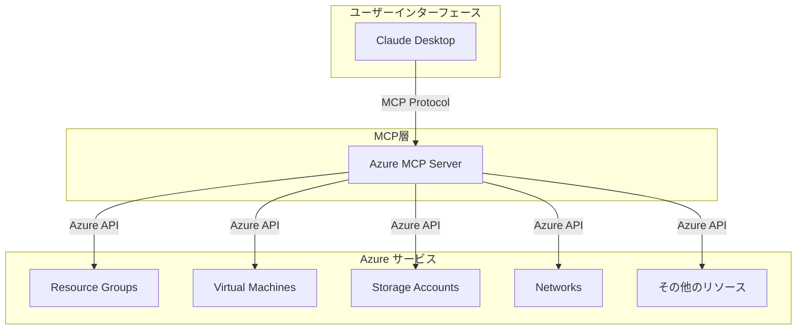

## はじめに

クラウドリソースの管理は、現代のIT環境において避けて通れない重要な業務です。特にMicrosoft Azureのような大規模なクラウドプラットフォームでは、数多くのサービスやリソースを効率的に管理することが求められます。

従来、Azureリソースの管理には以下のような方法が使われてきました：

- Azure Portal（Webブラウザベースの管理画面）
- Azure CLI（コマンドラインインターフェース）
- Azure PowerShell
- REST API
- Infrastructure as Code（ARM Templates、Terraform等）

これらの方法はそれぞれ強力ですが、**Azure MCP Server**は、AI支援による新しいアプローチでクラウドリソース管理の効率化を提案する概念的なツールです。

> **注意**: 本章で説明する機能の多くは、現在のAzure MCP Serverでは実装されていない将来的な可能性を示しています。実際の機能については、Microsoft Learn公式ドキュメントでご確認ください。

## Model Context Protocol（MCP）とは

Model Context Protocol（MCP）は、AIアシスタントと外部システムを連携させるための標準化されたプロトコルです。このプロトコルにより、AIアシスタントは安全かつ効率的に外部のデータソースやAPIにアクセスできるようになります。

### MCPの主な特徴

1. **標準化されたインターフェース**: 異なるシステム間での統一的な通信方法
2. **セキュアな接続**: 認証と認可の仕組みが組み込まれている
3. **拡張性**: 新しいサービスやツールを簡単に追加可能
4. **コンテキスト保持**: AIアシスタントが操作の文脈を理解し、適切な支援を提供

## Azure MCP Serverの概要

Azure MCP Serverは、MCPを使用してAzureリソースを管理するためのサーバー実装です。これにより、GitHub Copilot、OpenAI Agents SDK、Semantic KernelなどのMCP対応クライアントから直接Azureリソースを操作できるようになります。

**現在実際に利用可能な主要なクライアント**：
- GitHub Copilot agent mode（Visual Studio Code）
- OpenAI Agents SDK
- Semantic Kernel
- カスタム.NETまたはPythonクライアント

### 主要な機能



**現在実際に利用可能な機能**（2024年時点）：

1. **リソースグループ管理**
   - 一覧表示

2. **ストレージ管理**
   - Azure Storageアカウント、コンテナ、Blob、テーブルの一覧表示と基本操作

3. **データベース管理**
   - Azure Cosmos DB（アカウント、データベース、コンテナ、ドキュメント操作）
   - Azure Database for PostgreSQL（サーバー、データベース、テーブル管理）

4. **その他のサービス**
   - Azure AI Search（検索サービス、インデックス、クエリ）
   - Azure Monitor（ログとメトリクスのクエリ）
   - Azure Service Bus（メッセージングサービス）
   - Azure Key Vault（キー管理）
   - Azure App Configuration（設定管理）
   - Azure Data Explorer（クラスター、データベース、テーブル、クエリ）
   - Azure CLI Extension（CLIコマンド実行）

**本書で説明する機能のうち現在未実装のもの**：
- 仮想マシンの詳細管理
- ネットワークリソースの管理
- ARMテンプレート操作
- 高度なセキュリティ設定
- コスト管理機能

## 従来の方法との違い

### 1. Azure Portal vs Azure MCP Server

| 項目 | Azure Portal | Azure MCP Server |
|------|-------------|------------------|
| インターフェース | GUI（Web画面） | 自然言語による対話 |
| 学習コスト | 中～高（画面操作の習得） | 低（自然な会話で操作） |
| 自動化 | 限定的 | AI支援による高度な自動化 |
| 複雑な操作 | 複数画面の遷移が必要 | 一度の指示で完了可能 |

### 2. Azure CLI/PowerShell vs Azure MCP Server

| 項目 | Azure CLI/PowerShell | Azure MCP Server |
|------|---------------------|------------------|
| コマンド知識 | 必須（構文の暗記） | 不要（自然言語で指示） |
| エラー処理 | 手動でデバッグ | AIが自動的に対処法を提案 |
| スクリプト作成 | 手動でコーディング | AIが自動生成 |
| 学習曲線 | 急（専門知識が必要） | 緩やか（段階的に習得） |

### 3. Infrastructure as Code vs Azure MCP Server

| 項目 | IaC（Terraform等） | Azure MCP Server |
|------|-------------------|------------------|
| テンプレート作成 | 手動でコード記述 | AIが要件から自動生成 |
| 変更管理 | Gitなどで手動管理 | AI支援による変更提案 |
| トラブルシューティング | ログ解析が必要 | AIが問題を診断・解決 |
| 初期設定 | 複雑（ツールの設定） | シンプル（認証のみ） |

## ユースケースと活用シナリオ

Azure MCP Serverは、以下のようなシナリオで特に威力を発揮します：

### 1. 開発環境の迅速な構築

```
ユーザー: 「Node.js開発用の環境をAzureに構築して。Ubuntu VM、PostgreSQLデータベース、Redis キャッシュを含めて」

AIアシスタント: 了解しました。以下の構成で環境を構築します：
- Ubuntu 20.04 LTS VM (Standard_B2s)
- Azure Database for PostgreSQL
- Azure Cache for Redis
[実行中...]
```

### 2. 定期的なメンテナンス作業

```
ユーザー: 「開発環境のVMを毎日夜10時に停止、朝7時に起動するように設定して」

AIアシスタント: Azure Automationを使用して、指定されたスケジュールでVMの起動・停止を自動化します。
[設定中...]
```

### 3. コスト最適化

```
ユーザー: 「先月のAzure利用料金を分析して、コスト削減の提案をして」

AIアシスタント: 利用状況を分析しました。以下の最適化を提案します：
1. 未使用のディスクが3つ見つかりました（月額約¥5,000）
2. 過剰スペックのVMが2台あります（ダウンサイズで月額約¥15,000削減可能）
3. 古いスナップショットの削除で月額約¥3,000削減可能
```

### 4. トラブルシューティング

```
ユーザー: 「Webアプリケーションが遅い。原因を調査して」

AIアシスタント: Application Insightsのデータを分析中...
- データベースクエリの応答時間が通常の3倍です
- DTUが上限に達しています
- 推奨: データベースのスケールアップまたはクエリ最適化
```

### 5. セキュリティ監査

```
ユーザー: 「セキュリティの観点から、現在のリソース構成をチェックして」

AIアシスタント: セキュリティ評価を実行しました：
⚠️ 3つの問題を検出：
1. Storage AccountでHTTPSが無効
2. VMのNSGで不要なポートが開放
3. Key Vaultのアクセスポリシーが広すぎる
[修正方法を提案...]
```

## Azure MCP Serverのメリット

### 1. 生産性の向上
- 複雑な操作を自然言語で実行
- 繰り返し作業の自動化
- エラー処理の簡素化

### 2. 学習コストの削減
- Azure専門知識が不要
- 段階的な学習が可能
- AIによる操作支援

### 3. ミスの削減
- AIによる操作の妥当性チェック
- 危険な操作への警告
- ロールバックの提案

### 4. 継続的な改善
- 操作履歴からの学習
- ベストプラクティスの提案
- 新機能の自動適用

## まとめ

Azure MCP Serverは、AIの力を借りてAzureリソース管理を革新的に簡素化するツールです。自然言語による直感的な操作、高度な自動化、そしてAIによる継続的な支援により、クラウド管理の効率を大幅に向上させることができます。

次の章では、Azure MCP Serverの環境構築とセットアップ方法について詳しく説明します。実際にツールを使い始めるための具体的な手順を、ステップバイステップで解説していきます。