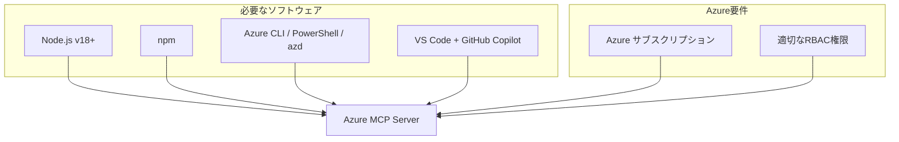

## はじめに

この章では、Azure MCP Serverを使用するための環境構築とセットアップ手順を詳しく説明します。必要な前提条件の確認から、実際にAzureリソースを操作できるようになるまでの全プロセスを、ステップバイステップで解説していきます。

## 前提条件の確認

Azure MCP Serverを使用するには、以下の要件を満たしている必要があります：

### 1. システム要件

**オペレーティングシステム**
- Windows 10/11（64ビット）
- macOS 12.0 以降
- Linux（Ubuntu 20.04 LTS以降推奨）

**ハードウェア要件**
- メモリ: 8GB以上（16GB推奨）
- ストレージ: 10GB以上の空き容量
- インターネット接続: 必須

### 2. 必要なソフトウェア



> **重要**: Azure MCP Serverは現在、Claude Desktopとの直接統合はサポートしていません。主要なクライアントはGitHub Copilot agent mode（VS Code）、カスタム.NET/Pythonクライアントです。

**必須ソフトウェアのバージョン確認**

```bash
# Node.jsのバージョン確認
node --version
# v18.0.0以上であることを確認

# npmのバージョン確認
npm --version
# 8.0.0以上であることを確認

# Azure CLIのバージョン確認
az --version
# 2.50.0以上であることを確認
```

### 3. Azureアカウントの準備

- 有効なAzureサブスクリプション
- 以下の最小限の権限を持つアカウント：
  - リソースグループの作成・管理権限
  - 仮想マシンの作成・管理権限
  - ストレージアカウントの作成・管理権限
  - ネットワークリソースの作成・管理権限

## Node.jsとnpmのインストール

### Windows環境

1. [Node.js公式サイト](https://nodejs.org/)から最新のLTS版をダウンロード
2. インストーラーを実行（npmも同時にインストールされます）
3. PowerShellまたはコマンドプロンプトで確認：

```powershell
# インストール確認
node --version
npm --version
```

### macOS環境

**Homebrewを使用する方法（推奨）**

```bash
# Homebrewがインストールされていない場合
/bin/bash -c "$(curl -fsSL https://raw.githubusercontent.com/Homebrew/install/HEAD/install.sh)"

# Node.jsのインストール
brew install node

# インストール確認
node --version
npm --version
```

### Linux環境（Ubuntu/Debian）

```bash
# NodeSourceリポジトリの追加
curl -fsSL https://deb.nodesource.com/setup_lts.x | sudo -E bash -

# Node.jsのインストール
sudo apt-get install -y nodejs

# インストール確認
node --version
npm --version
```

## Azure CLIのインストールと設定

### インストール手順

**Windows (PowerShell)**

```powershell
# MSIインストーラーを使用
Invoke-WebRequest -Uri https://aka.ms/installazurecliwindows -OutFile .\AzureCLI.msi
Start-Process msiexec.exe -Wait -ArgumentList '/I AzureCLI.msi /quiet'

# または、wingetを使用
winget install -e --id Microsoft.AzureCLI
```

**macOS**

```bash
# Homebrewを使用
brew update && brew install azure-cli
```

**Linux (Ubuntu/Debian)**

```bash
# Microsoftのリポジトリキーを追加
curl -sL https://aka.ms/InstallAzureCLIDeb | sudo bash
```

### Azure CLIの初期設定

```bash
# Azureにログイン
az login

# サブスクリプションの一覧表示
az account list --output table

# デフォルトサブスクリプションの設定
az account set --subscription "サブスクリプション名またはID"

# 現在の設定確認
az account show
```

## Azure MCP Serverのセットアップ

> **注意**: 以下のインストール方法は、実際のAzure MCP Serverの使用方法とは異なります。実際の手順については、Microsoft Learn公式ドキュメントをご参照ください。

### 実際のAzure MCP Server使用方法

Azure MCP Serverは独立したパッケージとしてインストールするのではなく、以下の方法で使用します：

#### GitHub Copilot agent mode（VS Code）での使用

1. **VS Codeでの設定ファイル作成**

```json
// .vscode/mcp.json
{
  "servers": {
    "Azure MCP Server": {
      "command": "npx",
      "args": [
        "-y",
        "@azure/mcp@latest",
        "server",
        "start"
      ]
    }
  }
}
```

2. **認証の設定**

```bash
# Azure CLIでログイン
az login

# または Azure PowerShell
Connect-AzAccount

# または Azure Developer CLI
azd auth login
```

#### カスタムクライアントでの使用

カスタム.NETまたはPythonクライアントから接続する場合は、MCP Serverを起動して接続します。詳細はMicrosoft Learnのドキュメントをご確認ください。

## Azure認証の設定

Azure MCP Serverは、DefaultAzureCredentialを使用してAzure Identity libraryによる認証を行います。

### 実際の認証方法

Azure MCP Serverは以下の認証方法をサポートしています：

#### ローカル開発環境での認証

```bash
# Azure CLIでログイン
az login

# または Azure PowerShell
Connect-AzAccount

# または Azure Developer CLI
azd auth login

# または Visual Studio経由
# (Visual Studioでサインイン済みの場合)
```

**認証の仕組み**：
- Azure MCP Serverは、DefaultAzureCredentialチェーンを使用
- 上記のいずれかの方法でログインしていれば、自動的に認証情報を取得
- ユーザーがアクセス可能なリソースのみ操作可能

> **注意**: 本書で説明するサービスプリンシパルやマネージドIDを使用した詳細な認証設定は、現在のAzure MCP Serverでは直接サポートされていません。

### 方法2: サービスプリンシパルを使用した認証（本番環境推奨）

#### サービスプリンシパルの作成

```bash
# サービスプリンシパルの作成
az ad sp create-for-rbac \
  --name "azure-mcp-server-sp" \
  --role Contributor \
  --scopes /subscriptions/{subscription-id}

# 出力例：
# {
#   "appId": "xxxxxxxx-xxxx-xxxx-xxxx-xxxxxxxxxxxx",
#   "displayName": "azure-mcp-server-sp",
#   "password": "xxxxxxxxxxxxxxxxxxxxxxxxxxxxxxxxxx",
#   "tenant": "xxxxxxxx-xxxx-xxxx-xxxx-xxxxxxxxxxxx"
# }
```

#### 環境変数の設定

**Windows (PowerShell)**

```powershell
# 環境変数の設定
$env:AZURE_CLIENT_ID = "appIdの値"
$env:AZURE_CLIENT_SECRET = "passwordの値"
$env:AZURE_TENANT_ID = "tenantの値"
$env:AZURE_SUBSCRIPTION_ID = "サブスクリプションID"

# 永続的に設定する場合
[Environment]::SetEnvironmentVariable("AZURE_CLIENT_ID", "appIdの値", "User")
[Environment]::SetEnvironmentVariable("AZURE_CLIENT_SECRET", "passwordの値", "User")
[Environment]::SetEnvironmentVariable("AZURE_TENANT_ID", "tenantの値", "User")
[Environment]::SetEnvironmentVariable("AZURE_SUBSCRIPTION_ID", "サブスクリプションID", "User")
```

**macOS/Linux**

```bash
# .bashrcまたは.zshrcに追加
export AZURE_CLIENT_ID="appIdの値"
export AZURE_CLIENT_SECRET="passwordの値"
export AZURE_TENANT_ID="tenantの値"
export AZURE_SUBSCRIPTION_ID="サブスクリプションID"

# 設定を反映
source ~/.bashrc  # または source ~/.zshrc
```

#### MCP Serverの設定

```bash
# サービスプリンシパル認証を使用
azure-mcp-server config set auth-method service-principal
```

### 方法3: マネージドIDを使用した認証（Azure VM上で実行する場合）

```bash
# Azure VM上でマネージドIDを有効化（Azure Portal or CLI）
az vm identity assign --resource-group myRG --name myVM

# MCP Serverの設定
azure-mcp-server config set auth-method managed-identity
```

## Claude Desktopとの連携設定

### 1. Claude Desktopのインストール

公式サイトから最新版をダウンロードしてインストール：
- Windows: [Claude Desktop for Windows](https://claude.ai/download/windows)
- macOS: [Claude Desktop for macOS](https://claude.ai/download/mac)
- Linux: [Claude Desktop for Linux](https://claude.ai/download/linux)

### 2. MCP設定ファイルの作成

Claude DesktopがAzure MCP Serverを認識できるように設定ファイルを作成します。

**設定ファイルの場所**
- Windows: `%APPDATA%\Claude\config.json`
- macOS: `~/Library/Application Support/Claude/config.json`
- Linux: `~/.config/claude/config.json`

**config.jsonの内容**

```json
{
  "mcpServers": {
    "azure": {
      "command": "azure-mcp-server",
      "args": ["start"],
      "env": {
        "AZURE_MCP_LOG_LEVEL": "info"
      }
    }
  }
}
```

### 3. 接続テスト

Claude Desktopを起動し、以下のコマンドで接続を確認：

```
# Claude Desktop内で実行
@azure status
```

正常に接続されている場合、以下のような応答が表示されます：

```
Azure MCP Server Status:
- Connected: ✓
- Authentication: ✓
- Subscription: Production (xxxxxxxx-xxxx-xxxx-xxxx-xxxxxxxxxxxx)
- Region: Japan East
```

## トラブルシューティング

### よくある問題と解決方法

#### 1. Node.jsのバージョンが古い

**症状**: `npm install`実行時にエラーが発生

**解決方法**:
```bash
# Node.jsを最新のLTS版にアップデート
# nvm（Node Version Manager）を使用している場合
nvm install --lts
nvm use --lts
```

#### 2. Azure認証エラー

**症状**: "Authentication failed"エラー

**解決方法**:
```bash
# Azure CLIの再ログイン
az logout
az login

# トークンのリフレッシュ
az account get-access-token --resource https://management.azure.com/
```

#### 3. 権限不足エラー

**症状**: "Insufficient permissions"エラー

**解決方法**:
```bash
# 現在のユーザーの権限確認
az role assignment list --assignee $(az account show --query user.name -o tsv)

# 必要な権限の付与（管理者に依頼）
az role assignment create \
  --assignee "ユーザーのオブジェクトID" \
  --role "Contributor" \
  --scope "/subscriptions/サブスクリプションID"
```

#### 4. Claude Desktopとの接続エラー

**症状**: Claude DesktopがMCP Serverを認識しない

**チェックリスト**:
1. config.jsonの構文エラーがないか確認
2. azure-mcp-serverコマンドがPATHに含まれているか確認
3. ファイアウォールの設定を確認
4. Claude Desktopを再起動

### ログの確認方法

```bash
# MCP Serverのログ確認
azure-mcp-server logs

# 詳細なデバッグログを有効化
export AZURE_MCP_LOG_LEVEL=debug
azure-mcp-server start

# ログファイルの場所
# Windows: %LOCALAPPDATA%\azure-mcp-server\logs
# macOS/Linux: ~/.azure-mcp-server/logs
```

## 動作確認

セットアップが完了したら、以下の手順で動作を確認します：

### 1. 基本的な動作確認

Claude Desktopで以下のコマンドを実行：

```
# リソースグループの一覧取得
@azure list resource groups

# 現在のサブスクリプション情報
@azure show subscription
```

### 2. 簡単なリソース作成テスト

```
# テスト用リソースグループの作成
@azure create resource group "test-mcp-rg" in "japaneast"

# 作成したリソースグループの確認
@azure show resource group "test-mcp-rg"

# テスト用リソースグループの削除
@azure delete resource group "test-mcp-rg"
```

## まとめ

この章では、Azure MCP Serverの環境構築とセットアップについて詳しく説明しました。主なポイントは以下の通りです：

1. **前提条件の確認**: Node.js、Azure CLI、適切な権限を持つAzureアカウントが必要
2. **認証設定**: 開発環境ではAzure CLI認証、本番環境ではサービスプリンシパル認証を推奨
3. **Claude Desktop連携**: 設定ファイルを作成してMCP Serverと接続
4. **動作確認**: 基本的なコマンドでセットアップの成功を確認

次の章では、Azure MCP Serverを使用した基本的なリソース操作について、実践的な例を交えながら解説していきます。