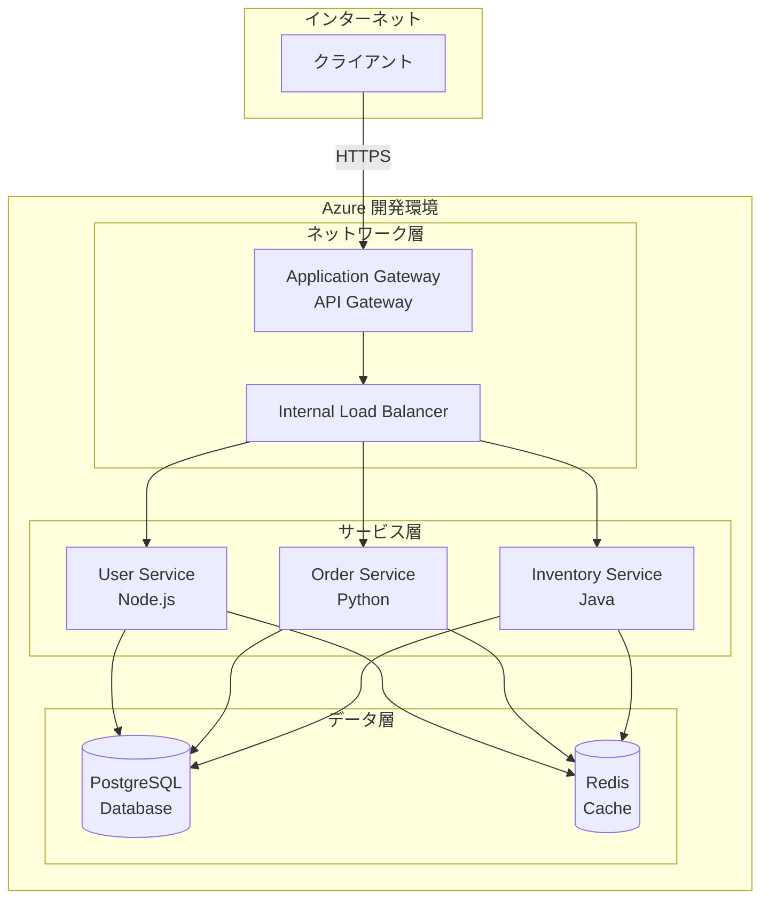

## はじめに

この章では、Azure MCP Serverを実際のプロジェクトで活用する具体的な例を紹介します。開発環境の自動構築、バックアップとリストアの自動化、モニタリングとアラート設定、CI/CDパイプラインとの統合など、実務で直面する様々なシナリオへの対応方法を詳しく解説します。

## 開発環境の自動構築

### マイクロサービス開発環境の構築

```
ユーザー: マイクロサービスアーキテクチャの開発環境を構築して。API Gateway、3つのマイクロサービス、Redis、PostgreSQLを含めて

AIアシスタント: マイクロサービスアーキテクチャの開発環境を構築します。構成を確認してから実行します。

構築予定の環境:
```



```
実行コマンド:
@azure create microservices-environment
  --name "dev-microservices"
  --resource-group "microservices-dev-rg"
  --location "japaneast"

実行中のタスク:
[==] ネットワーク構築中...
✓ Virtual Network作成 (10.2.0.0/16)
✓ サブネット作成:
  - Gateway Subnet (10.2.0.0/24)
  - Service Subnet (10.2.1.0/24)
  - Data Subnet (10.2.2.0/24)

[====] API Gateway設定中...
✓ Application Gateway作成
✓ バックエンドプール設定
✓ ルーティングルール設定:
  - /api/users/* → User Service
  - /api/orders/* → Order Service
  - /api/inventory/* → Inventory Service

[======] マイクロサービス展開中...
✓ User Service (Node.js 18):
  - VM: Standard_B2s
  - Port: 3001
  - 環境変数設定完了

✓ Order Service (Python 3.11):
  - VM: Standard_B2s
  - Port: 3002
  - 環境変数設定完了

✓ Inventory Service (Java 17):
  - VM: Standard_B2s
  - Port: 3003
  - 環境変数設定完了

[========] データストア構築中...
✓ PostgreSQL (バージョン 14):
  - サーバー名: dev-microservices-pg
  - SKU: B_Gen5_2
  - データベース作成:
    - users_db
    - orders_db
    - inventory_db

✓ Redis Cache:
  - 名前: dev-microservices-redis
  - SKU: Basic C1
  - 接続文字列生成完了

[==========] 最終設定中...
✓ NSGルール適用
✓ 監視設定
✓ ログ収集設定

構築完了！
アクセス情報:
- API Gateway URL: https://dev-microservices-gw.japaneast.cloudapp.azure.com
- PostgreSQL接続: dev-microservices-pg.postgres.database.azure.com
- Redis接続: dev-microservices-redis.redis.cache.windows.net:6380

開発者向けドキュメントを生成しますか？
```

### 開発チーム向けのアクセス設定

```
ユーザー: 開発チームメンバー5人にそれぞれ専用のVMとアクセス権限を設定して

AIアシスタント: 開発チームメンバー用の環境を設定します。

実行コマンド:
@azure setup developer-access
  --team-members "alice@example.com,bob@example.com,carol@example.com,david@example.com,eve@example.com"
  --resource-group "microservices-dev-rg"

設定内容:
1. 個人用VM作成
2. RBACロール割り当て
3. VPN/Bastionアクセス設定
4. 開発ツールプリインストール

実行中...

✓ 開発者VMを作成しました:
| 開発者 | VM名 | プライベートIP | 開発ツール |
|--------|------|----------------|-----------|
| Alice  | dev-alice-vm | 10.2.1.10 | VSCode, Node.js, Git |
| Bob    | dev-bob-vm   | 10.2.1.11 | VSCode, Python, Git |
| Carol  | dev-carol-vm | 10.2.1.12 | IntelliJ, Java, Git |
| David  | dev-david-vm | 10.2.1.13 | VSCode, Full Stack |
| Eve    | dev-eve-vm   | 10.2.1.14 | VSCode, Full Stack |

✓ アクセス権限を設定:
- 各自のVMへの管理者権限
- 共有リソースへの投稿者権限
- データベースへの読み取り専用権限

✓ Azure Bastion設定:
- Bastion Host: dev-bastion
- アクセスURL: https://portal.azure.com/#/bastionhost

各開発者に招待メールを送信しました。
```

### 自動スケーリング設定

```
ユーザー: マイクロサービスに負荷に応じた自動スケーリングを設定して

AIアシスタント: 各マイクロサービスに自動スケーリングを設定します。

実行コマンド:
@azure configure autoscaling
  --services "user-service,order-service,inventory-service"
  --min-instances 1
  --max-instances 5

スケーリングルール設定:

1. User Service:
   - CPU使用率 > 70%: スケールアウト
   - CPU使用率 < 30%: スケールイン
   - レスポンスタイム > 500ms: スケールアウト

2. Order Service:
   - CPU使用率 > 75%: スケールアウト
   - キュー長 > 100: スケールアウト
   - メモリ使用率 > 80%: スケールアウト

3. Inventory Service:
   - CPU使用率 > 70%: スケールアウト
   - 同時接続数 > 200: スケールアウト
   - DB接続プール使用率 > 80%: スケールアウト

✓ VM Scale Set作成完了
✓ Load Balancer設定更新
✓ Health Probe設定:
  - HTTP GET /health
  - 間隔: 5秒
  - 失敗しきい値: 3回

✓ 自動スケーリング有効化
現在のインスタンス数:
- User Service: 1/5
- Order Service: 1/5
- Inventory Service: 1/5
```

## バックアップとリストアの自動化

### 包括的なバックアップ戦略

```
ユーザー: すべての重要なリソースに対して自動バックアップを設定して

AIアシスタント: 包括的なバックアップ戦略を実装します。

実行コマンド:
@azure implement backup-strategy
  --scope "all-critical-resources"
  --retention "7-daily,4-weekly,12-monthly"

バックアップ対象の識別:
- 仮想マシン: 15台
- データベース: 3個
- ストレージアカウント: 5個
- Key Vault: 2個

バックアップポリシー:

1. 仮想マシンバックアップ
   ✓ Recovery Services Vault作成
   ✓ バックアップポリシー:
     - 日次: 23:00 JST（7日間保持）
     - 週次: 日曜日（4週間保持）
     - 月次: 第1日曜日（12ヶ月保持）

2. PostgreSQLバックアップ
   ✓ 自動バックアップ有効化
   ✓ ポイントインタイムリストア: 35日間
   ✓ 地理冗長バックアップ: 有効
   ✓ 長期保持:
     - 週次: 4週間
     - 月次: 12ヶ月
     - 年次: 3年

3. Blobストレージバックアップ
   ✓ ソフト削除: 30日間
   ✓ バージョニング: 有効
   ✓ 変更フィード: 有効
   ✓ セカンダリリージョンへのレプリケーション

4. Key Vaultバックアップ
   ✓ 自動バックアップスクリプト設定
   ✓ 暗号化されたバックアップ保存
   ✓ 日次実行（02:00 JST）

推定月額コスト: ¥8,500
初回フルバックアップ実行中...
```

### 災害復旧（DR）テスト

```
ユーザー: 災害復旧のテストを実施して、復旧時間を測定して

AIアシスタント: 災害復旧テストを開始します。本番環境には影響しません。

実行コマンド:
@azure test disaster-recovery
  --scenario "region-failure"
  --target-region "japanwest"

DRテストシナリオ:
1. 東日本リージョンの完全障害を想定
2. 西日本リージョンへのフェイルオーバー
3. RPO/RTO測定

テスト実行:

[Phase 1: 準備]
✓ テスト環境の分離
✓ 現在の状態のスナップショット
✓ DR環境の事前チェック

[Phase 2: 障害シミュレーション]
⚠️ 東日本リージョンを「利用不可」に設定
開始時刻: 14:30:00

[Phase 3: 自動フェイルオーバー]
14:30:15 - Traffic Manager検知
14:30:30 - DNSレコード更新開始
14:31:00 - VMフェイルオーバー開始
14:33:45 - データベースフェイルオーバー完了
14:35:20 - アプリケーション起動確認
14:36:00 - 全サービス復旧

[Phase 4: データ整合性チェック]
✓ トランザクションログ確認
✓ 最後のコミット: 14:29:58
✓ データロス: 2秒分（3トランザクション）

テスト結果:
- RTO（復旧時間目標）: 6分00秒 ✓（目標: 15分以内）
- RPO（復旧時点目標）: 2秒 ✓（目標: 5分以内）
- データ整合性: 99.98% ✓

フェイルバックを実行しますか？
```

### 選択的リストア

```
ユーザー: 昨日の午後2時時点のOrder Serviceのデータベースだけをリストアして

AIアシスタント: Order Serviceデータベースの選択的リストアを実行します。

実行コマンド:
@azure restore database
  --database "orders_db"
  --timestamp "2024-01-14T14:00:00Z"
  --restore-type "point-in-time"

リストア準備:
- ソースDB: orders_db
- リストアポイント: 2024-01-14 14:00:00 JST
- 利用可能なバックアップ: ✓

リストアオプション:
1. 新しいデータベースとしてリストア（推奨）
2. 既存データベースを上書き
3. 特定のテーブルのみリストア

選択: 1（新しいデータベースとしてリストア）

実行中...
✓ バックアップ検証完了
✓ リストア開始
✓ データベース作成: orders_db_restored_20240114
✓ データリストア中... (推定時間: 8分)

[======    ] 60% - テーブル: order_items

リストア完了！
- 新しいDB名: orders_db_restored_20240114
- リストアされたレコード数: 45,231
- リストア時間: 7分42秒
- 整合性チェック: パス

接続文字列:
postgresql://username@dev-microservices-pg:password@dev-microservices-pg.postgres.database.azure.com/orders_db_restored_20240114

データ検証を実行しますか？
```

## モニタリングとアラート設定

### 統合監視ダッシュボード

```
ユーザー: すべてのマイクロサービスを一元的に監視できるダッシュボードを作成して

AIアシスタント: 統合監視ダッシュボードを作成します。

実行コマンド:
@azure create monitoring-dashboard
  --name "microservices-dashboard"
  --include-services "all"

ダッシュボード構成:

1. サービスヘルス概要
   ✓ 各サービスの稼働状態
   ✓ レスポンスタイム（P50/P95/P99）
   ✓ エラー率
   ✓ スループット（req/sec）

2. インフラストラクチャメトリクス
   ✓ CPU/メモリ使用率
   ✓ ディスクI/O
   ✓ ネットワークトラフィック
   ✓ スケーリング状態

3. アプリケーションメトリクス
   ✓ APIエンドポイント別レスポンスタイム
   ✓ ビジネストランザクション
   ✓ キュー長
   ✓ 外部依存関係の状態

4. データストアメトリクス
   ✓ PostgreSQL: 接続数、クエリ性能
   ✓ Redis: ヒット率、メモリ使用量
   ✓ ストレージ: IOPS、遅延

ダッシュボード作成完了！
アクセスURL: https://portal.azure.com/#/dashboard/microservices-dashboard

リアルタイムアラート設定:
- Slack通知: #dev-alerts チャンネル
- Email通知: devops@example.com
- PagerDuty統合: 重大度High以上
```

### カスタムアラートルール

```
ユーザー: ビジネスロジックに基づいたカスタムアラートを設定して

AIアシスタント: ビジネスロジックベースのカスタムアラートを設定します。

実行コマンド:
@azure create custom-alerts
  --business-rules "order-processing,inventory-threshold,user-experience"

設定されたアラートルール:

1. 注文処理の異常検知
   - 条件: 5分間の注文完了率 < 95%
   - アクション: 
     * Order Service自動スケールアウト
     * 開発チームへの即時通知
     * 詳細ログの自動収集

2. 在庫しきい値アラート
   - 条件: 特定商品の在庫 < 再発注点
   - アクション:
     * 購買部門への自動通知
     * 発注推奨レポート生成
     * 関連サプライヤーへのAPI通知

3. ユーザーエクスペリエンス劣化
   - 条件: 
     * ページロード時間 > 3秒（5分間平均）
     * エラーページ表示率 > 1%
   - アクション:
     * CDNキャッシュの自動パージ
     * 静的リソースの最適化
     * パフォーマンストレース自動実行

4. 異常トラフィック検知
   - 条件: MLベースの異常検知
   - アクション:
     * WAFルールの自動調整
     * 疑わしいIPの一時ブロック
     * セキュリティチームへのアラート

✓ アラートルール有効化
✓ 自動修復アクション設定
✓ エスカレーションパス定義
```

### ログ分析と可視化

```
ユーザー: 過去24時間のエラーログを分析して、根本原因を特定して

AIアシスタント: エラーログを分析して根本原因を調査します。

実行コマンド:
@azure analyze logs
  --time-range "24h"
  --log-type "errors"
  --find-root-cause

ログ分析結果:

エラー統計（過去24時間）:
- 総エラー数: 342
- 影響を受けたユーザー: 89
- エラー率: 0.12%

エラー分類:
1. データベース接続エラー (45%)
   - 発生時間帯: 03:00-03:30, 15:00-15:15
   - 影響サービス: Order Service
   
2. API タイムアウト (30%)
   - 外部決済API応答遅延
   - 平均遅延: 8.5秒
   
3. 認証エラー (15%)
   - トークン有効期限切れ
   - 主に長時間セッション
   
4. その他 (10%)

根本原因分析:

🔍 主要因: データベース接続プールの枯渇
- 最大接続数: 100
- ピーク時使用: 98-100
- 待機中のクエリ: 最大45

📊 相関分析:
- バッチ処理実行時刻と一致
- 長時間実行クエリの存在
- インデックス不足による全表スキャン

推奨対策:
1. 即時対応:
   - 接続プール上限を150に増加
   - 長時間クエリの強制終了
   
2. 短期対策:
   - slow_queryのインデックス追加
   - バッチ処理の時間分散
   
3. 長期対策:
   - 読み取り専用レプリカの追加
   - クエリ最適化

これらの対策を実施しますか？
```

## CI/CDパイプラインとの統合

### Azure DevOpsとの連携

```
ユーザー: マイクロサービスのCI/CDパイプラインをAzure DevOpsで構築して

AIアシスタント: Azure DevOpsでCI/CDパイプラインを構築します。

実行コマンド:
@azure setup devops-pipeline
  --organization "example-corp"
  --project "microservices"
  --services "user-service,order-service,inventory-service"

パイプライン構成:

1. ソースコード管理
   ✓ Git リポジトリ作成（各サービス）
   ✓ ブランチ戦略: GitFlow
   ✓ ブランチ保護ルール設定

2. ビルドパイプライン（各サービス共通）
   ```yaml
   trigger:
     branches:
       include: ['main', 'develop', 'feature/*']
   
   stages:
   - stage: Build
     jobs:
     - job: BuildAndTest
       steps:
       - task: Docker@2
         inputs:
           command: 'build'
           Dockerfile: '**/Dockerfile'
       - task: Docker@2
         inputs:
           command: 'push'
           containerRegistry: 'azureContainerRegistry'
   ```

3. リリースパイプライン
   ✓ 環境: Dev → Test → Staging → Prod
   ✓ 承認ゲート:
     - Test: 自動承認
     - Staging: QAチーム承認
     - Prod: 運用チーム承認

4. 品質ゲート
   ✓ 単体テストカバレッジ: 80%以上
   ✓ 統合テスト: 全パス
   ✓ セキュリティスキャン: 高リスクなし
   ✓ パフォーマンステスト: SLA準拠

パイプライン作成完了！
初回実行を開始しますか？
```

### GitHub Actionsとの連携

```
ユーザー: GitHub Actionsを使ってAzureへの自動デプロイを設定して

AIアシスタント: GitHub ActionsでAzureデプロイを設定します。

実行コマンド:
@azure create github-actions-workflow
  --repo "example-corp/microservices"
  --environments "dev,staging,prod"

ワークフロー設定:

1. シークレット設定
   ✓ AZURE_CREDENTIALS
   ✓ REGISTRY_LOGIN_SERVER
   ✓ REGISTRY_USERNAME
   ✓ REGISTRY_PASSWORD

2. ワークフローファイル作成
   `.github/workflows/deploy-azure.yml`:
```

```yaml
name: Deploy to Azure

on:
  push:
    branches: [main, develop]
  pull_request:
    branches: [main]

env:
  AZURE_RESOURCE_GROUP: microservices-${{ github.event.inputs.environment }}-rg

jobs:
  build-and-deploy:
    runs-on: ubuntu-latest
    steps:
    - uses: actions/checkout@v3
    
    - name: Azure Login
      uses: azure/login@v1
      with:
        creds: ${{ secrets.AZURE_CREDENTIALS }}
    
    - name: Build and push Docker images
      run: |
        docker build -t ${{ secrets.REGISTRY_LOGIN_SERVER }}/user-service:${{ github.sha }} ./user-service
        docker push ${{ secrets.REGISTRY_LOGIN_SERVER }}/user-service:${{ github.sha }}
    
    - name: Deploy to Azure Container Instances
      uses: azure/aci-deploy@v1
      with:
        resource-group: ${{ env.AZURE_RESOURCE_GROUP }}
        dns-name-label: microservices-${{ github.event.inputs.environment }}
        image: ${{ secrets.REGISTRY_LOGIN_SERVER }}/user-service:${{ github.sha }}
        registry-login-server: ${{ secrets.REGISTRY_LOGIN_SERVER }}
        registry-username: ${{ secrets.REGISTRY_USERNAME }}
        registry-password: ${{ secrets.REGISTRY_PASSWORD }}
        location: 'japaneast'
    
    - name: Run smoke tests
      run: |
        curl -f https://microservices-${{ github.event.inputs.environment }}.japaneast.azurecontainer.io/health
```

```
3. 環境別設定
   ✓ Development: 自動デプロイ
   ✓ Staging: PR承認後デプロイ
   ✓ Production: 手動承認必須

✓ ワークフロー作成完了
✓ 初回テスト実行成功
✓ Webhook設定完了
```

### インフラストラクチャのコード化

```
ユーザー: 現在の環境をTerraformコードとして出力して、バージョン管理できるようにして

AIアシスタント: 現在のAzure環境をTerraformコードに変換します。

実行コマンド:
@azure export-to-terraform
  --resource-group "microservices-dev-rg"
  --output-dir "./infrastructure"

Terraformコード生成:

📁 infrastructure/
├── main.tf
├── variables.tf
├── outputs.tf
├── modules/
│   ├── networking/
│   │   ├── main.tf
│   │   ├── variables.tf
│   │   └── outputs.tf
│   ├── compute/
│   │   ├── main.tf
│   │   ├── variables.tf
│   │   └── outputs.tf
│   └── data/
│       ├── main.tf
│       ├── variables.tf
│       └── outputs.tf
└── environments/
    ├── dev.tfvars
    ├── staging.tfvars
    └── prod.tfvars

生成されたコード例（main.tf）:
```

```hcl
terraform {
  required_providers {
    azurerm = {
      source  = "hashicorp/azurerm"
      version = "~> 3.0"
    }
  }
  
  backend "azurerm" {
    resource_group_name  = "terraform-state-rg"
    storage_account_name = "tfstatestore"
    container_name       = "tfstate"
    key                  = "microservices.tfstate"
  }
}

provider "azurerm" {
  features {}
}

module "networking" {
  source = "./modules/networking"
  
  resource_group_name = var.resource_group_name
  location           = var.location
  vnet_cidr          = var.vnet_cidr
  subnets            = var.subnets
}

module "compute" {
  source = "./modules/compute"
  
  resource_group_name = var.resource_group_name
  location           = var.location
  subnet_id          = module.networking.app_subnet_id
  vm_configs         = var.vm_configs
}

module "data" {
  source = "./modules/data"
  
  resource_group_name = var.resource_group_name
  location           = var.location
  subnet_id          = module.networking.data_subnet_id
}
```

```
✓ Terraformコード生成完了
✓ 状態ファイル初期化
✓ terraform planで差分なし確認
✓ GitHubリポジトリ作成
✓ 初回コミット完了

Terraform Cloud連携も設定しますか？
```

## セキュリティとコンプライアンス

### セキュリティベースライン実装

```
ユーザー: Azureセキュリティベストプラクティスに基づいて環境を強化して

AIアシスタント: Azureセキュリティベースラインを実装します。

実行コマンド:
@azure implement security-baseline
  --standard "CIS-Azure-1.4.0"
  --scope "subscription"

セキュリティ評価と実装:

1. Identity and Access Management
   ✓ MFA強制: 全管理者アカウント
   ✓ 特権アクセス管理（PIM）有効化
   ✓ 条件付きアクセスポリシー設定
   ⚠️ サービスアカウントの定期ローテーション未実装

2. Network Security
   ✓ NSGフロー ログ有効化
   ✓ DDoS Protection Standard有効化
   ✓ プライベートエンドポイント実装
   ✓ Azure Firewall設定

3. Data Protection
   ✓ 保存データの暗号化（AES-256）
   ✓ 転送中データのTLS 1.2強制
   ✓ Key Vaultでの機密情報管理
   ✓ データ分類とラベリング

4. Logging and Monitoring
   ✓ Azure Security Center有効化
   ✓ 診断ログの一元管理
   ✓ 脅威検出アラート設定
   ✓ 監査ログの長期保管（365日）

5. Incident Response
   ✓ 自動インシデント対応プレイブック
   ✓ フォレンジック用スナップショット
   ✓ インシデント対応チーム通知

セキュリティスコア:
変更前: 65/100
変更後: 92/100 ✓

コンプライアンスレポートを生成しますか？
```

## まとめ

この章では、Azure MCP Serverの実践的な活用例を紹介しました：

1. **開発環境の自動構築**: マイクロサービス環境の迅速な立ち上げ
2. **バックアップとリストア**: 包括的なデータ保護と災害復旧
3. **モニタリング**: 統合監視とインテリジェントなアラート
4. **CI/CD統合**: 自動化されたデプロイメントパイプライン
5. **セキュリティ**: ベストプラクティスに基づく環境強化

これらの実例を参考に、自社の要件に合わせてAzure MCP Serverを活用することで、クラウド運用の効率化と自動化を実現できます。次の章では、トラブルシューティングについて解説します。