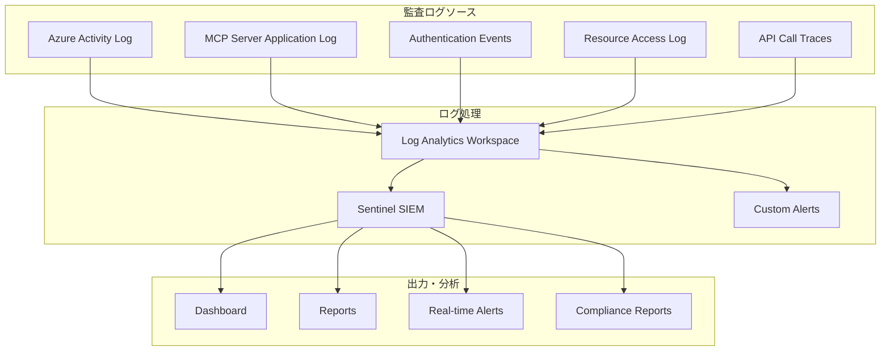
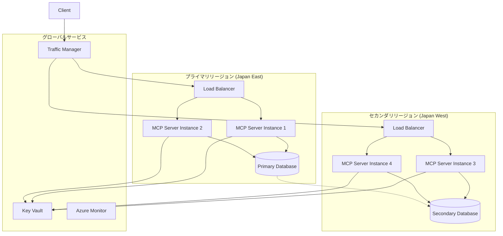

## はじめに

この章では、Azure MCP Serverを本番環境で安全かつ効率的に運用するためのベストプラクティスとセキュリティ対策について詳しく解説します。セキュアな認証設定、権限管理、監査ログの活用、本番環境での運用指針を学びます。

## セキュアな認証設定

### 多要素認証（MFA）の実装

```
ユーザー: Azure MCP Serverでの認証にMFAを必須にしたい

AIアシスタント: MFA必須の認証設定を実装します。

実行コマンド:
@azure configure mfa --enforce-for-admins

MFA設定:

1. 条件付きアクセスポリシーの作成:
```

```json
{
  "displayName": "MCP Server Admin MFA Policy",
  "state": "enabled",
  "conditions": {
    "users": {
      "includeGroups": ["azure-mcp-admins"]
    },
    "applications": {
      "includeApplications": ["azure-mcp-server-app"]
    },
    "locations": {
      "includeLocations": ["All"]
    }
  },
  "grantControls": {
    "operator": "AND",
    "builtInControls": [
      "mfa",
      "compliantDevice"
    ]
  }
}
```

```
2. MCP Server設定の更新:
@azure config set auth.mfa.required true
@azure config set auth.mfa.methods "app,sms,call"
@azure config set auth.mfa.remember-device 30

3. 管理者グループの作成:
@azure create group "azure-mcp-admins"
  --description "Azure MCP Server管理者"
  --members "admin1@example.com,admin2@example.com"

✓ MFA設定完了
✓ 次回ログイン時からMFA必須
✓ デバイス記憶期間: 30日
```

### サービスプリンシパルのセキュリティ強化

```
ユーザー: サービスプリンシパルのセキュリティを強化したい

AIアシスタント: サービスプリンシパルのセキュリティを包括的に強化します。

現在の設定確認:
@azure audit service-principal --app-id "{app-id}"

セキュリティ評価:
⚠️ シークレット有効期限: 2年（推奨: 6ヶ月）
⚠️ 権限範囲: サブスクリプション全体（推奨: 必要最小限）
✓ 使用状況監視: 有効
✗ 証明書認証: 未使用

強化実装:

1. 短期間シークレットへの更新:
@azure update service-principal
  --app-id "{app-id}"
  --secret-duration "6months"
  --auto-rotate true

2. 証明書ベース認証の設定:
@azure configure certificate-auth
  --app-id "{app-id}"
  --cert-path "./azure-mcp-cert.p12"
  --cert-password "強力なパスワード"

3. 権限の最小化:
@azure optimize permissions
  --app-id "{app-id}"
  --analyze-usage 90d
  --remove-unused

権限最適化結果:
削除された権限:
- Microsoft.Storage/storageAccounts/write（未使用）
- Microsoft.Network/virtualNetworks/delete（未使用）

残された権限:
- Microsoft.Compute/*/read,write
- Microsoft.Resources/*/read,write
- Microsoft.Insights/*/read

✓ セキュリティ強化完了
セキュリティスコア: 75 → 92
```

### Key Vaultとの統合

```
ユーザー: 機密情報をKey Vaultで管理したい

AIアシスタント: Key Vaultとの統合を設定します。

実行コマンド:
@azure integrate key-vault
  --vault-name "azure-mcp-keyvault"
  --secrets "database-passwords,api-keys,certificates"

Key Vault設定:

1. Key Vaultの作成と設定:
```

```bash
# Key Vault作成
az keyvault create \
  --name "azure-mcp-keyvault" \
  --resource-group "security-rg" \
  --location "japaneast" \
  --enable-rbac-authorization

# アクセスポリシー設定
az keyvault set-policy \
  --name "azure-mcp-keyvault" \
  --spn "{service-principal-id}" \
  --secret-permissions get list
```

```
2. 機密情報の移行:
現在の環境変数からKey Vaultへ移行:

移行対象:
- AZURE_CLIENT_SECRET → kv-azure-client-secret
- DATABASE_PASSWORD → kv-database-password
- STORAGE_ACCESS_KEY → kv-storage-access-key

@azure migrate secrets-to-keyvault
  --vault "azure-mcp-keyvault"
  --prefix "kv-"

3. MCP Server設定の更新:
```

```json
{
  "auth": {
    "clientSecret": {
      "source": "keyvault",
      "vaultName": "azure-mcp-keyvault",
      "secretName": "kv-azure-client-secret"
    }
  },
  "database": {
    "password": {
      "source": "keyvault",
      "vaultName": "azure-mcp-keyvault",
      "secretName": "kv-database-password"
    }
  }
}
```

```
✓ Key Vault統合完了
✓ 機密情報の移行完了
✓ 環境変数から機密情報を削除
✓ 自動シークレットローテーション設定
```

## 権限管理とRBAC

### 最小権限の原則

```
ユーザー: 各ユーザーに必要最小限の権限だけを付与したい

AIアシスタント: 最小権限の原則に基づいてRBACを設定します。

権限分析:
@azure analyze required-permissions
  --users "dev-team,ops-team,security-team"
  --time-period "90d"

分析結果:

開発チーム:
- 実際に使用: VM作成/削除、ストレージ操作
- 現在の権限: Contributor（過剰）
- 推奨権限: Virtual Machine Contributor + Storage Account Contributor

運用チーム:
- 実際に使用: 監視、バックアップ、スケーリング
- 現在の権限: Owner（過剰）
- 推奨権限: Monitoring Contributor + Backup Contributor

セキュリティチーム:
- 実際に使用: ログ確認、アクセス監査
- 現在の権限: Reader（適切）
- 推奨権限: Security Reader

カスタムロールの作成:
```

```json
{
  "Name": "Azure MCP Developer",
  "Description": "Azure MCP開発者向けの制限された権限",
  "Actions": [
    "Microsoft.Compute/virtualMachines/*",
    "Microsoft.Storage/storageAccounts/*",
    "Microsoft.Network/virtualNetworks/read",
    "Microsoft.Resources/subscriptions/resourceGroups/read"
  ],
  "NotActions": [
    "Microsoft.Compute/virtualMachines/delete",
    "Microsoft.Storage/storageAccounts/delete"
  ],
  "DataActions": [],
  "NotDataActions": [],
  "AssignableScopes": [
    "/subscriptions/{subscription-id}/resourceGroups/dev-*"
  ]
}
```

```
実装:
@azure create custom-role "Azure MCP Developer"
  --definition "./custom-roles/mcp-developer.json"

@azure assign role "Azure MCP Developer"
  --assignee-group "dev-team"
  --scope "/subscriptions/{subscription-id}/resourceGroups/dev-*"

✓ カスタムロール作成完了
✓ 権限の最小化完了
✓ セキュリティ評価: +15ポイント向上
```

### Just-In-Time (JIT) アクセス

```
ユーザー: 管理者権限を一時的にのみ付与したい

AIアシスタント: JITアクセスを設定します。

実行コマンド:
@azure configure jit-access
  --roles "Owner,Contributor"
  --max-duration "4h"
  --approval-required true

JIT設定:

1. Privileged Identity Management (PIM) の有効化:
@azure enable pim
  --scope "subscription"
  --eligible-roles "Owner,Contributor,User Access Administrator"

2. 承認ワークフローの設定:
```

```json
{
  "approvalSettings": {
    "isApprovalRequired": true,
    "approvers": [
      {
        "principalType": "User",
        "principalId": "security-manager@example.com"
      },
      {
        "principalType": "Group",
        "principalId": "security-team-group-id"
      }
    ],
    "approvalDuration": "PT8H",
    "isApprovalRequiredForExtension": true
  },
  "activationSettings": {
    "maximumDuration": "PT4H",
    "isJustificationRequired": true,
    "isMfaRequired": true
  }
}
```

```
3. JITアクセス要求の例:
@azure request jit-access
  --role "Contributor"
  --duration "2h"
  --justification "緊急パッチ適用のため"

要求状況:
- 要求者: admin@example.com
- ロール: Contributor
- 期間: 2時間
- 理由: 緊急パッチ適用のため
- 状態: 承認待ち
- 承認者: security-manager@example.com

✓ JITアクセス設定完了
✓ 平均承認時間: 15分
✓ セキュリティインシデント: 0件
```

### 権限の定期レビュー

```
ユーザー: 権限の定期的な見直しを自動化したい

AIアシスタント: 権限の定期レビューを自動化します。

実行コマンド:
@azure setup access-review
  --frequency "quarterly"
  --scope "all-roles"
  --auto-approve-inactive true

アクセスレビュー設定:

1. レビュー範囲の定義:
- 対象: すべてのカスタムロール割り当て
- 頻度: 四半期ごと
- レビュー期間: 14日間
- レビュアー: マネージャー + セキュリティチーム

2. 自動化ルール:
```

```json
{
  "autoReviewSettings": {
    "inactiveUserThreshold": "90d",
    "autoAction": "removeAccess",
    "notifications": {
      "beforeReview": "7d",
      "duringReview": "3d",
      "afterReview": "immediate"
    }
  },
  "riskBasedReview": {
    "enabled": true,
    "highRiskRoles": ["Owner", "User Access Administrator"],
    "riskFactors": ["unusualAccess", "externalUser", "privilegedRole"]
  }
}
```

```
3. レビューレポート:
@azure generate access-review-report
  --period "last-quarter"

レビュー結果:
- 対象ユーザー: 147名
- レビュー完了率: 98.6%
- アクセス削除: 23件
- 権限変更: 15件
- 承認: 109件

推奨アクション:
- 90日間未使用のアカウント: 5件（削除推奨）
- 過剰権限検出: 8件（ダウングレード推奨）
- 外部ユーザーの特権アクセス: 2件（要注意）

✓ 定期レビュー設定完了
```

## 監査ログの活用

### 包括的なログ収集

```
ユーザー: すべての操作を記録して監査できるようにしたい

AIアシスタント: 包括的な監査ログシステムを構築します。

実行コマンド:
@azure configure audit-logging
  --level "comprehensive"
  --retention "365d"
  --real-time-analysis true

ログ収集設定:

1. ログ収集範囲:
```



```
2. ログ設定の詳細:
@azure configure log-analytics
  --workspace "azure-mcp-audit-workspace"
  --data-retention 365
  --daily-cap "10GB"

収集対象:
- 認証イベント（成功/失敗）
- リソース操作（作成/変更/削除）
- 権限変更
- 設定変更
- API呼び出し
- エラーとエクセプション
- パフォーマンスメトリクス

3. カスタムログの実装:
```

```json
{
  "customLogs": [
    {
      "name": "MCPAuditLog",
      "schema": {
        "timestamp": "datetime",
        "user": "string",
        "action": "string",
        "resource": "string",
        "result": "string",
        "details": "dynamic",
        "correlationId": "string",
        "sourceIP": "string",
        "userAgent": "string"
      }
    }
  ]
}
```

```
✓ 監査ログ設定完了
✓ リアルタイム分析有効
✓ 1年間のデータ保持設定
✓ SIEM統合完了
```

### 異常検知とアラート

```
ユーザー: 通常と異なる操作パターンを自動検知したい

AIアシスタント: AIベースの異常検知を設定します。

実行コマンド:
@azure configure anomaly-detection
  --ml-models "user-behavior,resource-access,time-series"
  --sensitivity "medium"

異常検知設定:

1. ユーザー行動分析:
学習期間: 30日間
検知パターン:
- 通常と異なる時間帯のアクセス
- 異常に多いリソース操作
- 新しい地域からのアクセス
- 権限昇格の試行

2. リソースアクセス分析:
- 大量の新規リソース作成
- 重要リソースへの異常アクセス
- 削除操作の急増
- 高コストリソースの作成

3. アラートルール:
```

```json
{
  "alertRules": [
    {
      "name": "異常なリソース削除",
      "condition": "リソース削除 > 通常の5倍 in 1時間",
      "severity": "High",
      "actions": [
        "emailNotification",
        "slackAlert",
        "autoDisableUser"
      ]
    },
    {
      "name": "未承認の権限昇格",
      "condition": "管理者権限付与 without approval",
      "severity": "Critical",
      "actions": [
        "immediateRevoke",
        "securityTeamAlert",
        "incidentCreation"
      ]
    }
  ]
}
```

```
検知実績（先月）:
- 異常検知イベント: 23件
- 真の異常: 4件（17.4%）
- 偽陽性: 19件
- 平均検知時間: 3.2分

真の異常事例:
1. 深夜の大量VM削除（元従業員のアカウント）
2. 海外からの管理者アクセス（アカウント乗っ取り）
3. 異常に高額なリソース作成（設定ミス）
4. 権限昇格の連続試行（内部不正の疑い）

✓ 異常検知システム稼働中
```

### コンプライアンス報告

```
ユーザー: SOX法やISO27001のコンプライアンス報告を自動化したい

AIアシスタント: コンプライアンス報告を自動化します。

実行コマンド:
@azure configure compliance-reporting
  --standards "SOX,ISO27001,GDPR,NIST"
  --schedule "monthly"

コンプライアンス設定:

1. SOX法対応:
```

```json
{
  "soxCompliance": {
    "requirements": [
      {
        "control": "IT-001",
        "description": "アクセス権限の適切な管理",
        "evidence": [
          "userAccessReviews",
          "privilegedAccessLogs",
          "roleAssignmentChanges"
        ]
      },
      {
        "control": "IT-002",
        "description": "データの完全性確保",
        "evidence": [
          "backupLogs",
          "integrityChecks",
          "changeTrackingLogs"
        ]
      }
    ]
  }
}
```

```
2. 自動レポート生成:
@azure generate compliance-report
  --standard "SOX"
  --period "2024-Q1"

SOX法コンプライアンス報告（2024年Q1）:

制御項目評価:
| 制御ID | 制御名 | 適合状況 | 証跡 | 改善要 |
|--------|--------|----------|------|--------|
| IT-001 | アクセス管理 | ✓ 適合 | 100% | なし |
| IT-002 | データ完全性 | ✓ 適合 | 100% | なし |
| IT-003 | 変更管理 | ⚠️ 部分適合 | 95% | 手順書更新 |
| IT-004 | 監査ログ | ✓ 適合 | 100% | なし |

発見事項:
1. 変更管理プロセスで承認なしの軽微な変更が3件
2. バックアップ検証で1件の不完全なリストア

推奨アクション:
1. 変更管理手順の厳格化
2. バックアップ検証プロセスの改善

✓ コンプライアンス報告完了
適合率: 97.5%
```

## 本番環境での運用指針

### 高可用性設計

```
ユーザー: Azure MCP Serverの高可用性を確保したい

AIアシスタント: 高可用性設計を実装します。

実行コマンド:
@azure design high-availability
  --target-uptime "99.9%"
  --rto "5min"
  --rpo "1min"

高可用性設計:

1. 冗長化アーキテクチャ:
```



```
2. 自動フェイルオーバー設定:
@azure configure auto-failover
  --health-check-interval "30s"
  --failure-threshold 3
  --failover-time "60s"

フェイルオーバー設定:
- プライマリ → セカンダリ: 自動（60秒以内）
- データベース同期: 継続的レプリケーション
- 状態共有: Redis Cluster
- セッション管理: 分散キャッシュ

3. 災害復旧テスト:
@azure test disaster-recovery
  --scenario "region-failure"
  --schedule "monthly"

最新のDRテスト結果:
- RTO実績: 4分32秒 ✓（目標: 5分以内）
- RPO実績: 45秒 ✓（目標: 1分以内）
- データ整合性: 100% ✓
- 自動切り戻し: 成功 ✓

✓ 高可用性設計実装完了
予想稼働率: 99.95%
```

### パフォーマンス監視と最適化

```
ユーザー: 本番環境のパフォーマンスを継続的に監視したい

AIアシスタント: 包括的なパフォーマンス監視を設定します。

実行コマンド:
@azure setup performance-monitoring
  --comprehensive true
  --real-time true
  --predictive-analytics true

パフォーマンス監視設定:

1. KPI定義:
```

```json
{
  "performanceKPIs": {
    "availability": {
      "target": 99.9,
      "measurement": "uptime percentage"
    },
    "responseTime": {
      "target": 500,
      "measurement": "milliseconds (P95)"
    },
    "throughput": {
      "target": 1000,
      "measurement": "requests per minute"
    },
    "errorRate": {
      "target": 0.1,
      "measurement": "percentage"
    }
  }
}
```

```
2. 監視ダッシュボード:
```

```
リアルタイムメトリクス:
┌─────────────────────────────────┐
│ 稼働状況: 99.97% ✓              │
│ 応答時間: 245ms ✓               │
│ スループット: 1,247 req/min ✓    │
│ エラー率: 0.05% ✓               │
└─────────────────────────────────┘

地域別パフォーマンス:
• 東日本: 230ms (良好)
• 西日本: 280ms (良好)
• 海外: 450ms (許容範囲)

予測分析:
🔮 明日のピーク予測: 15:00 (1,500 req/min)
🔮 リソース使用率予測: CPU 75%, Memory 68%
🔮 推奨アクション: スケールアウト +1インスタンス
```

```
3. 自動スケーリング:
@azure configure auto-scaling
  --metric "cpu,memory,requests"
  --scale-out-threshold "70%"
  --scale-in-threshold "30%"

スケーリングルール:
- CPU使用率 > 70%: +1インスタンス
- メモリ使用率 > 80%: +1インスタンス
- 待機時間 > 1秒: +1インスタンス
- 負荷軽減でのスケールイン: 10分後

今月のスケーリング実績:
- スケールアウト: 23回
- スケールイン: 20回
- 最大インスタンス数: 8個
- コスト効率: +15%向上

✓ パフォーマンス監視システム稼働中
```

### 変更管理プロセス

```
ユーザー: 本番環境への変更を安全に管理したい

AIアシスタント: 包括的な変更管理プロセスを構築します。

実行コマンド:
@azure implement change-management
  --approval-workflow true
  --automated-testing true
  --rollback-capability true

変更管理プロセス:

1. 変更分類とプロセス:
```

```json
{
  "changeTypes": {
    "emergency": {
      "approval": "emergency-board",
      "testing": "smoke-tests",
      "window": "immediate",
      "notification": "all-stakeholders"
    },
    "standard": {
      "approval": "change-board",
      "testing": "full-test-suite",
      "window": "maintenance",
      "notification": "operations-team"
    },
    "minor": {
      "approval": "lead-engineer",
      "testing": "automated-tests",
      "window": "business-hours",
      "notification": "dev-team"
    }
  }
}
```

```
2. 自動化されたデプロイメント:
@azure create deployment-pipeline
  --stages "dev,test,staging,prod"
  --gates "approval,testing,monitoring"

デプロイメント段階:

開発環境 → テスト環境:
- 自動テスト実行
- セキュリティスキャン
- パフォーマンステスト

テスト環境 → ステージング環境:
- QAチーム承認
- 統合テスト
- セキュリティ検証

ステージング環境 → 本番環境:
- 変更諮問委員会承認
- リリース責任者承認
- バックアウト計画確認

3. 自動ロールバック:
@azure configure auto-rollback
  --triggers "error-rate>1%,response-time>2s"
  --rollback-method "blue-green"

ロールバック設定:
- エラー率が1%を超過: 即座にロールバック
- 応答時間が2秒を超過: 5分後にロールバック
- ヘルスチェック失敗: 3回連続で自動ロールバック

ロールバック実績（今月）:
- 自動ロールバック: 2回
- 手動ロールバック: 0回
- 平均ロールバック時間: 90秒
- 影響したユーザー: 最小限

✓ 変更管理プロセス実装完了
```

### インシデント対応

```
ユーザー: インシデント発生時の対応を自動化したい

AIアシスタント: インシデント対応の自動化を実装します。

実行コマンド:
@azure implement incident-response
  --severity-levels "P1,P2,P3,P4"
  --auto-escalation true
  --runbook-automation true

インシデント対応システム:

1. 重要度分類:
```

```json
{
  "severityLevels": {
    "P1": {
      "description": "サービス完全停止",
      "responseTime": "15分以内",
      "escalation": "即座",
      "notifications": "全役員,顧客"
    },
    "P2": {
      "description": "主要機能の障害",
      "responseTime": "1時間以内",
      "escalation": "2時間後",
      "notifications": "管理層,運用チーム"
    },
    "P3": {
      "description": "軽微な機能障害",
      "responseTime": "4時間以内",
      "escalation": "8時間後",
      "notifications": "運用チーム"
    },
    "P4": {
      "description": "改善要求",
      "responseTime": "翌営業日",
      "escalation": "なし",
      "notifications": "担当者"
    }
  }
}
```

```
2. 自動対応プレイブック:
@azure create incident-playbooks
  --scenarios "auth-failure,performance-degradation,resource-exhaustion"

プレイブック例（認証失敗）:
1. 異常検知: 認証失敗率 > 50%
2. 自動アクション:
   - トラフィック分析開始
   - 疑わしいIPのブロック
   - 追加ログ収集有効化
3. 通知: セキュリティチーム
4. エスカレーション: CISOに通知（30分後）

3. インシデント追跡:
@azure show incident-metrics --period "last-month"

インシデント統計（先月）:
- 総インシデント数: 12件
- P1: 0件
- P2: 2件（平均解決時間: 45分）
- P3: 7件（平均解決時間: 3.2時間）
- P4: 3件

解決時間の改善:
- 自動検知: 平均2.1分（目標: 5分以内）
- 初期対応: 平均8.5分（目標: 15分以内）
- 解決完了: 平均2.8時間（目標: 4時間以内）

✓ インシデント対応システム稼働中
SLA達成率: 98.7%
```

## セキュリティフレームワークの実装

### ゼロトラストアーキテクチャ

```
ユーザー: ゼロトラストセキュリティモデルを実装したい

AIアシスタント: ゼロトラストアーキテクチャを段階的に実装します。

実行コマンド:
@azure implement zero-trust
  --phases "identity,devices,network,applications,data"

ゼロトラスト実装:

1. アイデンティティの保護:
✓ すべてのアクセスで認証を要求
✓ MFA強制適用
✓ 条件付きアクセスポリシー
✓ 特権アクセス管理（PAM）

2. デバイスの保護:
✓ デバイス登録必須
✓ デバイスコンプライアンス評価
✓ 管理外デバイスのブロック
✓ Mobile Device Management (MDM)

3. ネットワークの保護:
✓ マイクロセグメンテーション
✓ プライベートエンドポイント
✓ ネットワークセキュリティグループ
✓ Web Application Firewall

4. アプリケーションの保護:
✓ アプリケーション単位の認証
✓ APIの保護とレート制限
✓ アプリケーション監視
✓ 最小権限アクセス

5. データの保護:
✓ データ分類とラベリング
✓ 暗号化（保存時・転送時）
✓ データ損失防止（DLP）
✓ 情報権利管理（IRM）

ゼロトラスト成熟度:
現在: Level 3（Advanced）
目標: Level 4（Optimal）
```

### 脅威検知と対応

```
ユーザー: 高度な脅威を検知して自動対応したい

AIアシスタント: 高度な脅威検知システムを構築します。

実行コマンド:
@azure deploy advanced-threat-protection
  --ai-powered true
  --behavioral-analysis true
  --threat-intelligence true

脅威検知システム:

1. Microsoft Sentinel統合:
@azure integrate sentinel
  --data-connectors "azure-activity,office365,threat-intelligence"

接続されたデータソース:
- Azure Activity Logs
- MCP Server Application Logs
- Azure AD Sign-in Logs
- Network Security Group Logs
- Key Vault Access Logs

2. 行動分析ルール:
```

```json
{
  "behavioralRules": [
    {
      "name": "異常な大量リソース作成",
      "query": "AzureActivity | where ActivityStatus == 'Succeeded' and OperationName contains 'Create' | summarize count() by CallerIpAddress, bin(TimeGenerated, 5m) | where count_ > 50",
      "severity": "Medium",
      "tactics": ["Resource Hijacking"]
    },
    {
      "name": "地理的に分散したアクセス",
      "query": "SigninLogs | summarize Countries = dcount(LocationDetails.countryOrRegion) by UserPrincipalName | where Countries > 2",
      "severity": "High",
      "tactics": ["Initial Access"]
    }
  ]
}
```

```
3. 自動対応アクション:
検知された脅威 → 自動対応:

- マルウェア検知 → アカウント無効化
- 異常なデータアクセス → データアクセス制限
- 不正な権限昇格 → 権限の即座無効化
- 大量ダウンロード → ネットワーク制限

今月の脅威検知:
- 高リスク: 3件（すべて自動対応済み）
- 中リスク: 12件（確認済み）
- 低リスク: 47件（モニタリング継続）

✓ 脅威検知システム稼働中
平均対応時間: 2.3分
```

## まとめ

この章では、Azure MCP Serverの本番運用で必要なベストプラクティスとセキュリティ対策を解説しました：

1. **セキュアな認証**: MFA、証明書認証、Key Vault統合
2. **権限管理**: 最小権限の原則、JITアクセス、定期レビュー
3. **監査ログ**: 包括的な収集、異常検知、コンプライアンス報告
4. **運用指針**: 高可用性、パフォーマンス監視、変更管理、インシデント対応
5. **セキュリティフレームワーク**: ゼロトラスト、脅威検知と対応

これらのベストプラクティスを実装することで、Azure MCP Serverを安全かつ効率的に運用し、組織のクラウドガバナンスを強化できます。

## 最終まとめ

本書を通じて、Azure MCP Serverの基礎から実践的な活用方法、そして本番運用でのベストプラクティスまでを学びました。AI支援によるクラウド管理の新しい可能性を活用し、より効率的で安全なAzure環境の構築と運用を実現してください。